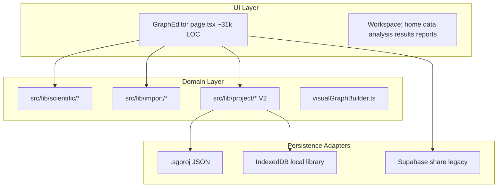
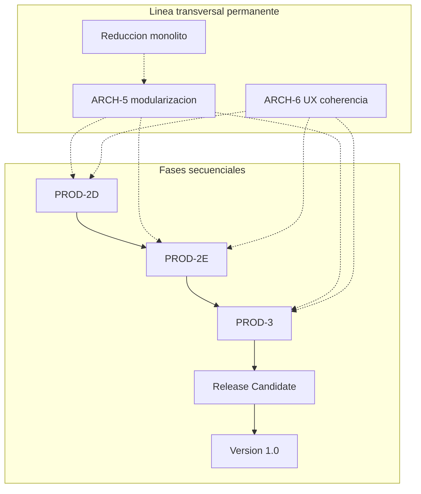
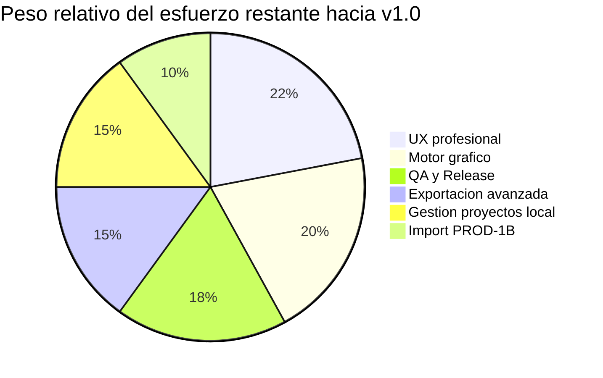
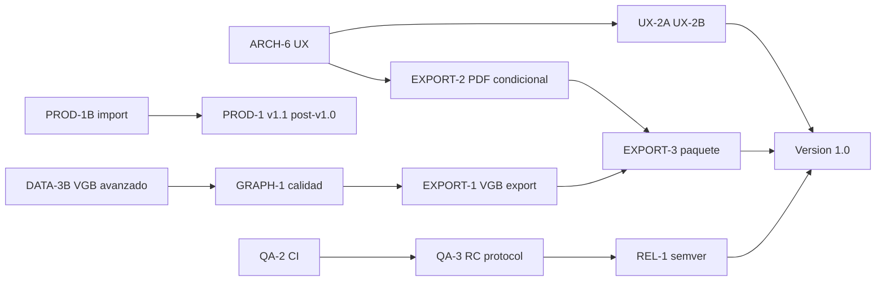
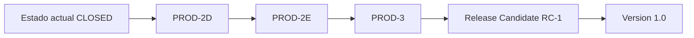

# Scientific Graph AI — Master Roadmap v1.0

| Campo | Valor |
|-------|-------|
| **Documento** | `MASTER_ROADMAP_V1.md` |
| **Fecha** | 2026-07-01 |
| **Estado** | **CLOSED** — baseline estratégica oficial congelada hasta Version 1.0 |
| **Versión del documento** | 1.0 |
| **Alcance** | Planificación estratégica completa desde el estado actual hasta Scientific Graph AI v1.0 |
| **Estado del producto** | `0.1.0` (pre-release) |
| **Documento padre** | — (documento raíz de gobernanza estratégica) |
| **Documentos relacionados** | [`ROADMAP.md`](./ROADMAP.md) · [`README.md`](./README.md) · [`PROJECT_STATUS_PROD_2B.md`](./PROJECT_STATUS_PROD_2B.md) · [`PROJECT_STATUS_PROD_2C.md`](./PROJECT_STATUS_PROD_2C.md) · [`PROJECT_STATUS_SCI_56.md`](./PROJECT_STATUS_SCI_56.md) · [`PROJECT_STATUS_SCI_58.md`](./PROJECT_STATUS_SCI_58.md) · [`QA-1_MANUAL_VALIDATION_PROTOCOL.md`](./QA-1_MANUAL_VALIDATION_PROTOCOL.md) · [`src/lib/project/README.md`](./src/lib/project/README.md) |

Scientific Graph AI **no se planifica por calendario**. El desarrollo avanza mediante **microfases cerradas por criterios técnicos**. Este documento no contiene estimaciones temporales, cronogramas ni diagramas Gantt basados en tiempo.

---

## Índice

1. [Principios Rectores del Proyecto](#1-principios-rectores-del-proyecto)
2. [Definition of Done](#2-definition-of-done)
3. [Estado actual del proyecto](#3-estado-actual-del-proyecto)
4. [Arquitectura como línea transversal](#4-arquitectura-como-línea-transversal)
5. [Cronología histórica](#5-cronología-histórica)
6. [Evaluación del grado de avance](#6-evaluación-del-grado-de-avance)
7. [Épicas restantes](#7-épicas-restantes)
8. [Dependencias entre épicas](#8-dependencias-entre-épicas)
9. [Riesgos técnicos](#9-riesgos-técnicos)
10. [Criterios de cierre por épica](#10-criterios-de-cierre-por-épica)
11. [Definición de Scientific Graph AI v1.0](#11-definición-de-scientific-graph-ai-v10)
12. [Fuera del alcance de v1.0](#12-fuera-del-alcance-de-v10)
13. [Roadmap por fases](#13-roadmap-por-fases)
14. [Gobernanza documental](#14-gobernanza-documental)

---

## 1. Principios Rectores del Proyecto

Esta sección funciona como la **constitución** del proyecto. Rige todas las fases futuras sin excepción.

| Principio | Descripción |
|-----------|-------------|
| **Arquitectura DDD obligatoria** | Separación estricta entre dominio, aplicación, adaptadores e interfaz de usuario. |
| **Dominio puro** | El dominio no depende de React, Next.js, IndexedDB, Supabase ni motores SCI. |
| **Backward compatibility** | Los proyectos `.sgproj` existentes deben abrirse sin pérdida de datos. V1→V2 es el precedente certificado. |
| **Schema + migrador** | Ningún cambio de `schemaVersion` sin migrador explícito y golden fixtures de regresión. |
| **Gates obligatorios** | Toda microfase certifica su cierre con gate(s) automatizado(s) en estado PASS. |
| **Tests obligatorios** | Todo dominio extraído o contrato modificado incluye casos de regresión. |
| **Documentación obligatoria** | Al cierre de cada fase se actualizan `PROJECT_STATUS_*` y el README técnico correspondiente. |
| **Microfases pequeñas** | Entregas atómicas y cerrables (modelo PROD-2C C1–C9, PROD-2B B6.1–B6.5). |
| **Sin deuda técnica deliberada** | No se dejan stubs, TODOs ni alcance diferido dentro de la microfase activa. |
| **Persistencia local-first** | `.sgproj` e IndexedDB constituyen el camino crítico; cloud es opt-in post-v1.0. |
| **Secuencialidad estricta** | Una fase solo inicia cuando la anterior está **CLOSED** según la Definition of Done. |

---

## 2. Definition of Done

Una fase o microfase solo puede declararse **CLOSED** cuando se cumplen **todos** los siguientes criterios:

- ✓ Implementación finalizada
- ✓ Gates PASS
- ✓ Tests PASS
- ✓ Documentación actualizada
- ✓ `PROJECT_STATUS` actualizado
- ✓ Commits realizados
- ✓ Push realizado
- ✓ Sin deuda pendiente dentro del alcance definido

Esta definición aplica de forma uniforme a PROD-2D, PROD-2E, PROD-3, Release Candidate (RC-1) y Version 1.0.

---

## 3. Estado actual del proyecto

### 3.1 Resumen ejecutivo

Scientific Graph AI es un editor científico web (Next.js 16, React 19) para importar datos experimentales, analizarlos con motores **SCI-1→SCI-60**, comparar datasets y persistir el workspace en archivos `.sgproj` V2 con biblioteca local IndexedDB.

| Hito | Estado |
|------|--------|
| Núcleo científico SCI-1→SCI-60 | Validado (QA-1 + gates automatizados) |
| PROD-2A — Project File Core | **CLOSED** |
| PROD-2B — Persistencia científica V2 | **CLOSED** (2026-07-01) |
| PROD-2C — Worksheet + Visual Graph Builder persistence | **CLOSED** (2026-06-30) — épica histórica |
| **PROD-2D** — UX profesional + arquitectura transversal | **CLOSED** (2026-07-09) |
| ARCH-5 Fases 1–4 | **CLOSED** |
| ARCH-5 F5 (metodología; PROD-2D D9–D17) | **CLOSED** |
| ARCH-6 (visibility; PROD-2D D4–D8) | **CLOSED** |
| Sprint QA-1 | **CLOSED** |
| Versión del producto | `0.1.0` — **pre-v1.0** |
| Backlog de épicas cerradas | Vacío |
| **Siguiente fase de implementación** | **PROD-2E** |

> **Nomenclatura:** la épica **PROD-2C (histórico)** — worksheet + Visual Graph Builder persistence, C1–C9 — está **CLOSED** y congelada en [`PROJECT_STATUS_PROD_2C.md`](./PROJECT_STATUS_PROD_2C.md). El identificador PROD-2C **no se reutiliza** para trabajo futuro. **PROD-2D** está **CLOSED** ([`PROJECT_STATUS_PROD_2D.md`](./PROJECT_STATUS_PROD_2D.md)). La siguiente fase es **PROD-2E**.

### 3.2 Arquitectura existente

Principios arquitectónicos vigentes:

- Dominio puro desacoplado de la infraestructura de persistencia.
- Pipeline invariante: `parse → migrate → validate → sanitize → hydrate`.
- Persistencia de inputs de dominio; no de outputs de motores SCI ni cachés de UI.

### 3.3 Capacidades implementadas

| Capa | Estado | Referencia |
|------|--------|------------|
| Núcleo SCI-1→SCI-60 | Validado | [`PROJECT_STATUS_SCI_56.md`](./PROJECT_STATUS_SCI_56.md) |
| Importación PROD-1A | CSV, TXT, XLSX, ODS + wizard | [`PROJECT_STATUS_SCI_56.md`](./PROJECT_STATUS_SCI_56.md) |
| Visual Graph Builder DATA-3A | 6 tipos: scatter, line, bar, histogram, box, violin | [`PROJECT_STATUS_PROD_2C.md`](./PROJECT_STATUS_PROD_2C.md) |
| Persistencia PROD-2A / PROD-2B / PROD-2C | V2 multi-dataset, worksheet, VGB, IndexedDB, UX de conflictos | [`PROJECT_STATUS_PROD_2B.md`](./PROJECT_STATUS_PROD_2B.md) |
| Comparación SCI-58 v2 | Slots A/B, dashboard KPI, exportación PDF | [`PROJECT_STATUS_SCI_58.md`](./PROJECT_STATUS_SCI_58.md) |
| Exportación básica | PNG, SVG, JSON (curva math); PDF científico (jspdf) | Código fuente |
| Cloud sync PROD-2B B7 | No implementado (`cloudRef` reservado en schema) | [`ROADMAP.md`](./ROADMAP.md) |

---

## 4. Arquitectura como línea transversal

La arquitectura **no es una épica aislada**. Es una actividad transversal que acompaña todas las fases restantes hasta Version 1.0.

| Actividad | Alcance transversal |
|-----------|---------------------|
| **ARCH-5 Fase 5+** | Extracción incremental del monolito `page.tsx` (~31 kLOC): metodología SCI-50→SCI-56, reporting UI, handlers React. |
| **ARCH-6** | Mejoras UX post-QA-1 integradas en cada fase que modifique interfaz. |
| **Reducción del monolito** | Criterio de cada microfase: extraer antes de extender; extracción move-only con gates. |
| **Modularización DDD** | Nuevos dominios en `src/lib/`; la UI actúa como adaptador. |

Implicaciones para el roadmap:

- PROD-2D incluye ARCH-6 y ARCH-5 parcial; ARCH-5 continúa en PROD-2E y PROD-3.
- Ninguna fase futura cierra sin evaluar la deuda arquitectónica que haya introducido.

---

## 5. Cronología histórica

Las fechas indicadas corresponden a **cierres históricos** documentados en `PROJECT_STATUS_*`. No constituyen proyección de planificación.

### 5.1 Bloque SCI (SCI-1 → SCI-60)

| Oleada | Rango | Hito clave |
|--------|-------|------------|
| Núcleo | SCI-1→SCI-27 | Estadística descriptiva, inferencia, distribución |
| Multivariante | SCI-28→SCI-40 | PCA, clustering, SCI-40 dashboard |
| Exploradores | SCI-41→SCI-49 | MANOVA, LDA, t-SNE, UMAP |
| Metodología | SCI-50→SCI-56 | Motores de evaluación + dashboard de síntesis |
| Inferencia ampliada | SCI-57, SCI-57B | Effect size, power, evidencia effect-aware |
| Orquestación | SCI-59 | Guided Scientific Workflow |
| Comparación | SCI-58 v1→v2 | Multi-dataset, PDF, perfiles enriquecidos |
| Publicación | SCI-60 | Executive Publication Dashboard |
| Modularización | ARCH-5 F1–F4 | normality, workflow, inference, comparison |
| UX | UX-1A.1 LITE | Progressive disclosure, toggles default OFF |
| Calidad | QA-1 | Validación manual end-to-end — CLOSED 2026-06-24 |

### 5.2 Bloque PROD

| Épica | Alcance | Estado |
|-------|---------|--------|
| **PROD-1A** | Scientific Workbook Import Framework | **CLOSED** |
| **PROD-2A** | `.sgproj` V1, F0–F6, sidebar Nuevo/Guardar/Abrir | **CLOSED** |
| **PROD-2B** | Schema V2, multi-dataset B2, IndexedDB B5, UX B6.1–B6.5 | **CLOSED** (2026-07-01) |
| **PROD-2C (histórico)** | Worksheet + Visual Graph Builder persistence, C1–C9 | **CLOSED** (2026-06-30) |
| **DATA-3A** | Visual Graph Builder UI v1 | **CLOSED** |
| **ARCH-6-DOC** | Alineación documental post-PROD-2C | **CLOSED** |

Referencia de cierre PROD-2B: [`PROJECT_STATUS_PROD_2B.md`](./PROJECT_STATUS_PROD_2B.md)  
Referencia de cierre PROD-2C (histórico): [`PROJECT_STATUS_PROD_2C.md`](./PROJECT_STATUS_PROD_2C.md)

---

## 6. Evaluación del grado de avance

> **Aviso metodológico:** los porcentajes siguientes son una **evaluación estratégica** basada en épicas cerradas frente a brechas documentadas. **No son métricas objetivas** — no derivan de LOC, story points medidos ni cobertura global de tests. Su única función es orientar la priorización hacia Version 1.0.

### 6.1 Motor científico

| Dimensión | % estimado | Justificación |
|-----------|-----------|---------------|
| Núcleo SCI-1→SCI-60 | ~95% | Validado por QA-1 y gates; evoluciones v3/v1.1 son mejoras no bloqueantes |
| Inferencia y metodología | ~95% | ARCH-5 F1–F4 extrajo los dominios críticos |
| Comparación SCI-58 v2 | ~90% | SCI-58 v3 (N>2 slots) queda fuera de v1.0 |
| Workflow SCI-59 | ~85% | SCI-59 v1.1 (branching avanzado) queda fuera de v1.0 |

**Síntesis — motor científico: ~92%.** El núcleo analítico está maduro; las brechas restantes no bloquean v1.0.

### 6.2 Producto profesional

| Dimensión | % estimado | Justificación |
|-----------|-----------|---------------|
| UX / progressive disclosure | ~55% | UX-1A.1 LITE entregado; ARCH-6 abierto; stubs Historial/Configuración |
| Motor gráfico / VGB | ~50% | 6 de 13+ tipos; calidad de publicación limitada |
| Exportación | ~60% | PDF básico; sin export VGB en alta resolución ni PDF alineado con toggles |
| Importación PROD-1B | ~65% | PROD-1A cerrado; validación avanzada pendiente |
| Persistencia local | ~85% | V2 completo; cloud ausente (fuera de v1.0) |
| QA / Release pipeline | ~45% | Gates extensos; sin CI unificado ni protocolo RC formal |

**Síntesis — producto profesional: ~58%.** Constituye la principal brecha hacia v1.0.

### 6.3 Avance global hacia v1.0

**Avance global ≈ 70%** — ponderación del motor científico (~92%, peso 40%) y del producto profesional (~58%, peso 60%). El núcleo analítico está maduro; el producto entregable profesional requiere completar PROD-2D → RC-1.

**Peso relativo del esfuerzo restante** (sin unidades temporales):

---

## 7. Épicas restantes

Las épicas se organizan en cinco categorías estratégicas. ARCH-5 Fase 5+ actúa de forma transversal en las categorías A, B y C según los módulos tocados (véase §4).

### A. UX profesional (P0)

| Épica | Alcance |
|-------|---------|
| **ARCH-6** | Resolver las observaciones UX de QA-1 §10 |
| **UX-2A** | Branding, metadata de aplicación, onboarding Smart Start refinado |
| **UX-2B** | Historial y Configuración — de stubs a funcionalidad mínima viable |

### B. Motor gráfico profesional (P0)

| Épica | Alcance |
|-------|---------|
| **DATA-3B** | Tipos VGB avanzados (`VISUAL_GRAPH_TYPES_FUTURE`) |
| **GRAPH-1** | Auto-fit viewport Y, estilos de publicación |
| **GRAPH-2** | Motor de curvas math — calidad de exportación vectorial |

### C. Exportación avanzada (P1)

| Épica | Alcance |
|-------|---------|
| **EXPORT-1** | Export VGB en PNG/SVG de alta resolución |
| **EXPORT-2** | PDF alineado con progressive disclosure |
| **EXPORT-3** | Paquete de exportación para manuscrito |

### D. Gestión avanzada de proyectos (P1 — local-first para v1.0)

| Épica | Alcance |
|-------|---------|
| **PROD-1B** | Validación estructurada de importación + ImportReport UI completo |
| **PROD-1 v1.1** | Multi-serie side-by-side (RW-04) — post-v1.0 |

*Post-v1.0 adicional: PROD-3A cloud (B7), SCI-58 v3, SCI-59 v1.1.*

### E. QA y Release (P0 final)

| Épica | Alcance |
|-------|---------|
| **QA-2** | Suite CI unificada |
| **QA-3** | Protocolo Release Candidate |
| **REL-1** | Versionado semver, changelog, release notes |
| **REL-2** | Hardening E2E (Playwright, `validate:full`) |

---

## 8. Dependencias entre épicas

**Reglas de dependencia:**

| Regla | Descripción |
|-------|-------------|
| EXPORT-2 → ARCH-6 | El PDF condicional requiere el modelo toggle-aware de ARCH-6 |
| PROD-3A cloud | Fuera del camino crítico hacia v1.0 |
| QA-2 → RC-1 | La suite CI debe estar operativa antes del Release Candidate |
| Secuencialidad de fases | Cada fase depende de la Definition of Done de la fase anterior |
| ARCH-5 transversal | Acompaña PROD-2D, PROD-2E y PROD-3 según módulos extraídos |

---

## 9. Riesgos técnicos

| Riesgo | Impacto | Mitigación |
|--------|---------|------------|
| Monolito `page.tsx` (~31 kLOC) | Alto | ARCH-5 transversal; gates por extracción |
| Playwright E2E intermitente | Medio | QA-2: retries, server fixture, separación E2E/unit |
| Divergencia PDF vs toggles de UI | Medio | EXPORT-2 + ARCH-6 |
| Limitaciones de Recharts para publicación | Medio | Evaluar capa alternativa solo si EXPORT-1 resulta insuficiente |
| Schema drift en V2 | Bajo | Migrador obligatorio + golden fixtures |
| Scope creep | Alto | §12 Fuera del alcance + Principios Rectores |
| Documentación desincronizada | Bajo | Definition of Done exige `PROJECT_STATUS` actualizado |

---

## 10. Criterios de cierre por épica

Todo cierre de fase exige además el cumplimiento íntegro de la Definition of Done (§2).

| Épica | Criterio de cierre técnico |
|-------|---------------------------|
| **ARCH-6** | Cuatro observaciones QA-1 §10 resueltas o documentadas como wont-fix; `validate:full` PASS |
| **UX-2A / UX-2B** | Branding production-ready; Historial/Config MVP; sin stubs «Próximamente» en home |
| **DATA-3B** | ≥3 tipos futuros con preview + round-trip persist VGB |
| **GRAPH-1** | Auto-fit Y + presets de publicación; golden visual regression |
| **EXPORT-1 / EXPORT-2 / EXPORT-3** | VGB 300 dpi; PDF respeta toggles; paquete ZIP documentado |
| **PROD-1B** | ImportReport UI completo; RW-01→RW-04 en CI |
| **QA-2** | CI ejecuta gates críticos en pull request |
| **QA-3 / RC-1** | Protocolo RC ejecutado; 0 blockers; smoke manual Dataset5/6/RW PASS |
| **REL-1 / Version 1.0** | semver `1.0.0`; changelog publicado; must-have §11 verificados |

---

## 11. Definición de Scientific Graph AI v1.0

**Scientific Graph AI v1.0** es la primera versión de producto **profesional y publicable** del editor: un flujo completo importar → analizar → visualizar → comparar → exportar → persistir, con UX coherente, figuras manuscript-ready, persistencia local robusta certificada y pipeline de release reproducible — **local-first, sin cloud sync obligatorio**.

### Criterios must-have v1.0

| # | Criterio | Estado al cierre de PROD-2C |
|---|----------|----------------------------|
| 1 | Núcleo SCI-1→SCI-60 + SCI-58 v2 + SCI-59 operativos | ✓ Cumplido |
| 2 | Persistencia V2 local certificada | ✓ Cumplido |
| 3 | ARCH-6 UX cerrado | Pendiente |
| 4 | VGB ≥9 tipos con export en alta resolución | Pendiente |
| 5 | PDF alineado con el estado visible del usuario | Pendiente |
| 6 | PROD-1B import validation en producción | Pendiente |
| 7 | CI gates críticos automatizados | Pendiente |
| 8 | Protocolo RC ejecutado sin blockers | Pendiente |
| 9 | Versión semver `1.0.0` y documentación alineada | Pendiente |

---

## 12. Fuera del alcance de v1.0

Esta sección delimita el alcance de Version 1.0 y **evita la expansión continua del scope**.

| Categoría | Excluido de v1.0 |
|-----------|------------------|
| **IA / ML generativo** | Asistentes LLM, generación automática de informes, sugerencias no deterministas |
| **Colaboración** | Multi-usuario, permisos, comentarios, edición concurrente |
| **Extensibilidad** | Plugins, scripting de usuario, API pública de extensiones |
| **Cloud avanzado** | Sync completo, resolución de conflictos multi-dispositivo, adaptador cloud PROD-2B B7 |
| **Marketplace** | Templates comerciales, biblioteca de gráficos compartida |
| **Experimental** | Tipos VGB no certificados; fuentes de import deshabilitadas (JSON, TSV, Google Sheets) |
| **Comparación avanzada** | SCI-58 v3 (N>2 slots) |
| **Workflow avanzado** | SCI-59 v1.1 (branching condicional complejo) |
| **Formatos import avanzados** | PROD-1 v1.1 multi-serie side-by-side (RW-04) |
| **Infraestructura** | Mobile nativo, PWA offline completa, internacionalización (i18n) |

**Regla de gobernanza:** cualquier funcionalidad no listada en los criterios must-have (§11) requiere un amend explícito de este Master Roadmap antes de entrar en una fase de implementación.

---

## 13. Roadmap por fases

Cada fase inicia **únicamente** cuando la anterior cumple la Definition of Done (§2). No existen estimaciones temporales ni cronogramas.

### PROD-2D — UX profesional + arquitectura transversal

| Campo | Contenido |
|-------|-----------|
| **Estado** | **CLOSED** (2026-07-09) — acta [`PROJECT_STATUS_PROD_2D.md`](./PROJECT_STATUS_PROD_2D.md) |
| **Objetivo** | Profesionalizar la experiencia de usuario y avanzar la modularización del monolito |
| **Épicas** | ARCH-6, UX-2A, UX-2B, ARCH-5 F5 (+ microfase D22 actividad proyecto) |
| **Dependencias** | PROD-2C (histórico) CLOSED; QA-1 CLOSED |
| **Criterios de cierre** | Observaciones QA-1 §10 resueltas; branding/metadata production-ready; Historial/Config MVP; actividad del proyecto; reducción neta de LOC del monolito certificada por gate; `validate:prod2d-gate` PASS; Definition of Done completa — **cumplidos** |

### PROD-2E — Motor gráfico profesional

| Campo | Contenido |
|-------|-----------|
| **Objetivo** | Elevar Visual Graph Builder y motor de curvas a calidad de publicación |
| **Épicas** | DATA-3B, GRAPH-1, GRAPH-2, ARCH-5 F5 (módulos gráficos según aplique) |
| **Dependencias** | PROD-2D CLOSED |
| **Criterios de cierre** | ≥3 tipos VGB avanzados con round-trip persist; auto-fit Y; presets de publicación; gates VGB PASS; Definition of Done completa |

### PROD-3 — Exportación, importación y cierre funcional

| Campo | Contenido |
|-------|-----------|
| **Objetivo** | Salida profesional (figuras + PDF + paquete) e importación validada |
| **Épicas** | EXPORT-1, EXPORT-2, EXPORT-3, PROD-1B, ARCH-5 F5 (reporting/export según aplique) |
| **Dependencias** | PROD-2E CLOSED |
| **Criterios de cierre** | Export VGB en alta resolución; PDF toggle-aware; ImportReport UI; RW en CI; Definition of Done completa |

### Release Candidate (RC-1)

| Campo | Contenido |
|-------|-----------|
| **Objetivo** | Estabilización total pre-lanzamiento |
| **Épicas** | QA-2, QA-3, REL-2, alineación documental |
| **Dependencias** | PROD-3 CLOSED |
| **Criterios de cierre** | CI gates en PR; protocolo RC ejecutado; 0 blockers; smoke manual PASS; Definition of Done completa |

### Version 1.0

| Campo | Contenido |
|-------|-----------|
| **Objetivo** | Lanzamiento semver `1.0.0` |
| **Épicas** | REL-1 (tag, changelog, release notes) |
| **Dependencias** | RC-1 CLOSED |
| **Criterios de cierre** | semver `1.0.0`; changelog publicado; criterios must-have §11 verificados; Definition of Done completa |

---

## 14. Gobernanza documental

### Jerarquía de documentos

| Documento | Función |
|-----------|---------|
| **`MASTER_ROADMAP_V1.md`** | Documento estratégico maestro. Define la visión, los principios rectores, el alcance de v1.0, las fases futuras y la Definition of Done. Es la referencia obligatoria para toda planificación e implementación hasta Version 1.0. |
| **`ROADMAP.md`** | Roadmap operativo de alto nivel. Registra hitos cerrados y candidatos de evolución. Se mantiene como índice operativo; la estrategia prioritaria reside en este Master Roadmap. |
| **`PROJECT_STATUS_*`** | Registro histórico y acta de cierre de cada fase o microfase. Documentos congelados al declararse CLOSED; no se modifican retrospectivamente. |
| **`README.md`** | Documentación de entrada para usuarios y desarrolladores: quick start, índice documental, gates principales. |
| **`src/lib/project/README.md`** | Referencia técnica de la arquitectura de persistencia V2. |

### Reglas de gobernanza

1. **El Master Roadmap define la estrategia.** Ninguna épica nueva entra en implementación sin incorporarse primero a este documento mediante amend explícito.
2. **Los `PROJECT_STATUS_*` documentan la ejecución.** Cada fase CLOSED genera o actualiza su acta de cierre conforme a la Definition of Done.
3. **Las fases cerradas son inmutables.** Ninguna fase posterior modifica retrospectivamente la documentación de fases ya declaradas CLOSED.
4. **La secuencialidad es obligatoria.** PROD-2E es la siguiente fase; PROD-2D y PROD-2C (histórico) están CLOSED y no se reabren ni se reutilizan como identificadores de fase futura.

### Documentos de referencia verificados

| Documento | Estado |
|-----------|--------|
| [`ROADMAP.md`](./ROADMAP.md) | Existe |
| [`README.md`](./README.md) | Existe |
| [`PROJECT_STATUS_PROD_2B.md`](./PROJECT_STATUS_PROD_2B.md) | Existe — cierre PROD-2B |
| [`PROJECT_STATUS_PROD_2C.md`](./PROJECT_STATUS_PROD_2C.md) | Existe — cierre PROD-2C histórico |
| [`PROJECT_STATUS_PROD_2B_B5.md`](./PROJECT_STATUS_PROD_2B_B5.md) | Existe — detalle IndexedDB B5 |
| [`PROJECT_STATUS_SCI_56.md`](./PROJECT_STATUS_SCI_56.md) | Existe — snapshot SCI + PROD-2A |
| [`PROJECT_STATUS_SCI_58.md`](./PROJECT_STATUS_SCI_58.md) | Existe — cierre SCI-58 v2 |
| [`QA-1_MANUAL_VALIDATION_PROTOCOL.md`](./QA-1_MANUAL_VALIDATION_PROTOCOL.md) | Existe — protocolo QA-1 |
| [`PROJECT_PLAN_PROD_2B.md`](./PROJECT_PLAN_PROD_2B.md) | Existe — plan histórico PROD-2B |
| [`PROJECT_DISCOVERY_PROD_2B.md`](./PROJECT_DISCOVERY_PROD_2B.md) | Existe — discovery PROD-2B |
| [`src/lib/project/README.md`](./src/lib/project/README.md) | Existe — arquitectura persistencia |

---

*Master Roadmap v1.0 — Scientific Graph AI — Baseline estratégica oficial (congelada). Amend únicamente mediante revisión explícita de este documento.*
