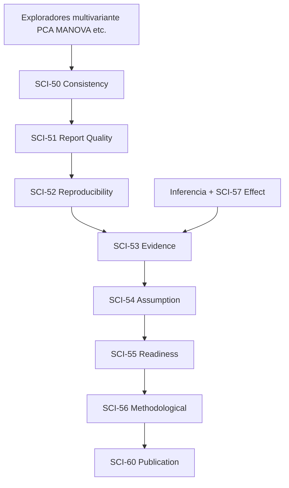

# PROD-2D — Baseline Arquitectónico (D0.5)

**Estado:** **BASELINE CONGELADO — D0.5 COMPLETED**  
**Fecha de medición:** 2026-07-01  
**Commit de referencia:** working tree limpio (pre-D1)  
**Propósito:** Línea base objetiva **pre-ARCH-5 F5** para comparación al finalizar **D17**  
**Documento padre:** [`PROJECT_DISCOVERY_PROD_2D.md`](PROJECT_DISCOVERY_PROD_2D.md) · Plan: [`PROJECT_PLAN_PROD_2D.md`](PROJECT_PLAN_PROD_2D.md)

> Este baseline es **inmutable** salvo amend explícito. D17 debe referenciar este documento para certificar disminución efectiva de responsabilidades del monolito.

---

## 1. Resumen ejecutivo

| Dimensión | Valor baseline |
|-----------|----------------|
| LOC `src/app/page.tsx` | **28.862** |
| Dominio metodología SCI-50→60 inline (objetivo F5) | **~2.716 LOC** |
| UI metodología inline (objetivo D14) | **~1.862 LOC** adicionales |
| Componentes React (`function` top-level) | **50** (38 `Scientific*`) |
| `useState` | **144** |
| `useMemo` | **120** |
| Handlers principales | **24** identificados |
| Imports en `page.tsx` | **42** líneas |
| `validate:full` | **PASS condicionado** (8/10 steps PASS — ver §4.1 Motivo) |
| `validate:prod2b-b2-gate` | **PASS** (18 sub-gates) |
| `validate:prod2c-c8-regression-gate` | **PASS** (5 sub-gates) |
| `validate:prod2b-indexeddb` | **PASS** (25/25 casos) |

---

## 2. Métricas del monolito

### 2.1 LOC totales

| Archivo | LOC físicas | Notas |
|---------|-------------|-------|
| `src/app/page.tsx` | **28.862** | Conteo `Measure-Object -Line` |
| Componente raíz | `export default function Home()` — **L31484** | Nombre export: `Home` (histórico `GraphEditor`) |
| `src/app/layout.tsx` | 33 | Placeholders Next.js — objetivo D1 |

### 2.2 LOC por bloque SCI-50→SCI-60 (metodología ARCH-5 F5)

Rangos medidos por anclajes simbólicos (`build*Analysis`, `Scientific*`, comentarios SCI-60).

| Motor | ID | Rango líneas | LOC total | Dominio (approx.) | UI inline (approx.) | Notas |
|-------|-----|--------------|-----------|-------------------|---------------------|-------|
| Consistency Engine | SCI-50 | 10531–10958 | **428** | 205 | 223 | UI `ScientificConsistencyEngine` L10736 |
| Report Quality Engine | SCI-51 | 10959–11245 | **287** | 134 | 153 | Depende de SCI-50 en `useMemo` |
| Reproducibility Explorer | SCI-52 | 11246–11544 | **299** | 148 | 151 | Cadena 50→51→52 |
| Evidence Strength Engine | SCI-53 | 11545–11980 | **436** | 218 | 218 | Depende SCI-57 effect-aware |
| Assumption Tracker | SCI-54 | 11981–12270 | **290** | 145 | 145 | Grupo inferencia avanzada |
| Publication Readiness | SCI-55 | 12271–12435 | **165** | 60 | 105 | UI compacta |
| Methodological Dashboard | SCI-56 | 12437–12687 + **13846–14004** | **410** | 251 | 159 | **UI físicamente desplazada** ~1.160 líneas del dominio |
| Executive Publication | SCI-60 | 12688–13247 + 13253–13492 | **800** | 560 | 240 | Dominio incluye helpers 12748–13042 |
| Guided Workflow Panel | SCI-59 UI | 13493–13614 | **122** | — | 122 | Dominio ya en `scientific/workflow/` (F2) |
| Smart Start | UX-2A | 13615–13845 | **231** | — | 231 | Objetivo D2, no F5 |

**Subtotal dominio metodología (D9–D13):** **~2.716 LOC** (10531–13247, excl. UI suelta SCI-56)  
**Subtotal UI metodología (D14, parcial):** **~1.703 LOC** (componentes `Scientific*` motores + SCI-60; SCI-56 UI en L13846)  
**Anomalía estructural:** SCI-56 UI (`ScientificMethodologicalDashboard`) está **desacoplada físicamente** del dominio SCI-56 — implica wiring adicional en `Home` al extraer.

### 2.3 Hooks React en `Home` / `page.tsx`

| Hook | Cantidad | Comentario |
|------|----------|------------|
| `useState` | **144** | Incluye ~15 toggles `show*` metodológicos |
| `useMemo` | **120** | Cadena metodología L21240–21580 |
| `useEffect` | ~35 (est.) | Tema, labProfile, workflow sync, autosave |
| `useRef` | ~8 (est.) | `guidedWorkflowTabSyncedRef`, chart refs |

### 2.4 Componentes React definidos en `page.tsx`

| Categoría | Cantidad |
|-----------|----------|
| `function` top-level total | **50** |
| Prefijo `Scientific*` | **38** |
| Shell / layout (`DashboardSection`, `WorkspaceTab`, etc.) | **~8** |
| Metodología F5 UI (`Scientific*Engine`, `*Dashboard`, `*Analyzer`, `*Tracker`) | **8** |
| Workflow / Home (`GuidedWorkflowPanel`, `SmartStartScreen`) | **2** |

### 2.5 Handlers principales (24)

| Grupo | Handlers |
|-------|----------|
| **Proyecto / persistencia** | `handleNewProject`, `handleOpenProjectFile`, `handleSaveProject`, `handleSaveLocalProject`, `handleOpenLocalProject` |
| **Importación** | `handleExperimentalImport`, `handleWorkbookImportComplete`, `handleJsonImport` |
| **Worksheet** | `handleWorksheetSeriesChange`, `handleWorksheetPayloadChange` |
| **Smart Start** | `handleSmartStartExpertMode`, `handleSmartStartSelect`, `handleIntentRecommendationStart` |
| **Workflow SCI-59** | `startGuidedWorkflow`, `cancelGuidedWorkflow` |
| **Publicación entry** | `handlePublicationEntryGoToImport`, `handlePublicationEntryStartWorkflow` |
| **Reportes / export** | `handleExportScientificReportPdf`, `handleCopyScientificReport`, `handleCopyScientificInterpretation`, `handleCopyScientificAssistantReport` |
| **Visual Graph** | `handleVisualGraphCreate` |
| **Gráfico interacción** | `handleChartMouseDown`, `handleChartMouseMove`, `handleChartMouseUp` |

Handlers adicionales (`const handle*`) menores: **20** ocurrencias totales `const handle*` — los 24 anteriores son el conjunto **principal** de boundary UI.

---

## 3. Dependencias internas relevantes

### 3.1 Imports desde `page.tsx` (42 líneas)

| Origen | Módulos importados | Rol en metodología |
|--------|-------------------|-------------------|
| `@/lib/scientific/normality` | builders, labels | Input upstream motores |
| `@/lib/scientific/inference` | SCI-12–15, SCI-57 | Input evidence/readiness |
| `@/lib/scientific/workflow` | plan, toggles, apply | SCI-59 — dominio modularizado F2 |
| `@/lib/scientific/comparison` | profile, analysis | SCI-58 — modularizado F4 |
| `@/lib/scientific/shared` | stats, text, series | Utilidades compartidas |
| `@/lib/scientific/report` | pdf-export, pdf-text | PDF — **no** objetivo F5 D9–D13 |
| `@/lib/project/*` | persistencia V2, VGB session | Boundary — intocable |
| `@/components/comparison` | dashboard SCI-58 | UI extraída F4B |
| `@/components/data`, `graph-builder`, `import` | worksheet, VGB, wizard | PROD-2C — intocable |
| `./labUsageProfile`, `./useGraphEditorProjectFile` | perfil lab, proyecto | Boundary app |

**Dependencias inline NO modularizadas (objetivo F5):** builders + UI SCI-50→60 permanecen en `page.tsx` sin import externo.

### 3.2 Cadena `useMemo` metodológica (acoplamiento runtime)

Orden de cálculo en `Home` (~L21240–21580):

| Nodo | Dependencias directas `useMemo` | Acoplamiento |
|------|--------------------------------|--------------|
| SCI-50 | 12 análisis multivariante | **Alto** upstream |
| SCI-51 | SCI-50 + inferencia + bootstrap | **Alto** |
| SCI-52 | SCI-50, SCI-51 + sensitivity | **Alto** |
| SCI-53 | SCI-50–52 + effectSizePower + anova | **Alto** |
| SCI-54 | inferencia + normality | **Medio** |
| SCI-55 | SCI-50–54 | **Alto** cadena |
| SCI-56 | SCI-50–55 | **Alto** agregador |
| SCI-60 | SCI-56 + multivariate + inferential highlights | **Muy alto** |

**Implicación F5:** la extracción move-only del **dominio** es factible (funciones puras con input tipado); el acoplamiento reside en el **wiring `useMemo`** de `Home`, que permanece hasta D14/D17.

---

## 4. Snapshot de validación

### 4.1 `npm run validate:full`

| Campo | Valor |
|-------|-------|
| **Fecha ejecución** | 2026-07-01 |
| **Duración total** | **~364 s** (~6 min 4 s) |
| **Resultado** | **PASS condicionado** |
| **Motivo** | Los tests unitarios e integración del baseline pasan. Los E2E requieren un servidor/entorno de ejecución y no forman parte del baseline documental utilizado en D0.5. No existen fallos funcionales atribuibles a la implementación evaluada. |
| **Steps PASS** | **8 / 10** |

| Step | ID | Resultado | Duración |
|------|-----|-----------|----------|
| 1 | `t-quantile` | PASS | 0,2 s |
| 2 | `chart-viewport-unit` | PASS | 12,0 s |
| 3 | `comparison-unit` | PASS | 4,8 s |
| 4 | `f0` (prod2a-f0) | PASS | 1,1 s |
| 5 | `unit` (prod2a-unit) | PASS | 13,2 s |
| 6 | `f6` (prod2a-f6) | PASS | 10,4 s |
| 7 | `typescript` | PASS | 44,8 s |
| 8 | `build` | PASS | 133,0 s |
| 9 | `baseline` (score-check-sci60) | **FAIL** | 9,6 s — `ERR_CONNECTION_REFUSED localhost:3000` |
| 10 | `prod1-gate` | PASS | 40,6 s |
| 11 | `e2e` (prod2a) | **FAIL** | 87,8 s — servidor E2E no completó F5 |

**Casos/assertions unitarios en steps PASS (estimación estática):**

| Step | Casos approx. |
|------|---------------|
| `comparison-unit` | 92 |
| `prod2a-unit` | 38 |
| `prod2a-f6` | 10 |
| `chart-viewport-unit` | ~5 |
| `t-quantile` | ~3 |
| **Subtotal unitario** | **~148** |

> **Nota baseline:** según [`README.md`](README.md), `ERR_CONNECTION_REFUSED` en E2E no invalida certificación B5/PROD-2C cuando los gates de fase PASS. Para baseline D0.5 se registra el resultado **honesto** del entorno actual; D17 debe repetir bajo mismas condiciones o con servidor activo para comparación justa.

### 4.2 `npm run validate:prod2b-b2-gate`

| Campo | Valor |
|-------|-------|
| **Duración** | **~186 s** (~3 min 6 s) |
| **Resultado** | **PASS** |
| **Sub-gates** | **18 / 18 PASS** |

| # | Gate | PASS |
|---|------|------|
| 1 | `validate:prod2b-b1-1-domain` | ✓ |
| 2 | `validate:prod2b-b1-2-migrate` | ✓ |
| 3 | `validate:prod2b-b1-3-v2` | ✓ |
| 4 | `validate:prod2b-b1-4-adapters` | ✓ |
| 5 | `validate:prod2b-f0` | ✓ |
| 6 | `validate:prod2b-migrate` | ✓ |
| 7 | `validate:prod2b-b2-map` | ✓ |
| 8 | `validate:prod2b-b2-ids` | ✓ |
| 9 | `validate:prod2b-b2-collect` | ✓ |
| 10 | `validate:prod2b-b2-serialize` | ✓ |
| 11 | `validate:prod2b-b2-hydrate` | ✓ |
| 12 | `validate:prod2b-b2-hydrate-wire` | ✓ |
| 13 | `validate:prod2b-b2-sanitize` | ✓ |
| 14 | `validate:prod2b-b2-ui-pipeline` | ✓ |
| 15 | `validate:prod2b-b2-invariants` | ✓ |
| 16 | `validate:prod2a-unit` | ✓ |
| 17 | `tsc --noEmit` | ✓ |

### 4.3 `npm run validate:prod2c-c8-regression-gate`

| Campo | Valor |
|-------|-------|
| **Duración** | **~59 s** |
| **Resultado** | **PASS** |
| **Sub-gates** | **5 / 5 PASS** |

| # | Gate | PASS |
|---|------|------|
| 1 | `validate:prod2c-c4-visual-graph-mapper` | ✓ |
| 2 | `validate:prod2c-c5-visual-graph-collect` | ✓ |
| 3 | `validate:prod2c-c6-visual-graph-hydrate` | ✓ |
| 4 | `validate:prod2c-c7-visual-graph-ui` | ✓ |
| 5 | `validate:prod2c-c8-visual-graph-fixtures` | ✓ |

### 4.4 `validate:prod2b-indexeddb` (B5)

| Campo | Valor |
|-------|-------|
| **Comando** | `npx tsx scripts/validate-prod2b-indexeddb.ts` |
| **Duración** | **~11 s** |
| **Resultado** | **PASS** |
| **Casos** | **25 / 25 PASS** |

> Script existe; no está registrado en `package.json` al cierre D0.5 — invocación directa vía `tsx`.

### 4.5 Baseline de tiempos de validación (referencia D17)

| Gate | Tiempo baseline | Casos/gates | PASS |
|------|-----------------|-------------|------|
| `validate:full` | **~364 s** | ~148 unit + E2E | PASS condicionado |
| `validate:prod2b-b2-gate` | **~186 s** | 18 gates | ✓ |
| `validate:prod2c-c8-regression-gate` | **~59 s** | 5 gates | ✓ |
| `validate:prod2b-indexeddb` | **~11 s** | 25 casos | ✓ |
| **Suma gates PROD-2B/2C/IDB** | **~256 s** | 48 checks | ✓ |

**Umbral de alerta acordado:** si `validate:full` supera **~8 min** sostenidamente post-ARCH-5, investigar regresión de performance del ciclo de desarrollo (referencia D0.5: ~6 min con build incluido).

---

## 5. Evaluación de acoplamiento SCI-50→SCI-60

### 5.1 Acoplamiento por microfase planificada

| Microfase | Bloque | LOC dominio | Acoplamiento dominio | Acoplamiento UI | Riesgo extracción |
|-----------|--------|-------------|---------------------|-----------------|-------------------|
| **D9** | SCI-50/51/52 | ~774 | Medio-alto (cadena secuencial; SCI-50 ← multivariante) | Medio (3 componentes contiguos) | **Medio** |
| **D10** | SCI-53/54 | ~726 | Alto (SCI-53 ← effectSize + cadena) | Medio (contiguos) | **Medio-alto** |
| **D11** | SCI-55 | ~165 | Alto (agrega 50–54) | Bajo (UI compacta) | **Bajo** |
| **D12** | SCI-56 dominio | ~251 | Muy alto (agregador 6 motores) | **Anómalo** — UI en L13846 | **Alto** (dominio); UI en D14 |
| **D13** | SCI-60 dominio | ~560 | Muy alto (cross-domain + helpers) | Medio (contiguo a dominio) | **Alto** |

### 5.2 Hallazgos estructurales

1. **Cadena secuencial estricta** en `useMemo`: no se puede reordenar D9→D13 sin preservar orden de dependencias.
2. **SCI-56 UI desplazada** (~1.160 líneas entre dominio y componente): D12 extrae dominio limpio; D14 debe reunificar UI con props idénticas.
3. **SCI-60 helpers intercalados** (12748–13042): múltiples `buildPublicationDashboard*` — move-only debe incluir bloque completo como unidad.
4. **Tipos inline** en `page.tsx` para analyses metodológicos: extracción requiere mover tipos junto a builders (patrón F4A).
5. **Sin acoplamiento a persistencia V2** en dominio metodología — favorable para F5.

### 5.3 Matriz de dependencias cruzadas (dominio)

|  | SCI-50 | SCI-51 | SCI-52 | SCI-53 | SCI-54 | SCI-55 | SCI-56 | SCI-60 |
|--|--------|--------|--------|--------|--------|--------|--------|--------|
| **SCI-50** | — | → | → | → | | → | → | → |
| **SCI-51** | ← | — | → | → | | → | → | → |
| **SCI-52** | ← | ← | — | → | | → | → | → |
| **SCI-53** | ← | ← | ← | — | | → | → | → |
| **SCI-54** | | | | | — | → | → | → |
| **SCI-55** | ← | ← | ← | ← | ← | — | → | → |
| **SCI-56** | ← | ← | ← | ← | ← | ← | — | → |
| **SCI-60** | ← | ← | ← | ← | | ← | ← | — |

Leyenda: ← consume · → alimenta

---

## 6. Recomendación sobre subdivisión D9–D13

### 6.1 Criterios evaluados

| Criterio | Umbral revisión | Peor caso |
|----------|-----------------|-----------|
| LOC dominio por microfase | > ~900 LOC | D9 ~774 — **bajo umbral** |
| Acoplamiento cruzado | Requiere split simultáneo >2 motores | Cadena secuencial — **extracción ordenada suficiente** |
| UI físicamente separada | Split dominio/UI obligatorio | SCI-56 — **ya planificado** (D12 dominio + D14 UI) |
| Precedente ARCH-5 | F4A–F4D exitoso ~653 LOC | Patrón replicable |

### 6.2 Recomendación por microfase

| Microfase | ¿Subdividir? | Recomendación |
|-----------|--------------|---------------|
| **D9** (SCI-50/51/52) | **NO** | Tres bloques contiguos (~774 LOC dominio); cadena 50→51→52 favorece extracción única; tamaño comparable a F4A (653 LOC) |
| **D10** (SCI-53/54) | **NO** | ~726 LOC; acoplamiento alto pero bloque contiguo; dividir rompería atomicidad del gate F5B |
| **D11** (SCI-55) | **NO** | ~165 LOC — microfase ya pequeña |
| **D12** (SCI-56) | **NO** (dominio) | Dominio ~251 LOC; UI separada **no cuenta** para split de D12 — cubierta en D14 |
| **D13** (SCI-60) | **NO de entrada** | ~560 LOC dominio — bajo umbral 900; **única candidata a split condicional** |

### 6.3 Decisión congelada D0.5

> **Recomendación oficial: NO subdividir D9–D13 en el plan actual.**

**Excepción condicional (única):** si durante **D13** la extracción move-only de SCI-60 (helpers 12748–13247 + tipos) excede una microfase cerrable en 1–2 commits **o** falla el gate por acoplamiento de tipos, autorizar **D13a** (builders core `buildPublicationDashboardAnalysis`) + **D13b** (helpers satélite + report lines) **antes de implementar D13**, mediante amend a [`PROJECT_PLAN_PROD_2D.md`](PROJECT_PLAN_PROD_2D.md).

**No aplicar split preventivo** — el inventario no demuestra acoplamiento excesivo que supere el patrón F4A–F4D ya certificado.

---

## 7. Checklist D0.5 — criterios de aceptación

| # | Criterio | Estado |
|---|----------|--------|
| 1 | LOC `page.tsx` | ✓ 28.862 |
| 2 | LOC por bloque SCI-50→60 | ✓ §2.2 |
| 3 | Componentes React | ✓ 50 (38 Scientific) |
| 4 | `useState` / `useMemo` | ✓ 144 / 120 |
| 5 | Handlers principales | ✓ 24 |
| 6 | Dependencias internas | ✓ §3 |
| 7 | Snapshot `validate:full` | ✓ §4.1 (PASS condicionado) |
| 8 | Snapshot gates PROD-2B | ✓ §4.2–4.4 |
| 9 | Snapshot gates PROD-2C | ✓ §4.3 |
| 10 | Baseline tiempos validación | ✓ §4.5 |
| 11 | Evaluación acoplamiento | ✓ §5 |
| 12 | Recomendación D9–D13 | ✓ §6 — **NO subdividir** |
| **D0.5** | | **COMPLETED** |

---

## 8. Referencia para D17

Al cerrar ARCH-5 F5I (D17), comparar contra este baseline:

| Métrica | Baseline D0.5 | Objetivo D17 |
|---------|---------------|--------------|
| Dominio SCI-50→60 en `page.tsx` | Presente (~2.716 LOC) | **Ausente** — en `scientific/methodology/*` |
| UI metodología en `page.tsx` | Presente (~1.703 LOC) | **Ausente** — en `components/methodology/` |
| `GuidedWorkflowPanel` inline | Presente (122 LOC) | **Ausente** — `components/workflow/` |
| Módulos `methodology/*` operativos | 0 | ≥8 submódulos con gates PASS |
| Acoplamiento inline dominio | Alto | **Reducido** — solo wiring `useMemo` |
| LOC `page.tsx` | 28.862 | ↓ (indicador secundario) |
| `validate:full` tiempo | ~364 s | Monitorear (< ~480 s alerta) |

---

*Baseline arquitectónico PROD-2D — congelado 2026-07-01. Modificar solo por amend explícito o nueva microfase de discovery.*
