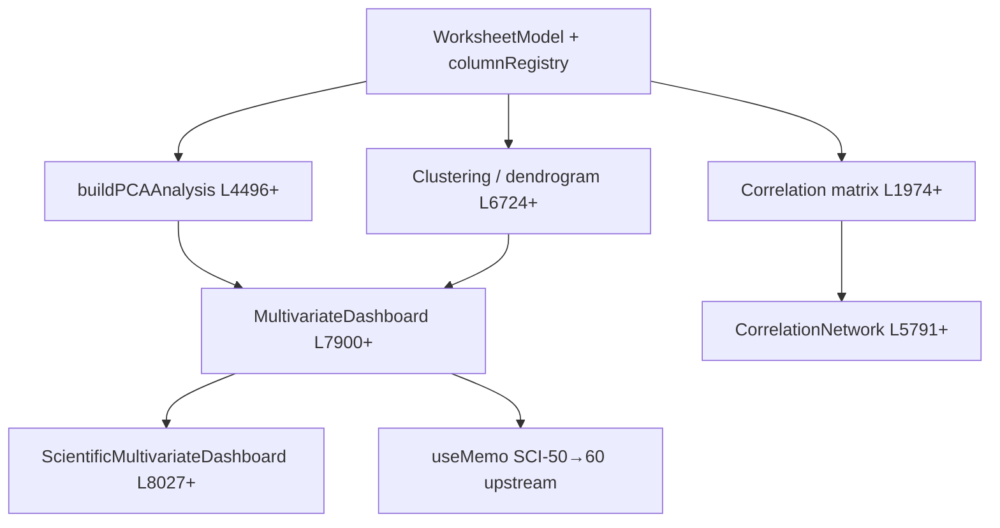

# PROD-2E — Baseline Arquitectónico (D25.2)

**Estado:** **BASELINE CONGELADO — D25.2 COMPLETED**  
**Fecha de medición:** 2026-07-09  
**Commit de referencia:** working tree pre-D26 (handoff PROD-2D CLOSED)  
**Propósito:** Línea base objetiva **pre-DATA-3B** para comparación al cierre PROD-2E (D36/D37)  
**Documento padre:** [`PROJECT_DISCOVERY_PROD_2E.md`](PROJECT_DISCOVERY_PROD_2E.md) · Plan: [`PROJECT_PLAN_PROD_2E.md`](PROJECT_PLAN_PROD_2E.md)

> Este baseline es **inmutable** salvo amend explícito. D36 debe referenciar este documento para certificar mejoras del motor gráfico.

---

## 1. Resumen ejecutivo

| Dimensión | Valor baseline |
|-----------|----------------|
| LOC `src/app/page.tsx` | **26.476** |
| LOC `src/lib/visualGraphBuilder.ts` | **637** |
| LOC `src/components/graph-builder/` (4 archivos) | **655** |
| LOC `src/app/chartViewport.ts` | **79** (solo eje X) |
| Tipos VGB activos | **6** |
| Tipos VGB placeholder | **7** |
| Exports `@/lib/visualGraphBuilder` | **32** |
| Bloque SCI-40 multivariante inline | **~8.532 LOC** (L1974–L10505) |
| F5F-BIS UI SCI-50–56 inline | **~718 LOC** (L10506–L11223) |
| Scripts `validate:*` | **60** |
| `validate:prod2c-c8-regression-gate` | **PASS (5/5)** |
| `validate:visual-graph-builder-unit` | **PASS (10/10)** |
| `validate:chart-viewport` | **PASS (9/9)** |

---

## 2. Métricas del monolito (referencia D24)

| Archivo | LOC físicas | Notas |
|---------|-------------|-------|
| `src/app/page.tsx` | **26.476** | Certificación D24; sin cambio en D25 |
| `src/lib/visualGraphBuilder.ts` | **637** | Dominio VGB |
| `VisualGraphBuilder.tsx` | **310** | UI constructor |
| `GraphPreview.tsx` | **195** | Preview Recharts |
| `GraphTypeSelector.tsx` | **57** | Selector tipos |
| `VariableSelector.tsx` | **93** | Selector variables |
| `chartViewport.ts` | **79** | Auto-fit **X** únicamente |

### 2.1 Bloques inline objetivo ARCH-5 gráfico

| Bloque | Rango líneas | LOC | Destino PROD-2E |
|--------|--------------|-----|-----------------|
| Correlación / matrices | L1974–L2200 | ~227 | SCI-40 dominio |
| Gráficos científicos inline (heatmap, bubble, PCA plots, etc.) | L2437–L10505 | ~8.068 | SCI-40 + reutilización PCA VGB |
| F5F-BIS UI metodología SCI-50–56 | L10506–L11223 | **718** | D33 → `components/methodology/` |
| Motor curvas y=f(x) (handlers + eval) | ~L1300–L1700 + wiring | ~400+ refs | D31 → `lib/graph/curves/` |

**Total SCI-40 medido:** **8.532 LOC** (L1974–L10505) — **trigger Escenario B** (>1.000 LOC).

### 2.2 Acoplamiento SCI-40 — mapa de dependencias

| Nodo | Dependencias directas | Acoplamiento |
|------|----------------------|--------------|
| `buildPCAAnalysis` | Worksheet numérico, constantes excluidas | **Medio** — reutilizable VGB D28 |
| `buildMultivariateDashboardAnalysis` | PCA + clustering + MANOVA + diagnosis | **Muy alto** |
| Componentes `Scientific*` gráficos (20+) | Análisis inline respectivo | **Alto** — extracción D34–D35 |
| Cadena SCI-50→60 `useMemo` | Multivariante como input upstream | **Alto** — wiring permanece en boundary |

**Decisión amend:** **Escenario B** — D34 dominio, D35 UI/wiring (plan § D34).

### 2.3 Decisión PCA vs clustering (tipo VGB #3)

| Criterio | PCA | Clustering |
|----------|-----|------------|
| LOC math reutilizable | ~600 (buildPCAAnalysis + helpers) | ~900+ (jerárquico + constantes) |
| Preview existente | `ScientificPCAPlotChart` L4673 | `ScientificHierarchicalClusteringDendrogram` L11438 |
| Acoplamiento dashboard SCI-40 | Medio | **Alto** |
| Round-trip VGB factible | **Sí** — `pcaVariables[]` en API Freeze | Complejo — grupos dinámicos |
| **Decisión D25** | **ELEGIDO** | Backlog SCI-40 extracción |

---

## 3. Métricas rendimiento motor gráfico

> Medición: `scripts/measure-prod2e-baseline-perf.ts` · 50 iteraciones · 2026-07-09T13:10:51Z  
> Dataset referencia: 3 series, 15 observaciones (control1, tratamiento1, grupo)  
> **Nota:** No incluye render DOM (Recharts). Re-medición obligatoria en cierre PROD-2E.

### 3.1 Generación preview (`buildVisualGraphPreview`)

| graphType | Mediana (ms) | P95 (ms) | Puntos default |
|-----------|-------------|----------|----------------|
| scatter | 0.0474 | 0.2684 | 5 |
| line | 0.0314 | 0.1049 | 5 |
| bar | 0.0294 | 0.0813 | 2 |
| histogram | 0.0205 | 0.0649 | 5 |
| boxPlot | 0.0264 | 0.0742 | 2 |
| violin | 0.0127 | 0.0455 | 5 |

### 3.2 Hydrate proyectos con gráficos

| Fixture | Mediana (ms) | P95 (ms) | Gráficos |
|---------|-------------|----------|----------|
| `project-v2-dataset5-with-visual-graph.sgproj` | 0.5591 | 2.0327 | 1 |
| `project-v2-dataset5-dataset6-with-visual-graphs.sgproj` | 0.3885 | 0.9116 | 2 |

### 3.3 Memoria

| Métrica | Valor |
|---------|-------|
| Heap usado post-medición | **69.42 MB** |
| Nota | Delta aproximado Node.js; no incluye browser heap |

### 3.4 Render preview UI

| Métrica | Valor baseline | Protocolo |
|---------|---------------|-----------|
| Tiempo render Recharts VGB | **No medido automatizado** | Smoke manual D26+ o Playwright QA-2 |
| Motivo | D25 es documentación; medición DOM diferida a BUILD con tipos nuevos |

---

## 4. Estado gates VGB (pre-D26)

| Gate | Resultado | Casos |
|------|-----------|-------|
| `validate:prod2c-c4-visual-graph-mapper` | **PASS** | 19/19 |
| `validate:prod2c-c5-visual-graph-collect` | **PASS** | 11/11 |
| `validate:prod2c-c6-visual-graph-hydrate` | **PASS** | 16/16 |
| `validate:prod2c-c7-visual-graph-ui` | **PASS** | 12/12 |
| `validate:prod2c-c8-visual-graph-fixtures` | **PASS** | 14/14 |
| **`validate:prod2c-c8-regression-gate`** | **PASS** | 5/5 |
| `validate:visual-graph-builder-unit` | **PASS** | 10/10 |
| `validate:chart-viewport` | **PASS** | 9/9 (solo X) |

---

## 5. Exports congelados `@/lib/visualGraphBuilder` (v1)

32 exports públicos — **inmutables** en semántica PROD-2E:

**Tipos:** `VisualGraphType`, `VisualGraphMarkerStyle`, `VisualGraphLineStyle`, `VisualGraphErrorBars`, `VisualGraphSpecification`, `GraphSpecification`, `VisualGraphVariableBadge`, `VisualGraphVariable`, `VisualGraphPreviewPoint`, `VisualGraphPreviewLineSeries`, `VisualGraphPreviewBarItem`, `VisualGraphPreviewHistogramBin`, `VisualGraphPreviewBoxPlotItem`, `VisualGraphPreviewViolinItem`, `VisualGraphPreview`, `VisualGraphBuilderDraft`, `ProjectVisualGraphEntry`

**Constantes:** `VISUAL_GRAPH_TYPES_V1`, `VISUAL_GRAPH_TYPE_LABELS`, `VISUAL_GRAPH_TYPES_FUTURE`, `DEFAULT_VISUAL_GRAPH_SPECIFICATION`, `INITIAL_VISUAL_GRAPH_BUILDER_DRAFT`

**Funciones:** `buildVisualGraphVariables`, `validateVisualGraphConfiguration`, `buildGraphSpecification`, `buildVisualGraphPreview`, `buildVisualGraphSeries`, `applyVisualGraphSpecification`, `hasVisualGraphPreviewChanged`, `createProjectVisualGraphEntry`, `incorporateVisualGraphIntoProject`, `suggestDefaultYVariable`

---

## 6. Deuda conocida carry-in (handoff D24)

| ID | Item | LOC | Microfase target |
|----|------|-----|------------------|
| **F5F-BIS** | UI SCI-50–56 inline | ~718 | D33 |
| **SCI-40** | Multivariante inline | ~8.532 | D34–D35 (Escenario B) |
| **CURVES-INLINE** | Motor curvas en page.tsx | ~400+ | D31–D32 |
| **GRAPH-NO-Y-FIT** | Sin auto-fit Y | — | D29 |
| **NO-PUB-PRESETS** | Sin presets publicación | — | D30 |

---

## 7. Comparación objetivo cierre PROD-2E (D36)

Métricas re-medidas vs baseline D25.2 (D36.1/D36.3 — 2026-07-16):

| Dimensión | Baseline D25 | Resultado D36 | Estado |
|-----------|-------------|---------------|--------|
| Tipos VGB activos | 6 | **9** (+heatmap, bubble, pca) | **ALCANZADO** |
| Auto-fit Y | No | **Sí** (D29) | **ALCANZADO** |
| Presets publicación | No | **≥3** (D30) | **ALCANZADO** |
| Motor curvas en dominio | No | **Sí** (`lib/graph/curves/`) | **ALCANZADO** |
| GRAPH modular (axes · interaction · rendering) | No | **Sí** (D33–D35) | **ALCANZADO** |
| F5F-BIS en page.tsx | ~718 LOC | **~718 LOC** (inline) | **DEFERRED** (amend D33.1 → ARCH-5) |
| SCI-40 en page.tsx | ~8.532 LOC | **~8.532 LOC** (inline) | **DEFERRED** (amend D33.1 → ARCH-5) |
| Preview median scatter (ms) | 0.0474 | **0.0278** (−41,4%) | **DOCUMENTADO** |
| Hydrate mono (ms) | 0.5591 | **0.3643** (−34,8%) | **DOCUMENTADO** |
| `page.tsx` LOC (no vacías) | 26.476 | **24.918** (−1.558) | **DOCUMENTADO** |

> **Amend D33.1:** Los targets originales F5F-BIS=0 y SCI-40=0 (Escenario B) no aplican al cierre PROD-2E certificado. La extracción F5F-BIS/SCI-40 quedó **diferida** a ARCH-5/post-GRAPH-3; el checklist ítem #5 se certifica **PASS (deferred)**. Ver [`PROJECT_STATUS_PROD_2E.md`](PROJECT_STATUS_PROD_2E.md) §D36 Resolution Note.

---

*Baseline PROD-2E — congelado D25.2 (2026-07-09) · Amend §7 D36.6 (2026-07-16) · Script medición: `scripts/measure-prod2e-baseline-perf.ts`.*
