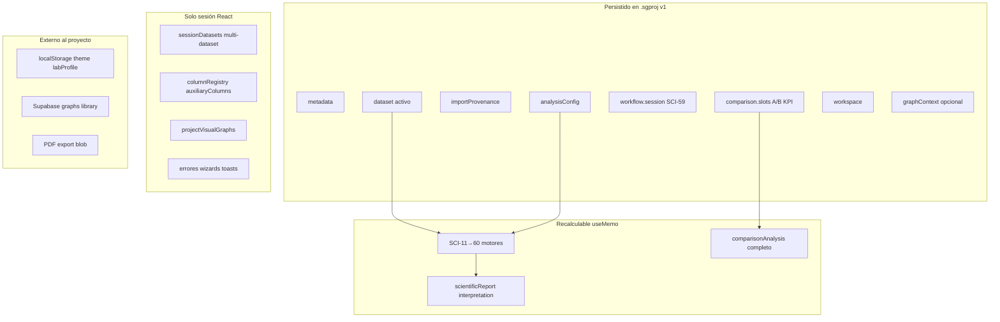
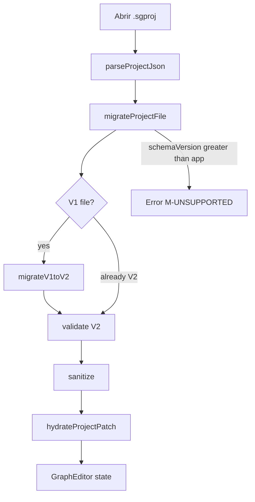
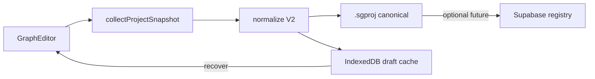
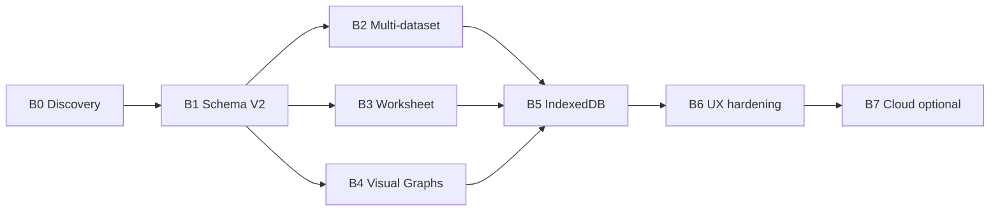

# PROD-2B — Discovery: Persistencia de Proyectos Científicos

**Estado:** **DISCOVERY CERRADO**  
**Fecha de aprobación:** 2026-06-27  
**Identificador:** PROD-2B (continúa [PROD-2A](src/lib/project/README.md))  
**Próxima etapa:** Plan de implementación (fases B1–B7)

**Nota de nomenclatura:** El brief original usaba "SCI-59 Persistencia"; en el codebase **SCI-59 = Guided Scientific Workflow** (`workflow.session` en `.sgproj`). Esta épica se identifica como **PROD-2B** para evitar colisión.

**Base:** PROD-2A COMPLETED — archivo `.sgproj` schema v1, boundary en [`src/app/projectPersistence.ts`](src/app/projectPersistence.ts), ~130 `useState` / ~100 `useMemo` en [`src/app/page.tsx`](src/app/page.tsx).

**Referencias:** [`PROJECT_STATUS_SCI_58.md`](PROJECT_STATUS_SCI_58.md) · [`ROADMAP.md`](ROADMAP.md) · [`PROJECT_STATUS_SCI_56.md`](PROJECT_STATUS_SCI_56.md)

---

## Principio Arquitectónico — Estado Persistente del Dominio

> El archivo `.sgproj` representa exclusivamente el **estado persistente del dominio científico**. No deberá almacenar cachés, resultados derivados fácilmente recalculables ni estado efímero de la interfaz. Siempre que sea posible, al abrir un proyecto la aplicación **reconstruirá los artefactos derivados** a partir del modelo persistido, garantizando un formato estable, compacto y desacoplado de la implementación interna.

Este principio gobierna todas las decisiones de PROD-2B:

- **Persistir:** datos primarios, configuración de análisis, snapshots explícitos del usuario (SCI-58), orquestación de workflow y navegación de workspace.
- **No persistir:** salidas de motores SCI-50→60, agregados de reporte, PDF, caches de renderizado, feedback UI.
- **Reconstruir al abrir:** pipeline `useMemo` determinista desde dataset + config; IndexedDB solo para drafts/recovery, no como segunda fuente de verdad científica.

---

## 1. Inventario del estado actual

### 1.1 Qué constituye un "Proyecto Científico" hoy



| Categoría | Ejemplos | Clasificación |
|-----------|----------|---------------|
| **Datos primarios** | `ExperimentalSeries[]`, `ImportReport`, worksheet columns | **Persistir** — fuente de verdad |
| **Configuración de análisis** | 58 toggles visibility, 9 modes, 4 inferential selections, legend | **Persistir** — intención del usuario |
| **Orquestación UX** | Guided workflow session, workspace tab, enabled modules | **Persistir** — continuidad de sesión |
| **Snapshots comparativos** | SCI-58 Slot A/B KPI profiles | **Persistir** — read-only snapshots explícitos |
| **Contexto gráfico matemático** | Curves, axis ranges, title | **Persistir** (opcional) — constructor matemático |
| **Resultados científicos** | SCI-50→60 analyses, normality, inference, multivariate | **Recalcular** — derivados deterministas |
| **Reportes narrativos** | `scientificReport`, `scientificInterpretation`, advisor text | **Regenerar** — derivados de motores + plantillas |
| **Comparación derivada** | `MultiDatasetComparisonAnalysis` | **Recalcular** desde snapshots A/B |
| **UI efímera** | Errores, copy flags, wizard abierto, PDF spinner | **No persistir** |
| **Preferencias globales** | theme, labUsageProfile | **localStorage** (fuera del proyecto) |
| **Biblioteca nube** | Supabase `graphs[]` | **Sistema separado** (referencia futura por id) |

### 1.2 PROD-2A — lo que ya persiste

Ver [`src/lib/project/types.ts`](src/lib/project/types.ts).

| Bloque | Campos clave | Límite conocido |
|--------|--------------|-----------------|
| `metadata` | id, name, timestamps | Sin historial de versiones |
| `dataset` | series, info, checksum? | **Un solo dataset** |
| `importProvenance` | report, preserveAnalysisOnReimport | Sin wizard state |
| `analysisConfig` | 58 visibility keys, modes, 4 selections, legend | Sin ANOVA group picks |
| `workflow` | SCI-59 session (template, step, completed/skipped) | Toggles viven en visibility |
| `comparison` | slots A/B + `DatasetAnalysisProfileV1` | Perfil V1 **subconjunto** del runtime enriquecido (SCI-58 v2) |
| `workspace` | section, inspector, modules, controlPanelTab | `home` → `data` al guardar |
| `graphContext` | curves, axes | IDs de curvas reasignados al cargar |

### 1.3 Gaps críticos vs "proyecto científico completo"

1. **Multi-dataset:** [`sessionDatasetRegistry.ts`](src/lib/sessionDatasetRegistry.ts) (`sessionDatasets[]`, `activeDatasetId`) no entra en `.sgproj` — al guardar/abrir solo sobrevive el dataset activo.
2. **Worksheet:** `columnRegistry`, `auxiliaryColumns`, `worksheetModified` en `SessionDatasetPayload` — no serializados.
3. **Visual Graph Builder:** `projectVisualGraphs` — session-only.
4. **Perfil comparativo enriquecido:** campos `methodological`, `multivariate`, `publication`, `captureMetadata` (SCI-58 v2 A1) pueden aparecer por JSON spread pero **no están en contrato V1** ni validados.
5. **Sin autosave, recent files, ni path tracking** — save = download manual.
6. **Sin versionado/migraciones** más allá de identity v1.
7. **~100 useMemo** recomputan al abrir — tiempo de carga proporcional al dataset.

---

## 2. Inventario useState — resumen por dominio

**Total:** ~130 hooks en `GraphEditor` + 5 en sub-componentes.

| Dominio | Count aprox. | Persistir | Recalcular | Ephemeral |
|---------|--------------|-----------|------------|-----------|
| Dataset/import | 12 | 6 (series, info, report, preserve flag) | — | 4 (wizard, errors) |
| Graph/math | 18 | 10 (curves, axes, modes) | 2 (chartData, metrics) | 6 |
| Visibility toggles (`show*`) | 58 | **58** (analysisConfig) | — | — |
| Analysis modes/selections | 10 | **10** | — | — |
| Comparison | 1 (+ toggles) | `comparisonSlots` | — | — |
| Workflow/UX | 8 | 1 (guidedWorkflowSession) | — | 7 |
| Workspace/navigation | 10 | 5 (section, inspector, modules, tab) | — | 5 |
| Project file | 3 | 1 (metadata) | 1 (isProjectDirty) | 1 |
| Theme/lab | 3 | 2 via **localStorage** | — | 1 (hydration guard) |
| Reports/share UX | 10 | 0 | — | **10** |

**Regla de persistencia:** persistir **inputs** (datos + configuración + snapshots explícitos + navegación); no persistir **outputs** (`useMemo` científicos) ni **feedback UI**.

---

## 3. Inventario useMemo — clasificación

| Clase | Ejemplos | Persistir | Justificación |
|-------|----------|-----------|---------------|
| **Derivados del dataset** | `experimentalStatistics`, `normalityAnalyses`, `pcaAnalysis` | **No** | Deterministas desde series + config |
| **Derivados de configuración** | `visibleExperimentalSeries`, `filteredFunctionLibrary` | **No** | Filtros sobre estado ya persistido |
| **Derivados de resultados (cascada SCI)** | `methodologicalDashboardAnalysis` → `publicationDashboardAnalysis` | **No** | Pipeline reproducible |
| **Cache de renderizado** | `composedChartData`, `chartTheme`, intersection markers | **No** | Regenerables |
| **Agregados de reporte** | `scientificReport`, `scientificInterpretation`, `comparisonAnalysis` | **No** | Evita drift texto vs motores |
| **Workflow derivado** | `guidedWorkflowContext`, `activeGuidedWorkflowPlan` | **No** | Reconstruible desde session + runtime |

**Excepción — snapshots explícitos:** SCI-58 slot profiles son **decisiones de captura del usuario**, no cache automático — deben persistirse formalmente con contrato V2 enriquecido.

---

## 4. Motores científicos — persistir vs recalcular

| Motor | Ubicación | Persistir resultados | Recomendación |
|-------|-----------|---------------------|---------------|
| Normality canónica | `src/lib/scientific/normality/` | No | Recalcular |
| Inferencia SCI-12–15 | `src/lib/scientific/inference/` | No | Recalcular; **persistir selections** |
| SCI-57 Effect/Power | `inference/effect-size.ts` | No | Recalcular; snapshot parcial en SCI-58 slot |
| SCI-40 Multivariate | page.tsx inline | No | Recalcular |
| SCI-50→55 | page.tsx inline | No | Recalcular |
| SCI-56 Methodological | page.tsx inline | No | Recalcular |
| SCI-60 Publication | page.tsx inline | No | Recalcular |
| SCI-58 Comparison | `src/lib/scientific/comparison/` | **Snapshots sí**; análisis no | Recalcular análisis desde snapshots |
| SCI-59 Workflow | `src/lib/scientific/workflow/` | **Session sí** (ya) | Mantener |
| PDF export | `src/lib/scientific/report/` | **No** | Regenerar siempre |

**Principio operativo:** *Configuration + data + explicit snapshots = source of truth; engines = pure functions.*

---

## 5. Exportación PDF

| Opción | Pros | Contras |
|--------|------|---------|
| **Persistir PDF binario** | Apertura instantánea | Obsoleto si cambian datos/motores; tamaño |
| **Persistir solo configuración de reporte** | Pequeño; flexible | Hoy no existe config separada del runtime |
| **Regenerar siempre (recomendado)** | Coherente con motores actuales | Coste CPU al exportar |

**Decisión:** **regenerar siempre** al exportar. Persistir únicamente toggles/modes, snapshots SCI-58 condicionales y metadata opcional de última exportación (`lastExportedAt`) — no el PDF.

---

## 6. Modelo conceptual del Proyecto Científico

```
ScientificProject (envelope)
├── metadata
│   ├── id, name, description, author
│   ├── schemaVersion, appVersion
│   ├── createdAt, updatedAt
│   └── revisionHistory[]          // PROD-2B futuro
├── datasets[]                     // PROD-2B: multi-dataset
│   ├── id, label, importedAt
│   ├── series[], importReport
│   ├── worksheet                  // columnRegistry, auxiliaryColumns, modified
│   └── checksum?
├── activeDatasetId
├── analysisConfig
│   ├── visibility (58+ keys)
│   ├── modes
│   ├── selections (extend: ANOVA groups, etc.)
│   └── legend
├── comparison
│   ├── slots { A, B, ...N? }
│   └── slotBinding → datasetId
├── workflow
│   └── session (SCI-59)
├── workspace
│   ├── navigation (section, inspector, modules)
│   └── uiState (collapsibles — opcional, baja prioridad)
├── graphContext?                  // math constructor
├── visualGraphs[]?                // PROD-2B: VGB entries
├── reportPreferences?             // secciones PDF preferidas (futuro)
└── extensions?                    // forward-compatible bag
```

**Separación de capas:**

- **Project domain** (`src/lib/project/`) — tipos, serialize, validate, migrate — sin lógica SCI
- **Session runtime** — React state + useMemo — rehidrata desde project patch
- **Scientific domain** — motores puros — nunca importan project

---

## 7. ScientificProjectV1 vs V2 y migrador V1→V2

### 7.1 Qué representa ScientificProjectV1 (PROD-2A)

`ScientificProjectV1` (`schemaVersion: 1`) es el **contrato mínimo viable** de PROD-2A: un **snapshot mono-dataset** con configuración, workflow y snapshots SCI-58 — no un workspace científico completo.

| Dimensión | Semántica V1 |
|-----------|--------------|
| **Propósito** | Round-trip local: dataset activo, toggles, workflow SCI-59, snapshots SCI-58 A/B |
| **Dataset** | Un bloque `dataset` — equivalente al dataset **activo** |
| **Análisis** | Configuración sin resultados computados |
| **Comparación** | KPI snapshots — `DatasetAnalysisProfileV1` |
| **Límite** | Documentado: *"Not persisted: SCI-53→60 outputs, useMemo analyses, PDF"* |

**Migrador actual:** [`migrate.ts`](src/lib/project/migrate.ts) — `MIGRATORS[1] = identityMigrateV1`.

### 7.2 Por qué ScientificProjectV2

| Gap V1 | Respuesta V2 |
|--------|--------------|
| Un solo dataset | `datasets[]` + `activeDatasetId` |
| Worksheet no serializado | bloque `worksheet` por dataset |
| Perfil comparison fuera de contrato | `DatasetAnalysisProfileV2` formalizado |
| Visual Graph Builder session-only | `visualGraphs[]` opcional |
| Slots sin referencia al dataset | `slotBinding.datasetId` |
| Drift runtime↔disco | validación estricta V2 |

**Diseño V2:** cambios **aditivos** — ningún campo V1 eliminado en migración.

**Por qué nueva schemaVersion:**

1. Validación discriminada v1 vs v2
2. Migración explícita V1→V2 al abrir
3. Compatibilidad forward (v3+)
4. Gates de regresión con fixtures V1 intactos

### 7.3 Migrador V1→V2



| Campo V1 | Campo V2 |
|----------|----------|
| `project.dataset` | `project.datasets[0]` con `id` estable |
| — | `project.activeDatasetId` |
| `project.importProvenance` | dentro del dataset o por referencia |
| `comparison.slots.*.profile` | perfil V2 + `slotBinding.datasetId` |
| resto | copia directa |

**Reglas:** idempotente · no destructivo · warnings explícitos · gate `validate:prod2b-migrate`.

---

## 8. Estrategias de persistencia — comparativa

| Estrategia | Fit PROD-2B |
|------------|-------------|
| **localStorage** | Solo prefs globales (theme, labProfile) |
| **IndexedDB** | Autosave, recent projects, recovery — **no** fuente de verdad científica |
| **Archivo JSON (.sgproj)** | **Canónico** — evolucionar v1→v2 |
| **Supabase** | Fase cloud — metadata + refs |
| **Híbrida (recomendada)** | **Primaria** |



---

## 9. Forward Compatibility

### 9.1 Envelope inmutable

```json
{
  "kind": "scientific-graph-ai.project",
  "schemaVersion": <number>,
  "appVersion": "<semver>",
  "exportedAt": "<ISO-8601>",
  "project": { ... }
}
```

### 9.2 Política de `schemaVersion`

| Regla | Descripción |
|-------|-------------|
| **Monótono entero** | v1 → v2 → v3+ |
| **Un migrador por salto** | `MIGRATORS[n]` en cadena |
| **MAX_SUPPORTED** | Rechazar versiones futuras (`M-UNSUPPORTED`) |
| **Additive by default** | Breaking changes solo con nueva schemaVersion |
| **No auto-downgrade** | Export siempre escribe versión actual |

### 9.3 Pipeline de migraciones

```
parse → migrate (v1→v2→…→current) → validate → sanitize → hydrate
```

- Migradores: funciones puras, tests por salto, **nunca** migrar motores SCI
- Perfiles anidados: `DatasetAnalysisProfileV1` → `V2` dentro del migrador V1→V2

### 9.4 Matriz de compatibilidad (objetivo post-PROD-2B)

| Formato | PROD-2A app | PROD-2B app |
|---------|-------------|-------------|
| `.sgproj` v1 | Abrir nativo | Abrir → migrar a v2 runtime |
| `.sgproj` v2 | Error | Abrir nativo |
| `.sgproj` v3+ | Error `M-UNSUPPORTED` | Error hasta migrador v2→v3 |

### 9.5 Extensibilidad

`project.extensions?: Record<string, unknown>` — round-trip de campos experimentales; namespace `"prod2b.experimental.*"`.

---

## 10. Riesgos técnicos

| Riesgo | Severidad | Mitigación |
|--------|-----------|------------|
| Tamaño datasets | Alta | IndexedDB drafts; límites documentados |
| Serialización | Media | Fixtures D5/D6; round-trip gates |
| Compatibilidad V1→V2 | Alta | Migrador aditivo; fixtures V1 PASS |
| Rendimiento al abrir | Media | No persistir useMemo; loading UX |
| Drift runtime↔disco | Alta | `DatasetAnalysisProfileV2` formal |
| Monolito page.tsx | Alta | PROD-2B acotado a `src/lib/project/` + boundary |
| Multi-dataset + comparison | Media | `slotBinding.datasetId`; sanitize orphans |

---

## 11. Recomendación técnica

Evolucionar **PROD-2A → PROD-2B** con filosofía **"persist inputs, recompute outputs"**, alineada con el **Principio Arquitectónico** de esta épica:

1. Schema V2 aditivo — multi-dataset, worksheet, comparison V2, visual graphs
2. `.sgproj` como formato canónico
3. IndexedDB para autosave — sin reemplazar export manual en fase inicial
4. No persistir motores SCI-50→60 ni PDF
5. Formalizar contrato comparison V2 (deuda SCI-58 v2 A4)
6. localStorage solo para preferencias de app
7. Supabase — fase posterior (B7)

---

## 12. Roadmap PROD-2B — fases con gates

| Fase | Nombre | Entregable principal | Gate |
|------|--------|----------------------|------|
| **B0** | Discovery | Este documento | **CERRADO** |
| **B1** | Schema V2 + contratos | `ScientificProjectV2`, migrator V1→V2, validadores | `validate:prod2b-f0` + `validate:prod2b-migrate` |
| **B2** | Multi-dataset | `datasets[]`, `activeDatasetId`, `slotBinding` | Round-trip D5+D6; SCI-58 Δ −9.5 |
| **B3** | Worksheet | columnRegistry, auxiliaryColumns, modified | RW workbook preserve |
| **B4** | Visual Graph Builder | `visualGraphs[]` | `validate:visual-graph-builder-unit` |
| **B5** | IndexedDB autosave | Draft cache, recovery, recent projects | Unit + crash-recovery manual |
| **B6** | UX hardening | Autosave indicator, conflict detection | `validate:prod2b-gate` (E2E) |
| **B7** | Cloud-ready (opcional) | Supabase project registry | Offline-first + sync test |



**Invariante por fase:** TypeScript PASS · `validate:full` PASS · regresión PROD-2A (fixtures V1) · baseline D5/D6 sin regresión.

---

## 13. Cierre oficial del Discovery

| Item | Estado |
|------|--------|
| Inventario estado actual | Completado |
| Clasificación persistir / no persistir | Completado |
| Modelo conceptual Proyecto Científico | Completado |
| V1 vs V2 + migrador | Completado |
| Estrategias de persistencia | Completado |
| Forward Compatibility | Completado |
| Principio Arquitectónico | Documentado |
| Roadmap B0–B7 | Completado |
| **Discovery PROD-2B** | **APROBADO Y CERRADO** |

**Restricciones respetadas en esta etapa:** documentación únicamente · sin cambios de código · sin cambios funcionales · sin commits de implementación.

**Siguiente etapa:** Plan de implementación — ver [`PROJECT_PLAN_PROD_2B.md`](PROJECT_PLAN_PROD_2B.md) (APROBADO).

---

Documento generado al cierre del Discovery PROD-2B (2026-06-27). Sustituye al borrador de plan interno como referencia oficial de la épica.
