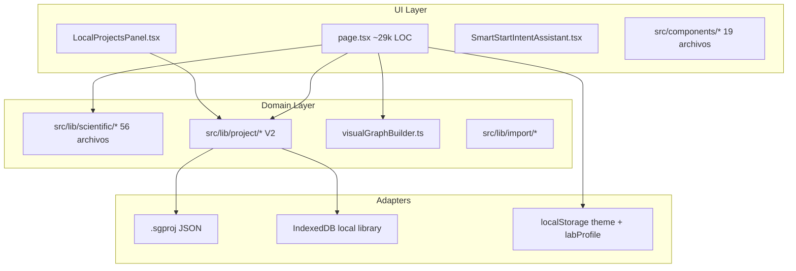
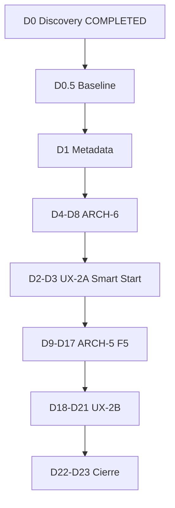

# PROD-2D — Discovery: UX profesional + arquitectura transversal

**Estado:** **DISCOVERY CERRADO (D0 COMPLETED)**  
**Fecha de cierre:** 2026-07-01  
**Identificador:** PROD-2D (continúa PROD-2C histórico CLOSED)  
**Próxima microfase:** **D1 — UX-2A metadata** (post-revisión D0.5)  
**Baseline:** [`PROJECT_BASELINE_PROD_2D.md`](PROJECT_BASELINE_PROD_2D.md) — **D0.5 COMPLETED**

**Base:** PROD-2A / PROD-2B / PROD-2C **CLOSED** · [`MASTER_ROADMAP_V1.md`](MASTER_ROADMAP_V1.md) §13 · QA-1 **CLOSED**

**Referencias:** [`QA-1_MANUAL_VALIDATION_PROTOCOL.md`](QA-1_MANUAL_VALIDATION_PROTOCOL.md) · [`PROJECT_STATUS_PROD_2C.md`](PROJECT_STATUS_PROD_2C.md) · [`PROJECT_STATUS_PROD_2B.md`](PROJECT_STATUS_PROD_2B.md) · [`src/lib/project/README.md`](src/lib/project/README.md) · Plan operativo: [`PROJECT_PLAN_PROD_2D.md`](PROJECT_PLAN_PROD_2D.md)

---

## Principio rector de PROD-2D

> PROD-2D **no amplía** el contrato `.sgproj` V2 ni los motores SCI. Su misión es **profesionalizar la experiencia de usuario**, **cerrar ARCH-6**, **entregar UX-2A/UX-2B MVP** y **reducir responsabilidades del monolito** mediante ARCH-5 F5 (extracción move-only SCI-50→SCI-60), preservando backward compatibility y el pipeline `parse → migrate → validate → sanitize → hydrate`.

Invariantes intocables:

- Dominio puro en `src/lib/scientific/` y `src/lib/project/domain/` (sin React/IndexedDB).
- Toggles metodológicos default OFF (UX-1A.1 LITE).
- Motores SCI calculan en runtime independientemente de visibilidad (salvo cambio explícito acordado en ARCH-6 — no previsto en alcance D0).
- Persistencia local-first; cloud B7 fuera de alcance.

---

## 1. Inventario del estado actual del proyecto

### 1.1 Resumen ejecutivo post-PROD-2C

| Hito | Estado | Referencia |
|------|--------|------------|
| Núcleo SCI-1→SCI-60 | Validado | QA-1 + `validate:full` |
| Persistencia V2 (multi-dataset, worksheet, VGB, IndexedDB) | **CLOSED** | PROD-2B + PROD-2C |
| ARCH-5 Fases 1–4 | **CLOSED** | `normality/`, `workflow/`, `inference/`, `comparison/` |
| ARCH-6 (observaciones QA-1 §10) | **Abierto** — objetivo PROD-2D | Este discovery |
| UX-2A (branding, Smart Start) | **Pendiente** — placeholders Next.js | `layout.tsx` |
| UX-2B (Historial / Configuración) | **Stubs** «Próximamente» | `page.tsx` sidebar |
| ARCH-5 F5 (metodología SCI-50→60 inline) | **En curso** — dominio SCI-50→56 extraído (D9–D12); pendiente SCI-60 dominio (D13) + UI (D14) | `methodology/*` + `page.tsx` boundary |
| Versión producto | `0.1.0` pre-v1.0 | `package.json` |
| Siguiente fase estratégica | **PROD-2D** | Master Roadmap §3.1 |

### 1.2 Métricas preliminares del monolito (inventario D0)

> **Nota:** métricas detalladas y baseline congelado → microfase **D0.5**. Aquí solo inventario preliminar para bloqueo de alcance.

| Métrica | Valor medido (2026-07-01) | Fuente |
|---------|---------------------------|--------|
| LOC `src/app/page.tsx` | **28.862** | conteo físico de líneas |
| `useState` en `page.tsx` | **144** | ripgrep |
| `useMemo` en `page.tsx` | **120** | ripgrep |
| `function` declaraciones top-level en `page.tsx` | **52** | ripgrep |
| Componentes React inline en `page.tsx` | **≥50** (incl. paneles metodológicos) | ripgrep `^function ` |
| Referencias UI metodológica (`Scientific*Engine/Dashboard`) | **26** | ripgrep |
| Stubs «Próximamente» en sidebar home | **2** (Historial, Configuración) | `page.tsx` ~L24138–24180 |
| Componentes `.tsx` en `src/components/` | **19** | filesystem |
| Módulos `.ts` en `src/lib/` | **183** | filesystem |

### 1.3 Arquitectura existente (capas)



**Ya modularizado (ARCH-5 F1–F4 + F5 parcial D9–D12):**

| Módulo | Ubicación | Permanece en monolito |
|--------|-----------|----------------------|
| Normalidad canónica | `scientific/normality/` | toggles + UI normality |
| Workflow SCI-59 dominio | `scientific/workflow/` | `GuidedWorkflowPanel`, handlers React |
| Inferencia SCI-12–15 + SCI-57 | `scientific/inference/` | toggles + UI inferencial |
| Comparación SCI-58 | `scientific/comparison/` + `components/comparison/` | capture slots, wrapper Resultados |
| Metodología SCI-50→56 dominio | `scientific/methodology/{consistency,report-quality,reproducibility,evidence,assumptions,readiness,summary}/` | `useMemo`, toggles, paneles `Scientific*` UI (D14) |

### 1.4 Inventario preliminar bloques SCI-50→SCI-60 en `page.tsx`

| Bloque | Motor | Builder principal (L approx.) | LOC approx. | Estado ARCH-5 |
|--------|-------|-------------------------------|-------------|---------------|
| SCI-50 | Consistency Engine | `buildConsistencyEngineAnalysis` | ~420 | **F5A — extracción completada (D9)** → `methodology/consistency/` |
| SCI-51 | Report Quality Engine | `buildReportQualityEngineAnalysis` | ~300 | **F5A — extracción completada (D9)** → `methodology/report-quality/` |
| SCI-52 | Reproducibility Explorer | `buildReproducibilityExplorerAnalysis` | ~250 | **F5A — extracción completada (D9)** → `methodology/reproducibility/` |
| SCI-53 | Evidence Strength Engine | `buildEvidenceStrengthEngineAnalysis` | ~390 | **F5B — extracción completada (D10)** → `methodology/evidence/` |
| SCI-54 | Assumption Tracker | `buildAssumptionTrackerAnalysis` | ~290 | **F5B — extracción completada (D10)** → `methodology/assumptions/` |
| SCI-55 | Publication Readiness | `buildPublicationReadinessAnalyzerAnalysis` | ~220 | **F5C — extracción completada (D11)** → `methodology/readiness/` |
| SCI-56 | Methodological Dashboard | `buildMethodologicalDashboardAnalysis` | ~270 | **F5D — extracción completada (D12)** → `methodology/summary/` |
| SCI-60 | Executive Publication Dashboard | `buildPublicationDashboardAnalysis` | ~810 | **F5E — pendiente (D13)** |
| SCI-59 UI | Guided Workflow Panel | `GuidedWorkflowPanel` | ~65 | **F5G — pendiente** |
| UX Home | Smart Start | `SmartStartScreen` | ~220 | **UX-2A D2 — completada** |

**Total bloque metodología inline:** ~2.930 LOC (dominio SCI-60 + interpretaciones + UI parcial; dominio SCI-50→56 extraído D9–D12). UI de paneles `Scientific*Engine/Dashboard` permanece distribuida en `page.tsx` hasta D14.

**Baselines QA-1 inmutables (regresión obligatoria):**

| Dataset | SCI-53 Evidence | SCI-55 Readiness | SCI-56 Overall Health | SCI-60 Status |
|---------|-----------------|------------------|----------------------|---------------|
| Dataset5 | ~82.7 | ~77.0 | ~77.0 | Near Ready |
| Dataset6 | ~73.3 | ~67.5 | ~67.5 | Requires Review |
| SCI-58 Δ Readiness | — | — | **−9.5** (A vs B) | — |

### 1.5 Stubs UX actuales (home sidebar)

| Elemento | Ubicación | Comportamiento actual |
|----------|-----------|----------------------|
| **Historial** | Sidebar Recursos, `page.tsx` ~L24138 | `aria-disabled`, badge «Próximamente» |
| **Configuración** | Sidebar Sistema, `page.tsx` ~L24172 | `aria-disabled`, badge «Próximamente» |
| **Tema oscuro** | Sidebar Sistema inline | **Funcional** — `localStorage` key `scientific-graph-theme` |
| **Perfil de laboratorio** | Sidebar + `LabUsageProfileSelector` | **Funcional** — `localStorage` key `scientific-graph-ai.lab-usage-profile` |
| **Proyectos locales** | `LocalProjectsPanel` (modal) | **Funcional** — CRUD IndexedDB vía `listLocalProjects` |
| **Metadata app** | `layout.tsx` | Placeholder «Create Next App», `lang="en"` |

### 1.6 Capacidades IndexedDB reutilizables para Historial MVP

Ya implementadas en PROD-2B B5 (sin cambios de schema en PROD-2D):

| API | Ubicación | Uso en UX-2B |
|-----|-----------|--------------|
| `listLocalProjects(repo, orderBy)` | `application/local-project/use-cases.ts` | Lista recientes ordenada por `lastAccessedAt` o `updatedAt` |
| `openLocalProject` | idem | Acción «Abrir» desde Historial |
| `LocalProjectSummary` | `domain/local-project/` | id, name, timestamps, storageState, size |
| `LocalProjectsPanel` | `src/app/LocalProjectsPanel.tsx` | Referencia UX; Historial MVP será vista **reducida** (solo listar + abrir) |

**Decisión D0:** Historial MVP **no duplica** CRUD completo de `LocalProjectsPanel`; expone acceso rápido read-only a recientes con acción abrir. Gestión completa (renombrar, eliminar, exportar) permanece en panel Proyectos locales existente.

### 1.7 Gates de regresión vigentes

| Gate | Alcance | Obligatorio en PROD-2D |
|------|---------|------------------------|
| `validate:full` | Núcleo científico + build + tsc + comparison | Sí — desde D8 |
| `validate:prod2b-b2-gate` | Multi-dataset V2 | Sí — cada microfase crítica |
| `validate:prod2b-indexeddb` | IndexedDB B5 | Sí — especialmente D20–D21 |
| `validate:prod2c-c8-regression-gate` | VGB persist | Sí — ARCH-5 no debe romper VGB |
| `validate:prod2d-gate` (nuevo D22) | Umbrella fase | Cierre PROD-2D |

---

## 2. Verificación de alcance ARCH-6

ARCH-6 cierra las **4 observaciones UX** registradas en QA-1 §10. **No constituyen bugs**; bloquean criterio v1.0 must-have #3 ([`MASTER_ROADMAP_V1.md`](MASTER_ROADMAP_V1.md) §11).

| # | Observación QA-1 §10 | Resolución PROD-2D | Microfase | Fuera de alcance |
|---|---------------------|-------------------|-----------|------------------|
| **10.1** | Sesión SCI-59 persiste al cambiar pestaña workspace | Indicador global persistente + CTA «Cancelar workflow» visible en Datos/Análisis/Resultados/Reportes | **D5** | Reset automático al cambiar tab |
| **10.2** | PDF incluye secciones metodológicas con toggles OFF | **Wont-fix funcional** en PROD-2D; banner informativo en Reportes; modelo toggle-aware (D4) prepara EXPORT-2 | **D4 + D8** | PDF condicional completo → **PROD-3 EXPORT-2** |
| **10.3** | Motores calculan en background con toggles OFF | Badge/tooltip explicativo (cálculo ≠ visualización); **sin** detener `useMemo` | **D6** | Lazy evaluation de motores |
| **10.4** | Workflow activa toggles pero no revierte al cancelar | Snapshot pre-inicio + restore en cancel | **D7** | Revertir toggles aplicados manualmente durante workflow |

**Observación histórica ya resuelta (no ARCH-6 PROD-2D):**

- **VGB persistente por dataset** — entregado en PROD-2C C4–C8 ([`PROJECT_STATUS_PROD_2C.md`](PROJECT_STATUS_PROD_2C.md)). No reabrir.

**Criterio de cierre ARCH-6:** 4/4 observaciones §10 resueltas o wont-fix documentado con mitigación UX; `validate:full` PASS ([Master Roadmap §10](MASTER_ROADMAP_V1.md)).

---

## 3. Verificación de alcance ARCH-5 F5

ARCH-5 F5 en PROD-2D es **parcial**; continúa en PROD-2E y PROD-3 según módulos restantes ([Master Roadmap §4](MASTER_ROADMAP_V1.md)).

### 3.1 Dentro de ARCH-5 F5 (PROD-2D)

| Subfase | Contenido | Microfases |
|---------|-----------|------------|
| **F5A** | Dominio SCI-50 + SCI-51 + SCI-52 | D9 |
| **F5B** | Dominio SCI-53 + SCI-54 | D10 |
| **F5C** | Dominio SCI-55 | D11 |
| **F5D** | Dominio SCI-56 | D12 — **COMPLETED** |
| **F5E** | Dominio SCI-60 | D13 — **siguiente** |
| **F5F** | UI paneles metodológicos → `components/methodology/` | D14 |
| **F5G** | UI `GuidedWorkflowPanel` → `components/workflow/` | D15 |
| **F5H** | Tests integrados + gate metodología | D16 |
| **F5I** | Certificación modularización vs baseline D0.5 | D17 |

**Protocolo:** extracción **move-only** estricta; dominio antes que UI; scores Dataset5/6 inalterados; subdivisión condicional D9–D13 según acoplamiento medido en D0.5.

**Destino objetivo:**

```
src/lib/scientific/methodology/
  consistency/      ← SCI-50
  report-quality/   ← SCI-51
  reproducibility/  ← SCI-52
  evidence/         ← SCI-53
  assumptions/      ← SCI-54
  readiness/        ← SCI-55 (D11)
  summary/          ← SCI-56 (D12)
  publication/      ← SCI-60 (D13 — pendiente)
src/components/methodology/   ← paneles UI
src/components/workflow/      ← GuidedWorkflowPanel (dominio ya en workflow/)
```

### 3.2 Fuera de ARCH-5 F5 (PROD-2D)

| Módulo | Razón | Fase futura |
|--------|-------|-------------|
| Multivariante SCI-40 inline | No es bloque metodología SCI-50→60 | PROD-2E / ARCH-5 continuación |
| Graph/math constructor | Dominio gráfico, no metodología | PROD-2E GRAPH-* |
| Handlers PDF / reporting wiring | Depende EXPORT-2 toggle-aware | PROD-3 |
| Capture SCI-58 slots en Datos | Ya parcialmente modularizado F4 | Mantener en boundary UI |
| Import / worksheet / VGB | Cerrados PROD-2C | Intocable |
| Reducción masiva de `useState` toggles | Fuera de F5; ARCH-6 D7 solo snapshot workflow | Evolución post-2D |

### 3.3 Criterio de éxito F5 (D17)

**Primario:** disminución efectiva de responsabilidades en `page.tsx` (dominio metodología + UI extraída operativa con gates PASS).

**Secundario:** reducción LOC medible vs baseline D0.5 — indicador de salud, **no** umbral único de cierre.

---

## 4. MVP definitivo — Historial (UX-2B)

### 4.1 Definición

**Historial MVP** es un panel de acceso rápido en el sidebar Recursos que lista **proyectos científicos recientes** almacenados en la biblioteca local IndexedDB (PROD-2B B5), permitiendo **abrir** un proyecto con un clic.

### 4.2 Funcionalidades incluidas (IN)

| # | Funcionalidad | Detalle |
|---|---------------|---------|
| H1 | Listar recientes | Top N (default **10**) proyectos ordenados por `lastAccessedAt` descendente |
| H2 | Abrir proyecto | Invoca flujo existente de apertura local respetando conflict detection B6 |
| H3 | Estado vacío | Mensaje amigable si no hay proyectos locales |
| H4 | Indicadores mínimos | Nombre, fecha último acceso, badge estado (`NORMAL` / `DIRTY` / `RECOVERABLE`) |
| H5 | Eliminar stub | Reemplazar entrada «Próximamente» por panel funcional o modal |

### 4.3 Exclusiones explícitas (OUT)

| Exclusión | Motivo |
|-----------|--------|
| Búsqueda / filtros / favoritos | Scope creep; panel completo ya existe en `LocalProjectsPanel` |
| Historial de acciones del usuario (undo/audit log) | Fuera de v1.0; no hay modelo de dominio |
| Metadata avanzada (autor, tags, descripción editable) | Pertenece a evolución PROD-3 / cloud |
| Estadísticas de uso | Fuera de MVP |
| Sincronización cloud | PROD-2B B7 post-v1.0 |
| CRUD completo (eliminar, renombrar, duplicar, exportar) | Permanece en `LocalProjectsPanel`; enlace opcional «Ver biblioteca completa» |
| Proyectos abiertos solo vía `.sgproj` file picker sin IndexedDB | Fuera de Historial; flujo Abrir archivo existente no cambia |
| Cambios a `schemaVersion` o campos `.sgproj` | PROD-2D no toca persistencia V2 |

### 4.4 Dependencias técnicas

- `listLocalProjects` / `openLocalProject` — **read-only reuse**, sin nuevo adaptador IndexedDB.
- Integración con detección de conflictos PROD-2B B6 al abrir desde Historial (**riesgo P2** — D21).
- Sin persistencia de preferencias de Historial en `.sgproj`.

---

## 5. MVP definitivo — Configuración (UX-2B)

### 5.1 Definición

**Configuración MVP** es un panel/modal accesible desde el sidebar Sistema que centraliza **preferencias globales de aplicación** (no del proyecto científico), persistidas en `localStorage`.

### 5.2 Funcionalidades incluidas (IN)

| # | Preferencia | Detalle | Storage key existente |
|---|-------------|---------|----------------------|
| C1 | **Tema** | Claro / Oscuro | `scientific-graph-theme` — migrar control desde sidebar inline |
| C2 | **Hints contextuales** | Toggle global `showContextualHints`: muestra/oculta tooltips, badges informativos y avisos de ayuda (incl. futuro ARCH-6.3 calc-vs-viz) | **Nuevo** — `scientific-graph-ai.contextual-hints` (default `true`) |
| C3 | **Versión de aplicación** | Mostrar semver read-only desde `package.json` / constante build (`0.1.0`) | N/A (display only) |

**Nota:** el **perfil de laboratorio** (`basic` / `standard` / `expert`) permanece en el sidebar vía `LabUsageProfileSelector` en MVP. No se mueve a Configuración en PROD-2D para minimizar diffs en `page.tsx` durante ARCH-5.

### 5.3 Exclusiones explícitas (OUT)

| Exclusión | Motivo |
|-----------|--------|
| Preferencias de motores SCI (toggles metodológicos) | Pertenecen a `analysisConfig` en `.sgproj`, no a prefs globales |
| Perfil de laboratorio en panel Config (mover) | Diferido; ya funcional en sidebar |
| i18n / idioma de interfaz | Fuera de v1.0 (Master Roadmap §12) |
| Sincronización / cuenta cloud | Post-v1.0 |
| Configuración de importación / PROD-1B | PROD-3 |
| Editor de metadata de proyecto (nombre, autor) | Pertenece a flujo proyecto / `.sgproj` |
| Atajos de teclado / accesibilidad avanzada | Evolución post-2D |
| Temas custom / branding usuario | UX-2A cubre branding app, no personalización |

### 5.4 Capa de dominio (D18)

```
src/lib/app-preferences/
  domain/          ← UserPreferences (tema, showContextualHints)
  adapters/        ← localStorage adapter puro
```

Separación estricta: **preferencias de app ≠ estado de proyecto**.

---

## 6. Alcance y exclusiones UX-2B (documento explícito)

UX-2B agrupa Historial + Configuración MVP (Master Roadmap §7.A).

### 6.1 Dentro de UX-2B (PROD-2D)

| Entregable | Microfases |
|------------|------------|
| Dominio preferencias usuario | D18 |
| Panel Configuración MVP | D19 |
| Application layer recientes (wrapper fino) | D20 |
| Panel Historial MVP | D21 |
| Eliminación stubs «Próximamente» en sidebar home | D19 + D21 |

### 6.2 Fuera de UX-2B

| Item | Épica / fase |
|------|--------------|
| Branding, metadata, Smart Start | **UX-2A** (D1–D3) |
| Observaciones QA-1 workflow/PDF/toggles | **ARCH-6** (D4–D8) |
| Biblioteca local CRUD completa | Ya entregada PROD-2B; no reimplementar |
| Cloud sync proyectos | PROD-3A / post-v1.0 |
| Historial científico de columnas worksheet | Ya existe `WorksheetColumnHistoryModal` — **no confundir** con UX-2B Historial |
| i18n, PWA, mobile | Master Roadmap §12 |

### 6.3 Criterio de cierre UX-2B

- Sin entradas «Próximamente» en sidebar Historial/Configuración.
- Preferencias Config persisten tras reload.
- Historial lista y abre proyectos IndexedDB.
- `validate:prod2b-indexeddb` PASS tras D21.

---

## 7. Decisiones arquitectónicas (congeladas en D0)

| ID | Decisión | Justificación |
|----|----------|---------------|
| **DA-1** | PROD-2D **no incrementa** `schemaVersion` | Persistencia V2 cerrada en PROD-2C |
| **DA-2** | Preferencias app en `localStorage`, **no** en `.sgproj` | Alineado con PROD-2B discovery (theme, labProfile) |
| **DA-3** | Historial MVP = vista reducida sobre IndexedDB existente | Reutilizar `listLocalProjects`; evitar duplicar CRUD |
| **DA-4** | ARCH-6.2 PDF = wont-fix funcional; mitigación UX + modelo D4 | EXPORT-2 requiere PROD-3; evitar scope creep |
| **DA-6** | ARCH-5 F5 move-only antes de refactors semánticos | Scores QA-1 son contrato de regresión |
| **DA-7** | Orden: ARCH-6 (D4–D8) antes de ARCH-5 F5 (D9–D17) | Cambios comportamiento en monolito más seguros con menos LOC movida |
| **DA-8** | UX-2B (D18–D21) **después** de ARCH-5 F5 | Evita competir por `page.tsx` durante extracciones masivas |
| **DA-9** | Subdivisión D9–D13 condicional post-D0.5 | Si acoplamiento excesivo, dividir en D9a/D9b etc. sin alterar orden global |
| **DA-10** | D17 mide responsabilidades, no solo LOC | Master Roadmap + ajuste plan maestro usuario |
| **DA-11** | `hints` = preferencia global de hints contextuales UI | Distinto de preferencias SCI; no incluye labProfile en Config MVP |

---

## 8. Orden de implementación D0→D23 (confirmado)

Secuencia oficial congelada — detalle por microfase en [`PROJECT_PLAN_PROD_2D.md`](PROJECT_PLAN_PROD_2D.md):

```
D0  Discovery          → COMPLETED (este documento)
D0.5 Baseline arq.     → siguiente (sin código)
D1  UX-2A metadata
D4  ARCH-6.1 toggle model
D5  ARCH-6.2 workflow indicator
D6  ARCH-6.3 calc vs viz
D7  ARCH-6.4 toggle revert
D8  ARCH-6.5 PDF wont-fix + cierre ARCH-6
D2  UX-2A Smart Start extract
D3  UX-2A Smart Start polish
D9–D13  ARCH-5 F5A–E dominio
D14–D15 ARCH-5 F5F–G UI
D16–D17 ARCH-5 F5H–I gates + certificación
D18–D19 UX-2B Config
D20–D21 UX-2B Historial
D22 Gate umbrella PROD-2D
D23 Cierre documental
```



**Nota numeración:** D2–D3 se ejecutan **después** de D8 (ARCH-6 completo) aunque numericamente preceden a D4 en la tabla de épicas. La numeración D1–D23 se mantiene por convención del plan maestro aprobado.

---

## 9. Riesgos identificados

| Riesgo | Severidad | Mitigación |
|--------|-----------|------------|
| Monolito ~29k LOC — regresión en extracción F5 | **Alta** | Move-only; gates por microfase; baselines D5/D6 |
| D7 toggle revert — estado React disperso | **Alta** | Snapshot acotado a inicio workflow; tests dedicados |
| D21 Historial + conflict B6 | **Media** | Reutilizar handler apertura existente; smoke manual |
| Scope creep UX-2B (buscar, favoritos, sync) | **Alta** | MVP congelado §4–§6; amend explícito para expandir |
| PDF wont-fix mal comunicado | **Media** | Banner D8 + doc EXPORT-2 PROD-3 |
| `validate:full` no cubre PROD-2B/2C | **Media** | Gate umbrella D22 |
| Divergencia README vs estado real | **Baja** | D23 alinea documentación |
| Subdivisión D9–D13 no ejecutada si acoplamiento alto | **Media** | D0.5 evalúa; amend plan antes de D9 |

---

## 10. Fuera de alcance global PROD-2D

Consolidado (Master Roadmap §13 + plan maestro):

- EXPORT-1/2/3, PROD-1B, DATA-3B, GRAPH-1/2
- Cloud B7, `schemaVersion` V3
- Nuevos tipos VGB, SCI-58 v3, SCI-59 v1.1
- QA-2 CI unificado, Playwright hardening (REL-2)
- i18n, PWA offline, colaboración multi-usuario
- Cambios a motores SCI semánticos (scores)

---

## 11. Cierre oficial D0 — Discovery PROD-2D

| Item | Estado |
|------|--------|
| Inventario estado actual | **Completado** §1 |
| MVP Historial definitivo | **Congelado** §4 |
| MVP Configuración definitivo | **Congelado** §5 |
| Alcance/exclusiones UX-2B | **Documentado** §6 |
| Verificación ARCH-6 | **Completado** §2 |
| Verificación ARCH-5 F5 | **Completado** §3 |
| Orden D0→D23 confirmado | **Completado** §8 |
| Decisiones arquitectónicas | **Congeladas** §7 |
| Riesgos | **Identificados** §9 |
| Plan operativo | [`PROJECT_PLAN_PROD_2D.md`](PROJECT_PLAN_PROD_2D.md) |
| Baseline arquitectónico | [`PROJECT_BASELINE_PROD_2D.md`](PROJECT_BASELINE_PROD_2D.md) — **D0.5 COMPLETED** |
| **Microfase D0** | **COMPLETED** |
| **Microfase D0.5** | **COMPLETED** |

**Restricciones respetadas (D0 + D0.5):** documentación únicamente · sin cambios de código · sin modificar `page.tsx` · sin componentes/adapters/tests/scripts/package.json.

**Siguiente microfase:** **D1 — UX-2A metadata** (esperar revisión antes de continuar).

---

*Documento generado al cierre del Discovery PROD-2D D0 (2026-07-01). Baseline detallado: [`PROJECT_BASELINE_PROD_2D.md`](PROJECT_BASELINE_PROD_2D.md) (D0.5 COMPLETED).*
