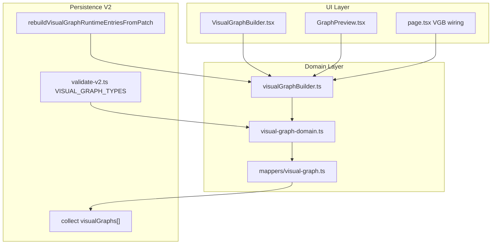

# PROD-2E — Discovery: Motor gráfico profesional

**Estado:** **DISCOVERY CERRADO (D25.1 COMPLETED)**  
**Fecha de cierre:** 2026-07-09  
**Identificador:** PROD-2E (continúa PROD-2D CLOSED)  
**Próxima microfase:** **D26 — DATA-3B tipo #1 Heatmap** (post-revisión D25.5)  
**Baseline:** [`PROJECT_BASELINE_PROD_2E.md`](PROJECT_BASELINE_PROD_2E.md) — **D25.2 COMPLETED**  
**Plan:** [`PROJECT_PLAN_PROD_2E.md`](PROJECT_PLAN_PROD_2E.md) — congelado D25.3  
**API Freeze:** §6 de este documento + [`PROJECT_PLAN_PROD_2E.md`](PROJECT_PLAN_PROD_2E.md) § D25.4

**Base:** PROD-2D **CLOSED** · [`MASTER_ROADMAP_V1.md`](MASTER_ROADMAP_V1.md) §13 · CA-D24 **21/21 PASS**

**Referencias:** [`PROJECT_STATUS_PROD_2D.md`](PROJECT_STATUS_PROD_2D.md) · [`PROJECT_DISCOVERY_PROD_2D.md`](PROJECT_DISCOVERY_PROD_2D.md) §3.2 · [`src/lib/project/README.md`](src/lib/project/README.md)

---

## Principio rector de PROD-2E

> PROD-2E **eleva el motor gráfico** (Visual Graph Builder, curvas y presets de publicación) a calidad profesional. **No reabre** contratos metodológicos SCI-50→60 ni UX-2A/2B. Amplía el contrato VGB **solo** según API Freeze D25.4, preservando backward compatibility V2 y el pipeline `parse → migrate → validate → sanitize → hydrate`.

Invariantes intocables:

- Dominio puro en `src/lib/` (sin React/IndexedDB en builders gráficos).
- Persistencia V2 multi-dataset, worksheet, VGB round-trip (PROD-2C CLOSED).
- VGB-R1: `preview` y `displaySeries` runtime-only — nunca en `.sgproj`.
- Motores SCI metodológicos: scores QA-1 inalterados salvo move-only ARCH-5.
- Export alta resolución (EXPORT-1) → **PROD-3**, fuera de alcance PROD-2E.

---

## 1. Inventario del estado actual

### 1.1 Resumen ejecutivo post-PROD-2D

| Hito | Estado | Referencia |
|------|--------|------------|
| Núcleo SCI-1→SCI-60 | Validado | QA-1 + `validate:full` |
| Persistencia V2 + VGB round-trip | **CLOSED** | PROD-2C C4–C8 |
| UX profesional (ARCH-6, UX-2A/2B/2C) | **CLOSED** | PROD-2D |
| ARCH-5 F5 metodología SCI-50→60 | **CLOSED** | PROD-2D D9–D17 |
| Tipos VGB activos | **6** (`VISUAL_GRAPH_TYPES_V1`) | `visualGraphBuilder.ts` |
| Tipos VGB futuros (placeholder UI) | **7** (`VISUAL_GRAPH_TYPES_FUTURE`) | deshabilitados |
| Auto-fit viewport | Solo eje **X** | `chartViewport.ts` |
| Presets publicación gráfica | **No existen** | objetivo GRAPH-1 |
| Motor curvas y=f(x) | Inline `page.tsx` | objetivo GRAPH-2 |
| Deuda ARCH-5 gráfica | F5F-BIS (~718 LOC) + SCI-40 (~8.532 LOC) | handoff D24 |
| Siguiente fase estratégica | **PROD-2E** | Master Roadmap §3.1 |

### 1.2 Arquitectura VGB existente

**Módulos ya extraídos (PROD-2C, intocables salvo extensión API Freeze):**

| Módulo | Ubicación | Rol |
|--------|-----------|-----|
| Builder dominio VGB | `src/lib/visualGraphBuilder.ts` | Tipos, preview, spec, apply |
| UI constructor | `src/components/graph-builder/` | 4 componentes |
| Dominio persist VGB | `src/lib/project/domain/visual-graph-domain.ts` | Clone, validate entry |
| Mapper persisted ↔ runtime | `src/lib/project/domain/mappers/visual-graph.ts` | Round-trip |
| Session UI helpers | `src/lib/project/visual-graph-session-ui.ts` | Stash/switch multi-dataset |
| Gates C4–C8 | `scripts/validate-prod2c-c*.ts` | Regresión VGB |

### 1.3 Tipos VGB — estado actual vs objetivo

| Categoría | Tipos | Estado |
|-----------|-------|--------|
| **V1 activos** | scatter, line, bar, histogram, boxPlot, violin | Operativos + round-trip |
| **Futuros (placeholder)** | heatmap, pca, clustering, parallel, radar, bubble, 3d | UI «Próximamente» |
| **Objetivo DATA-3B** | heatmap, bubble, **pca** | 3 tipos con persist (decisión §4) |
| **Contribución v1.0 #4** | 6 + 3 = **9 tipos** | Export 300dpi → PROD-3 |

---

## 2. Verificación de alcance por épica

### 2.1 DATA-3B — Tipos VGB avanzados

| # | Requisito Master §10 | Resolución PROD-2E | Microfases |
|---|---------------------|-------------------|------------|
| D1 | ≥3 tipos futuros con preview | heatmap + bubble + pca | D26, D27, D28 |
| D2 | Round-trip persist VGB | Golden fixture **por tipo** desde su microfase | D26–D28 |
| D3 | Sin schemaVersion bump | Campos opcionales en `graphSpec` (§6 API Freeze) | D25.4 |
| D4 | Regresión C4–C8 | Gate umbrella DATA-3B en D28 | D28 |

**Selección tipo #3 — decisión D25.1:**

| Candidato | Acoplamiento medido | Decisión |
|-----------|---------------------|----------|
| **pca** | `buildPCAAnalysis` inline L4496+; reutilizable desde worksheet numérico; preview parcial en `ScientificPCAPlotChart` | **ELEGIDO** |
| clustering | Acoplado a dashboard SCI-40, constantes excluidas, dendrograma jerárquico; mayor wiring UI | Descartado para VGB tipo #3 |

**Motivo:** PCA ofrece menor acoplamiento para round-trip VGB (matriz columnas → scores PC1/PC2). Clustering permanece en backlog SCI-40 (D34+) como análisis multivariante, no como tipo VGB certificado en PROD-2E.

### 2.2 GRAPH-1 — Auto-fit Y + presets publicación

| # | Requisito | Resolución | Microfases |
|---|-----------|------------|------------|
| G1 | Auto-fit viewport Y | Extender `chartViewport.ts` → `src/lib/graph/viewport.ts` | D29 |
| G2 | Preservar auto-fit X | Sin regresión HOTFIX-SCI-EXPERIMENTAL-VIEWPORT-1 | D29 |
| G3 | Presets publicación | Modelo `PublicationPreset` (default, journal, presentation) | D30 |
| G4 | Golden visual regression | Scaffold snapshot en D30 | D30 |

**Fuera de alcance:** PNG/SVG 300dpi → PROD-3 EXPORT-1.

### 2.3 GRAPH-2 — Motor de curvas

| # | Requisito | Resolución | Microfases |
|---|-----------|------------|------------|
| C1 | Extracción move-only | `evaluateExpression`, sampling → `src/lib/graph/curves/` | D31 |
| C2 | Calidad vectorial | Densidad muestreo configurable (prep EXPORT-1) | D32 |
| C3 | Contrato ProjectGraphContextV1 | **Intocable** | — |

### 2.4 ARCH-5 F5 — Módulos gráficos (continuación)

| Subfase | Contenido | Microfase | LOC baseline |
|---------|-----------|-----------|--------------|
| **F5F-BIS** | UI SCI-50–56 inline → `components/methodology/` | **D33** | ~718 |
| **SCI-40** | Multivariante inline → `scientific/multivariate/` + UI | **D34–D35** (amend B) | ~8.532 |

**Amend calendario (D25.3):** SCI-40 **> ~1.000 LOC** y acoplamiento elevado → **Escenario B**: D34 dominio, D35 UI/wiring. Ver baseline §3.

---

## 3. Fuera de alcance PROD-2E

| Módulo | Razón | Fase futura |
|--------|-------|-------------|
| EXPORT-1/2/3 | Export alta res + PDF toggle-aware | PROD-3 |
| PROD-1B ImportReport | Importación estructurada | PROD-3 |
| QA-2 CI unificada | Hardening pre-RC | RC-1 |
| Cloud B7 | Post-v1.0 | PROD-3A |
| Lazy evaluation motores SCI | Fuera charter gráfico | Evolución post-v1.0 |
| Tipos VGB 3d, radar, parallel | Más de 3 tipos DATA-3B | Post-v1.0 o amend |
| schemaVersion bump | No requerido (§6) | — |
| Modificar scores Dataset5/6 | Invariante QA-1 | — |

---

## 4. Riesgos identificados

| ID | Riesgo | Severidad | Mitigación |
|----|--------|-----------|------------|
| **R-E1** | Recharts insuficiente heatmap/PCA publicación | MEDIO | Render SVG custom en dominio; evaluar en D26 BUILD |
| **R-E2** | Schema drift al añadir campos bubble/pca | BAJO | API Freeze D25.4; golden per-type desde D26 |
| **R-E3** | SCI-40 subestimado (~8.5k LOC) | ALTO | Amend B: D34+D35; no compartir día con F5F-BIS |
| **R-E4** | Scope creep hacia EXPORT-1 | MEDIO | EXPORT explícitamente PROD-3 |
| **R-E5** | Monolito compite con extracciones | MEDIO | ARCH-5 D33+ no paralelizar BUILD con DATA-3B |
| **R-E6** | E2E flakiness (L-D23-2) | INFO | Política PASS condicionado; QA-2 |

---

## 5. Gates de regresión vigentes

| Gate | Alcance | Obligatorio en PROD-2E |
|------|---------|------------------------|
| `validate:prod2c-c8-regression-gate` | VGB persist C4–C8 | Sí — tras todo cambio VGB |
| `validate:visual-graph-builder-unit` | Dominio VGB | Sí — DATA-3B |
| `validate:chart-viewport` | Auto-fit X | Sí — baseline; extender Y en D29 |
| `validate:prod2d-gate` | Umbrella PROD-2D | Sanity read-only D25; regresión transversal |
| `validate:prod2e-gate` (nuevo D35/D36) | Umbrella PROD-2E | Cierre épica |

---

## 6. API Freeze VGB (D25.4 — CONGELADO)

> D26 **no inicia** sin este contrato cerrado. Amend solo mediante revisión explícita del plan.

### 6.1 VisualGraphType — extensión congelada

**Tipos v1 existentes (semántica inmutable):**

`scatter` · `line` · `bar` · `histogram` · `boxPlot` · `violin`

**Tipos nuevos PROD-2E (3):**

| Tipo | ID | Prioridad |
|------|-----|-----------|
| Heatmap | `heatmap` | D26 |
| Bubble | `bubble` | D27 |
| PCA | `pca` | D28 |

**No incluidos en PROD-2E:** `clustering`, `parallel`, `radar`, `3d` — permanecen placeholder.

### 6.2 GraphSpecification — campos opcionales nuevos

Campos **opcionales** añadidos a `VisualGraphSpecification` / `GraphSpecification`:

| Campo | Tipo | Tipos aplicables | Default | Persist |
|-------|------|------------------|---------|---------|
| `sizeVariable` | `string \| null` | `bubble` | `null` | Sí |
| `colorVariable` | `string \| null` | `heatmap` | `null` | Sí |
| `pcaVariables` | `string[]` | `pca` | `[]` | Sí |
| `pcaStandardize` | `boolean` | `pca` | `true` | Sí |
| `publicationPresetId` | `string \| null` | Todos (GRAPH-1 D30) | `null` | Sí |

Campos v1 existentes (`xVariable`, `yVariable`, `groupVariable`, `color`, `marker`, `lineStyle`, `markerSize`, `errorBars`, `bins`, `title`) — **semántica inmutable**.

### 6.3 Compatibilidad V2

| Regla | Decisión |
|-------|----------|
| Proyectos `.sgproj` existentes | Abren sin pérdida; tipos v1 sin cambio |
| Proyectos sin campos nuevos | Hydrate con defaults implícitos |
| `validate-v2.ts` enum | Extender a 9 tipos en D26+ (implementación) |
| VGB-R1 | `preview`, `displaySeries` **excluidos** de persistencia |
| Multi-dataset | `sourceDatasetId` invariante C-D |

### 6.4 schemaVersion

**Decisión:** **NO bump requerido.**

Los campos nuevos son opcionales dentro de `graphSpec` (objeto JSON existente). Proyectos antiguos omiten claves desconocidas; sanitize las ignora o aplica default. No se requiere migrador V2→V3.

### 6.5 Barrel / exports congelados (v1 — inmutables)

32 exports públicos en `@/lib/visualGraphBuilder` — ver baseline §5. PROD-2E **añade** funciones/tipos; **no elimina** exports v1.

---

## 7. Criterio de cierre Discovery

| ID | Criterio | Resultado |
|----|----------|-----------|
| CA-D25-01 | Alcance IN/OUT documentado | **PASS** |
| CA-D25-01b | Decisión PCA vs clustering | **PASS** — **pca** |
| CA-D25-01c | API Freeze checklist §6 completo | **PASS** |
| CA-D25-01d | Riesgos identificados | **PASS** |
| CA-D25-01e | Amend SCI-40 Escenario B activado | **PASS** — >1.000 LOC |

---

*Discovery PROD-2E — cerrado D25.1 (2026-07-09). Próximo: D26 BUILD heatmap sobre contrato §6.*
