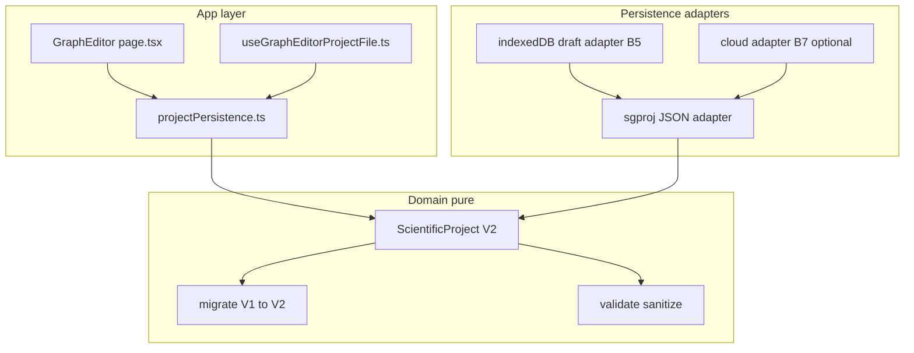
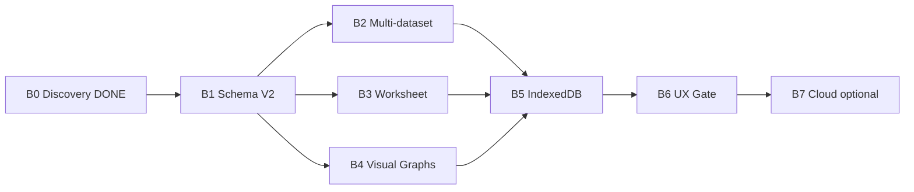

# Plan PROD-2B — Persistencia de Proyectos Científicos

**Estado:** **PLAN APROBADO**  
**Fecha de aprobación:** 2026-06-27  
**Identificador:** PROD-2B (continúa [PROD-2A](src/lib/project/README.md))  
**Próxima etapa:** Implementación — comenzar por **Fase B1**

**Referencias:**

- Discovery (cerrado): [`PROJECT_DISCOVERY_PROD_2B.md`](PROJECT_DISCOVERY_PROD_2B.md)
- Estado general: [`PROJECT_STATUS_SCI_56.md`](PROJECT_STATUS_SCI_56.md) · [`ROADMAP.md`](ROADMAP.md)

---

## Principios arquitectónicos (obligatorios)

### 1. Estado Persistente del Dominio (Discovery)

El `.sgproj` almacena **solo estado persistente del dominio científico**: datos, configuración, snapshots explícitos y orquestación. No cachés, no outputs de motores SCI, no UI efímera. Al abrir, la app **reconstruye** artefactos derivados.

### 2. Independencia del Dominio (Plan)

> `ScientificProject` será un **modelo de dominio puro**, desacoplado de React, Next.js y de cualquier mecanismo de persistencia. La serialización (`.sgproj`), IndexedDB y futuras implementaciones (Supabase, sync) actuarán **únicamente como adaptadores** sobre ese modelo, sin introducir dependencias en el dominio.

| Capa | Ubicación propuesta | Responsabilidad |
|------|---------------------|-----------------|
| **Dominio** | `src/lib/project/domain/` | Tipos `ScientificProject`, V1/V2, validación pura, migradores puros |
| **Adaptador archivo** | `src/lib/project/adapters/sgproj/` | parse, serialize, envelope JSON |
| **Adaptador borrador** | `src/lib/project/adapters/indexeddb/` (B5) | store/retrieve drafts |
| **Adaptador nube** | `src/lib/project/adapters/cloud/` (B7) | metadata + blob refs |
| **Boundary UI** | `src/app/projectPersistence.ts` | Mapeo React ↔ dominio |

**Prohibido en dominio:** imports de `react`, `next/*`, `jsPDF`, motores SCI, IndexedDB, Supabase.

### 3. Forward Compatibility + migraciones explícitas

Pipeline invariante: `parse → migrate → validate → sanitize → hydrate`. Un migrador por salto de versión. Export siempre escribe `schemaVersion` actual.

---

## Arquitectura objetivo (post PROD-2B)



---

## Modelo de datos V2 (referencia transversal)

Evolución aditiva de [`ScientificProjectV1`](src/lib/project/types.ts):

```typescript
// Conceptual — especificación de dominio

ScientificProjectV2 {
  metadata: ProjectMetadataV2
  datasets: ProjectDatasetV2[]         // reemplaza `dataset` singular
  activeDatasetId: string
  analysisConfig: ProjectAnalysisConfigV2
  comparison: ProjectComparisonV2      // slots + sourceDatasetId
  workflow: ProjectWorkflowV1
  workspace: ProjectWorkspaceV1
  graphContext?: ProjectGraphContextV1
  visualGraphs?: ProjectVisualGraphPersistedV2[]  // B4
  extensions?: Record<string, unknown>
}

ProjectDatasetV2 {
  id: string
  label: string
  series: ExperimentalSeries[]
  info: ProjectImportedDatasetInfo | null
  importReport: ImportReport | null
  worksheet?: ProjectWorksheetV2       // B3
  checksum?: string | null
}

ProjectWorksheetV2 {
  columnRegistry?: WorksheetColumnRegistry
  auxiliaryColumns?: ImportAuxiliaryColumn[]
  modified: boolean
}

DatasetAnalysisProfileV2
  // V1 + methodological, multivariate, publication, captureMetadata

ProjectComparisonSlotV2 {
  label: string
  profile: DatasetAnalysisProfileV2 | null
  sourceDatasetId: string | null       // B2
}

ProjectVisualGraphPersistedV2 {
  id: string
  graphSpec: GraphSpecification
  sourceDatasetId: string
  createdAt: string
  // preview: EXCLUIDO — recalcular on hydrate
}
```

**Mapeo V1 legacy:** `project.dataset` → `datasets[0]`; `importProvenance` → campos del primer dataset; `activeDatasetId` = id migrado.

---

# Fase B1 — Schema V2 + contratos + migrador V1→V2

## Objetivo funcional

Establecer el **contrato de dominio V2** y el **migrador V1→V2** sin cambiar aún el comportamiento visible de save/load en UI (wiring mínimo solo si compila). Formalizar `DatasetAnalysisProfileV2` alineado con [`comparison/types.ts`](src/lib/scientific/comparison/types.ts).

## Alcance

- Tipos dominio V2 puros en `src/lib/project/domain/`
- Migrador `migrateV1ToV2` puro
- Validadores V2; `CURRENT_SCHEMA_VERSION = 2`
- Fixtures V2 + migración desde fixtures V1
- Gates: `validate:prod2b-f0`, `validate:prod2b-migrate`
- **Fuera de alcance:** multi-dataset en UI, worksheet, VGB, IndexedDB, cambios SCI

## Archivos

| Acción | Ruta |
|--------|------|
| Crear | `src/lib/project/domain/types-v1.ts` |
| Crear | `src/lib/project/domain/types-v2.ts` |
| Crear | `src/lib/project/domain/scientific-project.ts` |
| Crear | `src/lib/project/domain/migrations/migrate-v1-to-v2.ts` |
| Crear | `src/lib/project/domain/migrations/index.ts` |
| Crear | `src/lib/project/domain/validate-v2.ts` |
| Crear | `src/lib/project/domain/index.ts` |
| Crear | `src/lib/project/adapters/sgproj/envelope.ts` |
| Crear | `src/lib/project/adapters/sgproj/serialize-v2.ts` |
| Crear | `src/lib/project/__tests__/migrate-v1-v2.cases.ts` |
| Crear | `src/lib/project/__tests__/validate-v2.cases.ts` |
| Crear | `scripts/validate-prod2b-f0.mjs` |
| Crear | `scripts/validate-prod2b-migrate.ts` |
| Crear | `scripts/fixtures/project-v2-empty.sgproj` |
| Crear | `scripts/fixtures/project-v2-dataset5-minimal.sgproj` |
| Modificar | `src/lib/project/types.ts`, `migrate.ts`, `constants.ts`, `validate.ts`, `index.ts`, `README.md` |
| Modificar | `src/lib/project/hydrate.ts`, `serialize.ts` (mínimo) |
| Modificar | `package.json` |

## Dependencias

- B0 Discovery (cerrado) · Bloqueante para B2–B7

## Riesgos

| Riesgo | Mitigación |
|--------|------------|
| Romper PROD-2A gates | Fixtures V1 + migración transparente |
| Duplicar types | domain re-exports |
| hydrate incompleto pre-B2 | patch intermedio V1-shaped hasta B2 |

## Estrategia de implementación

1. Extraer V1 a `domain/types-v1.ts`.
2. Definir V2 aditivo; `DatasetAnalysisProfileV2` mirror runtime comparison.
3. `migrateV1ToV2` idempotente + tests golden (empty, dataset5).
4. Export escribe v2; open v1 auto-migra.
5. No tocar motores SCI.

## Gate de aceptación

- `validate:prod2b-f0` · `validate:prod2b-migrate` · `validate:prod2a-gate` · `tsc` · `validate:full` — PASS

## Validaciones manuales

- Abrir fixture V1 — carga sin error.
- Guardar — `"schemaVersion": 2`.
- JSON migrado conserva series/toggles.

## Commit sugerido

```
prod-2b(B1): add ScientificProjectV2 domain, V1→V2 migrator and validation gates

Introduce pure domain layer and sgproj adapter for schema v2 without changing
scientific engines. PROD-2A fixtures remain loadable via automatic migration.
```

---

# Fase B2 — Multi-dataset persistence

## Objetivo funcional

Persistir **`sessionDatasets[]`** en V2 y restaurarlos al abrir. Vincular slots SCI-58 A/B a `sourceDatasetId`.

## Alcance

- `datasets[]` + `activeDatasetId` round-trip
- `comparison.slots.*.sourceDatasetId`
- Save persiste registry completo
- **Fuera de alcance:** N>2 slots, worksheet (B3), VGB (B4)

## Archivos

| Acción | Ruta |
|--------|------|
| Modificar | `domain/types-v2.ts`, `migrations/migrate-v1-to-v2.ts`, `sanitize.ts`, `hydrate.ts` |
| Modificar | `src/app/projectPersistence.ts`, `src/app/page.tsx` |
| Modificar | `src/lib/sessionDatasetRegistry.ts` |
| Crear | `__tests__/multi-dataset.cases.ts` |
| Crear | `scripts/fixtures/project-v2-dataset5-dataset6-comparison.sgproj` |
| Modificar | `scripts/validate-prod2b-migrate.ts` |

## Dependencias

- **B1**

## Riesgos

| Riesgo | Mitigación |
|--------|------------|
| D5+D6 solo uno sobrevive hoy | Fixture + manual QA |
| VGB cleared on switch | B4 |

## Estrategia

1. Mappers SessionDataset ↔ ProjectDatasetV2.
2. collect: all session datasets → `project.datasets`.
3. apply: rebuild registry; no drop inactive datasets.
4. Slot capture: `sourceDatasetId = activeDatasetId`.

## Gate de aceptación

- `validate:prod2b-migrate` · `validate:comparison-unit` (92/92, Δ −9.5) · `validate:full` — PASS

## Validaciones manuales

1. D5 → Slot A · D6 → Slot B · save/reopen · ambos datasets + slots OK.

## Commit sugerido

```
prod-2b(B2): persist multi-dataset registry and SCI-58 slot bindings in V2 projects
```

---

# Fase B3 — Worksheet persistence

## Objetivo funcional

Persistir **worksheet state** por dataset: `columnRegistry`, `auxiliaryColumns`, `worksheetModified`.

## Alcance

- Bloque `worksheet` en `ProjectDatasetV2`
- **Fuera de alcance:** formula engine, SCI

## Archivos

Modificar: `types-v2.ts`, `validate-v2.ts`, `sanitize.ts`, `projectPersistence.ts`, `page.tsx`  
Crear: `__tests__/worksheet-persist.cases.ts`

## Dependencias

- **B1** · **B2** recomendado

## Gate de aceptación

- `validate:prod2b-migrate` + worksheet cases · `validate:full` — PASS

## Validaciones manuales

- RW workbook → edit columns → save/reopen → registry preserved.

## Commit sugerido

```
prod-2b(B3): persist worksheet column registry and auxiliary columns per dataset
```

---

# Fase B4 — Visual Graph Builder persistence

## Objetivo funcional

Persistir **GraphSpecification** + `sourceDatasetId`; **excluir** preview cache.

## Alcance

- `visualGraphs[]` en V2
- Rebuild preview on hydrate
- **Fuera de alcance:** Supabase graph library

## Archivos

Modificar: `types-v2.ts`, `projectPersistence.ts`, `page.tsx`, `visualGraphBuilder.ts`  
Crear: `domain/mappers/visual-graph.ts`, `__tests__/visual-graph-persist.cases.ts`

## Dependencias

- **B1**, **B2**

## Gate de aceptación

- `validate:visual-graph-builder-unit` · `validate:prod2b-migrate` · `validate:full` — PASS

## Commit sugerido

```
prod-2b(B4): persist visual graph specifications in V2 projects
```

---

# Fase B5 — IndexedDB autosave (local)

## Objetivo funcional

Autosave local y recent projects via IndexedDB — adaptador sobre dominio V2, **no** segunda fuente de verdad.

## Alcance

- Draft cache, recovery prompt, recent list
- **Fuera de alcance:** sync, Supabase (B7)

## Archivos

Crear: `adapters/indexeddb/*`, `useProjectDraftAutosave.ts`, `validate-prod2b-indexeddb.ts`  
Modificar: `useGraphEditorProjectFile.ts`, `ProjectScientificFilePanel.tsx`, `package.json`

## Modelo IDB (adapter only)

```
ProjectDraftRecord { projectId, name, updatedAt, envelopeJson, isAutosave }
```

## Dependencias

- **B1**, **B2**

## Gate de aceptación

- `validate:prod2b-indexeddb` · `validate:full` — PASS

## Commit sugerido

```
prod-2b(B5): add IndexedDB draft adapter and debounced project autosave
```

---

# Fase B6 — UX hardening + gate PROD-2B

## Objetivo funcional

UX de persistencia + gate E2E unificado **PROD-2B**.

## Alcance

- Autosave indicator, size warnings (>10MB), conflict detection
- Playwright E2E multi-dataset + SCI-58
- `validate:prod2b-gate`
- `PROJECT_STATUS_PROD_2B.md` al cierre

## Archivos

Modificar: `ProjectScientificFilePanel.tsx`, `projectFileActions.ts`, `userMessages.ts`, `validate-full-gate.mjs`  
Crear: `validate-prod2b-gate.mjs`, `validate-prod2b-project-persistence.mjs`

## Dependencias

- **B1–B5**

## Gate de aceptación

- `validate:prod2b-gate` · `validate:full` — PASS
- Checklist manual (8 ítems) — PASS

## Checklist manual cierre PROD-2B

1. Nuevo proyecto D5 save/reopen V2  
2. Multi-dataset D5+D6 slots A/B  
3. Worksheet edit  
4. VGB graph  
5. Autosave recovery  
6. Open V1 migrates  
7. SCI-58 Δ −9.5  
8. PDF export unchanged  

## Commit sugerido

```
prod-2b(B6): UX hardening and validate:prod2b-gate for V2 project persistence
```

---

# Fase B7 — Cloud-ready (opcional)

## Objetivo funcional

Adaptador cloud stub — contratos sin sync en producción.

## Alcance

- `ProjectCloudAdapter`, `CloudProjectRecord`, Supabase stub
- **Fuera de alcance:** auth, real-time sync, merge UI

## Archivos

Crear: `adapters/cloud/*`, `validate-prod2b-cloud-contract.ts`  
Modificar: `types-v2.ts` — optional `cloudRef` in metadata

## Dependencias

- **B6** recomendado

## Gate de aceptación

- `validate:prod2b-cloud-contract` — PASS · dominio sin imports Supabase

## Commit sugerido

```
prod-2b(B7): add cloud project adapter contracts and Supabase stub
```

---

## Dependencias globales entre fases



**Paralelización tras B1:** B2, B3, B4 en paralelo. B5 requiere B2 mínimo.

---

## Gates consolidados PROD-2B

| Script | Fase |
|--------|------|
| `validate:prod2b-f0` | B1 |
| `validate:prod2b-migrate` | B1 |
| `validate:prod2b-indexeddb` | B5 |
| `validate:prod2b-gate` | B6 |
| `validate:prod2b-cloud-contract` | B7 |

**Regresión obligatoria en toda fase:** `validate:prod2a-gate` · `validate:comparison-unit` · `validate:full` · baseline D5/D6.

---

## Cierre oficial del Plan

| Item | Estado |
|------|--------|
| Discovery PROD-2B | CERRADO — [`PROJECT_DISCOVERY_PROD_2B.md`](PROJECT_DISCOVERY_PROD_2B.md) |
| Plan PROD-2B (B1–B7) | **APROBADO** |
| Implementación | **Pendiente** — iniciar en **B1** |

**Restricciones de esta etapa:** documentación únicamente · sin código · sin commits funcionales.

**Siguiente paso:** implementación **Fase B1** bajo este plan.

---

Documento generado al cierre del Plan PROD-2B (2026-06-27). Referencia arquitectónica oficial de implementación junto con [`PROJECT_DISCOVERY_PROD_2B.md`](PROJECT_DISCOVERY_PROD_2B.md).
