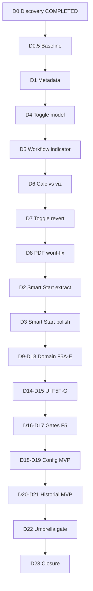

# Plan PROD-2D — UX profesional + arquitectura transversal

**Estado:** **PLAN APROBADO (congelado en D0)**  
**Fecha de aprobación:** 2026-07-01  
**Identificador:** PROD-2D (continúa PROD-2C histórico CLOSED)  
**Próxima microfase:** **D1 — UX-2A metadata**  
**Baseline:** [`PROJECT_BASELINE_PROD_2D.md`](PROJECT_BASELINE_PROD_2D.md) — D0.5 COMPLETED

**Referencias:**

- Discovery (cerrado): [`PROJECT_DISCOVERY_PROD_2D.md`](PROJECT_DISCOVERY_PROD_2D.md)
- Estrategia: [`MASTER_ROADMAP_V1.md`](MASTER_ROADMAP_V1.md) §13
- Estado persistencia: [`PROJECT_STATUS_PROD_2C.md`](PROJECT_STATUS_PROD_2C.md)

---

## Principios arquitectónicos (obligatorios)

### 1. Sin cambios al contrato V2

PROD-2D **no modifica** `schemaVersion`, migradores ni pipeline `parse → migrate → validate → sanitize → hydrate`. Toda preferencia nueva de app vive en `localStorage`, no en `.sgproj`.

### 2. Extracción move-only (ARCH-5 F5)

> Toda extracción desde `page.tsx` es **move-only**: mismos inputs, mismos outputs, mismos scores QA-1. Refactors semánticos quedan prohibidos dentro de la microfase activa.

| Capa | Ubicación | Responsabilidad |
|------|-----------|-----------------|
| **Dominio metodología** | `src/lib/scientific/methodology/*` | Builders SCI-50→60 puros |
| **Visibilidad** | `src/lib/scientific/visibility/` | Registry toggle-aware (ARCH-6 + prep EXPORT-2) |
| **Preferencias app** | `src/lib/app-preferences/` | Tema, hints — sin React en domain |
| **UI metodología** | `src/components/methodology/` | Paneles `Scientific*Engine/Dashboard` |
| **UI workflow** | `src/components/workflow/` | Indicador sesión + `GuidedWorkflowPanel` |
| **UI settings/history** | `src/components/settings/`, `history/` | UX-2B MVP |
| **Boundary** | `src/app/page.tsx` | Wiring mínimo; reducción progresiva de LOC |

### 3. Definition of Done (Master Roadmap §2)

Cada microfase D1–D23 cumple: implementación · gates PASS · tests · docs · commit · push (D23) · cero deuda en alcance.

---

## Épicas y microfases

| Épica | Microfases | Objetivo |
|-------|------------|----------|
| **Discovery** | D0, D0.5 | Bloqueo alcance + baseline |
| **UX-2A** | D1, D2, D3 | Branding + Smart Start |
| **ARCH-6** | D4, D5, D6, D7, D8 | Cerrar QA-1 §10 |
| **ARCH-5 F5** | D9–D17 | Modularizar SCI-50→60 |
| **UX-2B** | D18, D19, D20, D21 | Historial + Config MVP |
| **Cierre** | D22, D23 | Gate umbrella + acta |

---

## Roadmap microfases D0→D23

### D0 — Discovery y bloqueo de alcance

| Campo | Contenido |
|-------|-----------|
| **Estado** | **COMPLETED** |
| **Entregable** | [`PROJECT_DISCOVERY_PROD_2D.md`](PROJECT_DISCOVERY_PROD_2D.md), este plan |
| **Gate** | N/A (documentación) |

---

### D0.5 — Baseline arquitectónico

| Campo | Contenido |
|-------|-----------|
| **Estado** | **COMPLETED** |
| **Entregable** | [`PROJECT_BASELINE_PROD_2D.md`](PROJECT_BASELINE_PROD_2D.md) |
| **Recomendación D9–D13** | **NO subdividir** (excepción condicional solo D13) |
| **Gate** | N/A |

---

### D1 — UX-2A: Metadata y branding

| Campo | Contenido |
|-------|-----------|
| **Objetivo** | Identidad production-ready |
| **Archivos** | `src/app/layout.tsx`, `public/`, opcional OG image |
| **Criterios** | `title`/`description` correctos; `lang="es"`; favicon; `validate:full` PASS |
| **Gate** | `validate:full` |

---

### D4 — ARCH-6.1: Modelo toggle-aware (dominio)

| Campo | Contenido |
|-------|-----------|
| **Objetivo** | Registry toggles metodológicos; prep EXPORT-2 |
| **Archivos** | `src/lib/scientific/visibility/` |
| **Criterios** | ≥20 casos unitarios; sin cambio UI |
| **Gate** | `validate:visibility-unit` (nuevo) |

---

### D5 — ARCH-6.2: Indicador workflow activo

| Campo | Contenido |
|-------|-----------|
| **Objetivo** | Resolver QA-1 §10.1 |
| **Archivos** | `src/components/workflow/WorkflowSessionIndicator.tsx`, wiring `page.tsx` |
| **Criterios** | Visible en 4 tabs workspace; cancelar funcional |
| **Gate** | Smoke SCI-59 T1/T2/T3 |

---

### D6 — ARCH-6.3: Aviso cálculo vs visualización

| Campo | Contenido |
|-------|-----------|
| **Objetivo** | Resolver QA-1 §10.3 |
| **Archivos** | `src/components/analysis/`, wiring `page.tsx` |
| **Criterios** | Mensaje visible toggles OFF; scores D5/D6 inalterados |
| **Gate** | `validate:full` |

---

### D7 — ARCH-6.4: Revert toggles al cancelar workflow

| Campo | Contenido |
|-------|-----------|
| **Objetivo** | Resolver QA-1 §10.4 |
| **Archivos** | `src/lib/scientific/workflow/`, `page.tsx` |
| **Criterios** | Test: T3 → 2 pasos → cancelar → toggles = pre-inicio |
| **Gate** | Tests workflow + `validate:full` |
| **Riesgo** | **P0** |

---

### D8 — ARCH-6.5: PDF/toggles mitigación + cierre ARCH-6

| Campo | Contenido |
|-------|-----------|
| **Objetivo** | Resolver QA-1 §10.2 (wont-fix PDF → PROD-3) |
| **Archivos** | `src/components/reports/`, docs |
| **Criterios** | 4/4 §10 cerradas o wont-fix; `validate:full` PASS |
| **Gate** | `validate:full` |

---

### D2 — UX-2A: Extracción Smart Start

| Campo | Contenido |
|-------|-----------|
| **Objetivo** | Move-only Smart Start (~L13557–13840) |
| **Archivos** | `src/components/home/SmartStartScreen.tsx`, `page.tsx` |
| **Criterios** | 5 rutas inicio idénticas; `tsc` PASS |
| **Gate** | Smoke manual |

> **Orden de ejecución:** D2 se implementa **después** de D8 aunque el identificador numérico sea menor.

---

### D3 — UX-2A: Refinamiento Smart Start

| Campo | Contenido |
|-------|-----------|
| **Objetivo** | Copy, ARIA, alinear PROD-2C |
| **Archivos** | Smart Start component |
| **Criterios** | Sin referencias obsoletas ARCH-5/SCI-59 incorrectas |
| **Gate** | Opcional `validate:smart-start-unit` |

---

### D9 — ARCH-5 F5A: Dominio SCI-50/51/52

| Campo | Contenido |
|-------|-----------|
| **Objetivo** | Extraer Consistency + Report Quality + Reproducibility |
| **Archivos** | `methodology/consistency/`, `report-quality/`, `reproducibility/` |
| **Criterios** | Move-only; gate unitario; LOC ↓ |
| **Gate** | `validate:methodology-f5a-unit` |
| **Subdivisión** | Condicional post-D0.5 → D9a + D9b |

---

### D10 — ARCH-5 F5B: Dominio SCI-53/54

| Campo | Contenido |
|-------|-----------|
| **Objetivo** | Evidence Strength + Assumption Tracker |
| **Archivos** | `methodology/evidence/`, `assumptions/` |
| **Criterios** | Evidence 82.7/73.3 inalterado |
| **Gate** | Gate unitario F5B |

---

### D11 — ARCH-5 F5C: Dominio SCI-55

| Campo | Contenido |
|-------|-----------|
| **Objetivo** | Publication Readiness Analyzer |
| **Archivos** | `methodology/readiness/` |
| **Criterios** | Readiness 77.0/67.5 inalterado |
| **Gate** | Gate unitario F5C |

---

### D12 — ARCH-5 F5D: Dominio SCI-56

| Campo | Contenido |
|-------|-----------|
| **Objetivo** | Methodological Dashboard |
| **Archivos** | `methodology/summary/` |
| **Criterios** | Overall Health 77.0/67.5 inalterado |
| **Gate** | Gate unitario F5D |

---

### D13 — ARCH-5 F5E: Dominio SCI-60

| Campo | Contenido |
|-------|-----------|
| **Objetivo** | Executive Publication Dashboard |
| **Archivos** | `methodology/publication/` |
| **Criterios** | Publication Status inalterado; `validate:full` PASS |
| **Gate** | Gate unitario F5E |
| **Riesgo** | **P1** — agregador cross-domain |

---

### D14 — ARCH-5 F5F: UI paneles metodológicos

| Campo | Contenido |
|-------|-----------|
| **Objetivo** | Mover `Scientific*Engine/Dashboard` → `components/methodology/` |
| **Criterios** | Progressive disclosure intacto |
| **Gate** | Smoke + `validate:full` |

---

### D15 — ARCH-5 F5G: UI GuidedWorkflowPanel

| Campo | Contenido |
|-------|-----------|
| **Objetivo** | Completar patrón ARCH-5 F2 |
| **Archivos** | `src/components/workflow/GuidedWorkflowPanel.tsx` |
| **Criterios** | SCI-59 T1/T2/T3 PASS |
| **Gate** | Smoke workflow |

---

### D16 — ARCH-5 F5H: Tests + gate metodología

| Campo | Contenido |
|-------|-----------|
| **Objetivo** | Certificar F5A–G |
| **Archivos** | `scripts/validate-methodology-unit.ts`, `package.json` |
| **Criterios** | ≥80 casos acumulados; gate PASS |
| **Gate** | `validate:methodology-unit` |

---

### D17 — ARCH-5 F5I: Certificación modularización

| Campo | Contenido |
|-------|-----------|
| **Objetivo** | Disminución efectiva responsabilidades vs baseline D0.5 |
| **Criterios** | Dominio metodología fuera de `page.tsx`; módulos operativos; acoplamiento ↓; LOC ↓ documentado |
| **Gate** | `validate:arch5-f5-modularization-gate` |

---

### D18 — UX-2B.1: Dominio preferencias usuario

| Campo | Contenido |
|-------|-----------|
| **Objetivo** | `UserPreferences`: tema, `showContextualHints`, versión display |
| **Archivos** | `src/lib/app-preferences/domain/`, adapter localStorage |
| **Criterios** | Round-trip; validación pura |
| **Gate** | Unit tests preferencias |

---

### D19 — UX-2B.2: Panel Configuración MVP

| Campo | Contenido |
|-------|-----------|
| **Objetivo** | Reemplazar stub Configuración |
| **Alcance IN** | Tema, hints, versión |
| **Alcance OUT** | Ver [`PROJECT_DISCOVERY_PROD_2D.md`](PROJECT_DISCOVERY_PROD_2D.md) §5.3 |
| **Archivos** | `src/components/settings/SettingsPanel.tsx`, `page.tsx` |
| **Criterios** | Sin stub; prefs persisten reload |
| **Gate** | Smoke manual |

---

### D20 — UX-2B.3: Application layer historial recientes

| Campo | Contenido |
|-------|-----------|
| **Objetivo** | Wrapper `listRecentProjects(limit)` sobre IndexedDB |
| **Archivos** | `src/lib/project/application/local-project/recent-projects.ts` |
| **Criterios** | Orden `lastAccessedAt`; gate in-memory repo |
| **Gate** | Unit + `validate:prod2b-indexeddb` |

---

### D21 — UX-2B.4: Panel Historial MVP

| Campo | Contenido |
|-------|-----------|
| **Objetivo** | Reemplazar stub Historial |
| **Alcance IN** | Top 10 recientes + abrir |
| **Alcance OUT** | Ver discovery §4.3 |
| **Archivos** | `src/components/history/RecentProjectsPanel.tsx`, `page.tsx` |
| **Criterios** | Sin stub; abrir respeta conflict B6 |
| **Gate** | Smoke + `validate:prod2b-indexeddb` |
| **Riesgo** | **P2** |

---

### D22 — Gate umbrella PROD-2D

| Campo | Contenido |
|-------|-----------|
| **Objetivo** | Certificación integrada fase |
| **Composición** | `validate:full` + `validate:prod2b-b2-gate` + `validate:prod2c-c8-regression-gate` + `validate:methodology-unit` + `validate:visibility-unit` + checks LOC/responsabilidades |
| **Archivos** | `scripts/validate-prod2d-gate.ts`, `package.json` |
| **Gate** | `validate:prod2d-gate` |

---

### D23 — Cierre documental PROD-2D

| Campo | Contenido |
|-------|-----------|
| **Objetivo** | DoD §2 completa; épica CLOSED |
| **Archivos** | `PROJECT_STATUS_PROD_2D.md`, `README.md`, `ROADMAP.md` |
| **Criterios** | 8/8 DoD; push; sin deuda alcance |

---

## Orden óptimo de implementación

**Secuencia lineal:**  
`D0 → D0.5 → D1 → D4 → D5 → D6 → D7 → D8 → D2 → D3 → D9 → D10 → D11 → D12 → D13 → D14 → D15 → D16 → D17 → D18 → D19 → D20 → D21 → D22 → D23`

---

## Gates de regresión obligatorios (transversal)

| Gate | Cuándo |
|------|--------|
| `validate:full` | Desde D8 en adelante (mínimo) |
| `validate:prod2b-b2-gate` | Microfases que tocan persistencia o apertura proyecto |
| `validate:prod2b-indexeddb` | D20, D21, D22 |
| `validate:prod2c-c8-regression-gate` | D9–D17 (ARCH-5) |
| Baselines Dataset5/6 scores | Toda extracción ARCH-5 |

---

## Estimación relativa de esfuerzo

| Bloque | Microfases | % esfuerzo |
|--------|------------|------------|
| Discovery + Baseline | D0, D0.5 | 6% |
| UX-2A | D1–D3 | 11% |
| ARCH-6 | D4–D8 | 26% |
| ARCH-5 F5 | D9–D17 | 44% |
| UX-2B | D18–D21 | 12% |
| Cierre | D22–D23 | 3% |

PROD-2D ≈ **2× microfases** vs PROD-2C (9); dominado por ARCH-5 F5.

---

## Fuera de alcance PROD-2D

Ver [`PROJECT_DISCOVERY_PROD_2D.md`](PROJECT_DISCOVERY_PROD_2D.md) §10 y Master Roadmap §12.

---

## Criterio de cierre PROD-2D (Master Roadmap §13)

- [ ] Observaciones QA-1 §10 resueltas (ARCH-6)
- [ ] Branding/metadata production-ready (UX-2A)
- [ ] Historial/Config MVP sin stubs (UX-2B)
- [ ] Reducción efectiva responsabilidades monolito certificada (ARCH-5 F5 + D17)
- [ ] `validate:prod2d-gate` PASS
- [ ] Definition of Done §2 completa (D23)

---

*Plan operativo PROD-2D — aprobado y congelado en D0 (2026-07-01). Amend únicamente mediante revisión explícita del discovery o Master Roadmap.*
