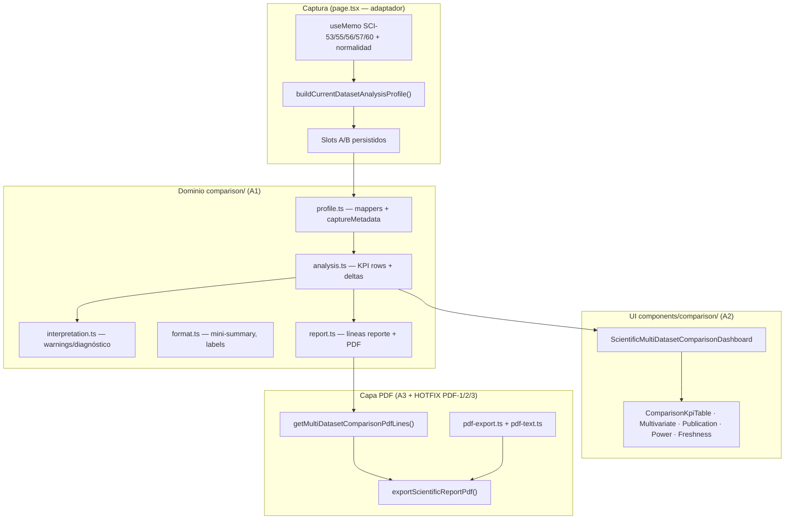

# Scientific Graph AI — Estado del Proyecto (Cierre SCI-58 v2)

**Fecha de cierre:** 2026-06-27  
**Estado:** **COMPLETADO**  
**Base:** SCI-58 v1 (ARCH-5 F4) + Sprint QA-1 CERRADO  
**Referencia anterior:** [`PROJECT_STATUS_SCI_56.md`](./PROJECT_STATUS_SCI_56.md)

---

## 1. Resumen ejecutivo

**SCI-58 v2 — Comparación científica ampliada** queda oficialmente **cerrado**. La evolución extiende el framework multi-dataset read-only (Opción D) con perfil comparativo enriquecido, dashboard ampliado, sección PDF condicional y tres hotfixes de capa de exportación PDF, **sin modificar motores SCI-50→60 ni recalcular scores upstream**.

Entregables cerrados:

| Entregable | Estado |
|------------|--------|
| **A1** — Modelo enriquecido de comparación | COMPLETADO |
| **A2** — Dashboard Multi-Dataset | COMPLETADO |
| **A3** — Exportación PDF | COMPLETADO |
| **HOTFIX PDF-1** — Layout sección SCI-58 en PDF | COMPLETADO |
| **HOTFIX PDF-2** — Espaciado global + dedupe Potencia observada | COMPLETADO |
| **HOTFIX PDF-3** — Espaciado en tokens cortos (págs. 12–14) | COMPLETADO |

**No quedan issues abiertos relacionados con SCI-58.**

---

## 2. Objetivo de SCI-58

### SCI-58 v1 (contexto — ARCH-5 F4)

Comparación read-only entre **dos snapshots** (`Slot A` / `Slot B`) capturados desde el dataset activo. Cada snapshot es un `DatasetAnalysisProfile` con scores de síntesis (Readiness, Evidence, Overall Health, Publication Status) y metadatos básicos. El dominio vive en `src/lib/scientific/comparison/`; la UI en `src/components/comparison/`.

### SCI-58 v2 (alcance cerrado)

Ampliar la **capacidad comparativa** manteniendo el principio read-only:

1. **Perfil enriquecido** — snapshots metodológicos (SCI-50→56), multivariantes (SCI-40), publicación (SCI-60), inferencia/potencia (SCI-57), normalidad integrada y metadatos de captura.
2. **Dashboard ampliado** — secciones condicionales, KPIs extendidos, badges de frescura (stale), side-by-side multivariante/publicación/potencia.
3. **Integración PDF** — sección *Comparación Multi-Dataset (SCI-58)* condicional en el informe científico cuando A y B están completos.
4. **Capa PDF robusta** — layout ASCII-safe, sin artefactos de espaciado jsPDF, sin duplicados de líneas de potencia.

**Fuera de alcance v2 (evolución futura):** comparación N>2 slots, persistencia PROD-2A extendida dedicada (subfase A4 del plan original), recálculo de motores upstream.

---

## 3. Arquitectura implementada

**Principio rector:** la capa de comparación **consume snapshots**; no invoca motores SCI-50→60 ni altera fórmulas. Golden reference intacto: **Δ Readiness (B − A) = −9.5** (Dataset5 Slot A 77.0 · Dataset6 Slot B 67.5).

---

## 4. Componentes nuevos y modificados

### A1 — Dominio (`src/lib/scientific/comparison/`)

| Archivo | Rol |
|---------|-----|
| `types.ts` | Snapshots metodológico, multivariante, publicación, inferencial, `captureMetadata`; flags en `MultiDatasetComparisonAnalysis` |
| `input-types.ts` | Inputs de mappers; extensión `BuildDatasetAnalysisProfileInput` |
| `profile.ts` | `buildDatasetAnalysisProfile`, mappers enriquecidos, `buildCaptureMetadata` |
| `analysis.ts` | Filas KPI SCI-50→54, normalidad Δ, potencia; `buildMultiDatasetComparisonAnalysis` |
| `interpretation.ts` | Warnings de comparabilidad, diagnóstico cruzado, recomendaciones ampliadas |
| `format.ts` | Formatters metodológicos, multivariante, potencia; mini-summary `M n/6` |
| `report.ts` | `getMultiDatasetComparisonReportLines`, `getMultiDatasetComparisonPdfLines`, builders de sección |
| `pdf-text.ts` | Re-export sanitización ASCII (SCI-58 PDF) |
| `pdf-text-audit.ts` | Utilidad de auditoría de caracteres problemáticos (tests) |
| `__tests__/*.cases.ts` | Casos unitarios ampliados (profile, analysis, report, format, interpretation) |

### A2 — Dashboard (`src/components/comparison/`)

| Componente | Rol |
|------------|-----|
| `ScientificMultiDatasetComparisonDashboard.tsx` | Dashboard enriquecido con secciones condicionales |
| `ComparisonSlotSummaryCard.tsx` | Resumen por slot + mini-summary + motores capturados |
| `ComparisonKpiTable.tsx` | Tabla KPI reutilizable |
| `ComparisonMultivariateSection.tsx` | SCI-40 side-by-side |
| `ComparisonPublicationSection.tsx` | Highlights SCI-60 |
| `ComparisonPowerSection.tsx` | Potencia / tamaño muestral SCI-57 |
| `ComparisonFreshnessBadge.tsx` | Badge stale/freshness |
| `comparisonSlotFreshness.ts` | Derivación UI-only de frescura desde `captureMetadata` |
| `comparisonKpiGroups.ts` | Partición core / metodológico / enriquecido |

### A3 + PDF — Reporte y exportación

| Archivo | Rol |
|---------|-----|
| `src/lib/scientific/report/pdf-text.ts` | `sanitizeForPdfText`, `prepareScientificReportPdfLine` |
| `src/lib/scientific/report/pdf-export.ts` | `drawPdfWrappedText`, dedupe potencia, skip-wrap tokens cortos, cabeceras `Serie:` |
| `src/lib/scientific/report/__tests__/pdf-export.cases.ts` | 14 casos unitarios capa PDF |
| `scripts/validate-pdf-export-unit.ts` | Gate dedicado PDF export |
| `src/app/page.tsx` | Wiring: `comparisonAnalysis` en PDF input; `formatPdfSectionContentLine` en secciones |

---

## 5. Cambios realizados por subfase

### A1 — Modelo enriquecido de comparación

- Nuevos snapshots en `DatasetAnalysisProfile`: `methodological`, `multivariate`, `publication`, `inferential`, `captureMetadata`.
- KPI rows ampliados: motores SCI-50→54, delta normalidad no-normal, potencia prospectiva.
- Flags de sección en análisis: `methodologicalBreakdownAvailable`, `multivariateSectionAvailable`, `publicationHighlightsAvailable`.
- Interpretación ampliada: warnings de asimetría metodológica/multivariante, diagnóstico de spread metodológico, recomendaciones PDF-aware.
- Adaptador mínimo en `page.tsx`: `buildCurrentDatasetAnalysisProfile` con `captureMetadata` desde toggles activos.

### A2 — Dashboard Multi-Dataset

- Dashboard 100% consumidor del modelo A1; sin recálculo ni duplicación de lógica.
- Secciones condicionales: dimensiones ampliadas, multivariante, normalidad integrada, potencia, publicación, warnings, diagnóstico, recomendaciones.
- Badges de frescura en panel de slots (archivo activo, worksheet modificado, checksum).
- Mini-summary enriquecido en tarjetas de slot.

### A3 — Exportación PDF

- `canIncludeMultiDatasetComparisonInReport()` — sección solo si A/B completos.
- `buildMultiDatasetComparisonPdfReportSection()` integrado en `exportScientificReportPdf`.
- Si slots incompletos, el PDF **no cambia** respecto al comportamiento pre-v2.

---

## 6. Hotfixes PDF

### HOTFIX PDF-1 — Layout sección SCI-58

**Problema:** espaciado exagerado entre caracteres, cortes incorrectos de línea y glifos Unicode rotos (`Δ`, `−`, `—`, `·`) en la sección SCI-58; filas KPI con separador `|` demasiado largas para `splitTextToSize`.

**Solución (solo capa PDF, sin cambio de KPIs):**

- `getMultiDatasetComparisonPdfLines()` — layout multilínea por KPI (Slot A / Slot B / Delta en líneas separadas; sin pipes).
- `sanitizeForPdfText()` — reemplazo ASCII de símbolos no soportados por Helvetica/jsPDF.
- Export PDF usa `buildMultiDatasetComparisonPdfReportSection` en lugar del generador de líneas planas con pipes.

### HOTFIX PDF-2 — Espaciado global + Potencia observada duplicada

**Problema:** espaciado anómalo residual en líneas del informe completo; duplicación de *Potencia observada (aprox.)* (emisión desde reporting + interpretation).

**Solución:**

- `drawPdfWrappedText()` — render línea a línea con `align: "left"`, `setCharSpace(0)`.
- `prepareScientificReportPdfLine()` aplicado a todas las secciones del informe.
- `deduplicateScientificReportPdfLines()` — conserva la línea de potencia más completa; elimina disclaimer suelto redundante.

### HOTFIX PDF-3 — Tokens cortos (págs. 12–14)

**Problema:** nombres de serie sueltos (`Temperatura`, `Presion`, `Humedad`) renderizados como `T e m p e r a t u r a` por paso obligatorio por `splitTextToSize()` en tokens mono-palabra.

**Causa raíz:** algoritmo interno jsPDF (`split(" ")` + `join(" ")`); no Unicode ni charSpacing.

**Solución (solo capa PDF; motores sin cambios):**

- `shouldSkipPdfTextWrap()` — omite `splitTextToSize` para tokens cortos y cabeceras `Serie: Nombre`.
- `formatPdfSectionContentLine()` — en *Evaluación integrada de normalidad*, representación visual `Serie: Temperatura` (contenido lógico del reporte intacto).
- Párrafos largos siguen usando `splitTextToSize`.

---

## 7. Gates ejecutados

| Gate | Resultado | Detalle |
|------|-----------|---------|
| `npx tsc --noEmit` | **PASS** | TypeScript sin errores |
| `npx tsx scripts/validate-pdf-export-unit.ts` | **PASS** | **14/14** casos |
| `npm run validate:comparison-unit` | **PASS** | **92/92** casos (incl. golden Δ −9.5) |
| `npm run validate:full` | **PASS** | 11/11 steps (t-quantile, chart-viewport, comparison, f0, unit, f6, typescript, build, baseline, prod1-gate, e2e) |

Casos PDF destacados:

- `report.pdf.noPipeKpiRows`, `report.pdf.kpiMultiline`, `report.pdf.noProblematicChars`
- `pdf.wrap.skipSingleToken`, `pdf.draw.skipSplitSingleToken`, `pdf.normalityHeader.seriePrefix`
- `pdf.dedupe.observedPowerOnce`

---

## 8. Validación manual

Verificada por el equipo sobre Dataset5 (Slot A) y Dataset6 (Slot B):

| Verificación | Resultado |
|--------------|-----------|
| Dashboard Multi-Dataset | OK — secciones enriquecidas, KPIs, stale badges |
| Comparación D5 vs D6 | OK — Δ Readiness −9.5, KPIs 77.0 / 67.5 |
| Exportación PDF completa | OK |
| Sección SCI-58 en PDF | OK — layout multilínea, ASCII-safe |
| Espaciado anómalo entre caracteres | OK — corregido (incl. págs. 12–14) |
| Duplicados *Potencia observada* | OK — eliminados |

---

## 9. Estado final

| Bloque | Estado |
|--------|--------|
| SCI-58 v1 (ARCH-5 F4) | COMPLETADO (base) |
| SCI-58 v2 — A1 Dominio | **COMPLETADO** |
| SCI-58 v2 — A2 Dashboard | **COMPLETADO** |
| SCI-58 v2 — A3 PDF | **COMPLETADO** |
| HOTFIX PDF-1 / PDF-2 / PDF-3 | **COMPLETADO** |
| **SCI-58 v2 global** | **COMPLETADO** |

### Restricciones respetadas

- Sin modificación de motores SCI-50→60.
- Sin recálculo de scores upstream en la capa de comparación.
- Sin cambio de fórmulas científicas.
- Hotfixes PDF limitados a capa de exportación y representación visual.
- Golden Δ Readiness **−9.5** intacto en tests automatizados.

### Issues abiertos SCI-58

**Ninguno.**

---

## 10. Referencias cruzadas

- Estado general del proyecto: [`PROJECT_STATUS_SCI_56.md`](./PROJECT_STATUS_SCI_56.md)
- Roadmap y backlog futuro: [`ROADMAP.md`](./ROADMAP.md)
- Protocolo QA-1: [`QA-1_MANUAL_VALIDATION_PROTOCOL.md`](./QA-1_MANUAL_VALIDATION_PROTOCOL.md)
- Dominio comparison: `src/lib/scientific/comparison/`
- UI comparison: `src/components/comparison/`
- Capa PDF: `src/lib/scientific/report/`

---

Documento generado al **cierre oficial de SCI-58 v2** (2026-06-27). Sustituye a la entrada *SCI-58 v2 — planificado* en `ROADMAP.md` y en §6 de `PROJECT_STATUS_SCI_56.md` como referencia de estado para comparación multi-dataset ampliada.
