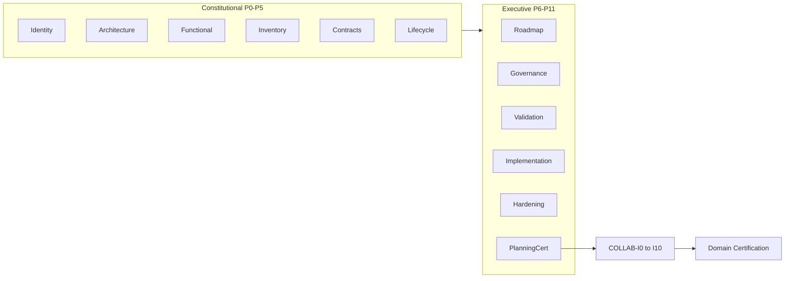
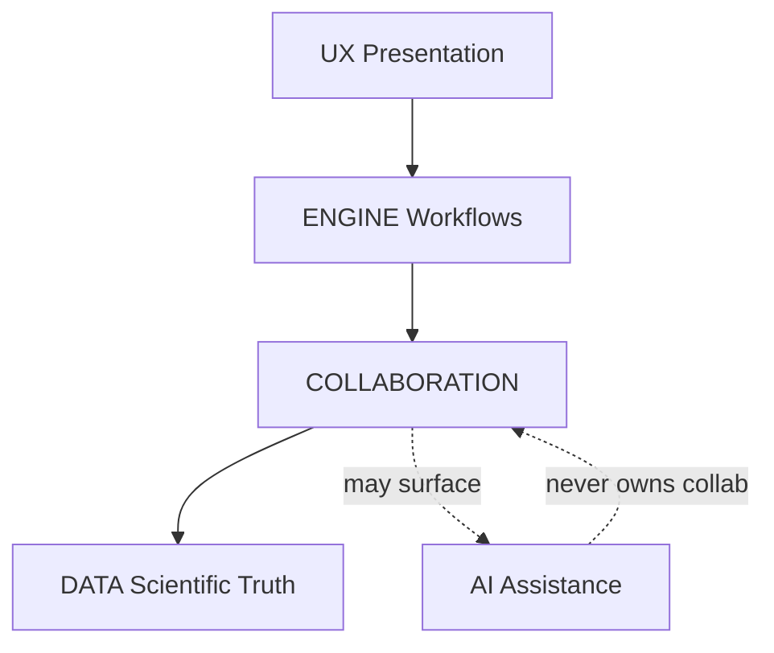

# COLLAB Planning Charter

**Artifact:** COLLAB Planning Charter  
**Status:** **RELEASE CERTIFIED**  
**Date:** 2026-08-07  
**Role:** Planning Authority for the COLLAB Planning Series (COLLAB-P0…P11) and subsequent COLLAB-I\* under inherited project methodology  
**Nature:** Collaboration-domain planning constitution only — does not recreate Scientific Graph AI project methodology  
**Path:** `docs/COLLAB/COLLAB-Planning-Charter.md`

---

## Verdict

COLLAB Planning inherits the RELEASE-CERTIFIED project methodology as **stable infrastructure**. This Charter is the **official planning artifact** for the Collaboration Domain. Official Records **cite** this Charter; they do **not** re-copy its constitutional freezes and principles.

Documentation stays compact relative to AI; executive phases (P7–P10) stay thin and cite project standards + this Charter.

Reading order: Methodology → Documentation → Constitutional Seed → Ownership → Series Shape → Integration → Citation → Authority Precedence.

---

## Authority Precedence (immutable)

```
Project Governance
        ↓
Certified Architecture
        ↓
COLLAB Planning Charter
        ↓
COLLAB Official Records
```

**Citation formulas (stable):**

> **Planning Authority:** `docs/COLLAB/COLLAB-Planning-Charter.md` (RELEASE CERTIFIED)

or

> This Official Record is governed by the COLLAB Planning Charter and the Scientific Graph AI certified project methodology.

**Citation rule:** Freeze #1, Collaboration SSOT, Ownership Matrix, Collaboration-is-Metadata, Identity Principle, Audit Principle, Decoupling Principle, and Future Evolution exclusions are **defined once in this Charter**. P0–P11 reference them; they do not reproduce them unless a phase-specific delta is required. The Charter SHALL NOT be rewritten by Official Records.

---

## Methodology Inheritance

COLLAB Planning inherits certified project methodology as infrastructure. Official Records **cite** these authorities; they do **not** recreate them.

| Layer | Authority (SSOT) |
|-------|------------------|
| Constitution | [docs/governance/](../governance/) — PROJECT_PRINCIPLES, DOMAIN_BOUNDARIES, CERTIFICATION_FRAMEWORK, QUALITY_GATES, DECISION_FRAMEWORK, ARCHITECTURE_GOVERNANCE |
| Architecture | [docs/architecture/](../architecture/) — DOMAIN_MATRIX, DEPENDENCY_MATRIX, SYSTEM_INTERACTIONS, ARCHITECTURE_DECISIONS |
| Domain vision seed | [MASTER ROADMAP V2](../roadmaps/MASTER%20ROADMAP%20V2.md) **§18 COLLABORATION Domain**, **§25 COLLABORATION Strategy** |
| Peer freezes | ENGINE, DATA, AI, UX — all **RELEASE CERTIFIED** / immutable under COLLAB Planning |
| Method pattern | AI Official Record template: Authority Precedence · Series Opening Frame · Freeze ladder · Planning Finality · no-code during P\* |
| **COLLAB Planning Authority** | **This COLLAB Planning Charter (RELEASE CERTIFIED)** |

**Conflict rule (inherited):** Architectural Decisions and certified peer domains prevail. COLLAB Planning never reopens ENGINE/DATA/AI/UX freezes. Within COLLAB planning, this Charter prevails over informal notes; certified Official Records prevail for their frozen phase content.

**Out of scope for this series:** recreating planning/certification/freeze/evidence/traceability methodology, generic Quality Gates, or any peer-domain ownership.

---

## Documentation Layout

Mirror AI, not UX microphases:

```
docs/COLLAB/
  COLLAB-Planning-Charter.md   # THIS ARTIFACT — Planning Authority (RELEASE CERTIFIED)
  official-records/            # COLLAB-P0 … COLLAB-P11 (planning only; cite Charter)
  implementation/              # reserved post–Planning Certification (COLLAB-I*)
```

- No `src/collab/` (or equivalent) during COLLAB-P\*.
- No ROADMAP.md / PROJECT_STATUS.md sync until after Planning Certification (same AI-P0 rule).
- Each Official Record: lean header (**Planning Authority citation** + Authority Precedence + freeze matrix) → **phase-specific Collaboration architecture only** → exit criteria. No methodology essays. No re-copy of Charter principles.
- Symmetry preserved: **COLLAB-I0 … COLLAB-I10** after Planning Certification (same I-series shape as ENGINE / DATA / AI / UX).

**Size target:** substantially smaller than AI — aim roughly **≤50% of AI-P\* total line count**, with P7–P10 especially short (deltas only).

---

## Constitutional Seed

Materialized from MASTER ROADMAP V2 §18 / §25; refined across P0–P2.

**Owns:** shared projects/workspaces, user permissions, scientific comments/annotations, review workflows, activity history, presence, collaborative sessions, change tracking, discussions, collaborative-event notifications.

**Never owns:** ENGINE workflow orchestration; DATA scientific processing/truth; AI reasoning; UX presentation; Platform persistence infrastructure.

**Representative roles (P2):** owner · administrator · editor · reviewer · viewer.

**Integration rule:** Collaboration **extends** ENGINE workflows; never bypasses them. Comments attach to DATA identities without becoming scientific results.

**Distinction to freeze early:** ENGINE single-user **Session** (autosave/restore) ≠ COLLAB **collaborative session / presence**. P1/P2 must name this boundary explicitly.

---

### Collaboration Model Freeze #1 (binding)

> **Collaboration v1 SHALL implement asynchronous collaboration only.**
>
> Live collaboration, CRDT synchronization, Operational Transform, multiplayer editing, distributed conflict resolution, and related technologies are **explicitly outside** the certified scope of this planning series.
>
> Their architecture shall only be prepared through **extension points**.

This freeze is cited by P4 (contracts) and P6 (roadmap) to prevent scope creep into realtime/CRDT design.

---

### Collaboration is Metadata (constitutional principle)

> **Collaboration is Metadata.**
>
> All collaboration produces metadata. Collaboration **never** directly mutates scientific data.

**Attachment pattern (allowed):**

```
Graph          Dataset         Scientific Object
  ↑               ↑                    ↑
Annotation     Comment              Review
```

**Forbidden pattern:**

```
Comment
   │ edits
   ▼
Dataset
```

This principle permanently protects DATA ownership and shall be cited throughout P0–P11 and COLLAB-I\*.

---

### Identity Principle

> **COLLAB SHALL reference certified identities owned by peer domains.**
>
> Scientific objects, workflows, and AI artifacts retain the identity assigned by their owning domains.
>
> Collaboration metadata SHALL reference those identities without redefining or duplicating them.

**Forbidden** parallel-identity concepts (examples): Collaboration Graph, Collaboration Dataset, Shared Dataset Object.

**Required pattern:**

```
DATA Dataset
      ↑
Collaboration Metadata
```

This principle prevents ownership leakage into peer identity spaces and shall be cited throughout P0–P11 (especially P2 vocabulary and P4 contracts).

---

### Audit Principle

> **Every collaboration action SHALL be auditable.**
>
> Collaboration records shall preserve actor, timestamp, operation, and target references.
>
> Audit metadata SHALL never modify scientific data.

This principle simplifies P5 (Lifecycle), P8 (Validation), and P10 (Hardening) and shall be cited throughout the series.

---

### COLLAB never blocks ENGINE (decoupling principle)

> **COLLAB never blocks ENGINE.**
>
> If COLLAB fails: ENGINE continues, DATA continues, AI continues. Only collaboration is lost.

Collaboration is an optional collaborative layer over certified peers—not a hard dependency of Product Flows or scientific truth.

---

### Future Evolution (explicitly excluded from v1)

Prepared only as extension points; **not** designed, contracted, or scheduled in COLLAB-P\* / COLLAB-I\* v1:

- Real-time collaboration
- CRDT
- Operational Transform
- Shared cursors
- Live editing
- Collaborative AI
- Team workspaces (institutional)
- Organization management

Cite MASTER ROADMAP §18 Future Evolution / §25 Long-Term Evolution; do not reopen.

---

## Collaboration SSOT

Owned **exclusively** by COLLAB (everything else references certified peer domains):

- Project Sharing
- Membership
- Roles
- Permissions
- Reviews
- Discussions
- Activity Timeline

(plus related collaboration metadata: annotations/comments as metadata attached to peer identities, presence, collaborative sessions, collaborative-event notifications — refined in P2 without expanding ownership beyond collaboration metadata.)

---

## Ownership Matrix

| Capability | Owner |
|------------|-------|
| Workflow | ENGINE |
| Scientific Objects | DATA |
| AI Decisions | AI |
| Presentation | UX |
| Collaboration Metadata | COLLAB |

---

## Series Shape (P0–P11 / I0–I10)



| Phase | Deliverable | Freeze | Collab-only focus |
|-------|-------------|--------|-------------------|
| **P0** | Vision & Scope | Identity | Identity Freeze Official Record; cite Charter; materialize owns/never-owns & peer relationships; no methodology/code |
| **P1** | Domain Architecture | Architecture | Ecosystem position; deps; non-blocking integration; peer-identity references; cite Charter |
| **P2** | Domain Definition | Functional | Capabilities + vocabulary grounded in Collaboration SSOT (cited); roles; metadata-only attachment |
| **P3** | Component Inventory | Inventory | Conceptual components only — no code; no realtime/CRDT components in v1 inventory |
| **P4** | Contract Strategy | Contract | Public contracts + peer seams; reference peer IDs; extension points only; cite Freeze #1 |
| **P5** | Lifecycle | Lifecycle | Collaboration lifecycle; cite Audit Principle; distinct from ENGINE Product Flows |
| **P6** | Master Implementation Roadmap | Roadmap | **COLLAB-I0…I10** path; §25 epics mapped to I-phases; no realtime epics in v1 |
| **P7** | Execution Governance | Governance | **Deltas only** vs project frameworks (permission/ownership change rules) |
| **P8** | Validation Strategy | Validation | **Deltas only**; cite Audit / Identity / Metadata / Decoupling from Charter |
| **P9** | Implementation Strategy | Implementation | Package boundaries, build waves, adapter pattern toward certified peers |
| **P10** | Hardening Strategy | Hardening | Permission security, shared-access abuse, activity-trail / audit integrity |
| **P11** | Planning Certification | Planning Certification | Evidence-only close; unlock COLLAB-I\*; certify series under Charter |

Post-P11 (inherited workflow): Official Records → Build Specs / I-series → Validation Plan execution → Certification Plan → Domain Certification.

---

## Cross-Domain Integration



Allowed deps (already frozen): COLLABORATION → UX, ENGINE, DATA. AI remains peer for future Collaborative AI without ownership transfer.

**Failure semantics:** COLLAB unavailable ⇒ peers remain fully operational (decoupling principle).

High-level ownership for integration:

| Domain | Owns |
|--------|------|
| ENGINE | Workflow |
| DATA | Scientific entities |
| AI | Reasoning |
| UX | Presentation |
| COLLAB | Coordinates collaboration around certified entities |

---

## Success Criteria for the Planning Series

- COLLAB Planning Charter published and citable as RELEASE CERTIFIED Planning Authority.
- COLLAB-P0 Official Record certified as Identity Freeze.
- Complete COLLAB-P1…P11 Official Records, freezes, and Planning Certification — each citing the Charter.
- Implementation-ready Collaboration architecture integrating ENGINE, DATA, AI, UX under Charter Ownership Matrix + principles.
- Methodology and Charter principles referenced, not duplicated across P\*.
- Documentation substantially smaller than AI Planning Series while preserving freeze/traceability/certification quality.
- Real-time / CRDT / OT / live editing / Collaborative AI / org management explicitly excluded from v1; extension points only.
- COLLAB-I0…I10 symmetry preserved with peer domain I-series.
- Domain status remains **PLANNED** in ops docs until post–P11 sync (inherited rule).

---

## Certification Status

**RELEASE CERTIFIED** — 2026-08-07

This Charter is the immutable Planning Authority for the COLLAB Planning Series. Official Records cite it; they SHALL NOT rewrite it.
