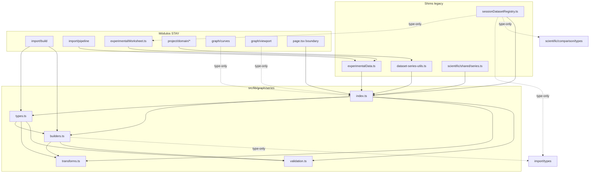

# D32.1 — Discovery: Inventario dominio Series/Datasets

**Épica:** PROD-2E — Modularización del motor gráfico  
**Microfase:** D32.1 — Discovery (BUILD)  
**Fecha:** 2026-07-11  
**Modo:** Documentación únicamente — cero cambios en `src/**`, `scripts/**`, `package.json`  
**Prerrequisitos:** D31 CLOSED · GRAPH-2a CLOSED · gates anteriores PASS  

---

## 1. Resumen ejecutivo

D32.1 confirma que el dominio Series/Datasets está **parcialmente modularizado** hoy: el núcleo tipado y los parsers viven en [`experimentalData.ts`](../src/lib/experimentalData.ts) (~538 LOC), el registro de sesión en [`sessionDatasetRegistry.ts`](../src/lib/sessionDatasetRegistry.ts) (~161 LOC), transforms duplicados en [`dataset-series-utils.ts`](../src/lib/project/domain/dataset-series-utils.ts) (~24 LOC) y [`scientific/shared/series.ts`](../src/lib/scientific/shared/series.ts) (~7 LOC). Quedan **~136 LOC de dominio puro inline** en [`page.tsx`](../src/app/page.tsx) (estadísticas y error bars, líneas 1333–1467).

La extracción D32.2 consolidará **~700–850 LOC de dominio puro** en `src/lib/graph/series/` con política move-only y shims de compatibilidad en rutas legacy. El boundary React de `page.tsx` conservará **~800 LOC de handlers** y **~10.600 LOC de análisis SCI-40** fuera de alcance.

**Hallazgo crítico — `seriesToWorksheet()`:** por evidencia de consumidores y tipos, pertenece al **dominio Worksheet (B)**, no al dominio Series. No se moverá en D32.

**Hallazgo crítico — ciclo de tipos:** `SessionDatasetPayload` referencia `WorksheetColumnRegistry` e `ImportReport`. Mover tipos de sesión a `series/types.ts` sin estrategia rompe la acyclicidad (`series` → `experimentalWorksheet` → `series`). Mitigación congelada: tipos de sesión permanecen en `sessionDatasetRegistry` (SHIM); solo se mueven símbolos series-centrados.

**Consumidores legacy:** ~40 archivos importan `ExperimentalSeries` vía `@/lib/experimentalData` (mayoría type-only). Shims obligatorios en D32.2.

---

## 2. Frontera dominio / UI / OUT OF SCOPE

### 2.1 IN SCOPE — Dominio puro Series/Datasets

| Categoría | Criterio |
|-----------|----------|
| Tipos núcleo | `ExperimentalSeries`, puntos, fuentes de datos, estadísticas por serie, error bars |
| Builders | Parsers archivo → `ExperimentalSeries[]`, colecciones, IDs de serie, fast-path legacy |
| Transforms | Clone, métricas, extracción Y, estadísticas descriptivas, error bars |
| Validation | Estructura runtime de serie, mínimo de puntos (paridad Q-01) |
| Shims | `experimentalData`, `sessionDatasetRegistry`, `dataset-series-utils`, `scientific/shared/series` |

### 2.2 STAY — Boundary React (`page.tsx`)

| Categoría | Ejemplos |
|-----------|----------|
| Estado React | `experimentalSeries`, `sessionDatasets`, `activeDatasetId`, `currentDatasetInfo` |
| Handlers sesión | `loadSessionDatasetIntoEditor`, `persistActiveSessionDataset`, `activateSessionDataset`, `registerAndActivateImportedDataset`, `removeSessionDataset`, `handleExperimentalImport` |
| Handlers worksheet sync | `handleWorksheetSeriesChange`, `handleWorksheetPayloadChange` |
| Derivados UI | `visibleExperimentalSeries` (`useMemo` + `hiddenLegendKeys`) |
| Display helpers | `experimentalLegendKey`, `mapExperimentalScatterData`, `getExperimentalPointReactKey`, `formatExperimentalStat`, `getErrorBarModeLabel` |
| JSX / Recharts | Toda la capa de render (~21.000 LOC) |

### 2.3 OUT OF SCOPE

| Bloque | LOC aprox. | Motivo |
|--------|------------|--------|
| Análisis SCI-40 inline `page.tsx` | ~10.600 | Correlación, PCA inline, heatmap, multivariado, informes — D34–D35 |
| `src/lib/import/**` (orquestación) | ~2.500 | Pipeline wizard, discover, map, report — dominio Import |
| `src/lib/experimentalWorksheet.ts` (cuerpo) | ~1.050 | Dominio Worksheet — salvo decisión explícita contraria |
| `src/lib/project/**` persistencia V2 | — | Adapters, collect, hydrate, `validate-v2` — intocable |
| `src/lib/visualGraphBuilder.ts` + previews | — | Consumen series; no son dominio series |
| `src/lib/graph/curves/**` | — | D31 CLOSED — intocable |
| `src/lib/graph/viewport.ts` | — | D29 — intocable |

---

## 3. Matriz símbolo → destino

### 3.1 [`experimentalData.ts`](../src/lib/experimentalData.ts)

| Símbolo | LOC aprox. | Destino D32 | Clasificación |
|---------|------------|-------------|---------------|
| `ExperimentalSeries` | type | `series/types.ts` | **MOVE** |
| `ExperimentalDataSourceId` | type | `series/types.ts` | **MOVE** |
| `ExperimentalDataLayout` | type | `series/types.ts` | **MOVE** |
| `ExperimentalDataSource` | type | `series/types.ts` | **MOVE** |
| `EXPERIMENTAL_DATA_SOURCES` | const | `series/builders.ts` | **MOVE** |
| `DEFAULT_EXPERIMENTAL_DATA_SOURCE_ID` | const | `series/builders.ts` | **MOVE** |
| `detectExperimentalDataLayout` | fn | `series/builders.ts` | **MOVE** |
| `parseMultiSeriesCsvContent` | fn | `series/builders.ts` | **MOVE** |
| `parseMultiSeriesSpreadsheet` | fn | `series/builders.ts` | **MOVE** |
| `parseXlsxFile` | fn | `series/builders.ts` | **MOVE** |
| `parseOdsFile` | fn | `series/builders.ts` | **MOVE** |
| `getExperimentalDataSource` | fn | `series/builders.ts` | **MOVE** |
| `buildExperimentalSeriesCollection` | fn | `series/builders.ts` | **MOVE** |
| `importExperimentalDataFile` | fn | `series/builders.ts` | **MOVE** |
| `parseExperimentalDataFile` | fn | `series/builders.ts` | **MOVE** |
| `createExperimentalSeries` | fn privada | `series/builders.ts` | **MOVE** |
| `ParsedMultiSeries` | type privado | `series/builders.ts` | **MOVE** |
| `stripBom`, `splitDelimitedLine`, `getNonEmptyLines` | fn privadas | `series/builders.ts` | **MOVE** |
| `parseNumericPair`, `isCsvHeaderRow`, `isMultiSeriesDelimitedHeader` | fn privadas | `series/builders.ts` | **MOVE** |
| `parseCsvContent`, `parseTxtContent` | fn privadas | `series/builders.ts` | **MOVE** |
| `parseDelimitedTextToCollection`, `parseTxtToCollection` | fn privadas | `series/builders.ts` | **MOVE** |
| `normalizeCell`, `cellToNumber`, `isKnownHeaderPair` | fn privadas | `series/builders.ts` | **MOVE** |
| `isSpreadsheetHeaderRow`, `isMultiSeriesSpreadsheetHeader` | fn privadas | `series/builders.ts` | **MOVE** |
| `findNumericColumnPair`, `parseSpreadsheetMatrix` | fn privadas | `series/builders.ts` | **MOVE** |
| `parseSpreadsheetToCollection`, `parseSpreadsheetFile` | fn privadas | `series/builders.ts` | **MOVE** |
| `parseTextSourceToCollection` | fn privada | `series/builders.ts` | **MOVE** |
| `KNOWN_HEADER_PAIRS`, `ENABLED_DATA_SOURCE_IDS` | const privados | `series/builders.ts` | **MOVE** |
| Archivo `experimentalData.ts` completo | — | shim re-export | **SHIM** |

### 3.2 [`sessionDatasetRegistry.ts`](../src/lib/sessionDatasetRegistry.ts)

| Símbolo | Destino D32 | Clasificación | Notas |
|---------|-------------|---------------|-------|
| `SessionDatasetPayload` | — | **STAY** | Acopla `ImportReport`, `WorksheetColumnRegistry` — evita ciclo |
| `SessionDataset` | — | **STAY** | Tipo de registro runtime multi-dataset |
| `createSessionDatasetId` | `series/builders.ts` | **MOVE** | Puro dominio ID |
| `cloneExperimentalSeries` | `series/transforms.ts` | **MOVE** | Canonical; eliminar duplicado |
| `computeSessionDatasetMetrics` | `series/transforms.ts` | **MOVE** | Alias de `computeDatasetMetrics` |
| `createSessionDatasetFromImport` | `series/builders.ts` | **MOVE** | Depende tipos STAY vía import type-only |
| `createSessionDatasetInfo` | `series/builders.ts` | **MOVE** | Proyección a `ProjectImportedDatasetInfo` |
| `updateSessionDatasetPayload` | `series/builders.ts` | **MOVE** | Usa `cloneExperimentalSeries` |
| `slotReferencesSessionDataset` | — | **STAY** | Acopla `DatasetAnalysisProfile` (comparison) |
| `sessionDatasetIdentityKey` | `series/builders.ts` | **MOVE** | Identidad pura |
| `getMostRecentSessionDatasetId` | `series/builders.ts` | **MOVE** | Selector de sesión |
| Archivo `sessionDatasetRegistry.ts` | shim re-export | **SHIM** | Re-exporta STAY + MOVE |

### 3.3 [`dataset-series-utils.ts`](../src/lib/project/domain/dataset-series-utils.ts)

| Símbolo | Destino D32 | Clasificación |
|---------|-------------|---------------|
| `cloneExperimentalSeries` | `series/transforms.ts` | **MOVE** (dedup) |
| `computeDatasetMetrics` | `series/transforms.ts` | **MOVE** (canonical) |
| Archivo completo | shim re-export | **SHIM** |

### 3.4 [`scientific/shared/series.ts`](../src/lib/scientific/shared/series.ts)

| Símbolo | Destino D32 | Clasificación |
|---------|-------------|---------------|
| `getSeriesYValues` | `series/transforms.ts` | **MOVE** |
| Archivo completo | shim re-export | **SHIM** |
| `scientific/shared/index.ts` | mantiene re-export | **SHIM** |

### 3.5 [`page.tsx`](../src/app/page.tsx) — inline dominio (líneas 1333–1467)

| Símbolo | Destino D32 | Clasificación |
|---------|-------------|---------------|
| `ExperimentalStatistics` | `series/types.ts` | **MOVE** |
| `ErrorBarMode` | `series/types.ts` | **MOVE** |
| `ErrorBarSeries` | `series/types.ts` | **MOVE** |
| `getStandardError` | `series/transforms.ts` | **MOVE** |
| `getCi95Margin` | `series/transforms.ts` | **MOVE** |
| `buildErrorBarSeries` | `series/transforms.ts` | **MOVE** |
| `calculateExperimentalStatistics` | `series/transforms.ts` | **MOVE** |
| `formatExperimentalStat` | — | **STAY** | Formato presentación; acoplado a ~80 usos en bloque análisis/JSX |
| `getErrorBarModeLabel` | — | **STAY** | Etiqueta UI |
| `experimentalLegendKey` | — | **STAY** | Clave leyenda React |
| `mapExperimentalScatterData` | — | **STAY** | Adaptador Recharts |
| `getExperimentalPointReactKey` | — | **STAY** | Clave React |
| `visibleExperimentalSeries` | — | **STAY** | `useMemo` boundary |
| Handlers GraphEditor (§2.2) | — | **STAY** | Orquestación React |
| Bloque análisis (l.1474–15408, useMemos, componentes) | — | **OUT OF SCOPE** | SCI-40 / D34–D35 |

### 3.6 [`import/build/index.ts`](../src/lib/import/build/index.ts)

| Símbolo | Destino D32 | Clasificación | Notas |
|---------|-------------|---------------|-------|
| `createSeriesId` | `series/builders.ts` | **MOVE** | Generador ID serie |
| `buildSeriesFromPreview` | `series/builders.ts` | **MOVE** | Construye `ExperimentalSeries[]` |
| `extractAuxiliaryColumns` | — | **STAY** | Dominio Import (aux columns) |
| `buildExperimentalSeriesFromImport` | — | **STAY** | Orquesta preview+validation+report; delegará a `series/builders` |
| `buildWizardImportResult` | — | **STAY** | Wrapper wizard |
| Archivo `import/build/index.ts` | actualizar imports | **STAY** | Thin orchestrator post-D32.2 |

### 3.7 [`import/validate/rules.ts`](../src/lib/import/validate/rules.ts)

| Símbolo | Destino D32 | Clasificación | Notas |
|---------|-------------|---------------|-------|
| `IMPORT_RULE_CATALOG_VERSION` | — | **STAY** | Catálogo Import |
| `BLOCKING_IMPORT_RULE_CODES` | — | **STAY** | |
| `IMPORT_VALIDATION_RULE_CATALOG` | — | **STAY** | |
| `applyValidationRuleQ01`–`Q03` | — | **STAY** | Operan sobre `ImportPreview`, no `ExperimentalSeries` |
| `applySupplementalValidationRules` | — | **STAY** | |
| `validateSeriesMinimumPoints` (nuevo en D32.2) | `series/validation.ts` | **MOVE** (nuevo) | Extracción move-only de semántica Q-01 aplicada a `ExperimentalSeries` |

### 3.8 [`experimentalWorksheet.ts`](../src/lib/experimentalWorksheet.ts) — decisión `seriesToWorksheet`

| Símbolo | Destino D32 | Clasificación | Decisión |
|---------|-------------|---------------|----------|
| `seriesToWorksheet` | — | **STAY** | **Dominio Worksheet (B)** — ver §5 |
| `worksheetToSeries` | — | **STAY** | Par inverse; Worksheet |
| `applyWorksheetModelUpdate` | — | **STAY** | Orquesta round-trip |
| Resto exports worksheet (~40) | — | **STAY** | CRUD columnas, paste, sort, transforms |

### 3.9 [`graph/curves/`](../src/lib/graph/curves/) — consumidor

| Símbolo | Destino D32 | Clasificación |
|---------|-------------|---------------|
| Todo el módulo curves | — | **STAY** (intocable D31) |
| `mergeYMetricsWithExperimental` | — | **STAY** | Solo actualizar import type `ExperimentalSeries` → `@/lib/graph/series` en D32.3 |
| `collectChartScaleSamples` | — | **STAY** | Idem |

### 3.10 [`graph/viewport.ts`](../src/lib/graph/viewport.ts) — consumidor

| Símbolo | Clasificación | Notas |
|---------|---------------|-------|
| `collectExperimentalXExtent` | **STAY** | D29 intocable; shim type path en D32.3 opcional |
| `fitXViewportToExperimentalSeries` | **STAY** | |

### 3.11 Persistencia V2 — consumidores

| Archivo | Símbolos usados | Clasificación |
|---------|-----------------|---------------|
| `project/domain/types-v2.ts` | `ExperimentalSeries` type | **SHIM** (type path) |
| `project/domain/validate-v2.ts` | `validateSeries` (privada) | **STAY** | Validación schema V2 |
| `project/collect-project-snapshot-v2.ts` | `cloneExperimentalSeries`, `computeDatasetMetrics` | **SHIM** (vía dataset-series-utils) |
| `project/adapters/sgproj/map-session-dataset.ts` | idem | **SHIM** |
| `project/domain/mappers/visual-graph.ts` | `cloneExperimentalSeries` | **SHIM** |
| `project/visual-graph-session-ui.ts` | `SessionDataset`, `updateSessionDatasetPayload` | **SHIM** |
| `project/domain/index.ts` | re-export utils | **SHIM** |

---

## 4. Inventario de dependencias

### 4.1 Grafo de imports propuesto (D32.2)



### 4.2 Consumidores por módulo fuente

#### `ExperimentalSeries` / `experimentalData` (~42 archivos `src/`)

| Patrón import | Archivos | Estrategia D32 |
|---------------|----------|----------------|
| `type ExperimentalSeries` only | 35 | Shim `@/lib/experimentalData` suficiente |
| Runtime (`EXPERIMENTAL_DATA_SOURCES`, etc.) | `page.tsx`, `import/pipeline.ts` | Boundary → `@/lib/graph/series`; pipeline → shim |
| `ExperimentalDataSourceId` type | `WorkbookImportWizard`, `import/types`, `import/pipeline` | Shim |

#### `sessionDatasetRegistry` (~24 archivos)

| Consumidor | Símbolos | Estrategia |
|------------|----------|------------|
| `page.tsx` | 8 símbolos runtime | Rewire D32.3 → `@/lib/graph/series` |
| `SessionDatasetPanel` | tipos + helpers | Shim (UI intocable) |
| `project/*` pipeline | tipos + `updateSessionDatasetPayload` | Shim |
| Tests | tipos | Shim |

#### `getSeriesYValues` (4 archivos runtime)

| Archivo | Estrategia |
|---------|------------|
| `page.tsx` | Rewire D32.3 |
| `scientific/inference/parametric.ts` | Shim `scientific/shared/series` |
| `scientific/inference/nonparametric.ts` | Shim |

#### `cloneExperimentalSeries` / `computeDatasetMetrics` (6 archivos runtime)

| Archivo | Estrategia |
|---------|------------|
| `page.tsx` | Rewire D32.3 |
| `collect-project-snapshot-v2.ts` | Shim `dataset-series-utils` |
| `map-session-dataset.ts` | Shim |
| `visual-graph.ts` mapper | Shim |

#### `seriesToWorksheet` (18 archivos — ver §5)

Todos permanecen en `@/lib/experimentalWorksheet` — **sin cambio D32**.

### 4.3 Dependencias cruzadas críticas

| Origen | Destino | Tipo | Riesgo | Mitigación D32.2 |
|--------|---------|------|--------|-------------------|
| `series/builders` | `import/types` | type-only | Bajo | `import type { ImportReport }` |
| `series/builders` | `xlsx` | runtime | Bajo | Ya presente en experimentalData |
| `sessionDatasetRegistry` (STAY types) | `experimentalWorksheet` | type | Medio | No mover `SessionDataset*` types a series |
| `import/build` | `series/builders` | runtime | Bajo | Delegación unidireccional import→series |
| `graph/curves/metrics` | `ExperimentalSeries` | type | Bajo | Actualizar path type-only D32.3 |
| `experimentalWorksheet` | `ExperimentalSeries` | type | Bajo | Shim experimentalData → series |
| `project/domain/types-v2` | `ExperimentalSeries` | type | Bajo | Shim |

### 4.4 Ciclos detectados y resolución

| Ciclo potencial | Estado | Resolución |
|-----------------|--------|------------|
| `series/types` → `experimentalWorksheet` → `series` | **BLOQUEANTE si se mueven SessionDataset types** | Mantener `SessionDataset*` en `sessionDatasetRegistry` STAY |
| `series` → `import/build` → `series` | Evitable | `import/build` importa desde `series/builders`; `series` no importa `import/build` |
| `series` → `project/domain` → `series` | Evitable | `project` consume solo shims; `series` no importa `project` |
| `curves` → `series` → `curves` | No aplica | `series` no importará `curves` |

**Veredicto acyclicidad:** viable con tipos de sesión STAY y worksheet STAY.

---

## 5. Decisión evidenciada: `seriesToWorksheet()`

### Evidencia

| Factor | Observación |
|--------|-------------|
| **Tipo de retorno** | `WorksheetModel` — tipo propio del dominio Worksheet |
| **Ubicación actual** | `experimentalWorksheet.ts` junto a `worksheetToSeries`, CRUD columnas, paste, sort |
| **Consumidores** | 18 referencias: `VisualGraphBuilder`, `visualGraphBuilder.ts`, `ScientificWorksheetPanel`, gates worksheet/VGB/perf — **ninguno** en dominio series puro |
| **Función inversa** | `worksheetToSeries` en el mismo archivo — round-trip worksheet↔series |
| **Dependencias internas** | Usa estructura `WorksheetRow`, `WorksheetColumn`; no exporta lógica series adicional |
| **Semántica** | Proyección tabular (pivot X → filas, series → columnas) — adaptador **hacia** representación worksheet |
| **VGB** | `seriesToWorksheet(series)` es paso de adaptación previo a algoritmos de gráfico sobre modelo tabular |

### Decisión D32.1 (congelada)

**B) Pertenece al dominio Worksheet.**

- **Clasificación:** STAY en `experimentalWorksheet.ts`
- **D32.2:** no mover
- **Shim:** no aplica
- **Nota:** `graph/series` exportará solo `ExperimentalSeries` como input type; la proyección worksheet permanece en Worksheet.

---

## 6. Borrador API Freeze — `src/lib/graph/series/index.ts`

### 6.1 Política barrel (Decisión A — paridad D31)

Exportar **únicamente** lo consumido por `page.tsx` boundary + cross-module esencial (`import/build`, shims). Internals privados al submódulo.

### 6.2 Tipos públicos preliminares (8)

```typescript
// FROZEN_SERIES_BARREL_API — types (borrador D32.1)
ExperimentalSeries
SeriesPoint                    // alias explícito { x: number; y: number } — evaluar en D32.2
ExperimentalDataSourceId
ExperimentalDataSource
ExperimentalDataLayout
ExperimentalStatistics
ErrorBarMode
ErrorBarSeries
```

### 6.3 Funciones públicas preliminares (22)

```typescript
// FROZEN_SERIES_BARREL_API — functions (borrador D32.1)
// builders.ts
EXPERIMENTAL_DATA_SOURCES
DEFAULT_EXPERIMENTAL_DATA_SOURCE_ID
getExperimentalDataSource
detectExperimentalDataLayout
parseMultiSeriesCsvContent
parseMultiSeriesSpreadsheet
parseXlsxFile
parseOdsFile
buildExperimentalSeriesCollection
importExperimentalDataFile
parseExperimentalDataFile
createSessionDatasetId
createSessionDatasetFromImport
createSessionDatasetInfo
updateSessionDatasetPayload
sessionDatasetIdentityKey
getMostRecentSessionDatasetId
buildSeriesFromPreview              // desde import/build — evaluar si barrel o deep import only

// transforms.ts
cloneExperimentalSeries
computeDatasetMetrics
computeSessionDatasetMetrics        // alias shim — evaluar si exportar o solo shim
getSeriesYValues
calculateExperimentalStatistics
buildErrorBarSeries

// validation.ts
validateExperimentalSeriesStructure   // borrador — nombre final en D32.2
hasMinimumSeriesPoints                // paridad semántica Q-01
```

### 6.4 Excluidos del barrel (privados / STAY / deep import)

| Símbolo | Motivo exclusión |
|---------|------------------|
| `SessionDataset`, `SessionDatasetPayload` | STAY — ciclo worksheet/import |
| `slotReferencesSessionDataset` | STAY — acopla comparison |
| `buildExperimentalSeriesFromImport` | STAY en import/build |
| `seriesToWorksheet`, `worksheetToSeries` | STAY — Worksheet |
| `formatExperimentalStat`, `getErrorBarModeLabel` | STAY — UI boundary |
| Parsers privados (~20 fn) | Internals de builders.ts |
| `getStandardError`, `getCi95Margin` | Internals de transforms.ts |

### 6.5 Conteo preliminar barrel

**22 funciones + 8 tipos = 30 exports** (paridad ± con D31: 23+6). Ajuste final en D32.2 tras wiring real de `page.tsx`.

---

## 7. Riesgos arquitectónicos

| ID | Riesgo | Severidad | Probabilidad | Mitigación D32.2 |
|----|--------|-----------|--------------|------------------|
| R-D32-01 | Scope creep al bloque análisis ~10.6k LOC en page.tsx | Alta | Media | Gate anti-inline; clasificación OUT OF SCOPE congelada |
| R-D32-02 | Ciclo `series` ↔ `worksheet` por `SessionDatasetPayload` | Alta | Alta si se mueven tipos sesión | Tipos sesión STAY; ver §4.4 |
| R-D32-03 | 42 consumidores `experimentalData` rompen en compilación | Media | Baja | Shims 100% re-export antes de cualquier delete |
| R-D32-04 | Duplicado `cloneExperimentalSeries` diverge | Media | Media | Unificar en transforms; gate `noDuplicateLogic` |
| R-D32-05 | `import/pipeline` re-export `buildExperimentalSeriesCollection` | Baja | Baja | Mantener re-export desde shim experimentalData |
| R-D32-06 | `mergeYMetricsWithExperimental` regression | Media | Baja | Caso cross-module en extension gate D32.4 |
| R-D32-07 | V2 round-trip `datasets[].series` | Alta | Baja | No tocar validate-v2; regresión C8 + smoke S5 |
| R-D32-08 | VGB `seriesToWorksheet` path indirecto | Baja | Nula | Worksheet STAY — sin cambio |
| R-D32-09 | Mover `buildSeriesFromPreview` rompe wizard import | Media | Media | Mover literal; gates `worksheet-import-unit` + C8 |
| R-D32-10 | `xlsx` dependency en builders | Baja | Nula | Ya existente; sin nueva dependencia |
| R-D32-11 | Barrel demasiado amplio | Media | Media | Decisión A — revisar tras wiring D32.3 |
| R-D32-12 | `computeSessionDatasetMetrics` vs `computeDatasetMetrics` naming | Baja | Alta | Alias en transforms; shim session conserva nombre |

---

## 8. Decisiones pendientes (resolver al inicio D32.2)

| ID | Pregunta | Opciones | Recomendación D32.1 |
|----|----------|----------|---------------------|
| DP-01 | ¿Exportar `buildSeriesFromPreview` en barrel o solo deep import desde `import/build`? | Barrel / deep only | **Deep only** — consumidor único import/build |
| DP-02 | ¿Exportar `computeSessionDatasetMetrics` como alias público? | Alias barrel / solo `computeDatasetMetrics` | **Solo `computeDatasetMetrics`**; shim session re-exporta alias |
| DP-03 | ¿Crear `SeriesPoint` type explícito o inline en `ExperimentalSeries`? | Alias / inline | **Alias** — move-only, mejora tipado sin cambio runtime |
| DP-04 | ¿Nombre `validateExperimentalSeriesStructure` vs `assertValidSeries`? | — | Resolver en D32.2 con paridad validate-v2 privada |
| DP-05 | ¿Actualizar consumidores a `@/lib/graph/series` o solo shims? | Rewire masivo / shims only | **Shims only** + rewire `page.tsx` y `curves/metrics` type path (mínimo) |
| DP-06 | ¿Mover `slotReferencesSessionDataset` a comparison module? | Sí / No | **No** — fuera alcance move-only D32 |

---

## 9. Métricas de referencia (pre-extracción)

| Métrica | Valor |
|---------|-------|
| `experimentalData.ts` | ~538 LOC |
| `sessionDatasetRegistry.ts` | ~161 LOC |
| `dataset-series-utils.ts` | ~24 LOC |
| `scientific/shared/series.ts` | ~7 LOC |
| `page.tsx` inline series dominio | ~136 LOC (1333–1467) |
| `import/build` series builders | ~60 LOC (`createSeriesId`, `buildSeriesFromPreview`) |
| **Total dominio a consolidar** | **~700–850 LOC** |
| `page.tsx` total | ~27.872 LOC |
| Consumidores `ExperimentalSeries` | ~42 archivos |
| Consumidores `seriesToWorksheet` | 18 archivos (STAY) |

---

## 10. Criterios de aceptación D32.1

| ID | Criterio | Estado |
|----|----------|--------|
| CA-D32.1-01 | Inventario completo símbolo → destino | **PASS** |
| CA-D32.1-02 | Alcance congelado IN/OUT/STAY/SHIM | **PASS** |
| CA-D32.1-03 | Frontera dominio/UI definida | **PASS** |
| CA-D32.1-04 | Barrel preliminar `FROZEN_SERIES_BARREL_API` | **PASS** |
| CA-D32.1-05 | Riesgos documentados | **PASS** |
| CA-D32.1-06 | Decisión `seriesToWorksheet` documentada | **PASS** (Worksheet B) |
| CA-D32.1-07 | Grafo dependencias + ciclos | **PASS** |
| CA-D32.1-08 | Cero cambios funcionales | **PASS** |
| CA-D32.1-09 | Cero cambios en src/scripts/package.json | **PASS** |
| CA-D32.1-10 | Decisiones pendientes listadas | **PASS** |

**Total CA-D32.1: 10/10 PASS**

---

## 11. Recomendación para iniciar D32.2

### Orden de ejecución sugerido

1. Crear `src/lib/graph/series/types.ts` — tipos núcleo (`ExperimentalSeries`, stats, error bars)
2. Crear `transforms.ts` — `cloneExperimentalSeries` **canonical** (primero, desbloquea builders)
3. Crear `builders.ts` — move literal desde `experimentalData.ts` + session builders + `buildSeriesFromPreview`
4. Crear `validation.ts` — validadores runtime serie (semántica Q-01)
5. Crear `index.ts` — barrel borrador §6
6. Convertir `experimentalData.ts`, `dataset-series-utils.ts`, `scientific/shared/series.ts` en shims
7. Convertir `sessionDatasetRegistry.ts` en shim híbrido (re-export MOVE + STAY types/funcs)
8. Actualizar `import/build/index.ts` — importar builders desde `@/lib/graph/series`
9. Crear `__tests__/series.cases.ts` — casos move-only (clone, metrics, stats, parsers, Q-01)
10. Verificar `npx tsc --noEmit` antes de D32.3

### Precondiciones

- [ ] Aprobación explícita de este inventario
- [ ] Confirmar DP-01 a DP-06 al kickoff D32.2
- [ ] No iniciar wiring `page.tsx` hasta D32.3

### Gates baseline pre-D32.2 (referencia)

```bash
npx tsc --noEmit
npm run validate:prod2e-d31-curves-gate
```

---

*Documento generado en D32.1 Discovery — BUILD STRICT. Sin cambios de producto. Próxima microfase: D32.2 Domain Extraction (pendiente aprobación).*
