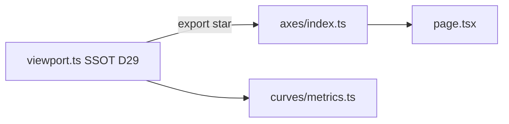

# D33.1 — Discovery: Inventario dominio Axes & Viewport (GRAPH-2c)

**Épica:** PROD-2E — Modularización del motor gráfico  
**Microfase:** D33.1 — Discovery (BUILD)  
**Fecha:** 2026-07-13  
**Modo:** Documentación únicamente — cero cambios en `src/**`, `scripts/**`, `package.json`  
**Prerrequisitos:** D32 CLOSED · GRAPH-2b CLOSED · D31 CLOSED · D29 CLOSED  

---

## 1. Resumen ejecutivo

D33.1 confirma que la lógica de ejes, escalas, rangos visibles, sincronización y tokens de grid en el gráfico principal permanece **parcialmente inline** en [`page.tsx`](../src/app/page.tsx). El viewport numérico X/Y certificado en D29 ya vive en [`viewport.ts`](../src/lib/graph/viewport.ts) (~166 LOC) y se consume vía [`chartViewport.ts`](../src/app/chartViewport.ts).

La extracción D33.2–D33.4 consolidará **~169 LOC de dominio puro** desde `page.tsx` en `src/lib/graph/axes/` (6 módulos, sin `axes/viewport.ts`). El archivo `viewport.ts` permanece **SSOT D29 intocable**; el barrel `@/lib/graph/axes` lo re-exportará con `export * from "../viewport"`.

**Objetivo wiring:** `page.tsx` importará **únicamente** desde `@/lib/graph/axes`, con reducción neta estimada **−120 a −180 LOC**.

**Certificación move-only:** Los **14 símbolos MOVE** del inventario §5 cumplen **Hooks React = ninguno** y **Recharts = ninguno**. D33.2 puede iniciarse.

**Amend planificación:** D33 oficial del plan original (F5F-BIS ~718 LOC) queda redefinido como GRAPH-2c; F5F-BIS diferido post-GRAPH-3 (acta D33.6).

---

## 2. Arquitectura SSOT (decisión congelada D33.1)

```
src/lib/graph/
  viewport.ts              ← SSOT D29 (intocable — sin nuevas funciones)
  axes/
    index.ts               ← export * from "../viewport" + módulos axes
    types.ts
    scales.ts
    ranges.ts
    grid.ts
    synchronization.ts
    __tests__/axes.cases.ts   (D33.2)
```

| Regla | Decisión |
|-------|----------|
| `viewport.ts` | **No modificar cuerpo** — gates D29 (`validate:chart-viewport`, `validate:chart-viewport-y`, `validate:prod2e-d29-viewport-gate`) siguen apuntando al archivo certificado |
| `axes/viewport.ts` | **No crear** — evita duplicación |
| Barrel `axes/index.ts` | `export * from "../viewport"` + exports de módulos nuevos |
| `page.tsx` post-D33.4 | Import único `@/lib/graph/axes` |
| `chartViewport.ts` | Shim legacy → re-export desde `@/lib/graph/axes` (D33.4) |
| `curves/metrics.ts` | Sigue importando `@/lib/graph/viewport` directo (sin cambio — evita ciclo) |



---

## 3. Frontera dominio / UI / OUT OF SCOPE

### 3.1 IN SCOPE — Dominio puro Axes (MOVE desde `page.tsx`)

| Categoría | Criterio |
|-----------|----------|
| Rangos visibles | Clamp, zoom wheel math, pan delta math |
| Escalas | Modo log/lineal, violaciones, warnings |
| Dominios eje | X domain para chart (log safety), Y domain adaptación log |
| Grid/tema chart | Tokens visuales grid/axis/tooltip (`getChartTheme`) |
| Sincronización | Alinear visible range a data range (puro) |
| Tipos | `AxisScaleMode`, violaciones, tokens tema |

### 3.2 RE-EXPORT — SSOT D29 (sin copia)

| Símbolo | Origen | Acción D33 |
|---------|--------|------------|
| `VIEWPORT_PADDING_RATIO`, `XViewportRange`, `XViewportSetters`, `YViewportRange` | `viewport.ts` | **RE-EXPORT** vía barrel |
| `collectExperimentalXExtent`, `computeXViewportWithPadding`, `fitXViewportToExperimentalSeries` | `viewport.ts` | **RE-EXPORT** |
| `applyXViewportRange`, `applyExperimentalXViewportFit` | `viewport.ts` | **RE-EXPORT** |
| `collectExperimentalYExtent`, `computePaddedDomain`, `computeYViewportWithPadding` | `viewport.ts` | **RE-EXPORT** |
| `fitYViewportToExperimentalSeries`, `computeYAxisDomainFromValues` | `viewport.ts` | **RE-EXPORT** |

### 3.3 STAY — Boundary React (`page.tsx`)

| Categoría | Símbolos / líneas aprox. |
|-----------|--------------------------|
| Estado React | `minX`, `maxX`, `visibleMinX`, `visibleMaxX`, `autoScaleY`, `axisScaleMode`, `useSecondaryYAxis`, `rangeWarning`, `scaleWarning` (L15407–15534) |
| Refs | `visibleRangeRef`, `panStateRef`, `chartInteractionRef` (L15769–15784) |
| Handlers | `resetVisibleRange`, `handleChartMouseDown/Move/Up`, `onWheel` (L15787–19617) |
| useEffect wiring | sync ref (L19538–19540), wheel listener (L19542–19576), pan cleanup (L19578–19585) |
| useMemo derivados | `chartScaleSamples`, `axisScaleViolations`, `axisScaleWarnings`, `xAxisDomain`, `*YAxisDomainForChart`, `chartTheme`, overlays viewport-dependent (L16792–16945, L19275–19442) |
| Flujos setState | `generateGraph` sync (L16497–16498), `loadGraph` sync (L16723–16724), `newGraph` reset (L16621–16624), `duplicateGraph` (L15798–15799), `applyExperimentalXViewportFit` calls (L15871+) |
| JSX Recharts | `ComposedChart`, `XAxis`, `YAxis`, `CartesianGrid`, props `domain`/`scale` (L23408+) |
| Inspector UI | Min/Max X inputs, auto-scale Y, secondary Y, scale mode select (L21257–21349) |

### 3.4 OUT OF SCOPE

| Bloque | LOC aprox. | Motivo |
|--------|------------|--------|
| `getQQPlotAxisBounds` | 14 (L11353–11366) | SCI-40 Q-Q plot — no eje principal |
| Ejes charts secundarios inline | ~120–180 | PCA, bubble, forest, etc. — D35 GRAPH-2e |
| `collectChartScaleSamples`, `resolveYAxisDomainFromMetrics` | en `curves/metrics.ts` | D31 — intocable |
| `normalizeImportedGraph` validación `min_x`/`max_x` | `curves/import.ts` | Dominio curves |
| Hooks interaction | — | D34 GRAPH-2d |
| F5F-BIS metodología UI | ~718 | Diferido post-GRAPH-3 |
| Persistencia V2 `graphContext` | — | PROD-2B — intocable |

---

## 4. Matriz símbolo → destino

### 4.1 MOVE — extracción desde `page.tsx`

| Símbolo | Origen `page.tsx` | LOC | Destino D33.2 |
|---------|-------------------|-----|---------------|
| `clampVisibleXRange` | L1186–1211 | 26 | `axes/ranges.ts` |
| `getAxisScaleModeLabel` | L15309–15314 | 6 | `axes/scales.ts` |
| `usesLogXScale` | L15316–15317 | 2 | `axes/scales.ts` |
| `usesLogYScale` | L15319–15320 | 2 | `axes/scales.ts` |
| `getAxisScaleViolations` | L15322–15333 | 12 | `axes/scales.ts` |
| `getAxisScaleWarnings` | L15335–15361 | 27 | `axes/scales.ts` |
| `clampPositiveLogDomain` | L15363–15375 | 13 | `axes/ranges.ts` |
| `adaptYDomainForLogScale` | L15377–15382 | 6 | `axes/ranges.ts` |
| `AxisScaleMode` | L15305 | 1 | `axes/types.ts` |
| `getChartTheme` | L359–374 | 16 | `axes/grid.ts` |
| `computeXAxisDomainForChart` | L19320–19336 (extraer cuerpo useMemo) | ~16 | `axes/ranges.ts` |
| `computeWheelZoomVisibleRange` | L19548–19568 (extraer math puro) | ~17 | `axes/ranges.ts` |
| `computePanVisibleRange` | L19604–19613 (extraer math puro) | ~10 | `axes/ranges.ts` |
| `alignVisibleRangeToDataRange` | inline L16497–16498, L16723–16724, etc. | ~6 | `axes/synchronization.ts` |

### 4.2 DELETE — duplicado

| Símbolo | Origen | Acción |
|---------|--------|--------|
| `ChartScaleSample` (duplicado) | L15307 | Eliminar; `import type` desde `@/lib/graph/curves/types` |

### 4.3 Tipos nuevos en `axes/types.ts` (derivados move-only)

| Tipo | Origen |
|------|--------|
| `AxisScaleMode` | MOVE desde L15305 |
| `AxisScaleViolations` | Return type de `getAxisScaleViolations` |
| `ChartThemeTokens` | Return type de `getChartTheme` |

### 4.4 Conteo LOC baseline

| Métrica | Valor |
|---------|-------|
| `page.tsx` total | **27.744** LOC |
| Inline axes/viewport extraíble | **~169** LOC |
| `viewport.ts` SSOT D29 | **166** LOC (intocable) |
| Reducción neta objetivo `page.tsx` | **−120 a −180** LOC |
| Módulos axes nuevos (estimado) | **~175–190** LOC + tests |

---

## 5. Inventario de dependencias por símbolo (gate move-only)

Criterio **MOVE:** Hooks React = **ninguno**, Recharts = **ninguno**, Estado = **extraíble** (función pura, parámetros explícitos).

### 5.1 Símbolos MOVE — certificación

| Símbolo | Destino | Hooks React | Recharts | Dependencias dominio | Estado | Veredicto |
|---------|---------|-------------|----------|----------------------|--------|-----------|
| `clampVisibleXRange` | `ranges.ts` | ninguno | ninguno | ninguna | extraíble | **MOVE** ✓ |
| `computeWheelZoomVisibleRange` | `ranges.ts` | ninguno | ninguno | `clampVisibleXRange` (interno) | extraíble | **MOVE** ✓ |
| `computePanVisibleRange` | `ranges.ts` | ninguno | ninguno | `clampVisibleXRange` (interno) | extraíble | **MOVE** ✓ |
| `clampPositiveLogDomain` | `ranges.ts` | ninguno | ninguno | ninguna | extraíble | **MOVE** ✓ |
| `adaptYDomainForLogScale` | `ranges.ts` | ninguno | ninguno | `clampPositiveLogDomain` (interno) | extraíble | **MOVE** ✓ |
| `computeXAxisDomainForChart` | `ranges.ts` | ninguno | ninguno | `ChartScaleSample` (type-only curves), `clampPositiveLogDomain` | extraíble | **MOVE** ✓ |
| `getAxisScaleModeLabel` | `scales.ts` | ninguno | ninguno | `AxisScaleMode` (interno types) | extraíble | **MOVE** ✓ |
| `usesLogXScale` | `scales.ts` | ninguno | ninguno | `AxisScaleMode` | extraíble | **MOVE** ✓ |
| `usesLogYScale` | `scales.ts` | ninguno | ninguno | `AxisScaleMode` | extraíble | **MOVE** ✓ |
| `getAxisScaleViolations` | `scales.ts` | ninguno | ninguno | `ChartScaleSample` (type-only), `usesLogXScale`, `usesLogYScale` | extraíble | **MOVE** ✓ |
| `getAxisScaleWarnings` | `scales.ts` | ninguno | ninguno | `AxisScaleViolations` (interno) | extraíble | **MOVE** ✓ |
| `AxisScaleMode` | `types.ts` | ninguno | ninguno | ninguna | extraíble | **MOVE** ✓ |
| `getChartTheme` | `grid.ts` | ninguno | ninguno | `ThemeMode` (type-only — ver §8) | extraíble | **MOVE** ✓ |
| `alignVisibleRangeToDataRange` | `synchronization.ts` | ninguno | ninguno | ninguna | extraíble | **MOVE** ✓ |

**CA-D33.1-03 PASS:** 14/14 símbolos MOVE certificados — **React deps = 0**, **Recharts deps = 0**.

### 5.2 Símbolos STAY

| Símbolo | Hooks React | Recharts | Dependencias dominio | Estado | Veredicto |
|---------|-------------|----------|----------------------|--------|-----------|
| `onWheel` handler | `useEffect`, `useRef` | ninguno | `clampVisibleXRange` → delegará a dominio | closure `setVisible*` | **STAY** |
| `handleChartMouseDown` | ninguno (handler) | ninguno | — | closure `visibleMinX`, `panStateRef` | **STAY** → D34 |
| `handleChartMouseMove` | ninguno (handler) | ninguno | `clampVisibleXRange` | closure `setVisible*` | **STAY** → D34 |
| `handleChartMouseUp` | ninguno (handler) | ninguno | — | `panStateRef` | **STAY** → D34 |
| `resetVisibleRange` | ninguno (handler) | ninguno | — | closure `setVisible*`, `minX`, `maxX` | **STAY** |
| `xAxisDomain` useMemo | `useMemo` | ninguno | `computeXAxisDomainForChart` (post-move) | wiring derivado | **STAY** |
| `chartScaleSamples` useMemo | `useMemo` | ninguno | `collectChartScaleSamples` (curves) | wiring derivado | **STAY** |
| `axisScaleViolations` useMemo | `useMemo` | ninguno | `getAxisScaleViolations` | wiring derivado | **STAY** |
| `axisScaleWarnings` useMemo | `useMemo` | ninguno | `getAxisScaleWarnings` | wiring derivado | **STAY** |
| `mathYAxisDomainForChart` useMemo | `useMemo` | ninguno | `adaptYDomainForLogScale` | wiring derivado | **STAY** |
| `chartTheme` useMemo | `useMemo` | ninguno | `getChartTheme` | wiring derivado | **STAY** |
| `generateGraph` (sync visible) | ninguno (handler) | ninguno | `alignVisibleRangeToDataRange` | `setState` | **STAY** |
| `loadGraph` / `newGraph` / `duplicateGraph` | ninguno (handlers) | ninguno | — | `setState` múltiple | **STAY** |
| `applyExperimentalXViewportFit` calls | ninguno | ninguno | `viewport.ts` (D29) | pasa setters React | **STAY** |
| `ComposedChart` / `XAxis` / `YAxis` / `CartesianGrid` | — | **sí** | dominios calculados | JSX | **STAY** |

### 5.3 OUT OF SCOPE

| Símbolo | Hooks React | Recharts | Veredicto |
|---------|-------------|----------|-----------|
| `getQQPlotAxisBounds` | ninguno | sí (`ReferenceLine`) | **OUT OF SCOPE** |

---

## 6. Firmas objetivo funciones a extraer (D33.2)

### 6.1 `computeWheelZoomVisibleRange` (desde L19548–19568)

```typescript
// Extraer math puro; DOM rect/ratio como parámetros explícitos
function computeWheelZoomVisibleRange(params: {
  visibleMinX: number;
  visibleMaxX: number;
  minX: number;
  maxX: number;
  pointerRatio: number;  // 0..1 dentro del chart
  deltaY: number;
}): [number, number] | null;  // null si span <= 0
```

### 6.2 `computePanVisibleRange` (desde L19604–19613)

```typescript
function computePanVisibleRange(params: {
  startMin: number;
  startMax: number;
  minX: number;
  maxX: number;
  deltaPixels: number;
  chartWidthPixels: number;
}): [number, number];
```

### 6.3 `computeXAxisDomainForChart` (desde L19320–19336)

```typescript
function computeXAxisDomainForChart(
  usesLogX: boolean,
  visibleMinX: number,
  visibleMaxX: number,
  chartScaleSamples: ChartScaleSample[]
): [number, number];
```

### 6.4 `alignVisibleRangeToDataRange`

```typescript
function alignVisibleRangeToDataRange(minX: number, maxX: number): {
  visibleMinX: number;
  visibleMaxX: number;
};
```

---

## 7. Política de imports del dominio `axes/**`

### 7.1 Permitidos

| Origen | Uso |
|--------|-----|
| `../viewport` | Re-export SSOT D29 en `index.ts` únicamente |
| `@/lib/graph/curves/types` | `import type { ChartScaleSample }` |
| `@/lib/app-preferences/domain/types` | `import type { ThemeMode }` (ver §8) |
| Tipos TS locales | `axes/types.ts` |
| Módulos internos `axes/*` | imports relativos entre submódulos |

### 7.2 Prohibidos en `axes/**`

| Origen | Motivo |
|--------|--------|
| `react`, `react/*` | Dominio puro |
| `recharts`, `recharts/*` | Rendering delegado a page.tsx |
| `@/app/*` | Sin acoplamiento UI |
| Hooks React | Boundary en page.tsx |
| `@/lib/experimentalData` | Usar `@/lib/graph/series` o curves types |

### 7.3 Tabla imports post-D33 por consumidor

| Consumidor | Import permitido | Prohibido |
|------------|------------------|-----------|
| `page.tsx` | `@/lib/graph/axes` (único para viewport/axes) | `@/lib/graph/viewport`, `./chartViewport`, definiciones inline |
| `page.tsx` (curves) | `@/lib/graph/curves` | — |
| `chartViewport.ts` | `@/lib/graph/axes` | `@/lib/graph/viewport` directo (post-D33.4) |
| `curves/metrics.ts` | `@/lib/graph/viewport` | Sin cambio D33 |
| Otros legacy | `@/lib/graph/viewport` | Sin cambio obligatorio D33 |
| `axes/**` | Ver §7.1 | Ver §7.2 |

---

## 8. Decisión ThemeMode (DP-D33-01 — RESUELTA)

### 8.1 Análisis

| Fuente | Contenido | React | `@/app` |
|--------|-----------|-------|---------|
| [`src/lib/app-preferences/domain/types.ts`](../src/lib/app-preferences/domain/types.ts) | `export type ThemeMode = "light" \| "dark"` | **no** | **no** |
| [`src/lib/app-preferences/index.ts`](../src/lib/app-preferences/index.ts) | Barrel domain + local-storage adapter | adapter no importado con `import type` | **no** |
| `page.tsx` L130 | `import { ..., type ThemeMode } from "@/lib/app-preferences"` | — | — |

### 8.2 Decisión congelada

**`axes/grid.ts` usará:**

```typescript
import type { ThemeMode } from "@/lib/app-preferences/domain/types";
```

**No** se definirá unión mínima duplicada en `axes/types.ts` — el SSOT `domain/types.ts` es puro TS sin dependencias React ni `src/app`.

`ChartThemeTokens` se definirá en `axes/types.ts` como tipo del return de `getChartTheme` (move-only).

---

## 9. API Freeze preliminar (borrador D33.3)

### 9.1 Barrel `src/lib/graph/axes/index.ts`

```typescript
export * from "../viewport";
export * from "./types";
export * from "./scales";
export * from "./ranges";
export * from "./grid";
export * from "./synchronization";
```

### 9.2 Re-exports D29 desde `viewport.ts` (13 símbolos)

| Tipo | Símbolos |
|------|----------|
| const | `VIEWPORT_PADDING_RATIO` |
| types | `XViewportRange`, `XViewportSetters`, `YViewportRange` |
| functions | `collectExperimentalXExtent`, `computeXViewportWithPadding`, `fitXViewportToExperimentalSeries`, `applyXViewportRange`, `applyExperimentalXViewportFit`, `collectExperimentalYExtent`, `computePaddedDomain`, `computeYViewportWithPadding`, `fitYViewportToExperimentalSeries`, `computeYAxisDomainFromValues` |

### 9.3 Símbolos nuevos axes (borrador)

| Módulo | Exports |
|--------|---------|
| `types.ts` | `AxisScaleMode`, `AxisScaleViolations`, `ChartThemeTokens` |
| `scales.ts` | `getAxisScaleModeLabel`, `usesLogXScale`, `usesLogYScale`, `getAxisScaleViolations`, `getAxisScaleWarnings` |
| `ranges.ts` | `clampVisibleXRange`, `computeWheelZoomVisibleRange`, `computePanVisibleRange`, `clampPositiveLogDomain`, `adaptYDomainForLogScale`, `computeXAxisDomainForChart` |
| `grid.ts` | `getChartTheme` |
| `synchronization.ts` | `alignVisibleRangeToDataRange` |

### 9.4 Conteo preliminar barrel

**~13 re-exports D29 + 3 tipos + 14 funciones = ~30 exports** (congelar en D33.3 con `FROZEN_AXES_BARREL_API`).

### 9.5 Excluidos del barrel

| Símbolo | Motivo |
|---------|--------|
| Handlers React | STAY page.tsx |
| `collectChartScaleSamples` | Dominio curves (D31) |
| `getQQPlotAxisBounds` | OUT OF SCOPE SCI-40 |

---

## 10. Hooks y wiring baseline (`page.tsx`)

| Hook | Cantidad | Uso axes/viewport | Veredicto |
|------|----------|-------------------|-----------|
| `useState` | 6+ | min/max/visible/scale/theme | **STAY** |
| `useRef` | 3 | visibleRange, panState, chartInteraction | **STAY** |
| `useMemo` | 8+ | dominios derivados, chartTheme | **STAY** (delegan a dominio) |
| `useEffect` | 3 | wheel, pan cleanup, ref sync | **STAY** |
| `useCallback` | 0 | — | — |

---

## 11. Baseline gates (pre-D33.2)

| Gate | Script | Estado esperado |
|------|--------|-----------------|
| TypeScript | `npx tsc --noEmit` | PASS |
| Viewport D29 | `validate:chart-viewport` | PASS |
| Viewport Y D29 | `validate:chart-viewport-y` | PASS |
| Viewport umbrella D29 | `validate:prod2e-d29-viewport-gate` | PASS |
| Curves D31 | `validate:graph-curves-unit`, `validate:prod2e-d31-curves-gate` | PASS |
| Series D32 | `validate:graph-series-unit`, `validate:prod2e-d32-series-gate` | PASS |
| C8 regression | `validate:prod2c-c8-regression-gate` | PASS |
| `npm test` | — | **No existe** en `package.json`; mapear a gates dominio |

Casos viewport D29: [`src/lib/graph/__tests__/viewport.cases.ts`](../src/lib/graph/__tests__/viewport.cases.ts) — permanecen intocados. Nuevos casos axes: `axes/__tests__/axes.cases.ts` (D33.2).

---

## 12. Riesgos identificados

| ID | Riesgo | Severidad | Mitigación |
|----|--------|-----------|------------|
| R-D33-01 | Duplicar `ChartScaleSample` | Media | DELETE duplicado L15307; import type curves |
| R-D33-02 | Romper gates D29 | Alta | `viewport.ts` intocable; barrel `export *` sin copia |
| R-D33-03 | Extraer handlers React en D33 | Media | STAY boundary; D34 Interaction |
| R-D33-04 | Conflicto numeración D33/F5F-BIS | Baja | Amend documentado; acta D33.6 |
| R-D33-05 | Duplicar viewport en `axes/viewport.ts` | Alta | **Prohibido** — SSOT único |
| R-D33-06 | `ThemeMode` arrastra React vía barrel app-preferences | Baja | `import type` desde `domain/types` |
| R-D33-07 | Ciclo axes ↔ curves | Media | Solo type-only import desde curves/types |
| R-D33-08 | `export *` barrel demasiado amplio | Media | API Freeze D33.3 con lista explícita |

---

## 13. Mapeo símbolos solicitados vs reales

| Solicitado | Equivalente real | Estado |
|------------|------------------|--------|
| `calculateViewport` | `computeXViewportWithPadding`, `fitXViewportToExperimentalSeries` | D29 SSOT |
| `normalizeRange` | `computePaddedDomain` (D29), `alignVisibleRangeToDataRange` (nuevo) | — |
| `clampViewport` | `clampVisibleXRange` | MOVE |
| `buildAxis`, `buildTicks`, `calculateGrid` | **No existen** — Recharts renderiza; `grid.ts` = tokens visuales | — |
| `validateRange` | Parcial en `normalizeImportedGraph` (curves) | OUT OF SCOPE |

---

## 14. Cronología D33

| Microfase | Alcance | Estado |
|-----------|---------|--------|
| **D33.1** | Discovery — inventario, deps, SSOT, API Freeze borrador | **COMPLETE** |
| D33.2 | Dominio `axes/**` move-only | Pendiente |
| D33.3 | Barrel + API Freeze gate | Pendiente |
| D33.4 | Wiring `page.tsx` | Pendiente |
| D33.5 | Gates + smoke S1–S6 | Pendiente |
| D33.6 | Acta `PROJECT_STATUS_PROD_2E.md` | Pendiente |

---

## 15. Criterios de aceptación D33.1

| ID | Criterio | Resultado |
|----|----------|-----------|
| CA-D33.1-01 | Inventario completo (LOC, símbolos, destinos) | **PASS** |
| CA-D33.1-02 | Arquitectura SSOT documentada (`viewport.ts` intocable, sin `axes/viewport.ts`) | **PASS** |
| CA-D33.1-03 | Todos los símbolos MOVE: React deps = 0, Recharts deps = 0 | **PASS** (14/14) |
| CA-D33.1-04 | Política de imports documentada (permitidos/prohibidos) | **PASS** |
| CA-D33.1-05 | Decisión ThemeMode documentada | **PASS** — `import type` desde `app-preferences/domain/types` |

---

## 16. Handoff D33.2

Prerrequisitos cumplidos:

- [x] Inventario MOVE/STAY/OUT OF SCOPE cerrado
- [x] 14 símbolos MOVE certificados move-only
- [x] SSOT `viewport.ts` congelado
- [x] Estructura 6 módulos `axes/` definida
- [x] ThemeMode resuelto
- [x] API Freeze borrador listo

**Next BUILD:** D33.2 — crear `src/lib/graph/axes/{types,scales,ranges,grid,synchronization}.ts` + `__tests__/axes.cases.ts` (move-only byte-a-byte desde `page.tsx`).

---

*D33.1 COMPLETE — 2026-07-13 — Listo para D33.2.*
