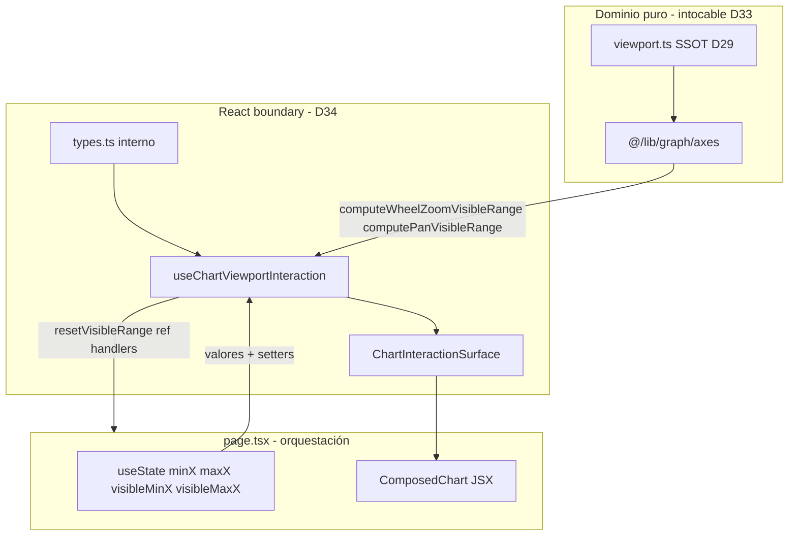

# D34.1 — Discovery: Inventario Interaction (GRAPH-2d)

**Épica:** PROD-2E — Modularización del motor gráfico  
**Microfase:** D34.1 — Discovery (BUILD)  
**Fecha:** 2026-07-13  
**Modo:** Documentación únicamente — cero cambios en `src/**`, `scripts/**`, `package.json`  
**Prerrequisitos:** D33 CLOSED · GRAPH-2c CLOSED · GRAPH-2 CLOSED · D32 CLOSED · D31 CLOSED · D29 CLOSED  

**Referencias:** [`PROJECT_STATUS_PROD_2E.md`](../PROJECT_STATUS_PROD_2E.md) §D33 handoff D34 · Plan D34 aprobado · [`docs/D33.1-discovery-inventory.md`](D33.1-discovery-inventory.md) §3.3 STAY→D34

---

## 1. Resumen ejecutivo

D34.1 confirma que la **capa React de interacción viewport** del gráfico principal (wheel zoom, pan horizontal, refs de sincronización, listeners DOM) permanece **inline** en [`page.tsx`](../src/app/page.tsx). La matemática viewport (clamp, zoom, pan) ya fue certificada en D33 en `@/lib/graph/axes` (`computeWheelZoomVisibleRange`, `computePanVisibleRange`, `clampVisibleXRange`), pero el wiring React y la math inline duplicada en handlers aún viven en `page.tsx`.

La extracción D34.2–D34.3 consolidará **~104 LOC de boundary React** desde `page.tsx` en `src/components/graph/chart-interaction/` (4 módulos). El hook `useChartViewportInteraction` es **React boundary, no dominio** — toda matemática viewport delega a `@/lib/graph/axes`.

| Métrica | Valor |
|---------|-------|
| `page.tsx` baseline post-D33 | **~25.504** LOC |
| Inline interaction extraíble | **~104** LOC |
| Reducción neta objetivo post-D34.3 | **−85 a −95** LOC |
| Símbolos MOVE certificados | **11/11** |
| Módulos destino | **4** (`types`, hook, surface, `index`) |
| Barrel público congelado (borrador) | **2 exports** |

**Certificación move-only:** Los 11 símbolos MOVE son wiring React puro. D34.2 puede iniciarse tras aprobación.

---

## 2. Principio arquitectónico obligatorio — React boundary, no dominio

> **`useChartViewportInteraction` es una boundary React, no un módulo de dominio.**

| Regla | Detalle |
|-------|---------|
| **Sin matemática nueva** | Prohibido introducir cálculos viewport (zoom factor, span, clamp, ratios de datos) en `chart-interaction/**` |
| **Delegación total** | Wheel y pan invocan exclusivamente `@/lib/graph/axes`: `computeWheelZoomVisibleRange`, `computePanVisibleRange`, `clampVisibleXRange` |
| **Rol del hook** | Orquesta `useRef`, `useEffect`, eventos DOM (`wheel`, `mousedown`/`mousemove`/`mouseup`) y llamadas a setters recibidos desde `page.tsx` |
| **DOM permitido en boundary** | `getBoundingClientRect`, coordenadas de puntero (`clientX`), ratios de posición en píxeles — entrada a funciones de dominio, no sustituto de ellas |
| **SSOT dominio** | `src/lib/graph/axes/` (D33) + `viewport.ts` (D29) — **intocables** en D34 |
| **Estado viewport** | `useState` de `minX`/`maxX`/`visibleMinX`/`visibleMaxX` **permanece en `page.tsx`** (patrón D31–D33) |



---

## 3. Frontera MOVE / STAY / OUT OF SCOPE

### 3.1 IN SCOPE — MOVE (extracción desde `page.tsx` → `chart-interaction/`)

| Categoría | Criterio |
|-----------|----------|
| Refs interacción | `chartInteractionRef`, `visibleRangeRef`, `panStateRef` |
| Handlers mouse | `handleChartMouseDown`, `handleChartMouseMove`, `handleChartMouseUp` |
| Handler reset | `resetVisibleRange` |
| Effects wiring | Sync `visibleRangeRef`; wheel listener (`passive: false`); window `mouseup` pan cleanup |
| Superficie DOM | Wrapper `div` interactivo (ref + handlers + className congelada) → `ChartInteractionSurface` |

### 3.2 STAY — Permanece en `page.tsx`

| Categoría | Símbolos / líneas aprox. |
|-----------|--------------------------|
| Estado React viewport | `minX`, `maxX`, `visibleMinX`, `visibleMaxX` + setters (L15296–15299) |
| useMemo dominio derivado | `chartScaleSamples`, `axisScaleViolations`, `axisScaleWarnings`, `xAxisDomain`, `mathYAxisDomainForChart`, `chartTheme` (delegan a `@/lib/graph/axes`) |
| JSX Recharts | `ResponsiveContainer`, `ComposedChart`, `XAxis`, `YAxis`, `CartesianGrid`, series, overlays (L23482+) |
| Refs no-interaction | `chartExportRef`, `generateGraphRef`, `nextCurveIdRef`, import refs |
| Flujos setState viewport | `generateGraph`, `loadGraph`, `newGraph`, `duplicateGraph`, `applyExperimentalXViewportFit` |
| Botón «Restablecer vista» | JSX del botón (L23291–23298) — `onClick` enlaza a `resetVisibleRange` retornado por hook |
| Import dominio axes | `@/lib/graph/axes` para useMemos y auto-fit (permanece en `page.tsx`) |
| Inspector UI ejes | Inputs min/max X, auto-scale Y, scale mode select |

### 3.3 OUT OF SCOPE

| Bloque | LOC aprox. | Motivo |
|--------|------------|--------|
| Matemática viewport | en `axes/ranges.ts` | D33 — intocable; hook solo delega |
| `viewport.ts` SSOT D29 | 166 | Intocable |
| Ejes charts secundarios inline | ~120–180 | D35 GRAPH-2e Rendering |
| JSX Recharts interior | ~500+ en bloque chart | D35 o permanece en page |
| `chartExportRef` / export PNG | — | Fuera interaction viewport |
| SCI-40 multivariante | ~8.532 | Deuda OPEN — post-GRAPH-2e |
| F5F-BIS metodología UI | ~718 | Diferido post-GRAPH-3 |
| VGB / persistencia V2 / fixtures | — | API Freeze D25.4 |
| `getQQPlotAxisBounds` | 14 | SCI-40 Q-Q — no gráfico principal |
| Gates / scripts | — | D34.4 |

---

## 4. Matriz símbolo → destino

### 4.1 Tabla completa

| Símbolo | Archivo origen | Líneas | LOC | Dependencias | Clasificación | Destino D34.2 |
|---------|----------------|--------|-----|--------------|---------------|---------------|
| `chartInteractionRef` | `page.tsx` | L15658 | 1 | `useRef`, `HTMLDivElement` | **MOVE** | `useChartViewportInteraction.ts` |
| `visibleRangeRef` | `page.tsx` | L15662–15667 | 6 | `useRef`, `visibleMinX`, `visibleMaxX`, `minX`, `maxX` (lectura inicial) | **MOVE** | `useChartViewportInteraction.ts` |
| `panStateRef` | `page.tsx` | L15668–15673 | 6 | `useRef` | **MOVE** | `useChartViewportInteraction.ts` |
| `resetVisibleRange` | `page.tsx` | L15676–15679 | 4 | `setVisibleMinX`, `setVisibleMaxX`, `minX`, `maxX` (params hook) | **MOVE** | `useChartViewportInteraction.ts` |
| `useEffect` sync ref | `page.tsx` | L19420–19422 | 3 | `visibleRangeRef`, estado viewport | **MOVE** | `useChartViewportInteraction.ts` |
| `useEffect` wheel listener | `page.tsx` | L19424–19458 | 35 | `chartInteractionRef`, `visibleRangeRef`, `setVisible*`, `clampVisibleXRange`¹, deps `chartData.length`, `experimentalSeries.length` | **MOVE** | `useChartViewportInteraction.ts` |
| `useEffect` pan cleanup | `page.tsx` | L19460–19467 | 8 | `panStateRef`, `window` | **MOVE** | `useChartViewportInteraction.ts` |
| `handleChartMouseDown` | `page.tsx` | L19469–19478 | 10 | `panStateRef`, `visibleMinX`, `visibleMaxX` | **MOVE** | `useChartViewportInteraction.ts` |
| `handleChartMouseMove` | `page.tsx` | L19480–19499 | 20 | `panStateRef`, `chartInteractionRef`, `setVisible*`, `clampVisibleXRange`¹, `minX`, `maxX` | **MOVE** | `useChartViewportInteraction.ts` |
| `handleChartMouseUp` | `page.tsx` | L19501–19503 | 3 | `panStateRef` | **MOVE** | `useChartViewportInteraction.ts` |
| JSX wrapper `div` interactivo | `page.tsx` | L23474–23481 | 8 | ref + 4 handlers + className | **MOVE** | `ChartInteractionSurface.tsx` |
| `minX`, `maxX`, `visibleMinX`, `visibleMaxX` | `page.tsx` | L15296–15299 | 4 | `useState` | **STAY** | `page.tsx` |
| `setVisibleMinX`, `setVisibleMaxX` | `page.tsx` | (setters) | — | React dispatch | **STAY** (pasados al hook) | `page.tsx` → hook input |
| `clampVisibleXRange` (import) | `page.tsx` | L115 | — | `@/lib/graph/axes` | **STAY** en page para otros flujos; hook importa axes propio | Ambos consumen barrel |
| `ComposedChart` / `ResponsiveContainer` | `page.tsx` | L23482+ | — | Recharts | **STAY** | `page.tsx` (hijos de `ChartInteractionSurface`) |
| `chartExportRef` | `page.tsx` | L15657, L23301 | — | export capture | **OUT** | — |
| `computeWheelZoomVisibleRange` | `axes/ranges.ts` | — | — | dominio D33 | **OUT** (ya existe) | Hook delega en D34.2 |
| `computePanVisibleRange` | `axes/ranges.ts` | — | — | dominio D33 | **OUT** (ya existe) | Hook delega en D34.2 |

¹ **Deuda D33:** handlers usan `clampVisibleXRange` directamente con math inline duplicada (`1.15`, `0.5`, ratios). D34.2 **sustituye** por `computeWheelZoomVisibleRange` / `computePanVisibleRange` — cumplimiento «React boundary, no dominio», no refactor oportunista.

### 4.2 Conteo LOC

| Métrica | Valor |
|---------|-------|
| LOC inline MOVE (suma §4.1) | **104** |
| LOC nuevas estimadas `chart-interaction/` | **~115–130** (types + hook + surface + barrel + `"use client"`) |
| LOC wiring añadidas en `page.tsx` (D34.3) | **~15–20** |
| Reducción neta `page.tsx` | **−85 a −95** |

---

## 5. Estructura objetivo y responsabilidades

```text
src/components/graph/
  chart-interaction/
    types.ts                      ← tipos internos input/result (no export barrel salvo necesidad D34.3)
    useChartViewportInteraction.ts ← hook: refs, effects, handlers, delegación axes
    ChartInteractionSurface.tsx   ← wrapper div + children slot
    index.ts                      ← barrel minimal (2 exports)
```

| Archivo | Responsabilidad | Contenido move-only |
|---------|-----------------|---------------------|
| **`types.ts`** | Contratos internos del hook | `PanState`, `VisibleRangeSnapshot`, `ChartViewportInteractionInput`, `ChartViewportInteractionResult` |
| **`useChartViewportInteraction.ts`** | React boundary orquestador | 3 refs, 3 `useEffect`, 4 handlers; import `@/lib/graph/axes`; **cero** aritmética viewport propia |
| **`ChartInteractionSurface.tsx`** | Superficie DOM interactiva | `div` con className congelada, spread de props del hook (`ref`, `onMouseDown`, etc.), `children` para Recharts |
| **`index.ts`** | API pública minimal | Solo `useChartViewportInteraction` + `ChartInteractionSurface` |

**No crear en D34.2:** `__tests__/` (D34.4), scripts gates (D34.4), subcarpetas adicionales.

---

## 6. Firmas objetivo (borrador D34.2)

### 6.1 `types.ts`

```typescript
export type PanState = {
  isPanning: boolean;
  startX: number;
  startMin: number;
  startMax: number;
};

export type VisibleRangeSnapshot = {
  visibleMinX: number;
  visibleMaxX: number;
  minX: number;
  maxX: number;
};

export type ChartViewportInteractionInput = {
  visibleMinX: number;
  visibleMaxX: number;
  minX: number;
  maxX: number;
  setVisibleMinX: (value: number) => void;
  setVisibleMaxX: (value: number) => void;
  /** Deps inmutables del effect wheel — conservar [chartData.length, experimentalSeries.length] */
  wheelEffectKey: readonly [number, number];
};

export type ChartViewportInteractionResult = {
  chartInteractionRef: React.RefObject<HTMLDivElement | null>;
  resetVisibleRange: () => void;
  surfaceProps: {
    ref: React.RefObject<HTMLDivElement | null>;
    onMouseDown: (e: React.MouseEvent<HTMLDivElement>) => void;
    onMouseMove: (e: React.MouseEvent<HTMLDivElement>) => void;
    onMouseUp: () => void;
    onMouseLeave: () => void;
  };
};
```

### 6.2 `useChartViewportInteraction`

```typescript
export function useChartViewportInteraction(
  input: ChartViewportInteractionInput
): ChartViewportInteractionResult;
```

**Delegación wheel (sustituye math inline L19431–19450):**

```typescript
const ratio = Math.min(1, Math.max(0, (e.clientX - rect.left) / rect.width));
const next = computeWheelZoomVisibleRange({
  visibleMinX, visibleMaxX, minX, maxX,
  pointerRatio: ratio,
  deltaY: e.deltaY,
});
if (next) { setVisibleMinX(next[0]); setVisibleMaxX(next[1]); }
```

**Delegación pan (sustituye math inline L19488–19495):**

```typescript
const [clampedMin, clampedMax] = computePanVisibleRange({
  startMin, startMax, minX, maxX,
  deltaPixels: e.clientX - startX,
  chartWidthPixels: rect.width,
});
```

### 6.3 `ChartInteractionSurface`

```typescript
export type ChartInteractionSurfaceProps = {
  surfaceProps: ChartViewportInteractionResult["surfaceProps"];
  children: React.ReactNode;
};

export function ChartInteractionSurface(props: ChartInteractionSurfaceProps): JSX.Element;
```

**className congelada (move-only):**

```text
w-full min-h-[360px] h-[min(42vh,480px)] sm:min-h-[400px] sm:h-[min(48vh,520px)] max-h-[520px] select-none cursor-grab active:cursor-grabbing
```

---

## 7. Política de imports

### 7.1 Permitidos en `chart-interaction/**`

| Origen | Uso |
|--------|-----|
| `react`, `react/*` | `useRef`, `useEffect`, tipos evento |
| `@/lib/graph/axes` | `computeWheelZoomVisibleRange`, `computePanVisibleRange`, `clampVisibleXRange` (si necesario residual) |
| Imports relativos internos | `./types`, etc. |

### 7.2 Prohibidos en `chart-interaction/**`

| Origen | Motivo |
|--------|--------|
| `src/app/*`, `@/app/*` | Sin acoplamiento a boundary app |
| `recharts`, `recharts/*` | Rendering permanece en `page.tsx` / D35 |
| `@/lib/graph/viewport` directo | Usar barrel `@/lib/graph/axes` |
| `@/lib/graph/curves`, `@/lib/graph/series` | Fuera alcance interaction |
| `@/lib/visualGraphBuilder` | VGB API Freeze |
| Cualquier otro paquete/módulo | Gate `governance.interaction.allowedImportsOnly` |

### 7.3 Consumidor `page.tsx` post-D34.3

| Import permitido | Prohibido |
|------------------|-----------|
| `@/components/graph/chart-interaction` (único para interaction) | Definir inline refs/handlers/effects interaction |
| `@/lib/graph/axes` (useMemos dominio — sin cambio D33) | `@/lib/graph/viewport` directo |

---

## 8. API Freeze previsto (borrador D34.3)

### 8.1 Barrel `src/components/graph/chart-interaction/index.ts`

```typescript
export { useChartViewportInteraction } from "./useChartViewportInteraction";
export { ChartInteractionSurface } from "./ChartInteractionSurface";
```

| Regla | Decisión |
|-------|----------|
| Exports públicos | **2** — minimal estricto |
| Tipos | Internos en `types.ts`; export al barrel **solo** si `page.tsx` no puede compilar sin ellos en D34.3 |
| `"use client"` | Obligatorio en archivos con hooks |
| Congelamiento | `FROZEN_INTERACTION_BARREL_API` en gate D34.4 |

### 8.2 Capas intocables durante D34

| Capa | Estado |
|------|--------|
| `@/lib/graph/axes` barrel D33 | **Intocable** — 6 `export *`, 24 símbolos |
| `viewport.ts` SSOT D29 | **Intocable** |
| VGB API Freeze D25.4 | Sin cambios |
| `schemaVersion`, fixtures golden | Sin cambios |
| `publicationPresetId` | Intocable |

### 8.3 Excluidos del barrel interaction

| Símbolo | Motivo |
|---------|--------|
| `PanState`, `VisibleRangeSnapshot` | Internos al módulo |
| Funciones dominio axes | Consumidas vía `@/lib/graph/axes`, no re-exportadas |
| Componentes Recharts | STAY `page.tsx` |

---

## 9. Inventario de dependencias por símbolo (certificación move-only)

Criterio **MOVE:** wiring React extraíble; matemática viewport delegada a axes en D34.2.

| Símbolo | Hooks React | Recharts | Dominio axes | Estado | Veredicto |
|---------|-------------|----------|--------------|--------|-----------|
| `chartInteractionRef` | `useRef` | no | no | extraíble | **MOVE** ✓ |
| `visibleRangeRef` | `useRef` | no | no | extraíble | **MOVE** ✓ |
| `panStateRef` | `useRef` | no | no | extraíble | **MOVE** ✓ |
| `resetVisibleRange` | no (handler) | no | no | closure setters | **MOVE** ✓ |
| `useEffect` sync ref | `useEffect` | no | no | extraíble | **MOVE** ✓ |
| `useEffect` wheel | `useEffect` | no | delegará axes | extraíble | **MOVE** ✓ |
| `useEffect` pan cleanup | `useEffect` | no | no | extraíble | **MOVE** ✓ |
| `handleChartMouseDown` | no (handler) | no | no | extraíble | **MOVE** ✓ |
| `handleChartMouseMove` | no (handler) | no | delegará axes | extraíble | **MOVE** ✓ |
| `handleChartMouseUp` | no (handler) | no | no | extraíble | **MOVE** ✓ |
| JSX wrapper `div` | — | no | no | → componente | **MOVE** ✓ |
| `minX`/`maxX`/`visible*` state | `useState` | no | no | ownership page | **STAY** |
| `ComposedChart` JSX | — | **sí** | dominios calculados | rendering | **STAY** |
| `chartExportRef` | `useRef` | no | no | export | **OUT** |

**CA-D34.1-03 PASS:** 11/11 símbolos MOVE certificados.

---

## 10. Hooks y wiring baseline (`page.tsx`)

| Hook / ref | Cantidad interaction | Uso | Veredicto |
|------------|---------------------|-----|-----------|
| `useRef` | 3 | interaction refs | **MOVE** → D34.2 |
| `useEffect` | 3 | sync ref, wheel, pan cleanup | **MOVE** → D34.2 |
| `useState` | 4 | viewport range | **STAY** en page |
| `useMemo` | 6+ | dominios derivados axes | **STAY** en page |
| `useCallback` | 0 | — | — |

**Deps wheel effect (congelar):** `[chartData.length, experimentalSeries.length]` — pasadas como `wheelEffectKey` al hook.

---

## 11. Riesgos identificados

| ID | Riesgo | Severidad | Mitigación |
|----|--------|-----------|------------|
| R-D34-01 | Regresión wheel zoom (focus ratio) | Alta | Delegar `computeWheelZoomVisibleRange`; smoke S2; casos axes D33 |
| R-D34-02 | Pan interrumpido (mouseup fuera chart) | Media | Conservar `window.addEventListener("mouseup")` + `onMouseLeave` |
| R-D34-03 | Stale closure en `visibleRangeRef` | Media | Conservar effect sync L19420–19422 |
| R-D34-04 | Wheel listener no registrado (ref null) | Media | Guard `if (!el) return`; smoke S2 |
| R-D34-05 | Math inline residual en boundary | Alta | Gate `noMathInline` + `delegatesAxesDomain` |
| R-D34-06 | Romper API Freeze axes D33 | Alta | `axes/index.ts` intocable en umbrella |
| R-D34-07 | Import prohibido desde `@/app/*` | Media | Gate `noAppImports` |
| R-D34-08 | Scope creep Recharts → D34 | Media | JSX chart STAY; D35 GRAPH-2e |
| R-D34-09 | `"use client"` omission | Baja | Directiva en hook + surface |
| R-D34-10 | Mover `useState` al hook | Media | Prohibido — patrón D31–D33; gate documental |

---

## 12. Baseline gates (pre-D34.2)

| Gate | Script | Estado esperado |
|------|--------|-----------------|
| TypeScript | `npx tsc --noEmit` | PASS |
| Axes D33 | `validate:graph-axes-unit` | PASS (89/89) |
| Axes umbrella D33 | `validate:prod2e-d33-axes-gate` | PASS (15/15) |
| Viewport D29 | `validate:chart-viewport`, `validate:chart-viewport-y` | PASS |
| Curves D31 | `validate:graph-curves-unit` | PASS |
| Series D32 | `validate:graph-series-unit` | PASS |
| C8 regression | `validate:prod2c-c8-regression-gate` | PASS |

---

## 13. Cronología D34

| Microfase | Alcance | Estado |
|-----------|---------|--------|
| **D34.1** | Discovery — inventario, deps, API Freeze borrador, principio boundary | **COMPLETE** |
| D34.2 | Build `chart-interaction/**` move-only | Pendiente |
| D34.3 | Barrel + wiring `page.tsx` | Pendiente |
| D34.4 | Gates unit + umbrella | Pendiente |
| D34.5 | Smoke S1–S8 + regresión | Pendiente |
| D34.6 | Acta `PROJECT_STATUS_PROD_2E.md` | Pendiente |

---

## 14. Criterios de aceptación D34.1

| ID | Criterio | Resultado |
|----|----------|-----------|
| CA-D34.1-01 | Inventario completo (LOC, símbolos, destinos) | **PASS** |
| CA-D34.1-02 | Matriz MOVE/STAY/OUT cerrada | **PASS** |
| CA-D34.1-03 | 11 símbolos MOVE certificados | **PASS** (11/11) |
| CA-D34.1-04 | Principio React boundary documentado | **PASS** |
| CA-D34.1-05 | Política imports permitidos/prohibidos | **PASS** |
| CA-D34.1-06 | API Freeze borrador (2 exports) | **PASS** |
| CA-D34.1-07 | Riesgos identificados | **PASS** |
| CA-D34.1-08 | Handoff D34.2 preparado | **PASS** |
| CA-D34.1-09 | Cero cambios `src/**` | **PASS** |

**Total CA-D34.1: 9/9 PASS**

---

## 15. Handoff D34.2

Prerrequisitos cumplidos:

- [x] Inventario MOVE/STAY/OUT OF SCOPE cerrado (§3–§4)
- [x] 11 símbolos MOVE certificados (§9)
- [x] Principio «React boundary, no dominio» congelado (§2)
- [x] Estructura 4 módulos `chart-interaction/` definida (§5)
- [x] Firmas objetivo documentadas (§6)
- [x] Política imports documentada (§7)
- [x] API Freeze borrador listo (§8)
- [x] Delegación axes obligatoria desde D34.2 (§4.1 nota ¹)
- [x] `useState` viewport permanece en `page.tsx` (§2, §3.2)

**Next BUILD:** D34.2 — crear `src/components/graph/chart-interaction/{types,useChartViewportInteraction,ChartInteractionSurface,index}.ts(x)` (move-only; delegación inmediata a `@/lib/graph/axes`; sin wiring `page.tsx`).

---

*D34.1 COMPLETE — 2026-07-13 — Listo para D34.2 (pendiente aprobación).*
