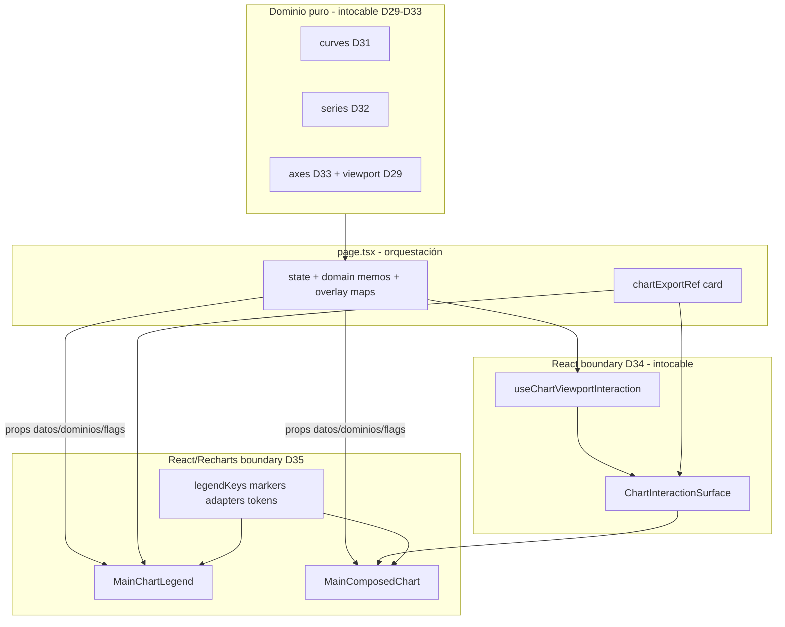

# D35.1 — Discovery: Inventario Graph Rendering (GRAPH-2e)

**Épica:** PROD-2E — Modularización del motor gráfico  
**Microfase:** D35.1 — Discovery (BUILD)  
**Fecha:** 2026-07-15  
**Modo:** Documentación únicamente — cero cambios en `src/**`, `scripts/**`, `package.json`  
**Prerrequisitos:** D34 CLOSED · GRAPH-2d CLOSED · D33 CLOSED · D32 CLOSED · D31 CLOSED · D29 CLOSED  

**Referencias:** [`PROJECT_STATUS_PROD_2E.md`](../PROJECT_STATUS_PROD_2E.md) §D34 handoff D35 · Plan técnico D35 aprobado · Revisión arquitectónica Ask (observaciones aceptadas incorporadas) · [`docs/D34.1-discovery-inventory.md`](D34.1-discovery-inventory.md)

---

## 1. Resumen ejecutivo

D35.1 confirma que la **capa React/Recharts de rendering del gráfico principal** (leyenda interactiva, `ResponsiveContainer` + `ComposedChart`, Tooltip custom, markers, adapters Scatter, legend keys, tokens de stroke) permanece **inline** en [`page.tsx`](../src/app/page.tsx). Los dominios curves/series/axes/viewport y el React boundary de interacción (`chart-interaction/`) ya están certificados (D29–D34).

La extracción D35.2–D35.3 consolidará **~520–600 LOC de boundary de rendering** desde `page.tsx` en `src/components/graph/chart-rendering/` (8 módulos). `MainComposedChart` y `MainChartLegend` son **React/Recharts boundary, no dominio** — reciben props ya calculadas desde `page.tsx`; no introducen sampling, axis math, viewport math ni series builders.

| Métrica | Valor |
|---------|-------|
| `page.tsx` baseline post-D34 | **~25.422** LOC (conteo líneas no vacías / archivo ~27.5k) |
| Inline rendering extraíble (main chart) | **~520–600** LOC |
| Símbolos / bloques MOVE certificados | **Helpers + legend JSX + ComposedChart tree + Tooltip** (§4.1) |
| Módulos destino | **8** (`types`, `legendKeys`, `scatterAdapters`, `markers`, `tokens`, `MainChartLegend`, `MainComposedChart`, `index`) |
| Barrel público congelado | **7 exports** |

**Certificación move-only:** Los símbolos MOVE son presentación Recharts / helpers de render. D35.2 puede iniciarse tras cierre de este inventario.

**Alcance superseded (D34.1 → D35):** El ítem de [`D34.1`](D34.1-discovery-inventory.md) §3.3 «Ejes charts secundarios inline ~120–180 → D35» queda **superseded** por el handoff D34 y este inventario. Charts secundarios / SCI-40 **no forman parte de D35** — diferidos post-GRAPH-2e / ARCH-5 (§3.4).

---

## 2. Principios arquitectónicos obligatorios

### 2.1 React/Recharts boundary, no dominio

> **`chart-rendering` es un React/Recharts boundary, no un módulo de dominio.**

| Regla | Detalle |
|-------|---------|
| **Sin matemática de dominio** | Prohibido sampling, axis math, viewport math, stats o series builders en `chart-rendering/**` |
| **Solo props calculadas** | El boundary lee props ya derivadas en `page.tsx` (`chartTheme`, domains, series lists, overlay maps, flags) |
| **Tema** | `getChartTheme` permanece cableado en page; se pasa el valor `chartTheme` como prop |
| **Interaction intocable** | `ChartInteractionSurface` + `useChartViewportInteraction` (API Freeze D34) envuelven el chart desde page; rendering es **hijo**, no re-envuelve ni importa interaction |
| **Domains intocables** | `@/lib/graph/{viewport,curves,series,axes}` + `publication-presets` — API Freeze D29–D33 |
| **Estado en page** | `useState` / orquestación / `useMemo` de análisis y dominios **permanecen** en `page.tsx` (patrón D31–D34) |

### 2.2 Separación dominio / interaction / rendering



### 2.3 Move-Only Policy (épica)

Toda extracción desde `page.tsx` es **move-only**: mismos inputs, mismos outputs, comportamiento idéntico al estado certificado D34. Sin optimizaciones, sin refactors oportunistas, sin cambios de layers Recharts.

### 2.4 API Freeze vigente D29–D34 (intocable en D35)

| Capa | Freeze |
|------|--------|
| D29 `viewport.ts` | SSOT intocable |
| D30 `publication-presets/` + VGB D25.4 | Intocable |
| D31 `curves/` barrel | Intocable |
| D32 `series/` barrel | Intocable |
| D33 `axes/index.ts` | **6 líneas** `export *` congeladas |
| D34 `chart-interaction/index.ts` | **2 exports** congelados |
| `schemaVersion = 2`, fixtures golden | Intocables |

---

## 3. Frontera MOVE / STAY / SHARED / OUT OF SCOPE

### 3.1 IN SCOPE — MOVE (extracción → `chart-rendering/`)

| Categoría | Criterio |
|-----------|----------|
| Markers Scatter | `ScatterMarkerProps`, `renderMaximumMarker`, `renderMinimumMarker` |
| Legend key factories | `curveLegendKey`, `derivativeLegendKey`, `integralLegendKey`, `experimentalLegendKey`, `regressionLegendKey` |
| Scatter adapters | `getExperimentalPointReactKey`, `mapExperimentalScatterData` |
| Tokens stroke | `DERIVATIVE_STROKE_OPACITY`, `INTEGRAL_STROKE_OPACITY` |
| Legend chrome | JSX interactivo leyenda (~L23214–23382) |
| Pipeline Recharts principal | `ResponsiveContainer` + `ComposedChart` + grid/axes/tooltip/layers (~L23384–23741) |
| Tooltip custom | `content=` error-bar / outlier / default |

### 3.2 STAY — Permanece en `page.tsx`

| Categoría | Símbolos / líneas aprox. |
|-----------|--------------------------|
| Estado chart / leyenda | `chartData`, `hiddenLegendKeys`, `toggleLegendVisibility` |
| Listas / filtros orquestación | `activeCurves`, `derivativeCurves`, `integralCurves`, `visible*`, `experimentalSeries`, `regressionCurves` |
| Error bars domain | `errorBarSeries` (`buildErrorBarSeries` — series D32) |
| Overlay point memos | `intersectionChartPoints`, `criticalMax/MinChartPoints`, `rootChartPoints`, `outlierChartPoints` |
| Pass-through data / tema | `composedChartData`, `chartTheme` (`getChartTheme` en page) |
| Axis wiring | `useDualYAxis`, `*YAxisDomainForChart`, `xAxisDomain`, `usesLogX`/`usesLogY` |
| Interaction D34 | `interaction`, `ChartInteractionSurface` wrapping |
| Export | `chartExportRef` + card wrapper |
| UI reset viewport | Botón «Restablecer vista» → `interaction.resetVisibleRange` |
| Análisis científico | `criticalPoints`, `curveIntersections`, `detectExperimentalOutliers`, etc. |
| Aliases de modelo editor | `Curve`, `DerivativeCurve`, `IntegralCurve`, `RegressionCurve`, `OutlierMethod` (permanecen en page; boundary usa espejos estructurales — §5.2) |

### 3.3 SHARED STAY — formatters (page → props)

Usados por Tooltip del main chart **y** por SCI-40 / informes. **No se mueven**; se inyectan como props a `MainComposedChart`.

| Símbolo | Líneas aprox. | Prop en boundary |
|---------|---------------|------------------|
| `formatExperimentalStat` | ~1311 | `formatStat` |
| `getOutlierMethodLabel` | ~2558 | `getOutlierMethodLabel` |
| `formatOutlierScore` | ~2561 | `formatOutlierScore` |
| `outlierMethod` (estado) | ~15318 | `outlierMethod` |

### 3.4 OUT OF SCOPE

| Bloque | Motivo |
|--------|--------|
| **Charts secundarios / ejes SCI-40** (~120–180 LOC y JSX Recharts SCI-40) | **Superseded:** D34.1 §3.3 apuntaba a D35; handoff D34 + este inventario los diferirán a **post-GRAPH-2e / ARCH-5**. **No D35.** |
| SCI-40 `Scientific*` charts, QQ, `ReferenceLine` secundario | Deuda OPEN post-GRAPH-2e |
| Export capture (`toPng`/`toSvg`, `prepareChartExportVisibility`, …) | No es composición del plot principal |
| VGB previews + `publication-presets` internals | API Freeze D25.4 / stack paralelo |
| Domains `curves` / `series` / `axes` / `viewport` + `chart-interaction/**` | Ya certificados; intocables |
| F5F-BIS, sampleStep/SVG quality, SHIM-NL | Prep EXPORT-1 / post-GRAPH-3 |
| Optimizar `composedChartData` (passthrough) | Cambio de comportamiento / refactor |

**Wiring parent (no es import del boundary):** `ChartInteractionSurface` permanece en page como envoltorio de `MainComposedChart`. No forma parte de los imports de `chart-rendering/**`.

---

## 4. Matriz símbolo → destino

### 4.1 MOVE — tabla completa

| Símbolo | Archivo origen | Líneas aprox. | Dependencias | Clasificación | Destino D35.2 |
|---------|----------------|---------------|--------------|---------------|---------------|
| `ScatterMarkerProps` | `page.tsx` | 14851–14854 | none | **MOVE** | `markers.tsx` |
| `renderMaximumMarker` | `page.tsx` | 14856–14865 | CSS `--app-success` | **MOVE** | `markers.tsx` |
| `renderMinimumMarker` | `page.tsx` | 14867–14876 | CSS `--app-danger` | **MOVE** | `markers.tsx` |
| `curveLegendKey` | `page.tsx` | 15252 | none | **MOVE** + barrel | `legendKeys.ts` |
| `derivativeLegendKey` | `page.tsx` | 15253 | none | **MOVE** + barrel | `legendKeys.ts` |
| `integralLegendKey` | `page.tsx` | 15254 | none | **MOVE** + barrel | `legendKeys.ts` |
| `experimentalLegendKey` | `page.tsx` | 15255 | none | **MOVE** + barrel | `legendKeys.ts` |
| `regressionLegendKey` | `page.tsx` | 15256 | none | **MOVE** + barrel | `legendKeys.ts` |
| `getExperimentalPointReactKey` | `page.tsx` | 15258–15262 | coords | **MOVE** | `scatterAdapters.ts` |
| `mapExperimentalScatterData` | `page.tsx` | 15264–15271 | key helper | **MOVE** | `scatterAdapters.ts` |
| `DERIVATIVE_STROKE_OPACITY` | `page.tsx` | 15273 | none (`0.55`) | **MOVE** | `tokens.ts` |
| `INTEGRAL_STROKE_OPACITY` | `page.tsx` | 15274 | none (`0.5`) | **MOVE** | `tokens.ts` |
| Legend JSX | `page.tsx` | 23214–23382 | keys, toggle, lists, opacities | **MOVE** | `MainChartLegend.tsx` |
| `ResponsiveContainer` + `ComposedChart` tree | `page.tsx` | 23384–23741 | domains, theme, series, overlays, markers | **MOVE** | `MainComposedChart.tsx` |
| Custom `Tooltip` `content=` | `page.tsx` | 23428–23539 | theme, formatters SHARED | **MOVE** (JSX) | `MainComposedChart.tsx` |

**Nota legend keys:** También usados en filtros `visible*` de page (~L16652–16727, ~L19108). Tras D35.3 page los importa desde el barrel `@/components/graph/chart-rendering`.

**LOC MOVE estimada:** ~520–600.

### 4.2 Certificación move-only por categoría

| Categoría | Hooks React nuevos en boundary | Recharts | Math dominio | Veredicto |
|-----------|--------------------------------|----------|--------------|-----------|
| Markers / adapters / keys / tokens | no (funciones puras / shapes) | markers SVG | no | **MOVE** ✓ |
| `MainChartLegend` | no (presentacional) | no | no | **MOVE** ✓ |
| `MainComposedChart` | no (presentacional) | **sí** | no (consume props) | **MOVE** ✓ |
| Overlay memos / axes memos / state | `useMemo`/`useState` en page | — | sí (en domains) | **STAY** ✓ |

---

## 5. Estructura objetivo y tipos estructurales

### 5.1 Archivos y responsabilidades

```text
src/components/graph/chart-rendering/
  types.ts                 ← props internas (espejos estructurales; no barrel)
  legendKeys.ts            ← 5 factories de keys (MOVE + export barrel)
  scatterAdapters.ts       ← getExperimentalPointReactKey + mapExperimentalScatterData
  markers.tsx              ← ScatterMarkerProps + renderMaximum/MinimumMarker
  tokens.ts                ← DERIVATIVE_STROKE_OPACITY, INTEGRAL_STROKE_OPACITY
  MainChartLegend.tsx      ← JSX leyenda
  MainComposedChart.tsx    ← ResponsiveContainer + ComposedChart + Tooltip + layers
  index.ts                 ← Barrel API Freeze (7 exports)
```

| Archivo | Responsabilidad | Contenido move-only |
|---------|-----------------|---------------------|
| **`types.ts`** | Contratos de props del boundary | Espejos estructurales (§5.2); **no** export barrel |
| **`legendKeys.ts`** | Identidades de leyenda | 5 factories idénticas a page |
| **`scatterAdapters.ts`** | Adapter datos Scatter | key + map `pointKey` |
| **`markers.tsx`** | Shapes max/min | polígonos SVG congelados |
| **`tokens.ts`** | Opacidades stroke | `0.55` / `0.5` |
| **`MainChartLegend.tsx`** | Chrome leyenda | JSX L23214–23382 |
| **`MainComposedChart.tsx`** | Pipeline plot | JSX L23384–23741 + Tooltip |
| **`index.ts`** | API pública | 7 exports (§6) |

`"use client"` obligatorio en componentes/markers con JSX (paridad D34).

**No crear en D35.2:** gates/scripts (D35.4), subdominios SCI-40, ni `lib/graph/rendering/`.

### 5.2 Política de tipos estructurales del boundary (congelada)

| Regla | Decisión |
|-------|----------|
| Aliases editor en page (`Curve`, `DerivativeCurve`, `IntegralCurve`, `RegressionCurve`, `OutlierMethod`, …) | **STAY** en `page.tsx` — **no** se mueven |
| `types.ts` del boundary | Define **espejos estructurales locales** compatibles con las shapes que page pasa como props |
| Import value desde `@/app/*` | **Prohibido** |
| Type-only desde `@/lib/graph/series` | **Permitido expresamente** para `ExperimentalSeries` y/o `ErrorBarSeries` si tipar props lo requiere |
| Type-only / value desde axes, viewport, curves | **Prohibido** (cálculo y tipos de dominio no se re-centralizan en rendering; `chartTheme` llega como valor prop) |
| Tipos al barrel | **No** — internos (paridad D34) |

---

## 6. Barrel API Freeze (D35)

Archivo `src/components/graph/chart-rendering/index.ts` — **fuente congelada exacta:**

```typescript
export {
  curveLegendKey,
  derivativeLegendKey,
  integralLegendKey,
  experimentalLegendKey,
  regressionLegendKey,
} from "./legendKeys";
export { MainChartLegend } from "./MainChartLegend";
export { MainComposedChart } from "./MainComposedChart";
```

| Export | Motivo público |
|--------|----------------|
| 5× `*LegendKey` | Page orquesta `visible*` / toggles / `hasLegendItems` |
| `MainChartLegend` | Wiring UI leyenda |
| `MainComposedChart` | Wiring plot |

**Internos (no barrel):** `types`, markers, scatterAdapters, tokens.  
**Prohibido:** deep imports `@/components/graph/chart-rendering/...` desde `page.tsx`.  
**Preservar sin tocar:** barrels D33 axes (6 líneas) y D34 interaction (2 exports).

---

## 7. Move Policy definitiva

1. Cortar/pegar byte-fiel desde `page.tsx` → módulos destino; solo ajustes mecánicos: imports, `"use client"`, props en vez de closures de scope.
2. Prohibido: renombrar props Recharts, reordenar layers, cambiar classNames/stroke/dasharray/`r`/colores, alterar keys React, fusionar/dividir series, «limpiar» `composedChartData`.
3. Prohibido: modificar `src/lib/graph/**`, `chart-interaction/**`, VGB, fixtures, `schemaVersion`.
4. Formatters SHARED permanecen en page; se pasan por props (no se mueven, no se duplican).
5. `ChartInteractionSurface` sigue envolviendo `MainComposedChart` en page (rendering no re-envuelve interaction).
6. `chartExportRef` permanece en el `div` card de page; legend + surface quedan **dentro** de ese card como hoy.
7. Tipos de modelo editor STAY en page; boundary usa espejos estructurales (§5.2).

---

## 8. Política de imports (congelada)

### 8.1 Permitidos en `chart-rendering/**`

| Origen | Uso |
|--------|------|
| `react`, `react/*` | Tipado / JSX |
| `recharts`, `recharts/*` | Primitivas del plot principal |
| Imports relativos internos | `./types`, `./legendKeys`, `./markers`, etc. |
| `@/lib/graph/series` | **Solo type-only** (`import type`) para `ExperimentalSeries` y/o `ErrorBarSeries` si tipar props lo requiere |

### 8.2 Prohibidos en `chart-rendering/**`

| Origen | Motivo |
|--------|--------|
| `src/app/*`, `@/app/*` | Sin acoplamiento a boundary app |
| `@/components/graph/chart-interaction` | Direccionalidad: page compone surface → chart |
| `@/lib/graph/axes` (value o type para calcular tema/dominios) | Tema/dominios llegan como props; no llamar `getChartTheme` / adaptadores |
| `@/lib/graph/viewport` | Dominio D29 — intocable / no rendering |
| `@/lib/graph/curves` | Dominio D31 — no builders/sampling en boundary |
| `@/lib/graph/series` **value** (`buildErrorBarSeries`, etc.) | Solo type-only permitido (§8.1) |
| `@/lib/graph/publication-presets`, `@/lib/visualGraphBuilder` | VGB API Freeze |
| `html-to-image` / helpers export | Fuera alcance rendering |
| Cualquier otro paquete/módulo no listado en §8.1 | Gate `governance.rendering.allowedImportsOnly` (D35.4) |

### 8.3 Consumidor `page.tsx` post-D35.3

| Import permitido | Prohibido |
|------------------|-----------|
| `@/components/graph/chart-rendering` (único para rendering) | Deep import `chart-rendering/...` |
| Definiciones inline de helpers MOVE (§4.1) | Tras wiring — denylist governor (§10) |
| `@/components/graph/chart-interaction` | Sin cambio D34 |
| `@/lib/graph/axes` (useMemos dominio) | Sin cambio D33 |

**Nota recharts en page:** SCI-40 / charts secundarios siguen usando Recharts en page (OUT D35). Auditar antes de eliminar el import `recharts` de `page.tsx`; el main chart deja de necesitar `ComposedChart` inline.

---

## 9. Estrategia de wiring (D35.3)

Concepto post-extracción (page conserva card + surface):

```tsx
<div ref={chartExportRef} className={...}>
  <MainChartLegend
    hasLegendItems={hasLegendItems}
    activeCurves={activeCurves}
    derivativeCurves={derivativeCurves}
    integralCurves={integralCurves}
    experimentalSeries={experimentalSeries}
    regressionCurves={regressionCurves}
    hiddenLegendKeys={hiddenLegendKeys}
    onToggleLegend={toggleLegendVisibility}
  />
  <ChartInteractionSurface surfaceProps={interaction.surfaceProps}>
    <MainComposedChart
      data={composedChartData}
      chartTheme={chartTheme}
      usesLogX={usesLogX}
      usesLogY={usesLogY}
      useDualYAxis={useDualYAxis}
      xAxisDomain={xAxisDomain}
      mathYAxisDomainForChart={mathYAxisDomainForChart}
      experimentalYAxisDomainForChart={experimentalYAxisDomainForChart}
      yAxisDomainForChart={yAxisDomainForChart}
      activeCurves={activeCurves}
      derivativeCurves={derivativeCurves}
      integralCurves={integralCurves}
      visibleExperimentalSeries={visibleExperimentalSeries}
      errorBarSeries={errorBarSeries}
      regressionCurves={regressionCurves}
      hiddenLegendKeys={hiddenLegendKeys}
      showErrorBars={showErrorBars}
      showIntersections={showIntersections}
      showCriticalPoints={showCriticalPoints}
      showRoots={showRoots}
      showOutliers={showOutliers}
      intersectionChartPoints={intersectionChartPoints}
      criticalMaxChartPoints={criticalMaxChartPoints}
      criticalMinChartPoints={criticalMinChartPoints}
      rootChartPoints={rootChartPoints}
      outlierChartPoints={outlierChartPoints}
      outlierMethod={outlierMethod}
      formatStat={formatExperimentalStat}
      formatOutlierScore={formatOutlierScore}
      getOutlierMethodLabel={getOutlierMethodLabel}
    />
  </ChartInteractionSurface>
</div>
```

- Page importa keys + componentes **solo** desde `@/components/graph/chart-rendering`.
- Recharts del main chart se importa **solo** dentro de `MainComposedChart.tsx`.
- Prop surface grande = mapeo 1:1 de closures del JSX actual (un salto); no capas intermedias.

**D35.2:** crear módulos move-only **sin** wiring page (page intacta; código nuevo aún no referenciado).

---

## 10. Unit Gate (propuesta D35.4)

| Artefacto | Path / script |
|-----------|----------------|
| Cases | `scripts/lib/graph-rendering-gate.cases.ts` |
| Runner | `scripts/validate-graph-rendering-unit.ts` |
| npm | `validate:graph-rendering-unit` |

**Checks unitarios (mirror D34 + allowlist):**

- Archivos requeridos existen bajo `chart-rendering/`
- `assertBarrelApiFreeze` — 7 exports + fuente `index.ts` exacta (§6)
- Markers: polígonos fills `--app-success` / `--app-danger`; offsets congelados (±6, ±5, ±4)
- Tokens opacities `0.55` / `0.5` congelados
- `legendKeys`: formatos `curve:N`, `derivative:N`, `integral:N`, `exp:id`, `regression:id`
- `mapExperimentalScatterData` añade `pointKey` determinista
- `governance.rendering.noAppImports`
- `governance.rendering.noChartInteractionImport`
- `governance.rendering.allowedImportsOnly` (§8.1)
- Sin matemática viewport/axis (`clampVisibleXRange`, `computeWheelZoom*`, `adaptYDomain*`, `getChartTheme(`, builders curves/series value)
- Tipos no exportados desde barrel

---

## 11. Umbrella Gate (propuesta D35.4)

| Artefacto | Path / script |
|-----------|----------------|
| Governor | `scripts/validate-prod2e-d35-rendering-gate.ts` |
| npm | `validate:prod2e-d35-rendering-gate` |

### 11.1 Cadena obligatoria (sin versiones reducidas)

Ejecutar **íntegramente** (paridad package.json D34; sin nest execSync Windows; sin subtítulo «o al menos»):

1. Governor D35 (existencia módulo, barrel freeze rendering, asserts page §11.2, freeze axes + interaction)
2. **`validate:prod2e-d34-interaction-gate` completo** — script npm existente tal cual (cadena D34→D33→tsc→units interaction/axes→viewport→D29–D32→C8). **Prohibido** sustituir por solo governor D34 + axes freeze.
3. `npx tsc --noEmit` (si no ya cubierto por la cadena; no omitir verificación de tipado del wiring D35)
4. `validate:graph-rendering-unit`
5. Resto de regresión ya incluida vía paso 2; reforzar units rendering + confirmar C8 en resumen umbrella D35

### 11.2 Governor `page.tsx` — asserts duros (congelados)

| Assert | Criterio |
|--------|----------|
| Usa boundary | `page.tsx` **contiene** `MainComposedChart` |
| Sin ComposedChart inline | `page.tsx` **no contiene** el JSX `<ComposedChart` |
| Barrel only | Import desde `@/components/graph/chart-rendering`; sin deep import |
| Denylist MOVE completa | Ausencia inline de: `renderMaximumMarker`, `renderMinimumMarker`, `mapExperimentalScatterData`, `getExperimentalPointReactKey`, `DERIVATIVE_STROKE_OPACITY`, `INTEGRAL_STROKE_OPACITY`, `curveLegendKey` / `derivativeLegendKey` / `integralLegendKey` / `experimentalLegendKey` / `regressionLegendKey` como **definiciones locales** (tras wiring deben venir del barrel; el uso vía import está permitido) |

**Implementación denylist keys:** Preferir detectar declaraciones locales (`const curveLegendKey =`) y definiciones de markers/adapters/tokens; no fallar por usos importados del barrel.

**Freeze preservado:** texto exacto `axes/index.ts` (6 líneas) + `chart-interaction/index.ts` (2 líneas) + `chart-rendering/index.ts` (7 exports).

---

## 12. Smoke Tests (D35.5) — paridad D34

Mantener **numeración y semántica certificada de D34** (acta D34.5 / `PROJECT_STATUS_PROD_2E.md`):

| ID | Caso (semántica D34) | Qué valida en D35 |
|----|----------------------|-------------------|
| **S1** | Render gráfico principal | Layers Line + ejes + grid vía `MainComposedChart`; incluye sanity de `chartTheme` / themeMode del editor |
| **S2** | Wheel zoom | Interaction + domains + re-render boundary |
| **S3** | Pan | Idem |
| **S4** | Restablecer vista | Reset + chart estable |
| **S5** | Escalas log/linear X/Y | Props scale/domain |
| **S6** | Dataset experimental | Error bars + outliers + tooltips |
| **S7** | **Publication Presets (VGB · D30)** | Regresión capa cerrada D30 — **no** reinterpretar como `chartTheme` del editor |
| **S8** | Curves + Series + viewport | Curvas + derivadas/integrales + regresiones + legend toggle + interacción OK |

Ejecución: `npm run dev` + browser; **sin cambios de producto** tras gates PASS.

---

## 13. Criterios de aceptación

### 13.1 CA-D35.1 (esta microfase)

| ID | Criterio | Resultado |
|----|----------|-----------|
| CA-D35.1-01 | Inventario completo (símbolos, destinos, LOC) | **PASS** |
| CA-D35.1-02 | Matriz MOVE / STAY / SHARED / OUT cerrada | **PASS** |
| CA-D35.1-03 | Principios boundary + move-only + freeze D29–D34 documentados | **PASS** |
| CA-D35.1-04 | Estructura 8 módulos + Barrel 7 exports | **PASS** |
| CA-D35.1-05 | Política imports allow/deny + tipos estructurales | **PASS** |
| CA-D35.1-06 | Umbrella: cadena D34 completa + asserts ComposedChart | **PASS** |
| CA-D35.1-07 | Smoke S1–S8 semántica D34 (S7 = VGB presets) | **PASS** |
| CA-D35.1-08 | Nota superseded charts secundarios D34.1 | **PASS** |
| CA-D35.1-09 | Revisión arquitectónica Ask documentada (§15) | **PASS** |
| CA-D35.1-10 | Cero cambios `src/**` / `scripts/**` / `package.json` | **PASS** |

**Total CA-D35.1: 10/10 PASS**

### 13.2 CA-D35 (fase completa — objetivo D35.6)

| ID | Criterio |
|----|----------|
| **CA-D35-01** | Boundary creada en `src/components/graph/chart-rendering/` |
| **CA-D35-02** | Move-Only respetado (símbolos MOVE §4.1; sin math de dominio nueva) |
| **CA-D35-03** | API Freeze D35 (7 exports barrel; sin deep imports) |
| **CA-D35-04** | API Freeze D33 (axes) y D34 (interaction) preservados |
| **CA-D35-05** | Separación dominio / interaction / rendering respetada |
| **CA-D35-06** | Unit gate PASS |
| **CA-D35-07** | Umbrella D35 PASS (incl. **cadena completa** `validate:prod2e-d34-interaction-gate` + tsc + C8) |
| **CA-D35-08** | Smoke S1–S8 PASS (semántica D34) |
| **CA-D35-09** | Zero regresiones comportamiento vs D34 certificado |
| **CA-D35-10** | Estado viewport + domain memos + export ref permanecen en `page.tsx` |
| **CA-D35-11** | SCI-40 / F5F-BIS / VGB / export capture no modificados |
| **CA-D35-12** | Acta D35.6 + deuda `RENDERING-INLINE` CLOSED + handoff D36 |

---

## 14. Riesgos y mitigaciones

| ID | Riesgo | Severidad | Mitigación |
|----|--------|-----------|------------|
| R-D35-01 | Omisión de una layer Recharts al cablear props | Alta | Checklist L23384–23741; smoke S6/S8 |
| R-D35-02 | Legend keys divergentes page vs module | Media | Un solo `legendKeys.ts` + barrel; page importa de ahí |
| R-D35-03 | Borrar import `recharts` prematuro (SCI-40) | Media | Auditar usos secundarios antes de limpiar |
| R-D35-04 | Tooltip rompe formatters | Media | Inyectar 3 formatters + `outlierMethod` (SHARED STAY) |
| R-D35-05 | Umbrella debilitado («solo governor D34») | Alta | Cadena íntegra `validate:prod2e-d34-interaction-gate` (§11.1) |
| R-D35-06 | Governor falso negativo/positivo en `ComposedChart` | Alta | Asserts duros: `MainComposedChart` presente + `<ComposedChart` ausente (§11.2) |
| R-D35-07 | Scope creep charts secundarios vía D34.1 | Media | OUT superseded (§1, §3.4); CA-D35-11 |
| R-D35-08 | Types importados desde `@/app` o MOVE ilegal de aliases | Media | Política §5.2 + gate `noAppImports` |
| R-D35-09 | Import value de series/axes/curves en boundary | Alta | Allowlist §8 + `allowedImportsOnly` |
| R-D35-10 | Interaction / axes freeze roto | Alta | Freeze texto barrels en umbrella |
| R-D35-11 | `"use client"` omission | Baja | Directiva en componentes JSX |

---

## 15. Revisión arquitectónica (Ask) — incorporada pre-BUILD

El plan técnico D35 fue revisado en modo **Ask** por un revisor arquitectónico antes de autorizar BUILD D35.1.

| Observación aceptada | Severidad | Incorporación en este inventario |
|----------------------|-----------|----------------------------------|
| Cadena umbrella D34 completa (sin «o al menos») | Alta | §11.1 |
| Governor: `MainComposedChart` + ausencia `<ComposedChart` | Alta | §11.2 |
| Denylist completa helpers/tokens MOVE | Baja→Media | §11.2 denylist |
| Allowlist de imports congelada | Media | §8 |
| Tipos estructurales del boundary | Media | §5.2 |
| Charts secundarios D34.1 superseded / fuera D35 | Media | §1, §3.4 |
| Smoke S7 = Publication Presets VGB (paridad D34) | Media | §12 |

**Alcance de la microfase:** no modificado. Sin rearquitectura, sin optimizaciones, sin ampliar IN SCOPE más allá del gráfico principal.

---

## 16. Decisiones congeladas

1. Destino: **`src/components/graph/chart-rendering/`** (React/Recharts boundary).
2. Extracción: legend + `MainComposedChart` + helpers/tokens/markers/adapters.
3. Overlay point **memos** y formatters SHARED: **STAY** (props).
4. Barrel: **7 exports** (§6).
5. Interaction envuelve chart desde page; rendering **no** importa `chart-interaction`.
6. SCI-40 / export / VGB / charts secundarios: **fuera de D35**.
7. Umbrella: **cadena completa** `validate:prod2e-d34-interaction-gate`.
8. Smoke: semántica **S1–S8 D34** (S7 = VGB publication presets).
9. Types: espejos estructurales locales; type-only series opcional; aliases editor STAY en page.

---

## 17. Cronología D35

| Microfase | Alcance | Estado |
|-----------|---------|--------|
| **D35.1** | Discovery — inventario, imports, freeze, gates/smoke borrador, revisión Ask | **COMPLETE** |
| D35.2 | Build `chart-rendering/**` move-only (sin wiring page) | Pendiente |
| D35.3 | Barrel + wiring `page.tsx` + import legend keys | Pendiente |
| D35.4 | Gates unit + umbrella | Pendiente |
| D35.5 | Smoke S1–S8 + regresión | Pendiente |
| D35.6 | Acta `PROJECT_STATUS_PROD_2E.md` + cerrar `RENDERING-INLINE` | Pendiente |

---

## 18. Handoff D35.2

Prerrequisitos cumplidos:

- [x] Inventario MOVE / STAY / SHARED / OUT OF SCOPE cerrado (§3–§4)
- [x] Principio React/Recharts boundary congelado (§2)
- [x] Estructura 8 módulos `chart-rendering/` definida (§5)
- [x] Política tipos estructurales (§5.2)
- [x] Barrel API Freeze 7 exports (§6)
- [x] Move Policy definitiva (§7)
- [x] Política imports allow/deny (§8)
- [x] Wiring conceptual (§9)
- [x] Unit + Umbrella (cadena D34 completa + asserts) (§10–§11)
- [x] Smoke S1–S8 semántica D34 (§12)
- [x] CA-D35 fase + revisión Ask (§13, §15)
- [x] Charts secundarios D34.1 marcados superseded (§3.4)
- [x] Cero cambios de código en D35.1

**Next BUILD:** D35.2 — crear `src/components/graph/chart-rendering/{types,legendKeys,scatterAdapters,markers,tokens,MainChartLegend,MainComposedChart,index}.ts(x)` (move-only; sin wiring `page.tsx`).

---

*Fin D35.1 — Discovery GRAPH-2e Rendering. Documento oficial base para D35.2–D35.6.*
