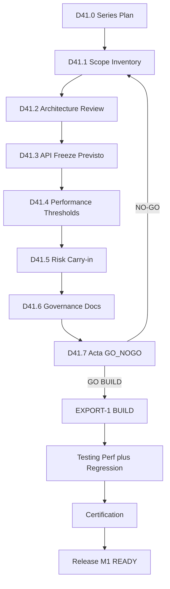

# D41.0 — Series Plan · EXPORT-1 Discovery (PROD-3)

**Épica:** PROD-3 — EXPORT-1 Discovery  
**Microfase:** D41.0 — Series Plan  
**Fecha:** 2026-07-17  
**Estado:** **D41.0 = OFFICIAL** · EXPORT-1 DISCOVERY = PLANNED  
**Modo:** Documental — create-only · cero cambios en `src/**` · `scripts/**` · tests · barrels · APIs · Freeze · Roadmap · Governance · Quality Gates · `PROJECT_STATUS_*` · docs históricas · D38.* · D39.* · D40.*  
**Prerrequisitos:** D40 OFFICIAL / CERTIFIED · FREEZE_PLANNING_TRACK = CERTIFIED · Execution Baseline READY · RN-D40 vigente · Plan D41 aprobado  

**Autoridad documental (SSOT — cita sin redefinir):**

| Documento | Rol |
|-----------|-----|
| [`docs/D38.2-architecture-freeze.md`](D38.2-architecture-freeze.md) | PRIMARY SSOT — Architecture |
| [`docs/D38.4-roadmap-final.md`](D38.4-roadmap-final.md) | PRIMARY SSOT — Roadmap OFFICIAL |
| [`docs/D38.3-governance.md`](D38.3-governance.md) | Governance OFFICIAL |
| [`docs/D38.5-quality-gates.md`](D38.5-quality-gates.md) | QG-PROD3 v1.0 OFFICIAL |
| [`docs/D39.4-execution-governance.md`](D39.4-execution-governance.md) | Execution Governance · Discovery §5.1 |
| [`docs/D39.3-risk-register.md`](D39.3-risk-register.md) | Risk Register operativo |
| [`docs/D40.6-resolution-note.md`](D40.6-resolution-note.md) | RN-D40 · handoff EXPORT-1 Discovery |
| [`PROJECT_STATUS_PROD_3.md`](../PROJECT_STATUS_PROD_3.md) | STATUS vigente (append-only; no modificado aquí) |

**Authority Limits:** D41 no modifica Freeze / Roadmap / Governance / QG / API / SSOT.  
Toda desviación requiere Amendment D38.x o Resolution Note (D38.3).

**D41.0 no reemplaza ningún SSOT.** No redefine Freeze, Roadmap, Governance ni Quality Gates. No autoriza BUILD. No cierra la épica PROD-3. No inicia D41.1–D41.7.

**Declaración de solo documentación:**

- Sin cambios en `src/**` · `scripts/**` · tests · `package.json`
- Sin cambios en Architecture Freeze / Governance / Roadmap Official / Quality Gates (D38.*)
- Sin cambios en serie D37 · D39 · D40
- Sin cambios en `PROJECT_STATUS_*` · docs históricas
- Sin ejecución de scripts · BUILD · tests · commits · push
- Sin inicio de D41.1–D41.7
- **Sin autorización para BUILD**
- Create-only: este documento

**Entradas (solo lectura):** D37.* · D38.1–D38.5 · D39.1–D39.4 · D40.1–D40.6 · `PROJECT_STATUS_PROD_3.md` · Plan D41 aprobado

**Declaración:**

```text
PROD-3 = OPEN
D41.0 = OFFICIAL
EXPORT-1 DISCOVERY = PLANNED
NO BUILD AUTHORIZED BY D41.0
NO AUTHORITY OVER FREEZE / ROADMAP / GOVERNANCE / QG / API / SSOT
READY FOR D41.1
```

---

## Estado de partida (inmutable)

```text
FREEZE_PLANNING_TRACK = CERTIFIED          (D40)
PROD-3 = OPEN
ROADMAP = OFFICIAL                         (D38.4)
ARCHITECTURE FREEZE = COMPLETE             (D38.2 PRIMARY SSOT)
GOVERNANCE = OFFICIAL                      (D38.3)
QG-PROD3 v1.0 = OFFICIAL                   (D38.5)
EXECUTION BASELINE = READY                 (D39)
AMD-CAND-01 RESOLVED via RN-D40
READY FOR EXPORT-1 DISCOVERY
NO BUILD AUTHORIZED BY D40
```

**SSOT vigente (cita sin redefinir):**

- Architecture: [`docs/D38.2-architecture-freeze.md`](D38.2-architecture-freeze.md)
- Roadmap: [`docs/D38.4-roadmap-final.md`](D38.4-roadmap-final.md)
- Governance: [`docs/D38.3-governance.md`](D38.3-governance.md)
- Quality Gates: [`docs/D38.5-quality-gates.md`](D38.5-quality-gates.md)
- Execution rules: [`docs/D39.4-execution-governance.md`](D39.4-execution-governance.md) §5.1 Discovery
- Handoff: [`docs/D40.6-resolution-note.md`](D40.6-resolution-note.md) · [`PROJECT_STATUS_PROD_3.md`](../PROJECT_STATUS_PROD_3.md) §D40
- Risks: [`docs/D39.3-risk-register.md`](D39.3-risk-register.md)

**Decisión de numeración (RN-D40 §4):** no reutilizar D39 para EXPORT-1. Esta serie se denomina oficialmente **D41 — EXPORT-1 Discovery**. La numeración de microfases BUILD se asigna solo en el acta final D41.7 (GO BUILD).

---

## 1. Objetivos generales

1. Confirmar el alcance EXPORT-1 frente a D38.2 Scope / Out of Scope / Ownership **sin ampliarlo**.
2. Inventariar la superficie export existente (`page.tsx` handlers · `html-to-image` · carry-ins) en modo read-only.
3. Cumplir gates Discovery de QG-PROD3 v1.0: **Architecture · Documentation · Governance**.
4. Fijar umbrales Performance de EXPORT-1 (cierra **EXEC-P3-04** para esta épica).
5. Disponer carry-ins EXPORT-1-01 / EXPORT-1-02 / SHIM-NL y evaluar riesgos diferidos (R-F1, R-I1, R-I2, R-A1).
6. Congelar el plan de ejecución BUILD (microfases + numeración) — **Plan Freeze de épica**, no reabrir D37.
7. Emitir acta Discovery con decisión **GO / NO-GO BUILD** explícita (única vía de autorización BUILD).

| D41 hace | D41 NO hace |
| -------- | ----------- |
| Discovery documental create-only | Código / scripts / tests / BUILD |
| Cita SSOT sin redefinir | Amendment ni cambios a D38.* |
| Fija umbrales Performance de épica | Inventa gates nuevos fuera de QG-PROD3 v1.0 |
| Asigna numeración BUILD en acta | Reutiliza etiqueta D39 |
| Mantiene PROD-3 = OPEN | Cierra la épica PROD-3 |
| Prepara M1 (EXPORT-1 READY) | Declara M1 READY |

---

## 2. Authority Limits (No Authority)

D41 es Discovery documental de épica. **No posee autoridad** para modificar, reinterpretar ni sustituir el corpus normativo vigente.

**D41 no posee autoridad para modificar:**

| Artefacto | Autoridad vigente | Rol de D41 |
|-----------|-------------------|------------|
| Architecture Freeze | D38.2 PRIMARY SSOT | Citar · verificar cumplimiento · **no editar** |
| Roadmap | D38.4 PRIMARY SSOT | Seguir orden EXPORT-1…RC-1 · **no reordenar** |
| Governance | D38.3 OFFICIAL | Aplicar reglas · **no redefinir** |
| Quality Gates | D38.5 QG-PROD3 v1.0 | Aplicar gates Discovery · **no inventar gates** |
| API Freeze vigente | D25–D35 · VGB-R1 | Prever invariantes · **no alterar contratos** |
| SSOT / STATUS histórico | D38.* · D37–D40 · pre-§D38 | Create-only D41.* · append-only §D41 en acta · **sin reescritura** |

**Límites operativos adicionales:**

- D41 **no** autoriza BUILD excepto el acta D41.7 con `GO BUILD` explícito.
- D41 **no** cierra la épica PROD-3 (`PROD-3 = OPEN` obligatorio).
- D41.* **nunca** prevalece sobre D38.* ante conflicto.
- D41 **no** emite Architecture Freeze ni Plan Freeze de pista (D37/D38); solo Plan Freeze de **épica BUILD** en D41.7, subordinado al Freeze.

**Desviación:**

> Toda desviación respecto de Architecture Freeze, Roadmap, Governance, Quality Gates, API Freeze o SSOT requiere el mecanismo formal definido por D38.3: **Amendment D38.x** (cambio de alcance/orden/gates/API/ownership) o **Resolution Note** (aclaración sin cambio de alcance), según corresponda. Sin ese instrumento, la desviación es **FAIL** y bloquea GO BUILD.

Declaración mandatoria en cada microfase D41.0–D41.7:

```text
NO AUTHORITY OVER FREEZE / ROADMAP / GOVERNANCE / QG / API / SSOT
DEVIATION REQUIRES D38 AMENDMENT OR RESOLUTION NOTE
```

---

## 3. Alcance (IN)

Heredado literal de D38.2 §6 / D38.4 §12 (sin ampliación):

| Ítem | Origen |
| ---- | ------ |
| VGB PNG alta resolución sobre handlers existentes | B-17 · S-EXPORT-HANDLERS |
| VGB SVG alta resolución / calidad vectorial | Carry-in **EXPORT-1-02** |
| Densidad/muestreo configurable (`sampleStep`) donde aplique | Carry-in **EXPORT-1-01** |
| Higiene SHIM-NL solo si el alcance EXPORT-1 lo exige | Carry-in **SHIM-NL** (condicional) |
| Confirmación Ownership: export handlers = sí; `page.tsx` = wiring mínimo; GRAPH barrels = no | D38.2 §11 |
| Umbrales Performance documentados | D38.5 §10 · EXEC-P3-04 |
| Plan BUILD acotado + GO/NO-GO | D39.4 §5.1 |

**Superficie de código a inventariar (solo lectura):** `src/app/page.tsx` (`captureChartAsPngDataUrl`, `exportChartPng`, `exportChartSvg`, `chartExportRef`); dependencia `html-to-image`. PDF (`handleExportScientificReportPdf`) y `.sgproj` quedan fuera de EXPORT-1 (EXPORT-2 / project).

---

## 4. Exclusiones (OUT — FAIL si se incluye)

Heredadas de D38.2 §7 (sin renegociación):

- SCI-40 / F5F-BIS (→ ARCH-5)
- EXPORT-2 PDF toggle-aware
- PROD-1B Import Report
- Split `visualGraphBuilder.ts`
- Refactors generales de `page.tsx` fuera de superficie export
- Modificar barrels GRAPH D29–D35
- `schemaVersion` bump / cloud / PROD-3A
- Reabrir PROD-2E
- Reescribir docs históricas / D37–D40 certificados
- Tratar IN-TREE scatter-pro / prod3 como BUILD #1
- L-D23-2 (→ QA-2)
- Cualquier cambio en `src/**` · `scripts/**` · tests durante D41

---

## 5. Entregables de la serie D41

| ID | Entregable | Microfase |
| -- | ---------- | --------- |
| E-01 | Inventario export + matriz alcance IN/OUT confirmada | D41.1 |
| E-02 | Architecture Review PASS (vs D38.2) | D41.2 |
| E-03 | API Freeze previsto (contratos intocables + superficie BUILD) | D41.3 |
| E-04 | Umbrales Performance EXPORT-1 documentados | D41.4 |
| E-05 | Disposición carry-ins + evaluación riesgos diferidos | D41.5 |
| E-06 | Governance + Documentation Review PASS | D41.6 |
| E-07 | Plan Freeze BUILD (microfases + numeración) | D41.7 |
| E-08 | Acta Discovery · GO/NO-GO BUILD explícito | D41.7 |
| E-09 | Append STATUS §D41 (solo si GO o cierre documental) | D41.7 |
| E-10 | Definition of Success = PASS (checklist acta) | D41.7 |

**Modo de serie:** documental · create-only en `docs/D41.*` · append-only STATUS en D41.7 · **cero** `src/**`.

---

## 6. Microfases (estructura completa — D41.1–D41.7 no materializados)

```text
D41.0  Series Plan (este documento — OFFICIAL)
  ↓
D41.1  Scope Confirmation & Export Inventory
  ↓
D41.2  Architecture Review
  ↓
D41.3  API Freeze Previsto
  ↓
D41.4  Performance Thresholds & Validation Strategy
  ↓
D41.5  Risk & Carry-in Resolution
  ↓
D41.6  Governance & Documentation Review
  ↓
D41.7  BUILD Plan Freeze + Discovery Acta (GO/NO-GO)
  ↓
[si GO]  EXPORT-1 BUILD (numeración asignada en acta; ≠ D39)
```

### D41.0 — Series Plan (este documento)

- Documento oficial create-only: [`docs/D41.0-export1-discovery-plan.md`](D41.0-export1-discovery-plan.md).
- **No** inicia D41.1–D41.7.
- **No** autoriza BUILD.
- **No** modifica STATUS ni SSOT.

### D41.1 — Scope Confirmation & Export Inventory

**Objetivo:** confirmar alcance vs Freeze; inventario read-only de handlers/export surface.

**Salidas:** matriz IN/OUT; mapa símbolos `page.tsx`; baseline B-17 citado; exclusiones FAIL listadas.

**CA tema:** alcance = D38.2 §6 literal · OUT = §7 · sin `src` changes.

### D41.2 — Architecture Review

**Objetivo:** Architecture Gate Discovery (D38.5 §7).

**Salidas:** checklist Ownership §11; plan move-only acotado (si procede) **solo como diseño documental**; rechazo explícito de SCI-40/F5F/split VGB/barrels.

**CA tema:** Ownership respetado · capas GRAPH intactas · sin Amendment requerido.

### D41.3 — API Freeze Previsto

**Objetivo:** documentar contratos intocables para BUILD (API Freeze Gate se ejecuta en BUILD; Discovery solo **prevé**).

**Salidas:** tabla de invariantes — schemaVersion 2 · VGB-R1 efímeros · barrels D29–D35 · exports GRAPH · sin breaking public API; lista de superficies permitidas (handlers export / wiring mínimo).

**CA tema:** sin propuesta de schema bump · sin exports nuevos en barrels · alineado a `PROJECT_DISCOVERY_PROD_2E` §6.

### D41.4 — Performance Thresholds & Validation Strategy

**Objetivo:** fijar umbrales Performance EXPORT-1 (cierra EXEC-P3-04 para la épica); definir estrategia de validación Testing.

**Salidas:** umbrales PNG/SVG (tiempo, memoria, DPI/calidad según evidencia baseline); plan de medición en Testing; dependencia de Regression Gate (`validate:prod2e-gate`).

**CA tema:** umbrales documentados · sin inventar gate nuevo · Performance Gate D38.5 §10 aplicable en Testing/Certification.

### D41.5 — Risk & Carry-in Resolution

**Objetivo:** disponer carry-ins y evaluar riesgos diferidos a Discovery.

| Ítem | Acción Discovery |
| ---- | ---------------- |
| EXPORT-1-01 sampleStep | IN / OUT justificado (no omitir sin acta — R-F1) |
| EXPORT-1-02 SVG calidad | IN / OUT justificado |
| SHIM-NL | IN si requerido por scope · else defer documentado |
| R-A1 | Mitigación move-only acotada vs leave-in-page |
| R-I1 · R-I2 | Controles Testing (smoke multi-tipo · captura) |
| R-A2 · R-F2 | Reafirmación exclusiones / separación EXPORT-2 |
| SCI-40 · F5F · L-D23-2 | Confirmar OUT (no reabrir) |

**CA tema:** todos los diferidos D40.1 §7 clasificados · sin scope creep.

### D41.6 — Governance & Documentation Review

**Objetivo:** Governance Gate + Documentation Gate Discovery (D38.5 §§9,13); reafirmar Authority Limits (§2).

**Salidas:** checklist vs D38.2–D38.5; jerarquía documental intacta; confirmación de que no se requiere Amendment; trazabilidad Decision Log si hubiera RN menor (solo aclaración); declaración No Authority explícita.

**CA tema:** Roadmap orden intacto · Freeze no editado · SSOT citado sin contradicción · Authority Limits PASS.

### D41.7 — BUILD Plan Freeze + Discovery Acta

**Objetivo:** congelar plan BUILD de la épica; emitir GO/NO-GO; asignar numeración BUILD.

**Salidas obligatorias:**

1. **Plan Freeze EXPORT-1 BUILD** — secuencia propuesta (p.ej. Discovery-complete → BUILD → Testing → Certification → Release) con IDs de microfase asignados (p.ej. D42.* o nomenclatura que fije el acta; **nunca D39**).
2. Checklist Discovery gates PASS (Architecture · Documentation · Governance).
3. **Definition of Success** checklist → PASS obligatorio para emitir GO.
4. Decisión explícita: `GO BUILD` o `NO-GO BUILD` + motivo.
5. Append [`PROJECT_STATUS_PROD_3.md`](../PROJECT_STATUS_PROD_3.md) §D41 (append-only).
6. Handoff: si GO → primera microfase BUILD; si NO-GO → remediation documental.

**Declaración terminal esperada (si GO):**

```text
D41 EXPORT-1 DISCOVERY = CERTIFIED
DEFINITION OF SUCCESS = PASS
PROD-3 = OPEN
GO BUILD AUTHORIZED BY D41.7
READY FOR EXPORT-1 BUILD
NO FREEZE / ROADMAP / API ALTERED
NO AUTHORITY BREACH
```

---

## 7. Dependencias

| Dependencia | Estado requerido | Fuente |
| ----------- | ---------------- | ------ |
| D38.1–D38.5 | PASS / OFFICIAL | D38.4 §11 |
| PROD-2E | CLOSED | D38.4 §11 |
| API Freeze D25–D35 · VGB-R1 | Vigente | D38.2 §9 |
| D39 Execution Planning | CLOSED · Baseline READY | D39.4 |
| D40 pista | CERTIFIED · RN-D40 | D40.6 |
| GRAPH barrels | Intactos | D38.2 §11 |
| Microfases D41.n | Secuenciales; CA PASS antes de n+1 | Este plan |

**D41 no depende de:** EXPORT-2, PROD-1B, ARCH-5, Amendment D38.x (salvo desviación — entonces STOP).

---

## 8. Riesgos (operativos en Discovery)

| ID | Tratamiento en D41 |
| -- | ------------------ |
| EXEC-P3-04 | **Cerrar** en D41.4 (umbrales) |
| R-F1 | **Resolver disposición** en D41.5 |
| R-I1 · R-I2 | **Evaluar** + controles Testing en D41.4/D41.5 |
| R-A1 | **Diseño mitigación** documental en D41.2/D41.5 |
| R-A2 · R-F2 | **Reafirmar OUT** en D41.1/D41.5 |
| EXEC-P3-05 | Vigilar scope creep en cada CA |
| DOC-P3-04 | No reclamar IN-TREE como EXPORT-1 |

Riesgos DOC-P3-* aceptados permanecen aceptados; no reabrir Freeze.

---

## 9. Criterios de aceptación (serie)

### Por microfase

Tabla `CA-D41.{n}-NN` con columnas `ID | Criterio | Evidencia | Resultado` → **N/N PASS** para avanzar.

Temas obligatorios recurrentes:

- Create-only / read-only integrity (sin `src/**`)
- SSOT citado sin redefinición
- Authority Limits (§2) — No Authority sobre Freeze/Roadmap/Gov/QG/API/SSOT
- PROD-3 = OPEN
- Alcance ⊆ D38.2 §6 · ∉ §7
- Sin Amendment silencioso
- Desviación solo vía Amendment D38.x o Resolution Note (D38.3)

### Rollup serie (D41.7)

| ID | Criterio |
| -- | -------- |
| CA-D41-01 | D41.1–D41.6 COMPLETE · CA PASS |
| CA-D41-02 | Architecture Gate Discovery PASS |
| CA-D41-03 | Documentation Gate Discovery PASS |
| CA-D41-04 | Governance Gate Discovery PASS |
| CA-D41-05 | API Freeze previsto documentado (sin breach propuesto) |
| CA-D41-06 | Umbrales Performance EXPORT-1 fijados |
| CA-D41-07 | Carry-ins dispuestos · riesgos diferidos evaluados |
| CA-D41-08 | Plan Freeze BUILD emitido · numeración ≠ D39 |
| CA-D41-09 | GO o NO-GO explícito en acta |
| CA-D41-10 | STATUS §D41 append-only · históricos intactos |
| CA-D41-11 | Sin autorización BUILD antes de D41.7 GO |
| CA-D41-12 | Authority Limits respetados · sin desviación informal a Freeze/Roadmap/Gov/QG/API/SSOT |
| CA-D41-13 | Definition of Success = PASS (paquete D38–D41 autocontenido para BUILD) |

---

## 10. Estrategia de validación



| Momento | Gates QG-PROD3 v1.0 | Evidencia en D41 |
| ------- | ------------------- | ---------------- |
| Discovery | Architecture · Documentation · Governance | D41.2 · D41.6 · acta |
| BUILD (post-GO) | API Freeze · Build | Fuera de D41 (previsto en D41.3) |
| Testing | Performance · Regression | Umbrales D41.4 · prod2e-gate |
| Certification | Re-chequeo multi-gate | Post-BUILD |
| Release | Release Gate | M1 READY (D38.4 §12 / D39.2) |

Validación documental D41: checklists + CA tables + citas SSOT. **Sin** ejecución de scripts en Discovery salvo mención informativa de comandos existentes que Testing usará (`npx tsc --noEmit`, `validate:prod2e-gate`).

---

## 11. API Freeze previsto (contrato Discovery)

Invariantes que BUILD **no puede** alterar sin Amendment:

| Invariante | Fuente |
| ---------- | ------ |
| schemaVersion = 2 (no bump) | D38.2 §9 |
| VGB-R1: efímeros no persistidos en `.sgproj` | API Freeze / VGB-R1 |
| Barrels GRAPH D29–D35 sin exports nuevos no autorizados | D38.2 §11 |
| 9 tipos VGB certificados | PROD-2E |
| API Freeze D25–D35 vigente | `PROJECT_DISCOVERY_PROD_2E` §6 |

Superficie prevista modificable en BUILD (dentro Ownership): handlers PNG/SVG / captura; wiring mínimo en `page.tsx`; posiblemente extracción move-only acotada de handlers (R-A1) **sin** tocar `src/lib/graph/*`.

---

## 12. Architecture Review (contrato)

Checklist normativo (D41.2):

1. Freeze Candidate = EXPORT-1 literal.
2. Scope §6 confirmado; Out of Scope §7 no infiltrado.
3. Ownership: export = sí; page = parcial; GRAPH = no; project persistence = no.
4. Capas domain/interaction/rendering intactas.
5. Mitigación R-A1 acotada a superficie export (diseño, no código).
6. Sin nueva decisión arquitectónica que contradiga D38.2.

**Rejection → STOP Discovery / no GO BUILD.**

---

## 13. Governance Review (contrato)

Checklist normativo (D41.6):

1. Jerarquía: D38.2 → D38.4 → D38.3/D38.5 → API Freeze → D37 histórico → informativos.
2. D41.* **nunca** prevalece sobre D38.*.
3. Instrumentos: Amendment solo si hace falta cambiar scope/roadmap/gates/API; RN solo aclaración.
4. Orden épicas EXPORT-1→…→RC-1 inalterado.
5. Históricos D37–D40 y pre-§D38 STATUS intocados (append-only §D41).
6. PROD-3 permanece OPEN.

---

## 14. Plan Freeze (épica EXPORT-1 BUILD)

En D41.7 se congela (sin Amendment a D38):

| Elemento congelado | Contenido |
| ------------------ | --------- |
| Alcance BUILD | Disposición final carry-ins de D41.5 |
| Umbrales Performance | D41.4 |
| Numeración microfases BUILD | Asignada en acta (≠ D39) |
| Secuencia | BUILD → Testing → Certification → Release |
| DoD M1 | Heredado D38.4 §12 + D39.2 M1 (sin nuevos criterios) |

Este Plan Freeze **no** reabre ni sustituye D37 Plan Freeze ni D38 Architecture Freeze.

---

## 15. Definition of Done

### DoD serie D41 (Discovery)

- D41.0 emitido; D41.1–D41.7 emitidos con CA PASS.
- Gates Discovery Architecture · Documentation · Governance PASS.
- Umbrales Performance documentados.
- Carry-ins dispuestos; riesgos diferidos evaluados.
- Acta con GO o NO-GO explícito.
- Si GO: numeración BUILD asignada · STATUS §D41 · handoff claro.
- `src/**` · barrels · APIs · D38.* · D37–D40 históricos: **intactos**.
- Authority Limits respetados en toda la serie (sin desviación informal).
- Definition of Success verificada en D41.7 (ver §16).

### DoD M1 EXPORT-1 READY (post-D41; no es DoD de Discovery)

Heredado D38.4 §12 / D39.2: PNG/SVG alta res · sampleStep según scope · SHIM-NL si aplica · acta épica · gates Architecture · API · Build · Regression · Performance · Governance · Release PASS.

---

## 16. Definition of Success

La serie D41 se considera **exitosa** únicamente si un equipo independiente puede iniciar EXPORT-1 BUILD utilizando exclusivamente:

- `D38.*` (Architecture Freeze · Roadmap · Governance · Quality Gates)
- `D39.*` (Execution Planning · Baseline · Risk Register)
- `D40.*` (pista Freeze/Planning CERTIFIED · RN-D40)
- `D41.*` (esta serie Discovery · Plan Freeze épica · acta GO)

**sin** necesidad de:

- reinterpretar decisiones arquitectónicas;
- solicitar aclaraciones adicionales al equipo autor de D41;
- consultar chats, notas informales o docs históricas pre-Freeze como autoridad;
- inventar alcance, umbrales Performance, disposición de carry-ins o numeración BUILD no documentados en D41.*.

| Dimensión | Criterio de éxito |
|-----------|-------------------|
| Completitud | Toda incertidumbre diferida a Discovery (D40.1) queda dispuesta o explícitamente deferida con dueño |
| Autocontención | El paquete D38–D41 basta para ejecutar BUILD |
| No ambigüedad | GO BUILD implica alcance, ownership, API invariantes, umbrales y plan de microfases inequívocos |
| Trazabilidad | Cada decisión de épica cita SSOT; ninguna depende de reinterpretación oral |

**FAIL de Success (aunque DoD checklist pase):**

- Ambigüedad residual en sampleStep / SVG / SHIM-NL / move-only R-A1.
- Umbrales Performance ausentes o no accionables en Testing.
- Numeración BUILD o secuencia no fijada en acta.
- Dependencia implícita de conocimiento no escrito.

**Verificación:** checklist explícito en D41.7 acta (`Definition of Success = PASS | FAIL`). Sin PASS de Success → **no** emitir `GO BUILD`.

---

## 17. Criterios OFFICIAL / CERTIFIED

| Label | Aplicación en D41 |
| ----- | ----------------- |
| **OFFICIAL** | Cada `docs/D41.{n}` al completar CA de microfase |
| **CERTIFIED** | Serie D41 al PASS rollup CA-D41-01…13 en D41.7 |
| **PRIMARY SSOT** | **No** se asigna a D41; permanece en D38.2 / D38.4 |
| **GO BUILD** | Solo D41.7 acta; nunca D41.0–D41.6 |
| **PROD-3 = OPEN** | Obligatorio en todos los docs D41 |
| **NO BUILD AUTHORIZED BY D41.{0–6}** | Declaración mandatoria hasta acta GO |
| **NO AUTHORITY** | D41 no modifica Freeze/Roadmap/Gov/QG/API/SSOT (§2) |
| **DEFINITION OF SUCCESS = PASS** | Obligatorio en D41.7 antes de GO BUILD (§16) |

---

## 18. Restricciones de ejecución de este plan

Vigentes para D41.0 y para toda la serie futura:

1. **Único archivo materializado en D41.0:** este documento (`docs/D41.0-export1-discovery-plan.md`).
2. **No** crear aún `D41.1`–`D41.7` en esta microfase.
3. **No** código, scripts, commits, push, BUILD, ni append STATUS en D41.0.
4. **No** editar D37–D40, D38.*, ni docs históricas.
5. Respetar **Authority Limits (§2)** en este documento y en toda la serie futura.

---

## 19. Plantilla header obligatoria (microfases futuras)

```markdown
# D41.{n} — {Title} · EXPORT-1 Discovery (PROD-3)

**Épica:** PROD-3 — EXPORT-1 Discovery
**Microfase:** D41.{n} — {short}
**Estado:** …
**Modo:** Documental — create-only · cero cambios en src/** · scripts/** · tests · barrels · APIs · Freeze · Roadmap · Governance · QG · históricos
**Prerrequisitos:** D41.{n-1} CA PASS · …

**Autoridad documental (SSOT — cita sin redefinir):** D38.2 · D38.4 · D38.3 · D38.5 · D39.4 · RN-D40 · D41.0

**Authority Limits:** D41 no modifica Freeze / Roadmap / Governance / QG / API / SSOT.
Toda desviación requiere Amendment D38.x o Resolution Note (D38.3).

**Declaración:** PROD-3 = OPEN · NO BUILD AUTHORIZED BY D41.{n} (salvo D41.7 GO)
```

Cierre estándar: Hallazgos · CA-D41.{n} · Archivos · Estado OFFICIAL · Handoff Next.

---

## 20. CA-D41.0 — Certificación

| ID | Criterio | Evidencia | Resultado |
| -- | -------- | --------- | --------- |
| **CA-D41.0-01** | Documento create-only emitido | Este archivo | **PASS** |
| **CA-D41.0-02** | Plan D41 aprobado materializado íntegramente (§§1–19) | Estructura · tablas · diagrama · CA · DoD · DoS · Authority Limits | **PASS** |
| **CA-D41.0-03** | Authority Limits (§2) presentes y mandatorios | §2 · header | **PASS** |
| **CA-D41.0-04** | Definition of Success (§16) presente | §16 | **PASS** |
| **CA-D41.0-05** | SSOT citado sin redefinir · D41 no prevalece sobre D38.* | Header · §2 · §13 | **PASS** |
| **CA-D41.0-06** | PROD-3 = OPEN · NO BUILD AUTHORIZED | Declaración header | **PASS** |
| **CA-D41.0-07** | Sin D41.1–D41.7 creados | Solo este archivo D41.* | **PASS** |
| **CA-D41.0-08** | Sin cambios a STATUS / D38.* / D39.* / D40.* / src/** | Create-only | **PASS** |
| **CA-D41.0-09** | Microfases futuras definidas sin materializar | §6 | **PASS** |
| **CA-D41.0-10** | Handoff READY FOR D41.1 | §21 | **PASS** |

**CA-D41.0: 10/10 PASS**

---

## 21. Archivos

| Acción | Path |
| ------ | ---- |
| **Creado** | `docs/D41.0-export1-discovery-plan.md` |
| **NO modificado** | `PROJECT_STATUS_PROD_3.md` · D38.* · D39.* · D40.* · D37.* · `src/**` · `scripts/**` · tests · `package.json` · APIs · barrels |
| **NO creado** | `docs/D41.1-*` … `docs/D41.7-*` |

---

## 22. Estado

```text
D41.0 = OFFICIAL
EXPORT-1 DISCOVERY = PLANNED
PROD-3 = OPEN
NO BUILD AUTHORIZED
NO AUTHORITY OVER FREEZE / ROADMAP / GOVERNANCE / QG / API / SSOT
READY FOR D41.1
```

---

## 23. Handoff

**Next:** D41.1 — Scope Confirmation & Export Inventory

**Prerrequisitos para D41.1:**

- D41.0 CA 10/10 PASS
- Plan serie OFFICIAL
- Authority Limits vigentes
- Sin BUILD autorizado

---

*D41.0 certificado 2026-07-17 · Series Plan OFFICIAL · EXPORT-1 DISCOVERY = PLANNED · CA-D41.0 10/10 PASS · PROD-3 = OPEN · NO BUILD AUTHORIZED · READY FOR D41.1.*
