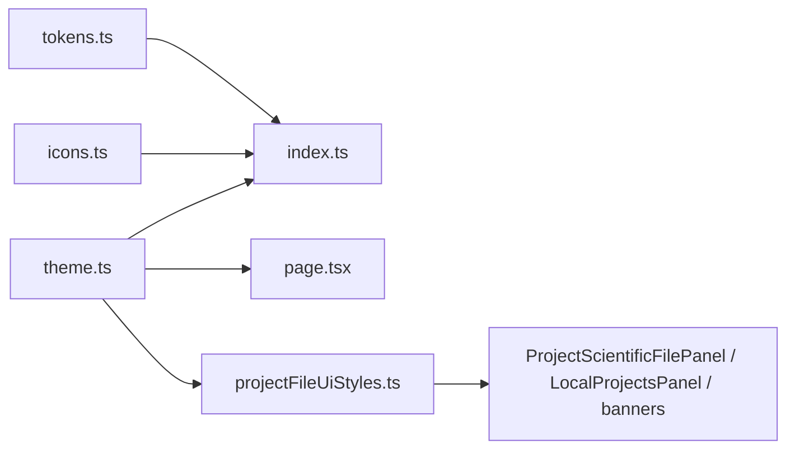

# D45.2 — UI Tokens · Theme · Icon Registry

**Épica:** v1.1 Improvements — UX Infrastructure  
**Microfase:** D45.2 — BUILD · UI Tokens · Theme · Icon Registry  
**Fase:** BUILD (infraestructura UI, sin extracción de componentes)  
**Fecha:** 2026-07-18  
**Estado:** **D45.2 = COMPLETE** · **CA-D45.2 = 10/10 PASS**  
**Owner:** Lead v1.1 UX Foundation  
**Prerrequisitos:** D45.1 = COMPLETE · UI Baseline RECORDED · EXPORT-2 / GRAPH freezes vigentes  

**Autoridad documental (SSOT — cita sin redefinir):**

| Documento | Rol |
|-----------|-----|
| [`docs/D45.1-ui-foundation.md`](D45.1-ui-foundation.md) | Baseline + inventario + alcance opción 1 |
| [`docs/D38.2-architecture-freeze.md`](D38.2-architecture-freeze.md) | Architecture Freeze |
| [`docs/D43.2-baseline-freeze.md`](D43.2-baseline-freeze.md) | EXPORT / GRAPH floor |
| [`PROJECT_STATUS_PROD_3.md`](../PROJECT_STATUS_PROD_3.md) | STATUS — append `## D45.2` |

**Declaración:**

```text
D45.2 = COMPLETE
src/lib/ui = CREATED
NO components/ui YET
NO VISUAL CHANGE
NO SIDEBAR JSX EXTRACTION
EXPORT / GRAPH FREEZES = PRESERVED
NEXT = D45.3 — Buttons · Layout
```

---

## 1. Executive Summary

Se creó la fuente única de verdad para tokens, theme class strings e iconografía.  
`page.tsx` importa estilos desde `@/lib/ui/theme`.  
`projectFileUiStyles.ts` reexporta variantes de proyecto sin romper la API pública.  
No se crearon `components/ui/*`. Sidebar JSX, dashboard, charts, EXPORT y GRAPH no se modificaron en comportamiento ni look.

---

## 2. Arquitectura creada

```text
src/lib/ui/
  tokens.ts    — spacing, radius, shadows, transitions, animation, zIndex, elevation
  theme.ts     — class strings canónicas + helpers + project-file variants
  icons.ts     — UI_ICONS + getIcon
  index.ts     — barrel re-exports
```



---

## 3. Inventario de tokens (`tokens.ts`)

| Grupo | Contenido (fragmentos Tailwind existentes) |
|-------|--------------------------------------------|
| `spacing` | `px-*`, `py-*`, `p-*`, `gap-*`, `space-y-*`, `my-*`, `mb-*`, `mt-*` |
| `radius` | `rounded-md`, `rounded-lg`, `rounded-xl`, `rounded-full` |
| `shadows` | `shadow-sm`, `shadow-md`, hover variants |
| `transitions` | `transition-colors duration-200/300`, `transition-all`, `transition-transform` |
| `animation` | `active:scale-[0.98]`, `duration-*`, grid collapse open/closed |
| `zIndex` | `z-0` … `z-50` (escala de stacking ya usada en patrones de overlay) |
| `elevation` | flat / low / medium / interactive (aliases de shadows existentes) |

**Regla:** no se introdujeron valores visuales nuevos respecto al baseline D45.1.

---

## 4. Theme helpers (`theme.ts`)

### 4.1 Class strings canónicas (desde `page.tsx`)

Incluye, entre otras: `getAppShell`, `card`, `panelHeading`, `contentPanel`, `btnPrimary`, `btnOutline`, `btnOutlineSm`, action-bar variants, sidebar class tokens (`sidebarNavItem`, `sidebarBtnPrimary`, …), toggles, alerts, data/results surfaces.

### 4.2 Variantes project-file (strings exactos previos)

| Export en theme | API pública vía `projectFileUiStyles` |
|-----------------|----------------------------------------|
| `projectFileFieldLabel` | `fieldLabel` |
| `projectFileInputField` | `inputField` |
| `projectFileBtnPrimary` | `btnPrimary` |
| `projectFileBtnSave` | `btnSave` |
| `projectFileBtnSecondary` | `btnSecondary` |

Looks divergentes respecto a `page.tsx` **preservados** (no se forzó un merge visual).

### 4.3 Helpers

| Helper | Rol |
|--------|-----|
| `getButtonVariant(variant)` | primary / secondary / outline / outlineSm / ghost / danger / action* / sidebar* / project* |
| `getPanelStyle(variant)` | card / content / subsection / empty / results* / data* |
| `getBadgeStyle(kind)` | persistence / soon / muted |
| `getStatusColor(status)` | success / warning / danger / muted / accent / info → `text-[var(--app-{status})]` |

`getButtonVariant("danger")` existe para D45.3; **no se cablea** en superficies UI en D45.2.

---

## 5. Icon registry (`icons.ts`)

| API | Descripción |
|-----|-------------|
| `UI_ICONS` | Mapa tipado key → emoji/ASCII |
| `getIcon(name)` | Lookup tipado |
| `UiIconName` | Union de keys |

Keys incluidas (mínimo del alcance + glyphs del baseline):  
`dashboard`, `modules`, `advisor`, `reports`, `library`, `settings`, `history`, `activity`, `save`, `export`, `open`, `expand` (`▶`), `collapse` (`▼`), módulos científicos, theme light/dark, status glyphs.

**Sin** librerías de iconos. Sidebar aún no consume el registry (D45.4).

---

## 6. Compatibilidad mantenida

| Superficie | Resultado |
|------------|-----------|
| `projectFileUiStyles` exports públicos | **Mismos nombres** · mismos strings |
| Consumidores (`ProjectScientificFilePanel`, `LocalProjectsPanel`, banners) | Sin cambios de import path |
| `page.tsx` class usage | Mismas cadenas vía import |
| Sidebar JSX | **No modificado** |
| EXPORT / GRAPH / `chartExport` | **No tocados** |
| `components/ui/*` | **No creado** |

---

## 7. Límites de la fase

### IN (hecho)

- `src/lib/ui/{tokens,theme,icons,index}.ts`
- Rewire de constantes visuales en `page.tsx`
- Unificación de `projectFileUiStyles.ts`
- Documentación + STATUS append

### OUT (explícito)

- `components/ui/buttons|layout|sidebar`
- Extracción del Sidebar JSX
- Migración de copias locales en feature panels
- Cambios de color / tipografía / spacing / look
- Scripts `validate:ui-architecture` (D45.5)

---

## 8. Validación

| Check | Resultado |
|-------|-----------|
| `npx tsc --noEmit` | **PASS** (exit 0) |
| Imports rotos | **Ninguno** |
| Cambio visual intencional | **Ninguno** |
| API `projectFileUiStyles` | **Compatible** |

---

## 9. Criterios de aceptación — CA-D45.2

| ID | Criterio | Resultado |
|----|----------|-----------|
| CA-D45.2-01 | `src/lib/ui/` creado | **PASS** |
| CA-D45.2-02 | `tokens.ts` implementado | **PASS** |
| CA-D45.2-03 | `theme.ts` implementado | **PASS** |
| CA-D45.2-04 | `icons.ts` implementado | **PASS** |
| CA-D45.2-05 | `index.ts` creado | **PASS** |
| CA-D45.2-06 | `projectFileUiStyles.ts` unificado sin romper API | **PASS** |
| CA-D45.2-07 | Sin cambios visuales | **PASS** |
| CA-D45.2-08 | Sin regresiones (EXPORT/GRAPH/Sidebar JSX intactos) | **PASS** |
| CA-D45.2-09 | TypeScript PASS | **PASS** |
| CA-D45.2-10 | Documentación PASS | **PASS** |

| Rollup | Resultado |
|--------|-----------|
| **CA-D45.2** | **10 / 10 PASS** |

---

## 10. Resolution

```text
D45.2 = COMPLETE
UI THEME FOUNDATION = READY
NEXT = D45.3 — Button System · Panel Layout
```
