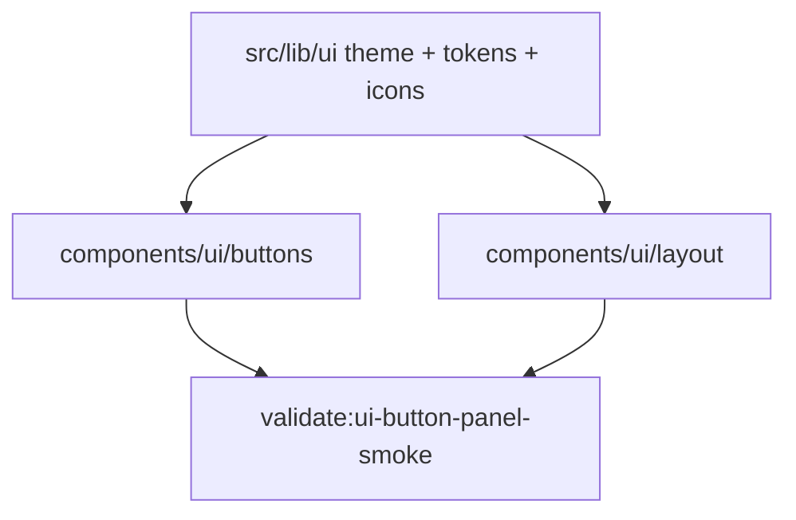

# D45.3 — Button System · Panel Layout

**Épica:** v1.1 Improvements — UX Infrastructure  
**Microfase:** D45.3 — BUILD · Button System · Panel Layout  
**Fase:** BUILD (primitives reutilizables, sin migración de call sites)  
**Fecha:** 2026-07-18  
**Estado:** **D45.3 = COMPLETE** · **CA-D45.3 = 10/10 PASS**  
**Owner:** Lead v1.1 UX Foundation  
**Prerrequisitos:** D45.2 = COMPLETE · `src/lib/ui` READY · EXPORT / GRAPH freezes vigentes  

**Autoridad documental (SSOT — cita sin redefinir):**

| Documento | Rol |
|-----------|-----|
| [`docs/D45.2-ui-theme-foundation.md`](D45.2-ui-theme-foundation.md) | Tokens · Theme · Icons |
| [`docs/D45.1-ui-foundation.md`](D45.1-ui-foundation.md) | Baseline · alcance opción 1 |
| [`PROJECT_STATUS_PROD_3.md`](../PROJECT_STATUS_PROD_3.md) | STATUS — append `## D45.3` |

**Declaración:**

```text
D45.3 = COMPLETE
components/ui/buttons = CREATED
components/ui/layout = CREATED
NO SIDEBAR FRAMEWORK YET
NO MASS CALL-SITE MIGRATION
NO VISUAL CHANGE IN APP
NEXT = D45.4 — Sidebar Extraction
```

---

## 1. Executive Summary

Se implementaron los primeros primitives UI reutilizables sobre la infraestructura D45.2.  
Los botones consumen `getButtonVariant()`; los paneles consumen `getPanelStyle()`.  
No se migró el monolito ni se tocó Sidebar / Dashboard / Project Panels / EXPORT / GRAPH.  
Smoke S1/S2 PASS vía `validate:ui-button-panel-smoke`.

---

## 2. Arquitectura

```text
src/components/ui/
  classNames.ts
  buttons/
    PrimaryButton.tsx
    SecondaryButton.tsx
    GhostButton.tsx
    IconButton.tsx
    DangerButton.tsx
    types.ts
    index.ts
  layout/
    Panel.tsx
    PanelHeader.tsx
    PanelBody.tsx
    PanelFooter.tsx
    SectionTitle.tsx
    Divider.tsx
    index.ts
```



---

## 3. API pública — Buttons

### Base: `UiButtonProps`

Extiende `ButtonHTMLAttributes<HTMLButtonElement>` e incluye:

| Prop | Tipo | Default |
|------|------|---------|
| `children` | `ReactNode` | — |
| `onClick` | handler | — |
| `type` | button types | `"button"` |
| `disabled` | `boolean` | — |
| `className` | `string` | — |
| `title` | `string` | — |
| `aria-label` | `string` | — |
| `size` | `"sm" \| "md"` | `"md"` |

### Variantes

| Componente | Theme helper |
|------------|--------------|
| `PrimaryButton` | `getButtonVariant("primary")` |
| `SecondaryButton` | `getButtonVariant("secondary")` / `"outlineSm"` si `size="sm"` |
| `GhostButton` | `getButtonVariant("ghost")` |
| `IconButton` | `getButtonVariant("ghost")` + composición cuadrada |
| `DangerButton` | `getButtonVariant("danger")` |

Import:

```ts
import {
  PrimaryButton,
  SecondaryButton,
  GhostButton,
  IconButton,
  DangerButton,
} from "@/components/ui/buttons";
```

---

## 4. API pública — Layout

| Componente | Dependencia theme/tokens |
|------------|--------------------------|
| `Panel` | `getPanelStyle(variant)` — default `"card"` |
| `PanelHeader` | `spacing` tokens |
| `PanelBody` | `spacing` tokens |
| `PanelFooter` | `actionBarGroup` + spacing |
| `SectionTitle` | `panelHeading` / `panelHeadingSubtext` |
| `Divider` | `sidebarDivider` |

Import:

```ts
import {
  Panel,
  PanelHeader,
  PanelBody,
  PanelFooter,
  SectionTitle,
  Divider,
} from "@/components/ui/layout";
```

---

## 5. Dependencias con theme (D45.2)

- **Obligatorio:** variantes de botón y superficie de panel salen de helpers theme.
- **Tokens:** spacing / composición de tamaño e IconButton square.
- **Icons:** smoke usa `getIcon("settings")` en IconButton; app aún no cablea registry en UI viva.
- **Prohibido en esta fase:** CVA, Radix, shadcn, librerías UI nuevas.

---

## 6. Smoke / Harness

| ID | Criterio | Script |
|----|----------|--------|
| S1 | Renderizan los 5 botones | `npm run validate:ui-button-panel-smoke` |
| S2 | Renderizan Panel + Header + Body + Footer + SectionTitle + Divider | mismo |

Resultado D45.3: **S1 PASS · S2 PASS**.

---

## 7. Límites de la fase

### IN

- `components/ui/buttons/*`
- `components/ui/layout/*`
- Harness smoke + script npm
- Docs + STATUS append

### OUT

- `components/ui/sidebar` (D45.4)
- Migración masiva de `<button>` / paneles en `page.tsx`
- Cambios visuales en la aplicación
- Toches a Sidebar / Charts / EXPORT / GRAPH / lógica de negocio

---

## 8. Preparación para D45.4

D45.4 podrá:

1. Crear `Sidebar` / `SidebarItem` / `SidebarGroup` / `SidebarSection` / `SidebarFooter` sobre estos primitives + theme.
2. Extraer el `<aside>` de `page.tsx` sin rediseño.
3. Usar `GhostButton` / `Divider` / `SectionTitle` / `getIcon` donde corresponda.

---

## 9. Validación

| Check | Resultado |
|-------|-----------|
| `npx tsc --noEmit` | **PASS** |
| `npm run validate:ui-button-panel-smoke` | **PASS** |
| Cambio visual en app | **Ninguno** (sin wiring a page) |
| Sidebar / EXPORT / GRAPH | **Intactos** |

---

## 10. Criterios de aceptación — CA-D45.3

| ID | Criterio | Resultado |
|----|----------|-----------|
| CA-D45.3-01 | `components/ui/buttons` implementado | **PASS** |
| CA-D45.3-02 | `components/ui/layout` implementado | **PASS** |
| CA-D45.3-03 | API común de botones | **PASS** |
| CA-D45.3-04 | Panel System implementado | **PASS** |
| CA-D45.3-05 | Divider y SectionTitle creados | **PASS** |
| CA-D45.3-06 | Sin migración masiva de call sites | **PASS** |
| CA-D45.3-07 | Sin cambios visuales | **PASS** |
| CA-D45.3-08 | TypeScript PASS | **PASS** |
| CA-D45.3-09 | Smoke S1/S2 PASS | **PASS** |
| CA-D45.3-10 | Documentación PASS | **PASS** |

| Rollup | Resultado |
|--------|-----------|
| **CA-D45.3** | **10 / 10 PASS** |

---

## 11. Resolution

```text
D45.3 = COMPLETE
BUTTON + PANEL SYSTEM = READY
NEXT = D45.4 — Sidebar Extraction
```
