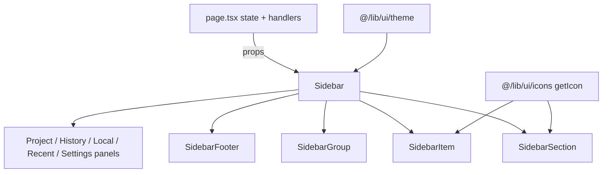

# D45.4 — Sidebar Extraction

**Épica:** v1.1 Improvements — UX Infrastructure  
**Microfase:** D45.4 — BUILD · Sidebar Extraction  
**Fase:** BUILD (extracción sin rediseño)  
**Fecha:** 2026-07-18  
**Estado:** **D45.4 = COMPLETE** · **CA-D45.4 = 10/10 PASS**  
**Owner:** Lead v1.1 UX Foundation  
**Prerrequisitos:** D45.3 = COMPLETE · Button/Panel system READY · D45.2 theme/icons READY  

**Autoridad documental (SSOT — cita sin redefinir):**

| Documento | Rol |
|-----------|-----|
| [`docs/D45.3-button-panel-system.md`](D45.3-button-panel-system.md) | Buttons · Layout |
| [`docs/D45.2-ui-theme-foundation.md`](D45.2-ui-theme-foundation.md) | Theme · Icons |
| [`docs/D45.1-ui-foundation.md`](D45.1-ui-foundation.md) | Baseline sidebar inventory |
| [`PROJECT_STATUS_PROD_3.md`](../PROJECT_STATUS_PROD_3.md) | STATUS — append `## D45.4` |

**Declaración:**

```text
D45.4 = COMPLETE
src/components/ui/sidebar = CREATED
page.tsx aside = EXTRACTED
NO VISUAL REDESIGN
NO DOMAIN LOGIC MOVE
NEXT = D45.5 — Validation · Certification
```

---

## 1. Executive Summary

El `<aside>` monolítico de `page.tsx` se extrajo a `src/components/ui/sidebar`.  
Estado, handlers y lógica de negocio permanecen en `page.tsx` y se pasan por props.  
Iconos del chrome del sidebar usan `getIcon()`. Apariencia y comportamiento preservados (sin rediseño; D46).

---

## 2. Arquitectura

```text
src/components/ui/sidebar/
  Sidebar.tsx          — shell <aside> + composición completa
  SidebarSection.tsx   — secciones colapsables (ex-DashboardSection)
  SidebarGroup.tsx     — grupos con label/hint
  SidebarItem.tsx      — ítems navegables (getIcon)
  SidebarFooter.tsx    — bloque inferior (Sistema)
  types.ts
  index.ts
```



---

## 3. Componentes y props públicas

### `Sidebar` (`SidebarProps`)

Recibe handlers/datos de curvas, proyecto, módulos, herramientas, recursos y settings.  
Incluye props tipadas para `ProjectScientificFilePanel`, `LocalProjectsPanel`, `RecentProjectsPanel`, `SettingsPanel` y `projectHistoryEntries`.

### `SidebarSection`

| Prop | Tipo |
|------|------|
| `title` | `string` |
| `icon` | `UiIconName` |
| `children` | `ReactNode` |
| `defaultOpen?` | `boolean` |
| `collapsed?` | `boolean` (controlado opcional) |
| `className?` | `string` |

Nota: no usa `SectionTitle` (D45.3) en el header colapsable para no cambiar nivel/look del título.

### `SidebarGroup` / `SidebarGroupLabel` / `SidebarGroupHint`

Agrupan bloques (Curvas / Proyecto) con labels y hints equivalentes al markup previo.

### `SidebarItem`

| Prop | Tipo |
|------|------|
| `icon?` | `UiIconName` → `getIcon(icon)` |
| `label` | `string` |
| `active?` | `boolean` |
| `disabled?` | `boolean` |
| `onClick?` | `() => void` |
| `badge?` | `ReactNode` |
| `showCaret?` / `expanded?` | caret expand/collapse vía `getIcon` |
| `className?` | `string` |

### `SidebarFooter`

Slot estructural para la sección Sistema (sin alterar contenido).

---

## 4. Estrategia de extracción

1. Crear primitives con class strings de `@/lib/ui/theme` (`sidebarShell`, `sidebarNavItem`, …).
2. Mover markup del aside a `Sidebar.tsx` composando primitives + paneles existentes.
3. Reemplazar `<aside>…</aside>` en `page.tsx` por `<Sidebar …props />`.
4. Eliminar `DashboardSection` / `ScientificModuleCard` locales del monolitio.
5. Mantener `SCIENTIFIC_MODULES` y toggles en `page.tsx`; mapear iconos por `module.id` → `getIcon` en el sidebar.

---

## 5. Evidencia de no regresión

| Check | Resultado |
|-------|-----------|
| `validate:ui-sidebar-architecture` | **PASS** (12/12) |
| `validate:ui-sidebar-smoke` S1 | **PASS** (aside + títulos + CTAs) |
| S2 Navegación | Handlers idénticos pasados por props |
| S3 Estados activos | `selectedGraphId` / module toggles / open flags sin cambio |
| S4 Responsive | `sidebarShell` = mismas clases `lg:` / `xl:` |
| S5 Sin diff visual intencional | Sin nuevos colores/spacing/look |
| S6 `npx tsc --noEmit` | **PASS** |

EXPORT / GRAPH / Dashboard main / Charts — **no tocados** en esta microfase (salvo wiring del aside).

---

## 6. Preparación para D45.5 y D46

**D45.5** — gate umbrella (`validate:ui-architecture` / `validate:v11-d45-gate`), certificación CA-D45, cierre de serie.

**D46** — rediseño visual del Sidebar/navegación sobre estos primitives (cambiar look sin re-extraer).

---

## 7. Criterios de aceptación — CA-D45.4

| ID | Criterio | Resultado |
|----|----------|-----------|
| CA-D45.4-01 | `src/components/ui/sidebar/` implementado | **PASS** |
| CA-D45.4-02 | Sidebar + Section + Group + Item + Footer creados | **PASS** |
| CA-D45.4-03 | `page.tsx` sin `<aside>` monolítico | **PASS** |
| CA-D45.4-04 | `getIcon()` usado por `SidebarItem` | **PASS** |
| CA-D45.4-05 | Sin cambios visuales intencionales | **PASS** |
| CA-D45.4-06 | Sin cambios funcionales (handlers en page) | **PASS** |
| CA-D45.4-07 | `tsc --noEmit` PASS | **PASS** |
| CA-D45.4-08 | `validate:ui-sidebar-architecture` PASS | **PASS** |
| CA-D45.4-09 | Smoke S1 PASS | **PASS** |
| CA-D45.4-10 | Documentación PASS | **PASS** |

| Rollup | Resultado |
|--------|-----------|
| **CA-D45.4** | **10 / 10 PASS** |

---

## 8. Resolution

```text
D45.4 = COMPLETE
SIDEBAR EXTRACTION = READY
NEXT = D45.5 — Validation · Certification
```
