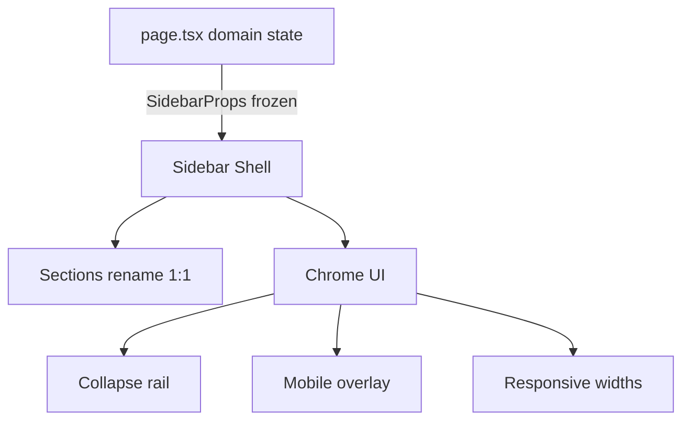

# D46.0 — Sidebar v2 · Discovery / Plan Freeze

**Épica:** v1.1 Improvements — UI Modernization  
**Microfase:** D46.0 — DISCOVERY / PLAN FREEZE  
**Fase:** DISCOVERY (documental; sin cambios de producto)  
**Fecha:** 2026-07-19  
**Estado:** **D46.0 = COMPLETE** · **D46 PLAN = FROZEN** · **READY FOR D46.1**  
**Owner:** Lead v1.1 UX Foundation  
**Prerrequisitos:** D45 = CLOSED · CA-D45.5 = 10/10 PASS · v1.1 UI Foundation READY  

**Autoridad documental (SSOT — cita sin redefinir):**

| Documento | Rol |
|-----------|-----|
| [`docs/D45.4-sidebar-extraction.md`](D45.4-sidebar-extraction.md) | Extracción sidebar (arquitectura base) |
| [`docs/D45.5-ui-foundation-certification.md`](D45.5-ui-foundation-certification.md) | Certificación D45 · NEXT = D46 |
| [`docs/D45.2-ui-theme-foundation.md`](D45.2-ui-theme-foundation.md) | Tokens · Theme · Icons |
| [`docs/D38.2-architecture-freeze.md`](D38.2-architecture-freeze.md) | Architecture Freeze |
| [`docs/D43.2-baseline-freeze.md`](D43.2-baseline-freeze.md) | EXPORT / GRAPH floor |

**Declaración:**

```text
D46.0 = COMPLETE
D46 PLAN = FROZEN
NO PRODUCT CODE CHANGES IN D46.0
NEXT = D46.1 — Sidebar Sections
```

**Modo:** create-only este documento · **cero cambios** en `src/**` · `scripts/**` · `package.json` · theme · props · APIs.

---

## 1. Estado actual

### 1.1 Contexto de serie

| Campo | Valor |
|-------|-------|
| PROD-3 | OPEN |
| D45 | **CLOSED** |
| CA-D45.5 | **10/10 PASS** |
| v1.1 UI Foundation | **READY** |
| D46 | **OPEN** (esta serie) |

D45 extrajo el `<aside>` monolítico a `src/components/ui/sidebar` **sin rediseño visual**.  
D46 moderniza UX/layout/responsive **sobre** esa arquitectura, sin re-extraer ni mover lógica de dominio.

### 1.2 Árbol actual

```text
src/components/ui/sidebar/
  Sidebar.tsx          — shell <aside> + composición completa
  SidebarSection.tsx   — secciones colapsables (accordion)
  SidebarGroup.tsx     — grupos con label/hint (+ Label/Hint helpers)
  SidebarItem.tsx      — ítems navegables (getIcon)
  SidebarFooter.tsx    — bloque inferior
  types.ts             — contratos públicos
  index.ts             — barrel
```

### 1.3 Barrel exports (`index.ts`)

**Componentes**

- `Sidebar`
- `SidebarSection`
- `SidebarGroup`, `SidebarGroupLabel`, `SidebarGroupHint`
- `SidebarItem`
- `SidebarFooter`

**Tipos**

- `SidebarProps`
- `SidebarSectionProps`
- `SidebarGroupProps`
- `SidebarItemProps`
- `SidebarFooterProps`
- `SidebarGraphEntry`
- `SidebarModuleEntry`

`SidebarModuleCard` es interno a `Sidebar.tsx` (no exportado).

### 1.4 Relación con `page.tsx`

```text
page.tsx
  │  estado de dominio + handlers + SCIENTIFIC_MODULES
  │  props (SidebarProps)
  ▼
Sidebar  (<aside> — único dueño del markup de chrome)
```

- `page.tsx` **importa** `@/components/ui/sidebar` y renderiza `<Sidebar …>`.
- **No** queda `<aside>` inline en `page.tsx` (contrato D45 / gate).
- Handlers (`onNewCurve`, `onOpenAssistant`, toggles de paneles, etc.) viven en `page.tsx`.
- Paneles de dominio anidados se pasan por props (`projectFilePanelProps`, `settingsPanelProps`, …) o se montan dentro de `Sidebar` con datos/handlers del host.

### 1.5 Responsabilidades por componente

| Componente | Responsabilidad |
|------------|-----------------|
| `Sidebar` | Shell, header, orden de composición, wiring visual de props → UI |
| `SidebarGroup` | Bloque con label/hint (hoy: curvas / proyecto) |
| `SidebarSection` | Sección accordion con título + icono (`defaultOpen` / `collapsed`) |
| `SidebarItem` | Acción/navegación con icono, active/disabled, caret expand |
| `SidebarFooter` | Contenedor del bloque inferior (hoy: Sistema → Ajustes) |
| `types.ts` | Contratos públicos congelados |
| `index.ts` | Superficie pública del módulo |

### 1.6 Dueño del estado de dominio

**`page.tsx` continúa siendo el dueño exclusivo del estado científico y de dominio**, incluyendo (no exhaustivo):

- curvas / biblioteca de gráficos / `selectedGraphId`
- proyecto `.sgproj`, actividad, historial, proyectos locales
- módulos habilitados y contadores
- flags de paneles (`graphLibraryOpen`, `projectActivityOpen`, `recentProjectsOpen`, `settingsOpen`)
- navegación de workspace (`onOpenAssistant`, `onOpenReports`, `onOpenFunctionLibrary`)

El Sidebar **no** posee ese estado. Solo presenta y dispara callbacks.

---

## 2. API Freeze

### 2.1 Contratos congelados (D45 → D46)

Las siguientes APIs públicas permanecen **congeladas** (sin cambios breaking):

| API | Estado |
|-----|--------|
| `SidebarProps` | **FROZEN** |
| `SidebarSectionProps` | **FROZEN** |
| `SidebarGroupProps` | **FROZEN** |
| `SidebarItemProps` | **FROZEN** |
| `SidebarFooterProps` | **FROZEN** |
| `SidebarGraphEntry` | **FROZEN** |
| `SidebarModuleEntry` | **FROZEN** |
| Barrel exports de `index.ts` | **FROZEN** (exports existentes) |

Campos existentes de `SidebarProps` (referencia; ver `types.ts`):

- Curvas / nube: `onNewCurve`, `onClearCurves`, `graphLibraryOpen`, `onToggleGraphLibrary`, `graphs`, `graphLabels`, `selectedGraphId`, `onLoadGraph`
- Proyecto: `projectPanelRef`, `highlightProjectPanel`, `projectFilePanelProps`, `projectActivityOpen`, `onToggleProjectActivity`, `projectHistoryEntries`, `localProjectsPanelProps`, `onResetProject`
- Módulos: `modules`, `activeModuleCount`, `modulesTotal`
- Herramientas: `isAssistantEnabled`, `isReportsEnabled`, `onOpenAssistant`, `onOpenReports`
- Recursos: `onOpenFunctionLibrary`, `recentProjectsOpen`, `onToggleRecentProjects`, `recentProjectsPanelProps`
- Sistema: `settingsOpen`, `onToggleSettings`, `settingsPanelProps`
- Shell: `className?`

### 2.2 Extensiones permitidas (solo aditivas)

Únicamente se permiten **props opcionales aditivas** relacionadas con chrome UI:

| Área | Extensión permitida |
|------|---------------------|
| Collapse | p.ej. `collapsed?`, `onCollapsedChange?` (opcional; preferible estado local) |
| Overlay | p.ej. props opcionales de control mobile overlay (si se necesitan) |

**No se permiten:**

- Renombrar / eliminar / reordenar props existentes
- Cambiar tipos de props existentes
- Mover estado de dominio al Sidebar
- Breaking changes en callers de `page.tsx`

### 2.3 Theme / icons (piso D45)

- Helpers existentes en `@/lib/ui/theme` se respetan; D46 **extiende** (no redefine el contrato de consumidores D45).
- Iconos vía `getIcon` / registry; **sin** lucide / heroicons / react-icons / radix icons.
- Freezes EXPORT / GRAPH vigentes.

---

## 3. Arquitectura objetivo

```text
page.tsx
  │  dominio + handlers (sin cambios de wiring)
  ▼
Sidebar Shell
  │
  ├──────────────────┐
  ▼                  ▼
Sections          Chrome UI
(rename 1:1)         │
                     ├─ Collapse (rail)
                     ├─ Overlay (mobile)
                     └─ Responsive (width tokens)
```



### 3.1 Reglas de arquitectura D46

| Regla | Detalle |
|-------|---------|
| Estado científico | Permanece **fuera** del Sidebar (`page.tsx`) |
| Collapse | **Autocontenido** (estado local en Sidebar; props aditivas opcionales) |
| Overlay | **Autocontenido** (estado local; sin rewiring de dominio) |
| Wiring existente | **No se modifica** el paso de props de dominio desde `page.tsx` |
| Re-extracción | **Prohibida** — no volver a monolitizar ni re-partir paneles |

---

## 4. Rename 1:1 congelado

| Orden | Label actual (D45) | Label D46 |
|------:|--------------------|-----------|
| 1 | Curvas matemáticas | **Visualización** |
| 2 | Proyecto científico | **Proyecto** |
| 3 | Módulos | **Científico** |
| 4 | Herramientas | **Análisis** |
| 5 | Recursos | **Recursos** |
| 6 | Sistema | **Ajustes** |

### 4.1 Garantías del rename

- **Mismo orden** de bloques
- **Mismo contenido** dentro de cada bloque
- **Mismos callbacks** y **mismos handlers**
- **Sin** sección Export en el sidebar (Export permanece en action bar / EXPORT freeze)
- **Badges** (`NUBE`, `.SGPROJ`) y **CTAs** internas permanecen
- Hints y tooltips de dominio se preservan (texto puede ajustarse solo si es copy de título de sección)

---

## 5. Objetivos por microfase

| Microfase | Nombre | Objetivo |
|-----------|--------|----------|
| **D46.1** | Sidebar Sections | Rename 1:1 + títulos + separadores + spacing consistente; sin cambiar comportamiento |
| **D46.2** | Active Navigation | Estados `active` / `hover` / `pressed` / `disabled` vía tokens theme (`--app-*`) |
| **D46.3** | Collapse Rail | Expanded / Collapsed con transición; keyboard, focus, tooltips |
| **D46.4** | Responsive + Mobile Overlay | Desktop/Tablet widths + overlay mobile; sin romper layout |
| **D46.5** | Certification | `validate-sidebar-v2` + umbrella `validate:v11-d46-gate` → **PASS** |

---

## 6. Tokens

D46 **únicamente extiende** [`src/lib/ui/theme.ts`](../src/lib/ui/theme.ts) con helpers derivados de CSS variables existentes (`--app-surface`, `--app-border`, `--app-text`, `--app-accent`, etc.) y tokens estructurales ya presentes en `@/lib/ui/tokens` (`transitions`, `animation`, `zIndex`, …).

### 6.1 Prohibido en `Sidebar*`

- Colores **hex** (`#444`, `#666`, …)
- Paletas Tailwind nuevas (`bg-slate-*`, `text-zinc-*`, …)
- Colores **inline** / literales fuera de `--app-*` y helpers theme
- Nuevas librerías UI / icon libraries

### 6.2 Extensiones theme previstas (implementación en D46.1+)

Nav: `sidebarNavItemActive`, `sidebarNavItemPressed`, `sidebarNavItemDisabled` (además de existentes).  
Chrome: width tokens + `sidebarOverlayOpen` (ver §7).  
Spacing/separadores: helpers de sección si hace falta (`sidebarSectionGap`, etc.).

---

## 7. Responsive

### 7.1 Tokens de ancho / overlay (única fuente numérica)

| Token (`theme.ts`) | Rol | Valor interno de referencia |
|--------------------|-----|-----------------------------|
| `sidebarWidthDesktop` | Desktop expanded | 280px |
| `sidebarWidthTablet` | Tablet expanded | 240px |
| `sidebarWidthCollapsed` | Rail collapsed | 64px |
| `sidebarOverlayOpen` | Drawer mobile abierto | `fixed` + z-index + opacity + pointer-events |

### 7.2 Reglas

- Los **números viven solo en `theme.ts`**.
- Componentes `Sidebar*` **importan los exports**; no introducen literales `280` / `240` / `64`.
- `sidebarOverlayOpen` concentra clases de overlay abierto para no repartir `fixed` / z-index / opacity / pointer-events entre archivos.
- D47 podrá retocar tamaños en `theme.ts` sin tocar componentes.

---

## 8. Accesibilidad

### 8.1 Collapse toggle

El botón de colapsar/expandir rail **debe**:

| Requisito | Detalle |
|-----------|---------|
| `aria-label` | Etiqueta clara según estado (colapsar / expandir) |
| Enter | Activa el toggle |
| Space | Activa el toggle |
| Focus visible | Conserva / restaura focus tras el toggle |
| Focuseable | En ambos estados (expanded y collapsed) |

Implementación preferida: `<button type="button">` nativo.

### 8.2 Overlay mobile

| Requisito | Detalle |
|-----------|---------|
| Esc | Cierra overlay |
| Click backdrop | Cierra overlay |
| Restore focus | Devuelve focus al trigger al cerrar |
| Tooltips | En rail colapsado, `title` / tooltip nativo en ítems |

### 8.3 Navegación existente

Se preservan `aria-expanded`, `aria-disabled`, `aria-pressed` (module cards) ya usados en D45.

---

## 9. Smoke Tests

| ID | Nombre | Criterio |
|----|--------|----------|
| **S1** | Expand | Sidebar / rail expandido usable |
| **S2** | Collapse | Rail colapsado: iconos + tooltips + toggle |
| **S3** | Navigation | Cambiar panel / ítem (mismas acciones D45) |
| **S4** | Hover | Estados hover en botones/ítems |
| **S5** | Keyboard | Focus teclado + Enter/Space en collapse |
| **S6** | Desktop | Ancho vía `sidebarWidthDesktop` |
| **S7** | Tablet | Ancho vía `sidebarWidthTablet` |
| **S8** | Mobile | Overlay + Esc/backdrop |
| **S9** | Build | `tsc` + `next build` limpios |
| **S10** | Regression | Sin regresiones funcionales / dominio |

**Gate D46.5:** `npm run validate:v11-d46-gate` → **PASS**  
(incluye arquitectura, sidebar-v2, smokes, `tsc`, build; D45 gates siguen PASS).

---

## 10. Fuera de alcance

| Área | Estado |
|------|--------|
| EXPORT | **NO** |
| GRAPH | **NO** |
| Charts | **NO** |
| Workflow | **NO** |
| Paneles científicos (lógica / API) | **NO** |
| Re-extraer monolito | **NO** |
| D47 Design Tokens v2 | **NO** |
| D48 Panels Modernization | **NO** |
| Rediseño de cards internas de paneles anidados | **NO** |
| Cambios de handlers / estado en `page.tsx` (dominio) | **NO** |
| Librerías UI nuevas (CVA, Radix, shadcn, icon packs) | **NO** |

---

## 11. Riesgos

| Riesgo | Mitigación |
|--------|------------|
| Romper **API Freeze** D45 | Solo props aditivas opcionales; gates de arquitectura D45 siguen en umbrella |
| Regresar D45 a FAIL | `validate:ui-sidebar-architecture` + smokes D45 permanecen en cadena |
| Regresiones funcionales | Rename 1:1; mismos callbacks; smokes S3/S10; sin mover estado |
| Cambios de dominio accidentales | Collapse/overlay locales; no tocar wiring de dominio en `page.tsx` |
| Colores hardcodeados | Gate `validate-sidebar-v2`: sin hex / slate / zinc en `Sidebar*` |
| Literales de ancho en componentes | Tokens `sidebarWidth*`; gate verifica exports + uso |

---

## 12. Definition of Done (D46.0)

La microfase **D46.0** finaliza cuando existe **únicamente**:

```text
docs/D46.0-sidebar-v2-plan.md
```

y se cumple:

| Criterio | Requerido |
|----------|-----------|
| Documentación completa (§1–§12) | ✓ |
| API Freeze documentada | ✓ |
| Rename 1:1 congelado | ✓ |
| Objetivos D46.1–D46.5 definidos | ✓ |
| Responsive documentado | ✓ |
| Accesibilidad documentada | ✓ |
| Fuera de alcance documentado | ✓ |
| **Sin** modificar código fuente | ✓ |
| **Sin** cambios funcionales | ✓ |
| **Sin** cambios visuales | ✓ |

---

## 13. Resolución / cierre D46.0

```text
D46.0 = COMPLETE
D46 PLAN = FROZEN
docs/D46.0-sidebar-v2-plan.md = SSOT D46
NO PRODUCT CODE CHANGES
READY FOR D46.1 — Sidebar Sections
```

**Hoja de ruta v1.1 UI (contexto):**

```text
✅ D45 — UI Foundation
🚧 D46 — Sidebar v2   ← AQUÍ (D46.0 FROZEN → D46.1 next)
⬜ D47 — Design Tokens v2
⬜ D48 — Panels Modernization
⬜ D49 — Dashboard & Home Experience
⬜ D50 — UI v1.1 Release & Certification
```
