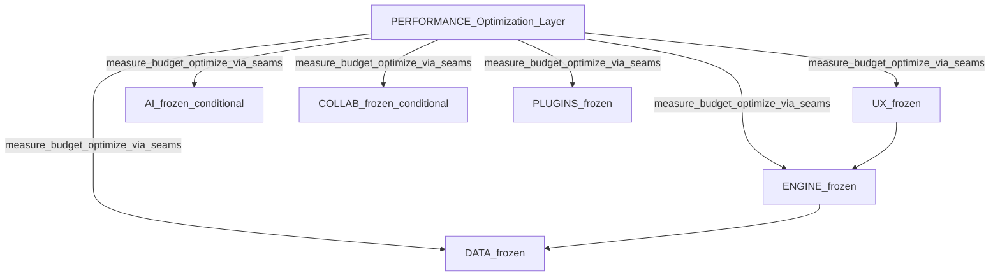
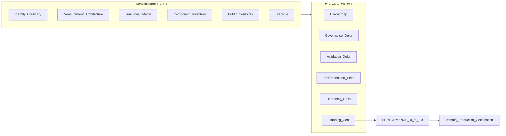

# PERFORMANCE Planning Charter

**Artifact:** PERFORMANCE Planning Charter  
**Status:** **RELEASE CERTIFIED**  
**Date:** 2026-08-07  
**Role:** Planning Authority for the PERFORMANCE Planning Series (PERFORMANCE-P0…P11) and subsequent PERFORMANCE-I\* under inherited project methodology  
**Nature:** Optimization-domain planning constitution only — does not recreate Scientific Graph AI project methodology  
**Path:** `docs/PERFORMANCE/PERFORMANCE-Planning-Charter.md`

---

## Verdict

PERFORMANCE Planning inherits the RELEASE-CERTIFIED project methodology as **stable infrastructure**. This Charter is the **official planning artifact** for the PERFORMANCE Domain. Official Records **cite** this Charter; they do **not** re-copy its constitutional freezes and principles.

Documentation stays compact relative to AI; executive phases (P7–P10) stay thin and cite project standards + this Charter.

Reading order: Executive Summary → Authority Precedence → Methodology → Identity → Ownership → Peer Baseline → Series Shape → Certification → Freeze / Exit Criteria.

---

## 1. Executive Summary

PERFORMANCE is the **Optimization Layer** of Scientific Graph AI: a transversal domain that measures, instruments, budgets, detects regressions, optimizes within existing boundaries, and produces evidence and gates — **without** introducing product capabilities and **without** absorbing peer-domain ownership.

Peers ENGINE, DATA, AI, UX, COLLAB, and PLUGINS are an **immutable certified baseline**. PERFORMANCE plans **above** those freezes, never inside them.

Constitutional principle:

> **Peers Own. PERFORMANCE Observes and Optimizes.**

Planning structure is the mature COLLAB / PLUGINS ladder: **P0–P5 Constitutional → P6–P11 Executive → I0–I10 Implementation (post–P11 unlock only)**. Per-peer P\* phases are permanently rejected.

This Charter freezes Planning Authority for that series. It does **not** authorize code, `src/performance/`, validators, benchmarks, CI gates, peer changes, ops-doc sync, or PERFORMANCE-I0.

---

## Authority Precedence (immutable)

```
Project Governance
        ↓
Certified Architecture
        ↓
PERFORMANCE Planning Charter
        ↓
PERFORMANCE Official Records
```

**Citation formulas (stable):**

> **Planning Authority:** `docs/PERFORMANCE/PERFORMANCE-Planning-Charter.md` (RELEASE CERTIFIED)

or

> This Official Record is governed by the PERFORMANCE Planning Charter and the Scientific Graph AI certified project methodology.

**Citation rule:** Optimization Layer definition, Owns / Never Owns, Frozen / Measurable / Optimizable / Seams model, Peer Baseline, Peer Ownership Freeze, Measure-Before-Optimize, Optimize-the-System, Conflict Register rule, Future Evolution exclusions, PERFORMANCE SSOT, Ownership Matrix, Series Shape, No-Code Rule, and I\* lock until P11 are **defined once in this Charter**. P0–P11 reference them; they do not reproduce them unless a phase-specific delta is required. The Charter SHALL NOT be rewritten by Official Records.

---

## Methodology Inheritance

PERFORMANCE Planning inherits certified project methodology as infrastructure. Official Records **cite** these authorities; they do **not** recreate them.

| Layer | Authority (SSOT) |
|-------|------------------|
| Constitution | [docs/governance/](../governance/) — PROJECT_PRINCIPLES, DOMAIN_BOUNDARIES, CERTIFICATION_FRAMEWORK, QUALITY_GATES, DECISION_FRAMEWORK, ARCHITECTURE_GOVERNANCE |
| Architecture | [docs/architecture/](../architecture/) — DOMAIN_MATRIX, DEPENDENCY_MATRIX, SYSTEM_INTERACTIONS, ARCHITECTURE_DECISIONS, ARCHITECTURAL_LAYERS, ARCHITECTURAL_PATTERNS |
| Domain vision seed | [MASTER ROADMAP V2](../roadmaps/MASTER%20ROADMAP%20V2.md) **§20 PERFORMANCE Domain**, **§27 PERFORMANCE Strategy** |
| Peer freezes | ENGINE, DATA, AI, UX, COLLAB — **RELEASE CERTIFIED**; PLUGINS — **PRODUCTION CERTIFIED**; all immutable under PERFORMANCE Planning |
| Method pattern | PLUGINS / COLLAB Official Record template: Authority Precedence · Series Opening Frame · Freeze ladder · Planning Finality · no-code during P\* |
| Approved planning baseline | PERFORMANCE Official Planning Plan (structure P0–P11 confirmed; per-peer P\* rejected) |
| **PERFORMANCE Planning Authority** | **This PERFORMANCE Planning Charter (RELEASE CERTIFIED)** |

**Conflict rule (inherited):** Architectural Decisions and certified peer domains prevail. PERFORMANCE Planning never reopens ENGINE / DATA / AI / UX / COLLAB / PLUGINS freezes. Within PERFORMANCE planning, this Charter prevails over informal notes; certified Official Records prevail for their frozen phase content.

**Out of scope for this series:** recreating planning/certification/freeze/evidence/traceability methodology, generic Quality Gates, or any peer-domain ownership.

---

## Documentation Layout

Mirror PLUGINS / COLLAB Official Record layout:

```
docs/PERFORMANCE/
  PERFORMANCE-Planning-Charter.md   # THIS ARTIFACT — Planning Authority (RELEASE CERTIFIED)
  official-records/                 # PERFORMANCE-P0 … PERFORMANCE-P11 (planning only; cite Charter)
  implementation/                   # reserved post–Planning Certification (PERFORMANCE-I*)
```

- No `src/performance/` (or equivalent) during PERFORMANCE-P\*.
- No ROADMAP.md / PROJECT_STATUS.md sync until after Planning Certification (inherited rule).
- Each Official Record: lean header (**Planning Authority citation** + Authority Precedence + freeze matrix) → **phase-specific optimization architecture only** → exit criteria. No methodology essays. No re-copy of Charter principles.
- Symmetry preserved: **PERFORMANCE-I0 … PERFORMANCE-I10** after Planning Certification (same I-series shape as peer domains).
- **PERFORMANCE-I\* remains LOCKED until PERFORMANCE-P11 Planning Certification unlocks it.**

**Size target:** substantially smaller than AI — aim roughly **≤50% of AI-P\* total line count**, with P7–P10 especially short (deltas only).

---

## 2. Domain Identity

**Canonical identity:** Optimization Layer (PERFORMANCE Domain).

PERFORMANCE is **not** an additional product peer that introduces user capabilities. It is the permanent platform discipline for measurement, budgets, regression detection, optimization governance, and performance evidence across certified domains.

Materialized from MASTER ROADMAP V2 §20 / §27; refined across P0–P2 under this Charter.

---

## 3. Performance Mission

The mission of the PERFORMANCE Domain is to ensure that Scientific Graph AI delivers a responsive, efficient, and scalable experience while preserving architectural principles, scientific correctness, and peer ownership.

PERFORMANCE shall:

- make performance **measurable, reproducible, and governed**;
- establish budgets / SLOs and objective regression gates (**planning-level** until numbers are evidence-set in authorized I\*);
- optimize execution, resources, and perceived performance **within** peer boundaries;
- coordinate **cross-domain** optimization as an integrated system;
- produce evidence sufficient for Domain / Production Certification and to feed the project **Performance Gate** / **Performance Certification** without replacing peer Domain Certification.

Performance optimization improves productivity **without** altering business behavior, scientific results, interaction design meaning, or architectural ownership.

---

## 4. Motto

> **Optimize without owning.**

---

## 5. Scope

### Owns (PERFORMANCE SSOT)

Owned **exclusively** by PERFORMANCE (planning-level / conceptual until I\*):

- measurement architecture (metrics model, instrumentation **seams**, profiling methodology);
- performance budgets / thresholds / SLOs (policy ownership — concrete numeric budgets are evidence-driven in authorized I\*);
- benchmarking methodology and regression detection;
- optimization governance (what may be optimized, under what evidence, with what reversibility);
- cross-cutting performance diagnostics / monitoring (distinct from peer **structural** diagnostics);
- performance evidence packages and PERFORMANCE domain performance gates;
- coordination of post–P11 optimization waves over peers **without** transferring ownership.

### Operates over (does not own)

- ENGINE Product Flows / commands / application lifecycle;
- DATA pipelines / datasets / persistence internals;
- AI assistance pathways (**conditional** on runtime);
- UX rendering / interaction / perceived performance;
- COLLAB metadata flows (**conditional** on COLLAB implementation);
- PLUGINS admission / lifecycle overhead; plugin **execution** overhead (**conditional** — execution deferred in PLUGINS);
- **cross-domain** scenarios (e.g. UX → ENGINE → DATA ± optional peers).

### Never owns

- ENGINE workflow orchestration / Product Flows;
- DATA scientific processing / scientific truth;
- AI reasoning / intelligence decisions;
- UX presentation / Design System ownership;
- COLLAB collaboration metadata;
- PLUGINS extension-point ownership (peers own EPs; PLUGINS owns interaction governance);
- Platform persistence / runtime infrastructure ownership;
- product feature surface whose purpose is end-user capability rather than governed measurement / evidence.

---

## 6. Non-Goals

Frozen non-goals for the entire Planning Series:

1. Reopen, redesign, or duplicate certified peer architecture or public contracts.
2. Absorb workflow orchestration, scientific truth, AI reasoning, UX design, collaboration metadata, or plugin extension-point ownership.
3. Convert peer structural diagnostics into a public telemetry / metrics product API owned by those peers.
4. Introduce PERFORMANCE as a user-facing product capability domain (beyond governed internal evidence / diagnostic surfaces defined later under this Charter).
5. Design or schedule Future Evolution items listed below as P\* / early I\* deliverables.
6. Create `src/performance/`, runtime validators, executable benchmarks, or CI gates during P\*.
7. Unilaterally resolve peer contract conflicts (Conflict Register only).
8. Structure Official Records as per-peer phases (ENGINE-P3 … PLUGINS-P8 style) — **permanently rejected**.
9. Invent peer public APIs, runtime contracts, or metrics bindings that do not exist; conditional peers stay conditional.
10. Start PERFORMANCE-I0 (or any I\*) before P11 unlock.
11. Sync ROADMAP.md / PROJECT_STATUS.md before Planning Certification.
12. Author Lovable / Cursor implementation prompts as part of this Planning Series.

---

## 7. Optimization Layer Definition

From certified architecture ([ARCHITECTURAL_LAYERS](../architecture/ARCHITECTURAL_LAYERS.md), [DOMAIN_MATRIX](../architecture/DOMAIN_MATRIX.md)):

> PERFORMANCE is the **Optimization Layer**.
>
> It owns diagnostics (performance), optimization, benchmarking, and performance monitoring **as a transversal discipline**.
>
> Optimization improves execution while preserving architecture, ownership, and public-contract meaning.

PERFORMANCE **consumes** every certified domain. It **never** becomes a dependency required for peer correctness. Peers MUST remain correct and operable if PERFORMANCE measurement or optimization is unavailable.

---

## 8. Ownership Model

### Peer Ownership Freeze (binding)

> **Certified peer domains exclusively own their responsibilities, public contracts, and semantics.**
>
> **PERFORMANCE owns only measurement, budgets, regression/gate evaluation, optimization governance, and performance evidence — exercised through seams, without transferring peer ownership.**

### Observes and Optimizes (constitutional principle)

> **Peers Own. PERFORMANCE Observes and Optimizes.**
>
> Observation does not imply ownership.
> Optimization within boundaries does not imply contract change.
> Evidence of need to change a peer contract is a **conflict**, not a PERFORMANCE license to reopen that peer.

### Measure Before Optimize (constitutional principle)

> **Optimization decisions SHALL be based on measurable evidence.**
>
> Assumptions are not sufficient for certification-grade optimization.

### Optimize the System (constitutional principle)

> **Local optimization SHALL never degrade overall platform performance.**
>
> Cross-domain cost and leverage are first-class concerns of the Functional Model (P2) and Roadmap (P6).

### Preserve Correctness / Architecture / Maintainability (constitutional principles)

> Performance improvements SHALL never modify scientific correctness.  
> Optimization SHALL never introduce architectural coupling that violates domain boundaries.  
> Performance SHALL never sacrifice maintainability for negligible gains.

### Conflict Register rule (binding)

> If an optimization requires changing a peer **contract** or **ownership**:
>
> 1. register it as a dependency / conflict;
> 2. **do not** reopen the peer freeze under PERFORMANCE Planning;
> 3. **do not** resolve unilaterally;
> 4. escalate under project governance / peer Planning Revision only.

### Conditional measurement (binding)

| Peer concern | Condition |
|--------------|-----------|
| AI pathway latency / scheduling cost | **Conditional** — only when AI runtime assistance surfaces exist under AI freezes |
| COLLAB metadata / non-blocking cost | **Conditional** — only when COLLAB I\* runtime exists under COLLAB freezes |
| PLUGINS **execution** / EP call overhead | **Conditional** — plugin execution remains deferred under PLUGINS; measure admission/lifecycle now only where surfaces exist; do not invent execution contracts |

Planning MAY describe **conceptual** seams for conditional peers. Planning SHALL NOT invent fictitious peer APIs to satisfy those seams.

---

## 9. Frozen / Measurable / Optimizable / Seams

Canonical relation vocabulary (Charter-level; refined in P0–P4 without changing meaning):

| Relation | Definition |
|----------|------------|
| **Frozen** | Peer ownership, public contracts, semantics, and certified freezes — PERFORMANCE MUST NOT modify |
| **Measurable** | Signals observable at public seams or via instrumentation agreed without publishing peer internals as consumer API |
| **Optimizable** | Internal peer or adapter improvements under the **same** public contract meaning; requires evidence; reversible governance |
| **Seams** | Interaction points PERFORMANCE↔peer (typically public facade / contract boundary) — **planning-level / conceptual** until P4 Contract Freeze |

Seams are formalized in PERFORMANCE-P1 / P4. This Charter freezes the **model**, not concrete metric names, numeric budgets, or implemented adapters.

---

## 10. Peer Baseline (immutable)

All peers below are **immutable baseline** for PERFORMANCE Planning. Status and implications are documentary; PERFORMANCE does not re-certify peers.

| Peer | Baseline status | Frozen (PERFORMANCE must not change) | Measurable (conceptual) | Optimizable (within boundaries) | Seams (conceptual; formalize in P1/P4) | Condition |
|------|-----------------|--------------------------------------|-------------------------|----------------------------------|----------------------------------------|-----------|
| **ENGINE** | RELEASE CERTIFIED | Public facade / workflows / lifecycle ownership & contracts | Facade / command / Product Flow / lifecycle stage timings at public boundary | Internal orchestration / adapters under same contracts | UX→ENGINE facade; ENGINE lifecycle; ENGINE→DATA orchestration path | Active |
| **DATA** | RELEASE CERTIFIED | `@/data` / public API groups & scientific ownership | Public API operation latency / throughput envelopes; deterministic processing timing at public boundary | Internal pipelines / registries under same semantics | ENGINE→DATA public API boundary | Active |
| **AI** | RELEASE CERTIFIED | Ownership quartet / contract strategy / pathways; no ownership absorption | Assistance pathway latency; optional/non-blocking behavior **when runtime exists** | Internal capability implementation under AI freezes | ENGINE/DATA/UX pathway seams **when runtime exists** | **Conditional** |
| **UX** | RELEASE CERTIFIED | Presentation / Design System ownership; structural diagnostics non-telemetry posture | Interaction latency at UX→ENGINE boundary; rendering / perceived performance within UX ownership | Rendering / layout / theme internals without owning ENGINE logic | UX→ENGINE call sites; UX-owned render paths | Active |
| **COLLAB** | RELEASE CERTIFIED (planning) | Metadata-only; async v1; never-blocks-ENGINE; no scientific truth | Metadata op cost; blocking detection vs ENGINE **when implemented** | Metadata store/indexing under metadata-only boundary | ENGINE↔COLLAB conceptual seams **when I\* exists** | **Conditional** |
| **PLUGINS** | PRODUCTION CERTIFIED | EP ownership by peers; lifecycle/governance; diagnostics read-only posture; execution deferred | Admission / validation / compatibility duration where surfaces exist; future EP overhead only when execution unlocked | Governance internals without transferring ownership on failure | PLUGINS public/status & governance surfaces; future EP seams **conditional** | Lifecycle measurable where present; **execution conditional** |

**Domain-local diagnostics** (ENGINE tracing, UX structural diagnostics, PLUGINS diagnostics/observability) remain **peer-owned**. PERFORMANCE may consume signals only through seams that preserve peer Never-Public / non-telemetry rules. PERFORMANCE does **not** absorb those diagnostic packages.

---

## 11. Architecture Position



- PERFORMANCE sits in the **Optimization Layer** above product/ecosystem domains.
- Dependency direction for measurement adapters (future I\*): PERFORMANCE → peer **public** contracts only.
- Peers MUST NOT depend on PERFORMANCE for correctness.
- Cross-domain cost emerges from peer interaction; PERFORMANCE measures and gates the **system**, not only local slices.

Detailed measurement topology is deferred to PERFORMANCE-P1 (Architecture Freeze).

---

## 12. Dependencies

| Dependency | Type | Rule |
|------------|------|------|
| Project Governance (`docs/governance/`) | Methodology SSOT | Inherit; do not recreate |
| Certified Architecture | Architecture SSOT | Inherit; PERFORMANCE = Optimization Layer |
| MASTER ROADMAP §20 / §27 | Vision seed | Materialize in Charter / P0–P2 |
| ENGINE / DATA / AI / UX / COLLAB / PLUGINS freezes | Peer baseline | Immutable; conflicts → Conflict Register |
| COLLAB / PLUGINS Planning Charters | Method pattern | Mirror layout + compactness |
| PERFORMANCE Official Planning Plan | Series structure authority | P0–P11 ladder confirmed; per-peer P\* rejected |
| Domain-local diagnostics | Input / non-ownership | Consumable only via seams; no ownership absorption |
| AI / COLLAB runtime; PLUGINS execution | Soft / conditional | Measure when surfaces exist; no fictitious contracts |

---

## 13. Governance / Authority Precedence

Restated for citation:

1. **Project Governance** — principles, boundaries, certification, quality gates, decisions.  
2. **Certified Architecture** — domain matrix, layers, dependency matrix, ADs.  
3. **This Charter** — PERFORMANCE Planning Authority.  
4. **Official Records P0–P11** — phase freezes under Charter.  
5. **PERFORMANCE-I\*** — implementation only after P11 unlock; must not redefine P\* without Planning Revision.

PERFORMANCE optimization affecting architectural behavior requires governance review before implementation (MASTER ROADMAP §20 Governance). Improvements remain measurable, documented, and reversible (**planning principle**; mechanisms in P5/P7/P10).

---

## 14. Planning Ladder P0–P11



| Phase | Deliverable | Freeze | PERFORMANCE-only focus |
|-------|-------------|--------|------------------------|
| **P0** | Identity & Boundary | Identity + Boundary | Owns/never-owns; peer baseline; Frozen/Measurable/Optimizable/Seams seed; cite Charter; no architecture depth / no code |
| **P1** | Measurement & Optimization Architecture | Architecture | Ecosystem position; measurement topology; distinction vs peer structural diagnostics; cross-domain measurement graph |
| **P2** | Functional Model | Functional | Capabilities + vocabulary; metrics/budgets/workloads; **per-domain + cross-domain as model dimensions** (not separate P\* phases) |
| **P3** | Component Inventory | Inventory | Conceptual components only — no code; no peer internals inventoried as PERFORMANCE-owned |
| **P4** | Public Contracts | Contract | PERFORMANCE public contract categories + Peer Seam Matrix; peer contracts cited immutable; Conflict Register |
| **P5** | Lifecycle | Lifecycle | Baseline → Instrument → Measure → Analyze → BudgetCheck → Optimize(optional) → Re-measure → Gate → Evidence; closes Constitutional Layer |
| **P6** | I0–I10 Roadmap | Roadmap | PERFORMANCE-I0…I10 ordered by impact / risk / deps / evidence / cross-domain leverage — **not** one I-phase per peer by force |
| **P7** | Governance Delta | Governance | **Deltas only** vs project frameworks (optimization review; Conflict Register process) |
| **P8** | Validation Delta | Validation | **Deltas only**; evidence classes; relation to project Performance Gate / Performance Certification |
| **P9** | Implementation Strategy Delta | Implementation | Package boundaries; adapter isolation; PERFORMANCE→peer public contracts only |
| **P10** | Hardening Delta | Hardening | Measurement overhead budgets; instrumentation integrity; containment; PASSED before P11 |
| **P11** | Planning Certification | Planning Certification | Evidence-only close; **unlock PERFORMANCE-I\***; certify series under Charter |

**Rejected structure (frozen rejection):** P3–P8 as peer-domain phases (ENGINE…PLUGINS). Peer concerns live in P0–P4 matrices and in I\* waves.

Official Records are **not** emitted by this Charter artifact. P0 requires separate authorization after this Charter is certified.

---

## 15. I0–I10 Reserved Post-P11

**Lock state:** PERFORMANCE-I0…I10 are **LOCKED** until PERFORMANCE-P11 Planning Certification explicitly unlocks them.

Symmetry with peer I-series is preserved. Outline shape (refinable in P6/P9; **not** authorized here):

- I0 Foundation / package identity  
- I1 Measurement core  
- I2 Instrumentation seams (read-only adapters)  
- I3 Budgets / SLOs registry  
- I4 Workload harnesses + baselines  
- I5 Domain-scoped measurement waves (evidence-ordered; conditional peers remain conditional)  
- I6 Cross-domain scenarios  
- I7 Optimization waves (evidence-gated)  
- I8 Regression / CI gate wiring  
- I9 Hardening / measurement integrity  
- I10 Domain / Production Certification pack  

Domain-scoped optimizations are **implementation waves**, not P\* phases. Order follows impact, risk, dependencies, available evidence, cross-domain leverage, and implementation cost.

**Hard exclusions until P11 unlock:** `src/performance/`, executable benchmarks, runtime validators, CI performance gates, peer source modifications, I0 start.

---

## 16. Certification Model

**Two-stage (inherited):**

| Stage | Artifact | Unlocks |
|-------|----------|---------|
| **Planning Certification (P11)** | `docs/PERFORMANCE/official-records/PERFORMANCE-P11-…` | PERFORMANCE-I0…I10 |
| **Domain / Production Certification (I10)** | Future `src/performance/certification/` (post-unlock) | PERFORMANCE Domain RELEASE / PRODUCTION CERTIFIED |

Traceability required in each Official Record: **Requirement → Decision → (future) Implementation → Validation → Evidence → Certification**.

Evidence classes for planning: this Charter; P0–P10 records (when issued); peer certification status; Seam Matrix; Conflict Register (empty register must be explicit); freeze matrix; no-code proof during P\*.

Project-level **Performance Certification** / **Performance Gate** ([CERTIFICATION_FRAMEWORK](../governance/CERTIFICATION_FRAMEWORK.md), [QUALITY_GATES](../governance/QUALITY_GATES.md)) are fed by PERFORMANCE evidence; they do **not** reopen or replace peer Domain Certification.

**This Charter’s certification** is Planning Authority certification only — it does **not** certify the PERFORMANCE Domain as Production Ready and does **not** unlock I\*.

---

## 17. Future Evolution Exclusions

Prepared only as strategic horizon / extension points; **not** designed, contracted, or scheduled as deliverables in PERFORMANCE-P\* / early PERFORMANCE-I\* unless a later certified phase explicitly opens them (cite MASTER ROADMAP §20 Future Evolution / §27 Long-Term Evolution):

- GPU acceleration  
- distributed computation  
- incremental rendering as a separate platform program  
- predictive caching / adaptive execution scheduling as intelligent platform services  
- cloud-scale optimization  
- intelligent resource management beyond governed local optimization  

**Hard exclusions for the entire Planning Series until later authorization:** implementation under `src/performance/`, marketplace-like performance products, and any peer reopen to enable Future Evolution.

---

## 18. Planning Rules

1. Official Records **cite** this Charter; they do not rewrite it.  
2. Each P\* declares a named Freeze; later phases treat prior freezes as immutable.  
3. No methodology essays in Official Records.  
4. P7–P10 are **deltas only**.  
5. No per-peer P\* fragmentation.  
6. No fictitious peer contracts for conditional runtimes.  
7. Conflict Register for peer contract/ownership tensions.  
8. Compactness target: ≤ ~50% AI-P\* volume.  
9. Planning Finality: I\* must not redefine P\* without Planning Revision.  
10. Domain status in ops docs remains unchanged until post–P11 sync (inherited).

---

## 19. No-Code Rule

> **No application source, runtime validators, executable benchmarks, or CI gates during PERFORMANCE-P\*.**

Specifically forbidden until after Planning Certification unlock and a separately authorized I\* phase:

- creating or modifying `src/performance/`;
- modifying `src/engine`, `src/data`, `src/ai`, `src/ui`, `src/collab`, `src/plugins` (or peer equivalents);
- implementing measurement adapters, harnesses, or gates in code;
- syncing ROADMAP.md / PROJECT_STATUS.md as part of P\*;
- authoring implementation prompts as planning deliverables.

Documentation under `docs/PERFORMANCE/` is the only authorized authoring surface for P\*.

---

## Ownership Matrix

| Capability | Owner |
|------------|-------|
| Workflow / Product Flows | ENGINE |
| Scientific objects / truth | DATA |
| AI reasoning | AI |
| Presentation / Design System | UX |
| Collaboration metadata | COLLAB |
| Plugin EP design / evolution / versioning | Owning peer |
| Plugin interaction governance | PLUGINS |
| Performance measurement / budgets / regression / optimization governance / performance evidence | PERFORMANCE |

---

## Success Criteria for the Planning Series

- PERFORMANCE Planning Charter published and citable as RELEASE CERTIFIED Planning Authority.  
- PERFORMANCE-P0…P11 Official Records completed under this ladder (separate authorizations per phase).  
- Peer Ownership Freeze held throughout; no peer reopen.  
- Frozen / Measurable / Optimizable / Seams model refined in P0–P4 without ownership bleed.  
- Conditional AI / COLLAB / PLUGINS-execution measurement preserved.  
- I0–I10 symmetry preserved and **locked until P11**.  
- Methodology cited, not duplicated; documentation compact vs AI.  
- Future Evolution excluded from v1 Planning / early I\* unless later authorized.  
- Ops docs remain unsynced until post–P11 (inherited).

---

## 20. Charter Freeze / Exit Criteria

### Decisions Frozen by this Charter

- PERFORMANCE = Optimization Layer (not a product peer).  
- Motto: **Optimize without owning.**  
- Owns / Never Owns / Scope / Non-Goals as stated.  
- Peer Ownership Freeze + Observes-and-Optimizes principle.  
- Frozen / Measurable / Optimizable / Seams vocabulary.  
- Peer Baseline table (ENGINE…PLUGINS) immutable under this series.  
- Conditional measurement for AI, COLLAB, PLUGINS execution.  
- Planning ladder P0–P11 as tabulated (per-peer P\* rejected).  
- I0–I10 reserved and **LOCKED until P11**.  
- Conflict Register rule for peer contract/ownership tensions.  
- No-Code Rule during P\*.  
- Future Evolution exclusions.  
- Two-stage certification model (Planning P11 → Domain I10).

### Exit Criteria (Charter)

- [x] Artifact exists at `docs/PERFORMANCE/PERFORMANCE-Planning-Charter.md`.  
- [x] Required constitutional sections present (identity, mission, motto, scope, non-goals, ownership, peer baseline, ladder, certification, no-code, freeze).  
- [x] No implementation / no `src/performance/` introduced.  
- [x] No peer ownership bleed or peer reopen.  
- [x] P0–P11 matches approved PERFORMANCE Official Planning Plan.  
- [x] I0–I10 explicitly locked until P11.  
- [x] Planning Authority and Authority Precedence unambiguous.  
- [x] `docs/PERFORMANCE/official-records/` reserved (no P0–P11 records emitted by this Charter step).

### Unlock State after Charter certification

| Item | State |
|------|-------|
| PERFORMANCE Planning Charter | **RELEASE CERTIFIED / FROZEN** |
| PERFORMANCE-P0 | **NOT AUTHORIZED** by this artifact — requires separate authorization |
| PERFORMANCE-P1…P11 | **BLOCKED** until prior freezes + separate phase authorization |
| PERFORMANCE-I0…I10 | **LOCKED** until P11 |
| `src/performance/` | **FORBIDDEN** |
| Peer source / freezes | **IMMUTABLE** under PERFORMANCE Planning |
| ROADMAP / PROJECT_STATUS sync | **DEFERRED** until post–P11 |

---

## Certification Status

**RELEASE CERTIFIED** — 2026-08-07

This Charter is the immutable Planning Authority for the PERFORMANCE Planning Series. Official Records cite it; they SHALL NOT rewrite it.

**Charter Freeze:** IN FORCE.
