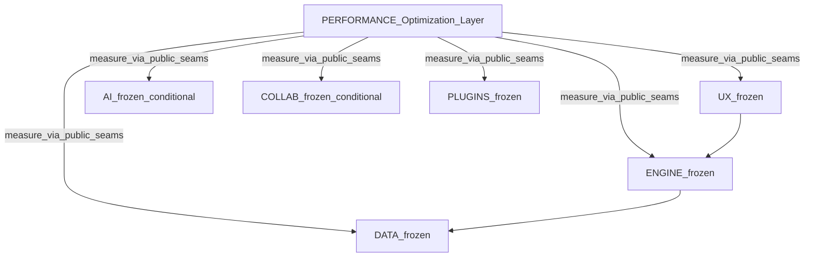

# Official Record

# PERFORMANCE-P1 — Measurement & Optimization Architecture

**Domain:** PERFORMANCE — Optimization Layer  
**Phase:** PERFORMANCE-P1  
**Date:** 2026-08-07  
**Nature:** Measurement & Optimization Architecture only — no functional vocabulary freeze, no component inventory, no public contracts, no APIs, metrics, benchmarks, runtime, code, or repository mutations beyond this Official Record (and the official-records README index entry)  
**Prerequisites:** PERFORMANCE Planning Charter **RELEASE CERTIFIED / FROZEN** · PERFORMANCE-P0 **RELEASE CERTIFIED / FROZEN** (Identity & Boundary Freeze) · Peer baseline per P0 / Charter  
**Status:** **RELEASE CERTIFIED / FROZEN**

**Planning Authority:** [`docs/PERFORMANCE/PERFORMANCE-Planning-Charter.md`](../PERFORMANCE-Planning-Charter.md) (**RELEASE CERTIFIED / FROZEN**; cite only; SHALL NOT rewrite)

**Identity Authority:** [`PERFORMANCE-P0 — Identity & Boundary Freeze`](./PERFORMANCE-P0-Identity-Boundary-Freeze.md) (**RELEASE CERTIFIED / FROZEN**; cite only; SHALL NOT reopen)

This is the second Official Record of the PERFORMANCE Planning Series. It materializes the architectural position of the PERFORMANCE Domain under Charter and Identity & Boundary Freeze authority. It does **not** introduce new constitutional principles.

**Authority Precedence (immutable):**

```
Project Governance
        ↓
Certified Architecture
        ↓
PERFORMANCE Planning Charter
        ↓
PERFORMANCE-P0 Identity & Boundary Freeze
        ↓
PERFORMANCE-P1 Measurement & Optimization Architecture
```

### Planning Rule — No New Constitutional Principles

PERFORMANCE-P1 SHALL NOT introduce new constitutional principles. Its purpose is to materialize the certified architectural position already frozen by the Charter and P0. Any new constitutional decision requires Charter revision and is outside this Official Record.

P1 may refine architecture **within** frozen boundaries. P1 may **NOT** override Charter or P0.

### Methodology Inheritance (cite only — do not recreate)

Planning lifecycle · Official Record methodology · freeze / evidence / traceability · Quality Gates — as defined under project governance and certified architecture (see Charter Methodology Inheritance).

### Baseline Freeze

| Item | Frozen value |
|------|----------------|
| ENGINE / DATA / AI / UX / COLLAB / PLUGINS | Immutable peer baseline (cite P0 §7 / Charter §10) |
| PERFORMANCE Planning Charter | **RELEASE CERTIFIED / FROZEN** — Planning Authority |
| PERFORMANCE-P0 Official Record | **RELEASE CERTIFIED / FROZEN** — Identity & Boundary Freeze; cited, not modified |
| PERFORMANCE-I\* | **LOCKED** until PERFORMANCE-P11 |
| ROADMAP.md / PROJECT_STATUS.md | **Unchanged** during PERFORMANCE-P\* |
| `src/performance/` | **Forbidden** during PERFORMANCE-P\* |
| PERFORMANCE-P2…P11 | **NOT AUTHORIZED / BLOCKED** by this record |

### No-Code Compliance Checklist (PERFORMANCE-P1)

- [x] No application source under `src/performance/`  
- [x] No APIs, TypeScript, collectors, registries, runtime components  
- [x] No validators, executable benchmarks, or CI performance gates  
- [x] No modification of ENGINE, DATA, AI, UX, COLLAB, PLUGINS, Charter, or P0  
- [x] No ROADMAP.md / PROJECT_STATUS.md updates  
- [x] No advance into PERFORMANCE-I\*  
- [x] No fictitious peer APIs or invented runtime contracts  
- [x] No per-peer P\* phases  
- [x] No P2+ functional / inventory / contract / lifecycle freezes opened inside this Record  

### Traceability

**Requirement → Decision → Evidence → Certification** (Implementation deferred until post–P11 I\*).

Every architectural freeze in this record traces to Charter/P0 or is identified as a **P1 architectural decision** refining within those boundaries.

---

## 1. Executive Summary

PERFORMANCE-P1 freezes **where** PERFORMANCE sits and **how** measurement/optimization is architected at planning level: Optimization Layer topology, conceptual measurement pipeline, measurement seam roles, profiling methodology, cross-domain observation, and diagnostics separation — without defining functional vocabulary, components, contracts, or implementation.

Identity and ownership remain in Charter / P0. Functional model is deferred to PERFORMANCE-P2. Peer Seam Matrix / Contract Freeze remain deferred to PERFORMANCE-P4.

Canonical identity (cite P0 / Charter):

> **Optimization Layer (PERFORMANCE Domain)**

Motto (cite P0 / Charter):

> **Optimize without owning.**

This Record establishes the **Architecture Freeze**.

---

## 2. Authority / Source of Truth

| Layer | Authority |
|-------|-----------|
| Planning Authority | [`PERFORMANCE-Planning-Charter.md`](../PERFORMANCE-Planning-Charter.md) — RELEASE CERTIFIED / FROZEN |
| Identity & Boundary | [`PERFORMANCE-P0-Identity-Boundary-Freeze.md`](./PERFORMANCE-P0-Identity-Boundary-Freeze.md) — RELEASE CERTIFIED / FROZEN |
| Certified Architecture | `docs/architecture/` — ARCHITECTURAL_LAYERS, DOMAIN_MATRIX, DEPENDENCY_MATRIX (cite via Charter) |
| Vision seed | MASTER ROADMAP V2 §20 / §27 (cite via Charter) |
| This freeze | This Official Record — Architecture only |

If this record conflicts with Charter or P0, Charter then P0 prevail and this record is invalid.

---

## 3. P1 Objective

Establish and freeze the **planning-level Measurement & Optimization Architecture** so later PERFORMANCE-P\* phases inherit an immutable architectural frame.

P1 **does**:

- confirm Optimization Layer position vs peers;
- freeze topology and dependency direction;
- freeze conceptual measurement pipeline;
- freeze seam **roles** (not contract catalogs);
- freeze profiling methodology at planning level;
- freeze cross-domain measurement as a PERFORMANCE capability (not a peer);
- freeze diagnostics separation;
- reaffirm architectural constraints / no-code.

P1 **does not**:

- redefine identity, ownership, or non-goals (P0 / Charter);
- invent peer APIs, concrete metrics, or numeric budgets;
- open Functional Model (P2), Inventory (P3), Contracts (P4), or I\*.

---

## 4. Architecture Position

**Requirement (Charter §7 / §11; P0 Identity Freeze):** PERFORMANCE is the Optimization Layer, not a product peer.

**Architecture Position (frozen):**

| Peer | Relationship to PERFORMANCE (planning-level / conceptual) |
|------|-------------------------------------------------------------|
| **ENGINE** | Observed/optimized via public orchestration seams; ENGINE owns Product Flows and workflow correctness |
| **DATA** | Observed/optimized via public scientific API seams; DATA owns scientific truth and processing semantics |
| **AI** | Observed/optimized **conditionally** when runtime assistance surfaces exist; AI owns reasoning |
| **UX** | Observed/optimized via presentation/interaction seams and UX→ENGINE boundary; UX owns presentation / Design System |
| **COLLAB** | Observed/optimized **conditionally** when COLLAB I\* runtime exists; COLLAB owns collaboration metadata |
| **PLUGINS** | Observed via governance/lifecycle seams where present; **execution** overhead **conditional**; PLUGINS owns interaction governance; peers own EPs |

PERFORMANCE **consumes** certified domains for measurement/optimization. PERFORMANCE is **never** required for peer product correctness.

Architectural authorities cited (not reopened): ARCHITECTURAL_LAYERS (Optimization Layer); DOMAIN_MATRIX (PERFORMANCE owns diagnostics/benchmarking/optimization/metrics as transversal discipline); DEPENDENCY_MATRIX (PERFORMANCE → every domain).

**Architecture Position Freeze:** IN FORCE.

---

## 5. Optimization Layer Topology



**Topology decisions (P1 architectural refinement within Charter §11):**

| Rule | Frozen statement |
|------|------------------|
| Dependency direction | PERFORMANCE → peer **public** contracts / conceptual seams only (future adapters in I\* follow this direction) |
| Inverse dependency | Peers **MUST NOT** depend on PERFORMANCE for product correctness |
| Orchestration | PERFORMANCE is **not** product orchestration; ENGINE remains sole Product Flow owner |
| Ownership | PERFORMANCE does **not** acquire peer capabilities through measurement or optimization |
| Coupling | No product event bus introduced by PERFORMANCE; no architectural coupling that violates peer boundaries |

**Optimization Layer Topology Freeze:** IN FORCE.

---

## 6. Measurement Architecture

**Requirement (Charter mission; Measure-Before-Optimize; P0 Scope):** performance must become measurable and evidence-driven before optimization.

**Conceptual pipeline (planning-level / conceptual — not APIs or components):**

```
Collect → Aggregate → Budget Evaluate → Evidence
```

| Stage | Role (conceptual) | Explicitly not in P1 |
|-------|-------------------|----------------------|
| **Collect** | Obtain observations at seams | No collectors, adapters, or runtime |
| **Aggregate** | Compose observations into comparable views | No registries or stores |
| **Budget Evaluate** | Compare observations to budget/SLO **policy** (policy ownership PERFORMANCE; numeric budgets deferred) | No threshold numbers; no gate engines |
| **Evidence** | Package reproducible measurement outcomes for analysis, Conflict Register input, and later gates | No evidence packager implementation |

Pipeline stages are architectural roles for later Inventory (P3), Contracts (P4), Lifecycle (P5), and I\*. They are **not** TypeScript modules, public APIs, or executable benchmarks.

**Measurement Architecture Freeze:** IN FORCE.

---

## 7. Measurement Seams

**Requirement (Charter §9–§10; P0 Boundary / Peer Baseline):** Seams are conceptual interaction points; formal Peer Seam Matrix / Contract Freeze reserved for P4.

**Seam topology and roles (planning-level / conceptual):**

| Seam focus | Role | Condition | Must not |
|------------|------|-----------|----------|
| **ENGINE** | Observe facade / command / Product Flow / lifecycle timings at **public** ENGINE boundary | Active | Expose ENGINE internals as PERFORMANCE API |
| **DATA** | Observe public DATA API operation timing / throughput envelopes at **public** DATA boundary | Active | Own scientific algorithms or persistence engines |
| **AI** | Observe assistance pathway latency and non-blocking behavior | **Conditional** — runtime assistance surfaces | Invent AI public APIs |
| **UX** | Observe interaction latency at UX→ENGINE boundary; UX-owned render/perceived-performance paths within UX ownership | Active | Absorb UX structural diagnostics ownership |
| **COLLAB** | Observe metadata op cost and non-blocking vs ENGINE | **Conditional** — COLLAB I\* runtime | Invent COLLAB runtime contracts; treat as scientific truth |
| **PLUGINS** | Observe admission / validation / compatibility duration where surfaces exist | Lifecycle where present; **execution conditional** | Invent plugin execution contracts; absorb EP ownership |
| **Cross-domain** | Observe systemic / end-to-end paths spanning peer seams (e.g. UX→ENGINE→DATA ± optional peers) | Active for certified path shapes; optional peers remain conditional | Create per-peer P\* or PERFORMANCE subdomains |

Seam concepts used here are those already supported by Charter §10 / P0 §6–§7. No new peer public contracts are invented.

Domain-local diagnostics remain peer-owned; PERFORMANCE may consume signals **only** through seams that preserve peer Never-Public / non-telemetry rules (cite Charter / P0).

**Measurement Seams Freeze (topology & roles):** IN FORCE.  
**Peer Seam Matrix / Contract Freeze:** DEFERRED to PERFORMANCE-P4.

---

## 8. Profiling Methodology

**Requirement (Charter Measure-Before-Optimize / Optimize-the-System; P0 Non-Goals):** evidence before optimization; no executable benchmarks in P\*.

**Planning methodology (frozen):**

1. **Baseline first** — establish a reproducible baseline before claiming improvement.  
2. **Reproducible measurement** — measurements must be repeatable under documented conditions (conditions detailed later; not invented here).  
3. **Compare against baseline** — regressions and improvements are relative to baseline, not subjective judgment alone.  
4. **Evidence before optimization** — no certification-grade optimization without prior evidence.  
5. **Optimize only after evidence** — optimization is optional and governed.  
6. **Re-measure after optimization** — before/after traceability required.  
7. **Profiling ≠ product/structural diagnostics** — distinct concern spaces (see §10).

Concrete metric names and numeric thresholds are **out of scope** for P1 (deferred to Functional Model / Budgets work in later P\* / I\*).

**Profiling Methodology Freeze:** IN FORCE.

---

## 9. Cross-Domain Measurement Model

**Requirement (Charter Optimize-the-System; P0 rejection of per-peer P\*):** PERFORMANCE measures the platform as an integrated system.

**Frozen model:**

| Statement | Value |
|-----------|-------|
| Capability owner | PERFORMANCE owns **cross-domain measurement** as a capability of the Optimization Layer |
| What it observes | Systemic / end-to-end scenarios composed from peer seams |
| What it is not | A separate peer; a new ownership domain; a set of P phases per peer; a replacement for peer ownership |
| Structure rule | No ENGINE/DATA/AI/UX/COLLAB/PLUGINS sub-phases under PERFORMANCE-P\* |
| Local vs system | Local peer measurement must not be treated as sufficient when system-level cost dominates |

**Cross-Domain Measurement Model Freeze:** IN FORCE.

---

## 10. Diagnostics Separation

**Requirement (Charter Never Owns peer diagnostics absorption; P0 Non-Goals #3):** PERFORMANCE does not absorb peer diagnostics ownership.

**Conceptually distinct planes:**

| Plane | Owner / role |
|-------|----------------|
| Peer **structural** diagnostics | Owning peer (ENGINE tracing, UX structural diagnostics, PLUGINS diagnostics/observability, etc.) |
| **Performance metrics** | PERFORMANCE (planning-level / conceptual until I\*) |
| **Profiling** | PERFORMANCE methodology (this Record §8) |
| **Evidence** | PERFORMANCE evidence packaging role (pipeline stage) |
| **Regression evaluation** | PERFORMANCE (planning-level; mechanisms later) |
| **Gate evaluation** | PERFORMANCE domain gates + project Performance Gate (cite Charter Certification Model; mechanisms later) |

PERFORMANCE coordinates measurement and evaluation; it **does not** take ownership of peer diagnostic packages or convert them into PERFORMANCE-owned peer telemetry APIs.

**Diagnostics Separation Freeze:** IN FORCE.

---

## 11. Architectural Constraints

Confirmed frozen for P1 and remaining PERFORMANCE-P\*:

- no product event bus introduced by PERFORMANCE;  
- no peer reopen;  
- no ownership transfer / ownership bleed;  
- no fictitious peer APIs;  
- no implementation during P\*;  
- no validators;  
- no executable benchmarks;  
- no CI performance gates;  
- no `src/performance/`;  
- no I-series until P11 unlock;  
- no ROADMAP / PROJECT_STATUS synchronization during P\*.

**Architectural Constraints Freeze:** IN FORCE (reaffirmation of Charter / P0; not new constitution).

---

## 12. Decisions Frozen

| ID | Decision | Trace |
|----|----------|-------|
| D-P1-01 | Architecture Position: Optimization Layer vs six peers as tabulated | Charter §7/§11; P0 Identity |
| D-P1-02 | Topology: PERFORMANCE → public seams; peers independent of PERFORMANCE for correctness | Charter §11; P1 refinement |
| D-P1-03 | PERFORMANCE ≠ product orchestration | Charter / P0 Never Owns ENGINE |
| D-P1-04 | Measurement pipeline Collect → Aggregate → Budget Evaluate → Evidence (conceptual) | Charter mission; P1 architecture |
| D-P1-05 | Seam topology & roles for ENGINE/DATA/AI/UX/COLLAB/PLUGINS/cross-domain; P4 owns full Seam Matrix | Charter §9–§10; P0 Boundary |
| D-P1-06 | Conditional seams preserved (AI / COLLAB / PLUGINS execution) | Charter §8; P0 §7 |
| D-P1-07 | Profiling methodology baseline-first / evidence-gated / before-after | Charter Measure-Before-Optimize; P1 |
| D-P1-08 | Cross-domain measurement is PERFORMANCE capability, not peer or per-peer P\* | Charter; P0 D-P0-10 |
| D-P1-09 | Diagnostics separation; no absorption of peer diagnostics | Charter / P0 Non-Goals |
| D-P1-10 | Architectural constraints reaffirmed; no product event bus | Charter Non-Goals; P1 |
| D-P1-11 | No concrete metrics, numeric budgets, APIs, or runtime in P1 | Charter No-Code; P0 |
| D-P1-12 | Architecture Freeze closes P1; Functional Model reserved for P2 | Charter ladder |

**Conflict Register:** remains **empty** at P1 (explicit); no peer contract change requested.

---

## 13. Dependencies

| Dependency | Type | Rule |
|------------|------|------|
| PERFORMANCE Planning Charter | Planning Authority | Cite; do not rewrite |
| PERFORMANCE-P0 | Identity & Boundary Freeze | Cite; do not reopen |
| Certified Architecture (layers / matrix) | Architecture SSOT | Cite via Charter |
| Peer public contracts | Frozen baseline | Observe via seams only; no reopen |
| PERFORMANCE-P2 | Functional Model | **NOT AUTHORIZED** by this record |
| PERFORMANCE-P4 | Peer Seam Matrix / Contracts | Deferred owner of contract catalog |
| PERFORMANCE-I\* | Implementation | **LOCKED** until P11 |

---

## 14. Evidence

| Evidence | Location / status |
|----------|-------------------|
| Planning Authority | `docs/PERFORMANCE/PERFORMANCE-Planning-Charter.md` — RELEASE CERTIFIED / FROZEN; unmodified by this execution |
| Identity & Boundary | `docs/PERFORMANCE/official-records/PERFORMANCE-P0-Identity-Boundary-Freeze.md` — RELEASE CERTIFIED / FROZEN; unmodified by this execution |
| Architecture seed | Charter §11; ARCHITECTURAL_LAYERS / DOMAIN_MATRIX (cited) |
| Peer baseline / conditionals | P0 §7; Charter §10 |
| This Official Record | `docs/PERFORMANCE/official-records/PERFORMANCE-P1-Measurement-and-Optimization-Architecture.md` |
| README index | `docs/PERFORMANCE/official-records/README.md` — P1 entry only |
| Implementation package | `src/performance/` — ABSENT (compliant) |
| Conflict Register | Empty (explicit) |
| Other new Official Records | None |

---

## 15. Validation / Exit Checklist

- [x] Charter remains RELEASE CERTIFIED / FROZEN (not modified)  
- [x] P0 remains RELEASE CERTIFIED / FROZEN (not modified)  
- [x] P1 consistent with Charter and P0; no new constitutional principles  
- [x] Architecture Position, Topology, Measurement Architecture frozen  
- [x] Measurement Seams topology/roles frozen; conditionals preserved; no fictitious APIs  
- [x] Profiling Methodology, Cross-Domain Model, Diagnostics Separation frozen  
- [x] Architectural Constraints reaffirmed  
- [x] Exactly one new P1 Official Record; README limited to P1 index entry  
- [x] No peer modifications; no ownership bleed; no implementation  
- [x] `src/performance/` absent; no validators / executable benchmarks / CI  
- [x] No P2–P11 records; I\* locked; no ROADMAP/PROJECT_STATUS sync  
- [x] Traceability Requirement → Decision → Evidence → Certification present  
- [x] Certification Status = RELEASE CERTIFIED / FROZEN  

---

## 16. Certification Status

**RELEASE CERTIFIED / FROZEN** — 2026-08-07

PERFORMANCE-P1 Measurement & Optimization Architecture is complete.

**Architecture Freeze:** IN FORCE

PERFORMANCE-P2 is **NOT AUTHORIZED** by this record and requires separate authorization.

---

## 17. Unlock State

| Item | State |
|------|-------|
| PERFORMANCE Planning Charter | **CERTIFIED / FROZEN** |
| PERFORMANCE-P0 | **CERTIFIED / FROZEN** |
| PERFORMANCE-P1 | **CERTIFIED / FROZEN** |
| PERFORMANCE-P2 | **NOT AUTHORIZED** |
| PERFORMANCE-P3…P11 | **BLOCKED** |
| PERFORMANCE-I0…I10 | **LOCKED** |
| `src/performance/` | **FORBIDDEN** |
| Peer source / freezes | **IMMUTABLE** under PERFORMANCE Planning |
| ROADMAP / PROJECT_STATUS sync | **DEFERRED** until post–P11 |
