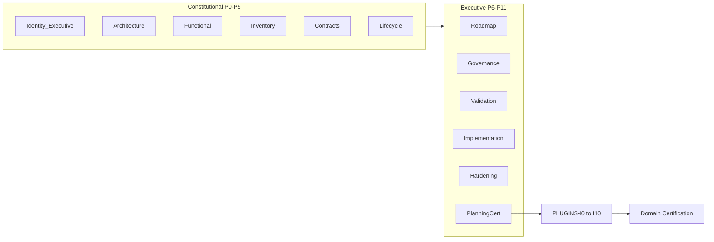
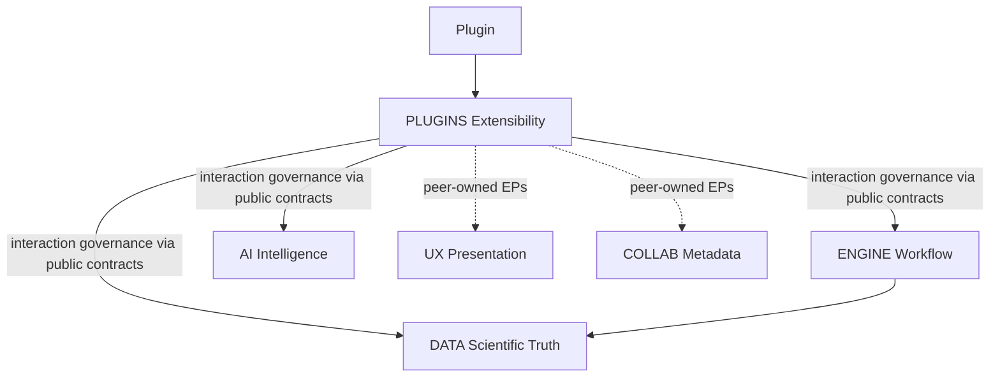

# PLUGINS Planning Charter

**Artifact:** PLUGINS Planning Charter  
**Status:** **RELEASE CERTIFIED**  
**Date:** 2026-08-07  
**Role:** Planning Authority for the PLUGINS Planning Series (PLUGINS-P0…P11) and subsequent PLUGINS-I\* under inherited project methodology  
**Nature:** Extensibility-domain planning constitution only — does not recreate Scientific Graph AI project methodology  
**Path:** `docs/PLUGINS/PLUGINS-Planning-Charter.md`

---

## Verdict

PLUGINS Planning inherits the RELEASE-CERTIFIED project methodology as **stable infrastructure**. This Charter is the **official planning artifact** for the PLUGINS Domain. Official Records **cite** this Charter; they do **not** re-copy its constitutional freezes and principles.

Documentation stays compact relative to AI; executive phases (P7–P10) stay thin and cite project standards + this Charter.

Reading order: Methodology → Documentation → Constitutional Seed → Ownership → Series Shape → Integration → Citation → Authority Precedence.

---

## Authority Precedence (immutable)

```
Project Governance
        ↓
Certified Architecture
        ↓
PLUGINS Planning Charter
        ↓
PLUGINS Official Records
```

**Citation formulas (stable):**

> **Planning Authority:** `docs/PLUGINS/PLUGINS-Planning-Charter.md` (RELEASE CERTIFIED)

or

> This Official Record is governed by the PLUGINS Planning Charter and the Scientific Graph AI certified project methodology.

**Citation rule:** Extension Point Ownership Freeze, Plugins Extend Never Own, Public Contracts Only, Capability-Based Access, Isolation & Sandbox Philosophy, Lifecycle Predictability, Version Compatibility, Plugins Optional, Category Taxonomy Prepared / V1 Selection Deferred, PLUGINS SSOT, Ownership Matrix, and Future Evolution exclusions are **defined once in this Charter**. P0–P11 reference them; they do not reproduce them unless a phase-specific delta is required. The Charter SHALL NOT be rewritten by Official Records.

---

## Methodology Inheritance

PLUGINS Planning inherits certified project methodology as infrastructure. Official Records **cite** these authorities; they do **not** recreate them.

| Layer | Authority (SSOT) |
|-------|------------------|
| Constitution | [docs/governance/](../governance/) — PROJECT_PRINCIPLES, DOMAIN_BOUNDARIES, CERTIFICATION_FRAMEWORK, QUALITY_GATES, DECISION_FRAMEWORK, ARCHITECTURE_GOVERNANCE |
| Architecture | [docs/architecture/](../architecture/) — DOMAIN_MATRIX, DEPENDENCY_MATRIX, SYSTEM_INTERACTIONS, ARCHITECTURE_DECISIONS, ARCHITECTURAL_PATTERNS |
| Domain vision seed | [MASTER ROADMAP V2](../roadmaps/MASTER%20ROADMAP%20V2.md) **§19 PLUGINS Domain**, **§26 PLUGINS Strategy** |
| Peer freezes | ENGINE, DATA, AI, UX, COLLAB — all **RELEASE CERTIFIED** / immutable under PLUGINS Planning |
| Method pattern | COLLAB Official Record template: Authority Precedence · Series Opening Frame · Freeze ladder · Planning Finality · no-code during P\* |
| **PLUGINS Planning Authority** | **This PLUGINS Planning Charter (RELEASE CERTIFIED)** |

**Conflict rule (inherited):** Architectural Decisions and certified peer domains prevail. PLUGINS Planning never reopens ENGINE/DATA/AI/UX/COLLAB freezes. Within PLUGINS planning, this Charter prevails over informal notes; certified Official Records prevail for their frozen phase content.

**Out of scope for this series:** recreating planning/certification/freeze/evidence/traceability methodology, generic Quality Gates, or any peer-domain ownership.

---

## Documentation Layout

Mirror COLLAB / AI Official Record layout:

```
docs/PLUGINS/
  PLUGINS-Planning-Charter.md   # THIS ARTIFACT — Planning Authority (RELEASE CERTIFIED)
  official-records/             # PLUGINS-P0 … PLUGINS-P11 (planning only; cite Charter)
  implementation/               # reserved post–Planning Certification (PLUGINS-I*)
```

- No `src/plugins/` (or equivalent) during PLUGINS-P\*.
- No ROADMAP.md / PROJECT_STATUS.md sync until after Planning Certification (same AI/COLLAB rule).
- Each Official Record: lean header (**Planning Authority citation** + Authority Precedence + freeze matrix) → **phase-specific extensibility architecture only** → exit criteria. No methodology essays. No re-copy of Charter principles.
- Symmetry preserved: **PLUGINS-I0 … PLUGINS-I10** after Planning Certification (same I-series shape as ENGINE / DATA / AI / UX / COLLAB).

**Size target:** substantially smaller than AI — aim roughly **≤50% of AI-P\* total line count**, with P7–P10 especially short (deltas only). PLUGINS-P0 is denser than COLLAB-P0 because it is an Executive Planning Foundation; later constitutional phases remain lean.

---

## Constitutional Seed

Materialized from MASTER ROADMAP V2 §19 / §26; refined across P0–P2.

**Canonical identity:** Extensibility Layer (PLUGINS Domain).

**Motto:**

> **Extend the platform without compromising its architecture.**

**Owns:** extension framework (integration governance), plugin lifecycle, registration/discovery, permissions/capabilities model, compatibility validation, extension metadata/diagnostics, future public SDK governance, governance of plugin interaction with peer-owned extension points through public contracts.

**Never owns:** peer extension points (design / evolution / versioning); ENGINE workflow orchestration; DATA scientific processing/truth; AI reasoning; UX presentation / Design System ownership; COLLAB collaboration metadata; Platform persistence / runtime infrastructure.

**Integration rule:** Plugins **extend** certified peer domains through peer-owned extension points and public contracts; they never bypass architectural layers and never transfer ownership.

---

### Extension Point Ownership Freeze (binding)

> **Peer domains exclusively own their extension points.**
>
> **PLUGINS owns only the governance of plugin interaction with those extension points through public contracts.**

Each peer domain remains responsible for designing, evolving, and versioning its own extension points. PLUGINS provides only the integration framework.

This freeze permanently prevents interpretation that PLUGINS owns the internal extension-point mechanism of ENGINE, DATA, AI, UX, COLLAB, or Platform.

---

### Plugins Extend, Never Own (constitutional principle)

> **Plugins extend. Plugins never own.**
>
> A plugin contributes capabilities without absorbing peer-domain ownership.
>
> Contribution never transfers Decision Authority, scientific truth, workflow orchestration, presentation ownership, or collaboration metadata ownership.

---

### Public Contracts Only (constitutional principle)

> **Plugins SHALL interact exclusively through documented public contracts.**
>
> Direct access to internal implementation is permanently prohibited.
>
> API Freeze and No Core Access follow from this principle.

---

### Capability-Based Access (constitutional principle)

> **Plugin access SHALL be capability-based and explicit.**
>
> Permissions are granted, discoverable, and least-privilege by default.
>
> Unrestricted platform access is forbidden.

---

### Isolation & Sandbox Philosophy (constitutional principle)

> **Plugins execute within controlled architectural boundaries.**
>
> Isolation protects peer domains from plugin failure, conflict, and unsafe behavior.
>
> Sandbox philosophy is architectural intent at Charter level; concrete sandbox mechanisms are deferred to later Planning (P1/P4/P10) and Implementation.

---

### Lifecycle Predictability (constitutional principle)

> **Every plugin SHALL follow a predictable lifecycle.**
>
> Seed stages (MASTER ROADMAP §19): Discovery → Validation → Registration → Initialization → Execution → Monitoring → Update → Removal.
>
> Detailed lifecycle contracts and failure semantics are deferred to PLUGINS-P5.

---

### Version Compatibility (constitutional principle)

> **Public interaction surfaces SHALL evolve through versioning, not silent breakage.**
>
> Peer domains own versioning of their extension points.
>
> PLUGINS owns compatibility governance for plugin–platform interaction (validation, negotiation, diagnostics) without absorbing peer EP ownership.

---

### Plugins Optional (constitutional principle)

> **Scientific Graph AI SHALL remain scientifically and architecturally functional without plugins.**
>
> Plugins augment. Plugins never become a runtime dependency for scientific correctness or core product operation of certified peers.

---

### Category Taxonomy Prepared; V1 Selection Deferred (constitutional principle)

> **The architecture SHALL be prepared for multiple plugin categories.**
>
> Representative prepared categories include UI, Engine, Data, AI, Workflow, and Future categories.
>
> **Which categories exist in V1 SHALL NOT be decided in PLUGINS-P0.** Selection is deferred to later Planning under this Charter.

---

### Future Evolution (explicitly excluded from v1 Planning / early Implementation)

Prepared only as extension points / strategic horizon; **not** designed, contracted, or scheduled as deliverables in PLUGINS-P\* / early PLUGINS-I\* unless a later certified phase explicitly opens them:

- scientific plugin marketplace
- institutional plugin repositories
- cloud-based / remote execution extensions
- commercial plugin licensing
- community extension catalogs as product surfaces

Cite MASTER ROADMAP §19 Future Evolution / §26 Long-Term Evolution; do not reopen in P0.

**Hard exclusions for the entire Planning Series until a later phase explicitly authorizes otherwise:** marketplace implementation, remote execution, loaders, SDK implementation, public API implementation, and application source under `src/plugins/`.

---

## PLUGINS SSOT

Owned **exclusively** by PLUGINS:

- Extension framework (integration governance)
- Plugin lifecycle coordination
- Registration / capability discovery (plugin-side)
- Permissions / capability governance for plugins
- Compatibility validation (plugin–platform interaction)
- Extension metadata and plugin diagnostics
- Future public SDK governance (when opened)

Everything else references certified peer domains. Peer extension points remain peer-owned (Extension Point Ownership Freeze).

---

## Ownership Matrix

| Capability | Owner |
|------------|-------|
| Workflow | ENGINE |
| Scientific Objects / Truth | DATA |
| AI Decisions / Reasoning | AI |
| Presentation / Design System | UX |
| Collaboration Metadata | COLLAB |
| Peer extension points (design, evolution, versioning) | Owning peer domain |
| Plugin interaction governance via public contracts | PLUGINS |
| Extension framework / plugin lifecycle | PLUGINS |

---

## Series Shape (P0–P11 / I0–I10)



| Phase | Deliverable | Freeze | Plugins-only focus |
|-------|-------------|--------|-------------------|
| **P0** | Executive Planning Foundation | Identity + Executive Foundation | Identity Freeze; cite Charter; program vision/architecture/roadmap/risks at executive grain; no methodology/code; no V1 category selection |
| **P1** | Domain Architecture | Architecture | Ecosystem position; deps; isolation model; topology of peer-owned EPs + PLUGINS interaction governance; cite Charter |
| **P2** | Domain Definition | Functional | Capabilities + vocabulary grounded in PLUGINS SSOT; cite Extension Point Ownership Freeze |
| **P3** | Component Inventory | Inventory | Conceptual components only — no code; no peer EP internals inventoried as PLUGINS components |
| **P4** | Contract Strategy | Contract | Public contracts + peer seams; API Freeze; EP ownership preserved |
| **P5** | Lifecycle | Lifecycle | Plugin lifecycle; failure semantics; cite Lifecycle Predictability |
| **P6** | Master Implementation Roadmap | Roadmap | **PLUGINS-I0…I10** path; §26 epics mapped to I-phases; marketplace/remote as Future Evolution only |
| **P7** | Execution Governance | Governance | **Deltas only** vs project frameworks (permission/compatibility change rules) |
| **P8** | Validation Strategy | Validation | **Deltas only**; cite Isolation / Contracts / Plugins Optional / EP Ownership |
| **P9** | Implementation Strategy | Implementation | Package boundaries, build waves, adapters toward certified peers |
| **P10** | Hardening Strategy | Hardening | Security boundaries, conflict containment, update/compatibility integrity |
| **P11** | Planning Certification | Planning Certification | Evidence-only close; unlock PLUGINS-I\*; certify series under Charter |

Post-P11 (inherited workflow): Official Records → Build Specs / I-series → Validation Plan execution → Certification Plan → Domain Certification.

---

## Cross-Domain Integration



Allowed deps (already frozen in DEPENDENCY_MATRIX): PLUGINS → ENGINE, DATA, AI. UX and COLLAB participate through peer-owned extension points and public contracts without transferring ownership.

**Failure semantics:** PLUGINS unavailable ⇒ peers remain fully operational (Plugins Optional).

High-level ownership for integration:

| Domain | Owns |
|--------|------|
| ENGINE | Workflow (+ ENGINE extension points) |
| DATA | Scientific entities / truth (+ DATA extension points) |
| AI | Reasoning (+ AI extension points) |
| UX | Presentation (+ UX extension points) |
| COLLAB | Collaboration metadata (+ COLLAB extension points) |
| PLUGINS | Governance of plugin interaction with those extension points through public contracts |

---

## Success Criteria for the Planning Series

- PLUGINS Planning Charter published and citable as RELEASE CERTIFIED Planning Authority.
- PLUGINS-P0 Official Record certified as Identity + Executive Foundation Freeze.
- Complete PLUGINS-P1…P11 Official Records, freezes, and Planning Certification — each citing the Charter.
- Implementation-ready extensibility architecture integrating ENGINE, DATA, AI, UX, COLLAB under Charter Ownership Matrix + principles.
- Methodology and Charter principles referenced, not duplicated across P\*.
- Documentation substantially smaller than AI Planning Series while preserving freeze/traceability/certification quality.
- Marketplace / remote execution / loaders / SDK / public API implementation explicitly excluded until later authorized phases; extension points / strategic horizon only where applicable.
- Extension Point Ownership Freeze held throughout: peers own EPs; PLUGINS owns interaction governance only.
- V1 plugin category selection not frozen in P0.
- PLUGINS-I0…I10 symmetry preserved with peer domain I-series.
- Domain status remains **PLANNED** in ops docs until post–P11 sync (inherited rule).

---

## Certification Status

**RELEASE CERTIFIED** — 2026-08-07

This Charter is the immutable Planning Authority for the PLUGINS Planning Series. Official Records cite it; they SHALL NOT rewrite it.
