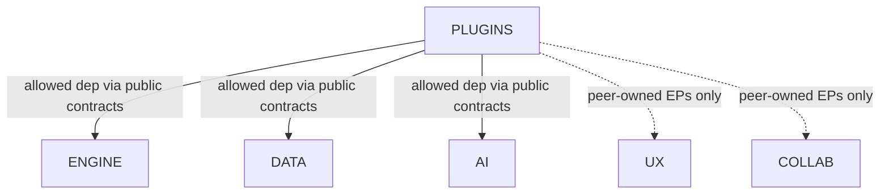
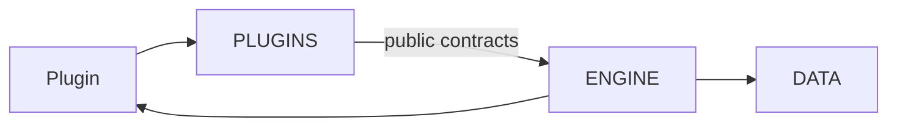

# Official Record

# PLUGINS-P1 — Domain Architecture

**Domain:** PLUGINS — Extensibility Layer  
**Phase:** PLUGINS-P1  
**Date:** 2026-08-07  
**Nature:** Domain architecture only — no components, package structure, APIs, contracts, SDK, loaders, lifecycle detail, plugin metadata schemas, marketplace, runtime, code, or repository mutations beyond this Official Record  
**Prerequisites:** PLUGINS-P0 **CERTIFIED** (Identity + Executive Foundation Freeze) · PLUGINS Planning Charter **RELEASE CERTIFIED** · ENGINE, DATA, AI, UX, COLLAB — all **RELEASE CERTIFIED**  
**Status:** **CERTIFIED**

**Planning Authority:** [`docs/PLUGINS/PLUGINS-Planning-Charter.md`](../PLUGINS-Planning-Charter.md) (**RELEASE CERTIFIED**; cite only; SHALL NOT rewrite)

**Identity Authority:** [`PLUGINS-P0 — Executive Planning Foundation`](./PLUGINS-P0-Executive-Planning-Foundation.md) (**Identity + Executive Foundation Freeze CERTIFIED**; cite only; SHALL NOT reopen)

This is the second Official Record of the PLUGINS Planning Series. It materializes the architectural position of the PLUGINS Domain under Charter and Identity Freeze authority.

**Authority Precedence (immutable):**

```
Project Governance → Certified Architecture → PLUGINS Planning Charter → PLUGINS-P0 → PLUGINS-P1
```

### Planning Rule — No New Principles

PLUGINS-P1 SHALL NOT introduce new constitutional principles. Its purpose is to materialize the certified architectural position of the PLUGINS Domain. Any new constitutional decision requires an explicit Charter revision and is outside the scope of this Official Record.

### Baseline Freeze

| Item | Frozen value |
|------|----------------|
| ENGINE / DATA / AI / UX / COLLAB | **RELEASE CERTIFIED** — immutable under PLUGINS Planning |
| PLUGINS Planning Charter | **RELEASE CERTIFIED** — Planning Authority |
| PLUGINS-P0 Official Record | **CERTIFIED** — Identity + Executive Foundation Freeze; cited, not modified |
| PLUGINS Domain (product status) | **PLANNED** — Planning Series open at PLUGINS-P1 |
| PLUGINS-I\* | **BLOCKED** until Planning Certification |
| ROADMAP.md / PROJECT_STATUS.md | **Unchanged** during PLUGINS-P\* |
| `src/plugins/` | **Forbidden** during PLUGINS-P\* |

### No-Code Compliance Checklist (PLUGINS-P1)

- [x] No application source under `src/plugins/`  
- [x] No components, contracts, SDK, loaders, APIs, marketplace, or runtime  
- [x] No modification of ENGINE, DATA, AI, UX, COLLAB, Charter, or PLUGINS-P0  
- [x] No ROADMAP.md / PROJECT_STATUS.md updates  
- [x] No advance into PLUGINS-I\*  
- [x] No V1 plugin category selection  
- [x] No PLUGINS-P2+ functional vocabulary, inventory, contracts, or lifecycle freezes opened inside this Record  

---

## 1. Executive Summary

PLUGINS-P1 freezes **where** the PLUGINS Domain sits: Platform Extensibility Layer, dependency direction, extension-point topology, isolation model, capability flow (architectural), conceptual layers, and cross-domain interaction—without defining implementation components.

Identity remains in PLUGINS-P0. Functional vocabulary is deferred to PLUGINS-P2. This Record establishes the **Architecture Freeze**.

Canonical identity (cite P0 / Charter):

> **Extensibility Layer (PLUGINS Domain)**

Architectural role synonym (DOMAIN_MATRIX): Platform Extensibility.

Responsibility: **governing extensibility** — not implementing peer functionality.

---

## 2. Architectural Vision

PLUGINS is the permanent Platform Extensibility Layer of Scientific Graph AI: the architectural surface through which governed plugins interact with peer-owned extension points via public contracts, without redesigning certified peers or absorbing their ownership.

Extensibility strengthens the platform. It never replaces Architecture First, SSOT, Governance, Validator Gates, or Release Certification.

---

## 3. Architectural Position

PLUGINS sits in the **Ecosystem** layer alongside COLLABORATION (ARCHITECTURAL_LAYERS). Peers ENGINE, DATA, AI, UX, COLLAB are RELEASE CERTIFIED. Platform Services remain Platform-owned infrastructure.

Materialized by reference: DOMAIN_MATRIX · DEPENDENCY_MATRIX · SYSTEM_INTERACTIONS · ARCHITECTURAL_LAYERS · MASTER ROADMAP V2 §19 / §26.

Position statements (frozen):

- PLUGINS is the Extensibility Layer / Platform Extensibility owner.  
- PLUGINS governs plugin interaction; peers own their extension points (**Cite Charter** — Extension Point Ownership Freeze).  
- PLUGINS depends on public contracts of allowed peers; peers never depend on plugins.  
- Plugins never own peers.  
- PLUGINS is optional relative to scientific correctness and core peer operation (**Cite Charter** — Plugins Optional).  

```text
                    ┌─────────────────────────┐
                    │     Ecosystem Layer     │
                    │  COLLAB  │  PLUGINS     │
                    └────┬─────┴──────┬───────┘
                         │            │
         ┌───────────────┼────────────┼───────────────┐
         ▼               ▼            ▼               ▼
        UX            ENGINE         AI             DATA
         │               │            │               │
         └───────────────┴─────┬──────┴───────────────┘
                               ▼
                      Platform Services
                               ▼
                         Core / Runtime
```

(Diagram is positional only — not a dependency claim that PLUGINS depends on UX/COLLAB as DEPENDENCY_MATRIX edges. UX/COLLAB participate via peer-owned extension points and public contracts; see §5–§8.)

---

## 4. Architectural Responsibilities

PLUGINS is architecturally responsible for:

- governing controlled platform extensibility;  
- coordinating plugin registration / discovery intent;  
- governing capability-based access intent;  
- governing compatibility validation intent (plugin–platform interaction);  
- coordinating lifecycle predictability at architectural level (detail → P5);  
- governing plugin interaction with peer-owned extension points through public contracts;  
- preserving isolation and failure boundaries at architectural level.  

PLUGINS is **not** architecturally responsible for:

- implementing ENGINE workflows, DATA science, AI reasoning, UX presentation, or COLLAB metadata;  
- designing, evolving, or versioning peer extension points;  
- owning Platform Services or Core;  
- delivering SDK, loaders, marketplace, or runtime in this phase.  

---

## 5. Dependency Architecture

Materializes [DEPENDENCY_MATRIX](../../architecture/DEPENDENCY_MATRIX.md):

| Source | Allowed dependencies |
|--------|----------------------|
| **PLUGINS** | **ENGINE, DATA, AI** |

Additional architectural rules (frozen):

| Rule | Statement |
|------|-----------|
| Public contracts only | PLUGINS depends on **public contracts**, never internal implementation (**Cite Charter**) |
| Peers never depend on plugins | ENGINE, DATA, AI, UX, COLLAB SHALL NOT take a hard dependency on PLUGINS for scientific correctness or core operation |
| Plugins never own peers | Contribution never transfers ownership (**Cite Charter** — Plugins Extend, Never Own) |
| UX / COLLAB | Participate through **peer-owned extension points** and public contracts; not listed as DEPENDENCY_MATRIX edges for PLUGINS |
| Platform Services | Consumed indirectly through documented public services of allowed layers; PLUGINS never owns Platform |
| Implicit deps | Prohibited |



**Forbidden:** PLUGINS → peer internals · Peer → PLUGINS (hard) · Plugin → Core bypass · circular domain deps involving PLUGINS ownership transfer.

---

## 6. Extension Point Topology

**Cite Charter** — Extension Point Ownership Freeze:

> Peer domains exclusively own their extension points.  
> PLUGINS owns only the governance of plugin interaction with those extension points through public contracts.

### Topology elements (architectural vocabulary — not contracts)

| Element | Architectural meaning | Owner |
|---------|----------------------|--------|
| **Extension Point** | Documented peer surface where extension may attach | Owning peer domain |
| **Plugin** | Governed extension unit contributing capabilities | Contributed under PLUGINS governance; never owns peers |
| **Capability** | Declared unit of permitted contribution / access | Governed by PLUGINS; exercised only via peer EPs + public contracts |
| **Public Contract** | Documented interaction boundary | Defined later (P4); cited as architectural requirement now |
| **Registration** | Architectural act of making a plugin/capability platform-visible under governance | PLUGINS governance |
| **Validation** | Architectural gate before activation (compatibility / permission intent) | PLUGINS governance |
| **Execution** | Architectural use of peer EP via public contracts after activation | Peer owns EP behavior; PLUGINS owns interaction governance |

### Topology rule

```text
Plugin
  │ declares Capability
  ▼
PLUGINS  (Registration → Validation → Activation governance)
  │ interacts only through Public Contracts
  ▼
Peer-owned Extension Point  (ENGINE | DATA | AI | UX | COLLAB | Platform-as-applicable)
  │
  ▼
Peer Domain behavior  (ownership unchanged)
```

**Frozen:** peers design / evolve / version their EPs. PLUGINS does not absorb EP internals.

**Deferred:** contract schemas (P4), registration metadata (later), runtime binding, loaders, SDK.

**Not frozen here:** which V1 categories exist (cite P0 / Charter — Category Taxonomy Prepared; V1 Selection Deferred).

---

## 7. Isolation Architecture

Architectural isolation only — no runtime implementation.

| Concern | Architectural statement |
|---------|-------------------------|
| **Plugin isolation** | Each plugin is a bounded extension unit; it must not reach peer internals or other plugins’ private state through non-contract paths |
| **Failure boundaries** | Plugin failure SHALL NOT cascade into peer scientific correctness or core workflow authority; peers remain operable (**Plugins Optional**) |
| **Core protection** | No Core Access; Public Contracts Only; plugins never bypass layers |
| **Sandbox philosophy** | Plugins execute within controlled architectural boundaries (permissions, capability limits, monitored interaction intent) |
| **Conflict containment** | Conflicting plugins are an isolation concern; resolution mechanisms deferred to later Planning (P5/P10) |

**Deferred:** concrete sandbox technology, process/worker models, loader isolation, monitoring implementation.

---

## 8. Capability Architecture

High-level capability flow only. **Detailed lifecycle deferred to PLUGINS-P5.**

```text
Capability Declaration
        ↓
     Validation
        ↓
     Activation
        ↓
     Execution   (via peer-owned EPs + public contracts)
        ↓
     Revocation
```

| Stage | Architectural intent |
|-------|----------------------|
| Declaration | Plugin states required capabilities under PLUGINS governance |
| Validation | Compatibility and permission intent checked before use |
| Activation | Capability becomes eligible for governed use |
| Execution | Interaction occurs only through public contracts at peer-owned EPs |
| Revocation | Capability eligibility may be withdrawn without transferring peer ownership |

Capability-Based Access and Permissions (**Cite Charter**) bind this flow. No lifecycle contracts, state machines, or APIs are defined here.

---

## 9. Architectural Layers (Conceptual)

Conceptual layers only — **not** classes, packages, or components (inventory → P3).

```text
┌──────────────────────────────────────────┐
│                 Plugin                   │
├──────────────────────────────────────────┤
│          Extensibility Layer             │  ← PLUGINS
├──────────────────────────────────────────┤
│            Public Contracts              │  ← seams (detail → P4)
├──────────────────────────────────────────┤
│           Platform Services              │  ← Platform-owned
├──────────────────────────────────────────┤
│             Core Domains                 │  ← ENGINE · DATA · AI · UX · COLLAB
├──────────────────────────────────────────┤
│           Scientific Engine              │  ← ENGINE coordination + DATA truth path
└──────────────────────────────────────────┘
```

Rules:

- Downward consumption through public contracts only.  
- Ownership never moves upward into Plugin or sideways into PLUGINS from peers.  
- Scientific Engine path remains peer-owned; plugins may extend it only through ENGINE/DATA EPs under governance.

---

## 10. Cross-Domain Integration

| Peer | Owns | PLUGINS architectural relationship |
|------|------|-------------------------------------|
| **ENGINE** | Workflow + ENGINE EPs | Allowed dependency; plugins may extend workflows; never replace orchestration |
| **DATA** | Scientific truth + DATA EPs | Allowed dependency; plugins may contribute via DATA EPs; never own truth |
| **AI** | Reasoning + AI EPs | Allowed dependency; plugins may contribute via AI EPs; never own reasoning |
| **UX** | Presentation + UX EPs | Peer-owned EPs / public contracts; never owns Design System or presentation |
| **COLLAB** | Collaboration metadata + COLLAB EPs | Peer-owned EPs / public contracts; never owns collaboration metadata |
| **Platform** | Persistence / runtime services | Consumed via documented public services; never owned by PLUGINS |

SYSTEM_INTERACTIONS Plugin Workflow (cited):

```text
Plugin → PLUGINS → ENGINE → DATA → ENGINE → Plugin
```

Plugins interact through documented public services. Ownership is never transferred. Circular communication is prohibited.



---

## 11. Ownership Boundaries

**Cite Charter** — Ownership Matrix (reaffirmed, not redefined):

| Capability | Owner |
|------------|-------|
| Workflow | ENGINE |
| Scientific Objects / Truth | DATA |
| AI Decisions / Reasoning | AI |
| Presentation / Design System | UX |
| Collaboration Metadata | COLLAB |
| Peer extension points (design, evolution, versioning) | Owning peer domain |
| Plugin interaction governance via public contracts | PLUGINS |
| Extension framework / plugin lifecycle governance | PLUGINS |

---

## 12. Architectural Principles

**Cite Charter / P0 only — No New Principles:**

1. Architecture First  
2. SSOT  
3. Governance First (inherited project governance; Validator Gates / Release Certification)  
4. Plugins Extend, Never Own  
5. Extension Point Ownership  
6. Public Contracts Only / API Freeze / No Core Access  
7. Capability-Based Access  
8. Isolation & Sandbox Philosophy  
9. Version Compatibility  
10. Plugins Optional  
11. Lifecycle Predictability (architectural citation only; detail → P5)  
12. Category Taxonomy Prepared; V1 Selection Deferred  
13. Registry Pattern / Service Layer / Event Bus / Design System — inherited; respected, not redefined  
14. Validator Inheritance — PLUGINS Planning and future Implementation SHALL NOT bypass certified Validator Gates  

---

## 13. Architectural Constraints

- No redesign of ENGINE, DATA, AI, UX, COLLAB  
- No `src/plugins/` during PLUGINS-P\*  
- No ROADMAP / PROJECT_STATUS sync during PLUGINS-P\*  
- No components, contracts, SDK, loaders, marketplace, remote execution, or runtime in this Record  
- Marketplace / remote execution remain Future Evolution (**Cite Charter**) unless a later certified phase opens them  

---

## 14. Risks (Architecture-Level)

| Risk | Mitigation (architecture-level only) |
|------|--------------------------------------|
| Architectural coupling to peer internals | Public Contracts Only; No Core Access; DEPENDENCY_MATRIX |
| Dependency inversion violations | Allowed edges only (ENGINE, DATA, AI); peers never hard-depend on plugins |
| Cross-domain leakage / ownership bleed | Extension Point Ownership Freeze; Ownership Matrix; Plugins Extend Never Own |
| Plugin isolation failures | Isolation Architecture; Failure boundaries; Plugins Optional |
| Version drift | Version Compatibility; peers own EP versioning; PLUGINS owns interaction compatibility governance |
| Architectural erosion via “temporary” bypasses | Architecture First; Governance First; Validator Inheritance; no implicit deps |

Detailed hardening deferred to PLUGINS-P10.

---

## 15. Deferred Decisions

This phase explicitly does **not** define:

| Deferred theme | Deferred to |
|----------------|-------------|
| Functional model / vocabulary | PLUGINS-P2 |
| Component inventory | PLUGINS-P3 |
| Public contracts / API surfaces | PLUGINS-P4 |
| Lifecycle details / state machines | PLUGINS-P5 |
| Implementation roadmap (I\*) | PLUGINS-P6 |
| SDK | Later authorized phase |
| Loaders | Later authorized phase |
| Plugin metadata schemas | Later Planning / Implementation |
| Marketplace | Future Evolution |
| Runtime / sandbox technology | Later Planning / Implementation |
| V1 plugin category selection | Beyond P0/P1 (still deferred) |
| Implementation / `src/plugins/` | Blocked until Planning Certification |

---

## 16. Architecture Freeze

Frozen as architectural authority for the remainder of the PLUGINS Planning Series (inherit by reference; SHALL NOT reopen):

- Domain architecture / position (Extensibility Layer / Platform Extensibility)  
- Domain responsibilities (govern extensibility; do not implement peer functionality)  
- Dependency model (PLUGINS → ENGINE, DATA, AI via public contracts; peers never hard-depend on plugins)  
- Extension Point Topology rules (peers own EPs; PLUGINS owns interaction governance)  
- Isolation Architecture (architectural)  
- Capability Architecture flow stages (Declaration → Validation → Activation → Execution → Revocation)  
- Conceptual layer stack  
- Cross-domain integration relationships  
- Ownership relationships (Charter matrix reaffirmed)  

Deferred: vocabulary (P2) · inventory (P3) · contracts (P4) · lifecycle (P5) · executive I-series (P6+).

---

## 17. Evidence

| Evidence | Status |
|----------|--------|
| Planning Authority — Charter | RELEASE CERTIFIED |
| Identity Authority — PLUGINS-P0 | CERTIFIED |
| DEPENDENCY_MATRIX · SYSTEM_INTERACTIONS · DOMAIN_MATRIX · ARCHITECTURAL_LAYERS | Cited |
| MASTER ROADMAP V2 §19 / §26 | Cited |
| Peer domains ENGINE / DATA / AI / UX / COLLAB | RELEASE CERTIFIED |
| This Official Record | Registered under `docs/PLUGINS/official-records/` |
| `src/plugins/` | ABSENT (compliant) |

---

## 18. Exit Criteria

- [x] Architectural position and vision stated  
- [x] Responsibilities stated (govern extensibility; not peer functionality)  
- [x] Dependency architecture materialized (ENGINE, DATA, AI; peers never depend on plugins)  
- [x] Extension Point Topology frozen (EP Ownership cited)  
- [x] Isolation Architecture stated without runtime  
- [x] Capability Architecture flow stated without lifecycle freeze  
- [x] Conceptual layers stated without components  
- [x] Cross-domain integration stated with ownership preserved  
- [x] Architectural principles cited (No New Principles)  
- [x] Architecture-level risks and mitigations recorded  
- [x] Deferred decisions explicit  
- [x] Architecture Freeze declared  
- [x] No components, contracts, SDK, loaders, code, or peer redesign  
- [x] Certification Status = CERTIFIED  

---

## 19. Certification Status

**CERTIFIED** — 2026-08-07

| Field | Value |
|-------|--------|
| **PLUGINS-P1 Status** | **CERTIFIED** |
| **Official Record** | **RELEASE READY** |
| **Planning Charter** | **RELEASE CERTIFIED** (unmodified) |
| **PLUGINS-P0** | **CERTIFIED** (unmodified) |
| **Repository** | **UNCHANGED** (Official Record registration only) |
| **Functional Model** | **NOT STARTED** (deferred to PLUGINS-P2) |
| **Implementation** | **BLOCKED** |
| **PLUGINS-I\*** | **BLOCKED** |
| **Next Phase** | **PLUGINS-P2 — Functional Model** (not opened by this Record) |

PLUGINS-P1 Architecture Freeze is complete. PLUGINS-P2 may proceed under the PLUGINS Planning Charter.

---

## 20. Registration Note

Registration path:

`docs/PLUGINS/official-records/PLUGINS-P1-Domain-Architecture.md`

Subsequent PLUGINS Planning phases shall cite this Record, PLUGINS-P0, and the Charter and shall not modify them.

---

**End of Official Record — PLUGINS-P1 Domain Architecture**
