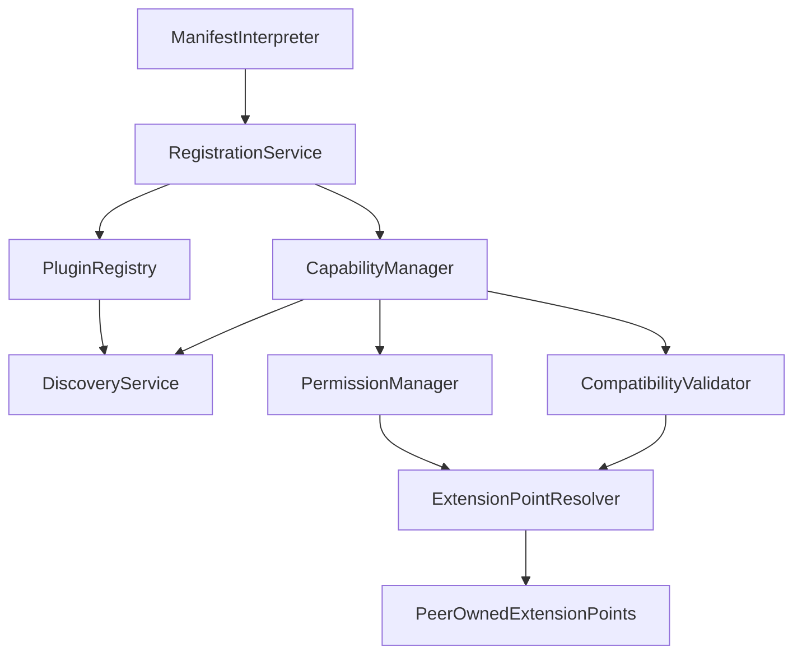

# Official Record

# PLUGINS-P3 — Component Inventory

**Domain:** PLUGINS — Extensibility Layer  
**Phase:** PLUGINS-P3  
**Date:** 2026-08-07  
**Nature:** Conceptual component inventory only — no package structure, APIs, interfaces, classes, persistence, schemas, runtime composition, source layout, code, or repository mutations beyond this Official Record  
**Prerequisites:** PLUGINS-P0 **CERTIFIED** · PLUGINS-P1 **CERTIFIED** (Architecture Freeze) · PLUGINS-P2 **CERTIFIED** (Functional Freeze) · PLUGINS Planning Charter **RELEASE CERTIFIED** · ENGINE, DATA, AI, UX, COLLAB — all **RELEASE CERTIFIED**  
**Status:** **CERTIFIED**

**Planning Authority:** [`docs/PLUGINS/PLUGINS-Planning-Charter.md`](../PLUGINS-Planning-Charter.md) (**RELEASE CERTIFIED**; cite only; SHALL NOT rewrite)

**Identity Authority:** [`PLUGINS-P0`](./PLUGINS-P0-Executive-Planning-Foundation.md) (**CERTIFIED**)  
**Architecture Authority:** [`PLUGINS-P1`](./PLUGINS-P1-Domain-Architecture.md) (**CERTIFIED**)  
**Functional Authority:** [`PLUGINS-P2`](./PLUGINS-P2-Functional-Model.md) (**CERTIFIED**)

This Official Record materializes the conceptual inventory required to realize the Platform Extensibility Layer under prior freezes. Concepts are architectural building blocks only — not modules, packages, classes, or files.

**Authority Precedence (immutable):**

```
Project Governance → Certified Architecture → Charter → PLUGINS-P0 → PLUGINS-P1 → PLUGINS-P2 → PLUGINS-P3
```

### Planning Rule — No New Constitutional Principles

PLUGINS-P3 SHALL NOT introduce new constitutional principles. SHALL NOT modify Identity, Architecture, or Functional Freezes, or Charter principles. Constitutional change requires an explicit Charter revision.

### Component Inventory Constitutional Freeze

> **Component Inventory is conceptual only.**
>
> Component names, responsibilities, and ownership become part of the architectural model.
>
> Internal classes, packages, modules, files, runtime composition, and implementation structure remain implementation concerns and are explicitly deferred to later phases.

### Baseline Freeze

| Item | Frozen value |
|------|----------------|
| Charter / P0 / P1 / P2 | **CERTIFIED** — cited; not modified |
| Peers ENGINE / DATA / AI / UX / COLLAB | **RELEASE CERTIFIED** |
| PLUGINS Domain (product status) | **PLANNED** — open at PLUGINS-P3 |
| PLUGINS-I\* | **BLOCKED** until Planning Certification |
| ROADMAP.md / PROJECT_STATUS.md | **Unchanged** during PLUGINS-P\* |
| `src/plugins/` | **Forbidden** during PLUGINS-P\* |

### No-Code Compliance Checklist (PLUGINS-P3)

- [x] No application source under `src/plugins/`  
- [x] No contracts, lifecycle, schemas, APIs, SDK, loaders, runtime, or source layout  
- [x] No modification of Charter, P0, P1, P2, or peer domains  
- [x] No ROADMAP.md / PROJECT_STATUS.md updates  
- [x] No advance into PLUGINS-I\*  
- [x] No peer Extension Point internals inventoried as PLUGINS components  

---

## 1. Executive Summary

PLUGINS-P3 freezes **which conceptual building blocks** realize the Functional Freeze and Architecture Freeze: a conceptual inventory for the Platform Extensibility Layer, with exclusive responsibilities, ownership, relationships, registry strategy, and service boundaries.

Identity (P0), architecture (P1), and functional model (P2) remain immutable. This Record establishes the **Inventory Freeze**. Contracts, lifecycle, and implementation remain deferred.

---

## 2. Inventory Vision

The inventory makes extensibility governable as a set of exclusive conceptual services: discovery and registration of plugins, validation of participation, capability and permission governance, compatibility checking, resolution of references to peer-owned extension points, diagnostics, and a future public SDK boundary—without absorbing peer domain logic or peer Extension Points.

Conceptual inventory ≠ physical architecture ≠ packages ≠ classes ≠ APIs ≠ runtime.

---

## 3. Complete Component Inventory

Inventory derives exclusively from PLUGINS-P2 vocabulary and PLUGINS-P1 topology, within Charter constraints (Extension Point Ownership; Public Contracts Only; Plugins Optional).

| ID | Conceptual component | Realizes (cite P2 / P1) | Nature |
|----|----------------------|-------------------------|--------|
| C1 | Extension Framework | Cross-cutting integration governance for plugin interaction | Core |
| C2 | Plugin Registry | Registration / Discovery visibility of Plugins | Core |
| C3 | Discovery Service | Discovery of registered Plugins / Capabilities | Core |
| C4 | Registration Service | Registration of Plugins and declared Capabilities | Core |
| C5 | Lifecycle Coordinator | Lifecycle Event coordination intent (detail → P5) | Core |
| C6 | Capability Manager | Capability Declaration / Availability governance | Core |
| C7 | Permission Manager | Permission / Authorization intent (rules → P4) | Core |
| C8 | Compatibility Validator | Compatibility Before Execution | Core |
| C9 | Diagnostics Service | Diagnostics observability | Core |
| C10 | Extension Point Resolver | Binding Capabilities to peer-owned Extension Points via public contracts | Core |
| C11 | Manifest Interpreter | Interpreting Manifest conceptual declarations | Concept only |
| C12 | Future Public SDK Boundary | Future stable developer surface governance boundary | Concept only / future |

No peer Extension Point internals are PLUGINS components. Marketplace / remote execution / loader components are excluded (Charter Future Evolution / hard exclusions).

---

## 4. Component Responsibilities

For each component: purpose, primary responsibility, owned concepts, inputs, outputs, dependencies, collaboration.

### C1 — Extension Framework

| Field | Content |
|-------|---------|
| Purpose | Provide the conceptual nexus of PLUGINS integration governance |
| Primary responsibility | Coordinate collaboration among PLUGINS conceptual services without owning peer logic |
| Owned concepts | Integration governance cohesion |
| Inputs | Participation requests / governance intents from peer-facing flows (conceptual) |
| Outputs | Coordinated governance outcomes across inventory services |
| Dependencies | C2–C10 (conceptual collaboration); public peer contracts (cite P1) |
| Collaboration | Supervises predictable collaboration among inventory services; sole conceptual nexus for cross-cutting extensibility governance |

### C2 — Plugin Registry

| Field | Content |
|-------|---------|
| Purpose | Maintain conceptual registry of registered Plugins |
| Primary responsibility | Authoritative registry surface for Plugin Identity visibility |
| Owned concepts | Registered Plugin entries (conceptual) |
| Inputs | Registration outcomes from C4 |
| Outputs | Registry visibility for C3 / validators / diagnostics |
| Dependencies | C4 (writes); C3 (reads); C8 (compatibility status association — conceptual) |
| Collaboration | Registry Pattern SSOT for Plugin visibility; does not own Capabilities exclusively (see C6) |

### C3 — Discovery Service

| Field | Content |
|-------|---------|
| Purpose | Locate registered Plugins / Capabilities eligible for consideration |
| Primary responsibility | Discovery |
| Owned concepts | Discovery queries / discovery results (conceptual) |
| Inputs | Discovery intent; C2 registry visibility; C6 capability visibility |
| Outputs | Discovered Plugin / Capability references |
| Dependencies | C2, C6 |
| Collaboration | Reads registries; never registers; never activates |

### C4 — Registration Service

| Field | Content |
|-------|---------|
| Purpose | Perform governed Registration of Plugins and declared Capabilities |
| Primary responsibility | Registration |
| Owned concepts | Registration acts (conceptual) |
| Inputs | Manifest interpretation outcomes (C11); Plugin Identity / Version / declared Capabilities |
| Outputs | Registration requests toward C2 / C6; Validation triggers toward C8 / C7 |
| Dependencies | C11 (concept); C2; C6; collaborates with C7, C8 before Activation eligibility |
| Collaboration | Discovery → Registration chain partner; does not execute peer domain logic |

### C5 — Lifecycle Coordinator

| Field | Content |
|-------|---------|
| Purpose | Coordinate Lifecycle Events conceptually across participation |
| Primary responsibility | Lifecycle predictability coordination (stages detail → P5) |
| Owned concepts | Lifecycle Event coordination intent |
| Inputs | Registration / Validation / Activation / Revocation intents |
| Outputs | Ordered lifecycle coordination signals (conceptual) |
| Dependencies | C4, C6, C7, C8, C9 |
| Collaboration | Observes / sequences participation events; does not define lifecycle contracts here |

### C6 — Capability Manager

| Field | Content |
|-------|---------|
| Purpose | Govern declared Capabilities |
| Primary responsibility | Capability Declaration, Availability, and capability-side governance |
| Owned concepts | Declared Capabilities (conceptual) |
| Inputs | Declarations from Registration / Manifest |
| Outputs | Capability eligibility views for Authorization / Resolver / Discovery |
| Dependencies | C4, C7, C8, C10 |
| Collaboration | Capabilities are Declarative / Never Inferred (cite P2); never owns peer Extension Points |

### C7 — Permission Manager

| Field | Content |
|-------|---------|
| Purpose | Constrain Capability Authorization by Permission intent |
| Primary responsibility | Permission / Authorization governance (evaluation rules → P4) |
| Owned concepts | Permission intent / Authorization outcomes (conceptual) |
| Inputs | Declared Permission intent; Capability references |
| Outputs | Authorization decisions (conceptual) |
| Dependencies | C6 |
| Collaboration | Least Privilege; does not own peer access-control systems outside PLUGINS governance |

### C8 — Compatibility Validator

| Field | Content |
|-------|---------|
| Purpose | Validate Compatibility before Execution eligibility |
| Primary responsibility | Platform / Contract / Version / Capability Compatibility governance (algorithms deferred) |
| Owned concepts | Compatibility assessments (conceptual) |
| Inputs | Plugin Version; declared Capabilities; contract/version intent |
| Outputs | Compatible / incompatible assessments |
| Dependencies | C2, C6; consumes peer EP versioning facts via public contracts (peers own EP versions) |
| Collaboration | Validation Before Activation / Compatibility Before Execution (cite P2) |

### C9 — Diagnostics Service

| Field | Content |
|-------|---------|
| Purpose | Provide Diagnostics for Plugin participation health and failures |
| Primary responsibility | Diagnostics observability |
| Owned concepts | Diagnostic signals (conceptual) |
| Inputs | Outcomes from C4, C5, C7, C8, C10 |
| Outputs | Diagnostic views / signals |
| Dependencies | Observes C2–C8, C10; never mutates peer scientific truth |
| Collaboration | Supports hardening visibility later; no ownership of peer domains |

### C10 — Extension Point Resolver

| Field | Content |
|-------|---------|
| Purpose | Resolve Capability binding to peer-owned Extension Points through public contracts |
| Primary responsibility | Extension Point reference resolution / binding intent |
| Owned concepts | Resolved EP references / binding intents (conceptual) — **not** Extension Points themselves |
| Inputs | Authorized Capabilities; peer EP identifiers via public contracts |
| Outputs | Binding intents toward peer-owned EPs |
| Dependencies | C6, C7, C8; public contracts of ENGINE / DATA / AI / UX / COLLAB as applicable |
| Collaboration | Enforces Extension Point Ownership Freeze: peers own EPs; Resolver only governs interaction binding |

### C11 — Manifest Interpreter (concept only)

| Field | Content |
|-------|---------|
| Purpose | Interpret Manifest conceptual declarations |
| Primary responsibility | Manifest interpretation intent |
| Owned concepts | Interpreted declaration views (conceptual) |
| Inputs | Manifest (concept — schema deferred) |
| Outputs | Structured declaration intent for C4 / C6 / C7 / C8 |
| Dependencies | None beyond conceptual Manifest surface |
| Collaboration | Concept only; no schema; no loader |

### C12 — Future Public SDK Boundary (concept only)

| Field | Content |
|-------|---------|
| Purpose | Reserve the future stable developer surface boundary |
| Primary responsibility | SDK governance boundary intent (delivery deferred) |
| Owned concepts | SDK boundary concept |
| Inputs | Future authorized Planning / Implementation |
| Outputs | None in v1 Planning (boundary reserved) |
| Dependencies | None for current Planning delivery |
| Collaboration | Concept only; no SDK implementation in this series until authorized |

---

## 5. Ownership Matrix

No ownership overlap. Peer Extension Points remain peer-owned.

| Component | Owns | Never Owns | Consumes | Produces |
|-----------|------|------------|----------|----------|
| C1 Extension Framework | Integration governance cohesion | Peer logic; EPs; science; UI; collab metadata | Service outcomes from C2–C10 | Coordinated governance |
| C2 Plugin Registry | Plugin registry visibility | Capabilities SSOT (C6); EPs; peer domains | Registration outcomes | Registry entries |
| C3 Discovery Service | Discovery results | Registration authority; Activation | Registry / capability visibility | Discovery results |
| C4 Registration Service | Registration acts | Peer logic; Compatibility algorithms | Manifest views; declarations | Registration outcomes |
| C5 Lifecycle Coordinator | Lifecycle coordination intent | Lifecycle contracts/runtime (→ P5); peer flows | Registration/validation/activation intents | Coordination signals |
| C6 Capability Manager | Declared Capabilities | Permissions SSOT (C7); EPs | Declarations | Capability eligibility |
| C7 Permission Manager | Permission / Authorization intent | Peer IAM systems; Capability SSOT | Capability refs; permission intent | Authorization outcomes |
| C8 Compatibility Validator | Compatibility assessments | Peer EP versioning ownership | Version/capability/contract intent | Compatibility assessments |
| C9 Diagnostics Service | Diagnostic signals | Scientific truth; workflow authority | Service outcomes | Diagnostics |
| C10 Extension Point Resolver | Binding intents / EP references | Extension Points; peer domain logic | Authorized capabilities; public contracts | Binding intents |
| C11 Manifest Interpreter | Interpreted declaration views | Manifest schema; loaders | Manifest concept | Declaration intent |
| C12 Future Public SDK Boundary | SDK boundary concept | SDK implementation; APIs | — | Reserved boundary |

**Cite Charter** Ownership Matrix: PLUGINS owns plugin interaction governance; peers own Extension Points and domain logic.

---

## 6. Component Relationships

Conceptual relationships only. **No runtime sequencing.**

```text
Manifest Interpreter (C11)
        ↓
Registration Service (C4)
        ↓
   ┌────┴────┐
   ▼         ▼
Plugin     Capability
Registry   Manager
(C2)       (C6)
   │         │
   ▼         ▼
Discovery  Permission Manager (C7)
Service    Compatibility Validator (C8)
(C3)              │
                  ▼
         Extension Point Resolver (C10)
                  │
                  ▼
         Peer-owned Extension Points
         (via Public Plugin Contracts)

Lifecycle Coordinator (C5)  ← coordinates C4 / C6 / C7 / C8 / C9 intents
Diagnostics Service (C9)    ← observes C2–C8, C10
Extension Framework (C1)    ← cross-cutting governance nexus
Future Public SDK Boundary (C12) — reserved; not on v1 participation path
```

Relationship examples (frozen as conceptual collaboration, not call graphs):

| Relation | Meaning |
|----------|---------|
| Discovery → Registration | Discovery locates; Registration admits (distinct responsibilities) |
| Registration → Validation | Registration triggers Compatibility / Permission validation intent |
| Validation → Capability Manager | Compatibility / Permission outcomes affect Capability Availability |
| Capability Manager → Extension Point Resolver | Authorized Capabilities resolve to peer-owned EPs |
| Diagnostics → Lifecycle | Diagnostics observe Lifecycle Events without owning lifecycle |
| Registry ↔ Compatibility | Registry visibility associates with Compatibility assessments |

---

## 7. Dependency Model

Conceptual components depend only on:

- public responsibilities of other inventory components;  
- public contracts of allowed peers (cite P1: PLUGINS → ENGINE, DATA, AI; UX/COLLAB via peer-owned EPs);  
- conceptual services within this inventory.  

| Rule | Statement |
|------|-----------|
| Direction | Prefer acyclic conceptual dependency: Declaration/Registration → Validation → Capability/Permission → Resolver → Peer EPs |
| Circular deps | Prohibited among ownership claims; observational edges (Diagnostics, Lifecycle coordination) do not create ownership cycles |
| Architecture First | No dependency on unimplemented runtime, loaders, or SDK |
| No Core Access | No dependency on peer internals |



---

## 8. Registry Strategy

Conceptual registry roles under Registry Pattern. **No storage. No data structures. No implementation.**

| Registry role | Conceptual purpose | Stewardship |
|---------------|-------------------|-------------|
| **Plugin Registry** | Visibility of registered Plugins / Plugin Identity | C2 |
| **Capability Registry** | Visibility of declared Capabilities (registry facet) | Stewarded with C6; not a separate inventory owner overlapping C6 |
| **Extension Point Registry** | Index of **references** to peer-owned Extension Points for resolution | Stewarded with C10; **does not own** Extension Points |
| **Compatibility Registry** | Association of Compatibility assessments with Plugin / Capability visibility | Stewarded with C8; observational to C2/C6 |

**Anti-proliferation rule:** registry roles are conceptual facets of governance, not an unbounded set of independent product registries. Peer domains retain their own registries/services; PLUGINS does not absorb them.

---

## 9. Service Boundaries

Clear separation of conceptual services:

| Service boundary | Components | Responsibility |
|------------------|------------|----------------|
| Validation services | C8 (+ C7 authorization intent) | Validation Before Activation; Compatibility Before Execution |
| Registration services | C4, C2, C11 | Admit Plugins / declarations into governed visibility |
| Compatibility services | C8 | Compatibility assessments across platform/contract/version/capability dimensions |
| Diagnostic services | C9 | Observability without ownership transfer |
| Capability services | C6, C7, C10 | Declare, authorize, and bind Capabilities to peer-owned EPs |
| Lifecycle coordination services | C5 | Coordinate Lifecycle Events (detail → P5) |
| Framework governance | C1 | Cross-cutting cohesion without absorbing exclusive service ownership |
| Future SDK boundary | C12 | Reserved; inactive for current Planning delivery |

No service may absorb another service’s exclusive ownership (SSOT).

---

## 10. Cross-Domain Integration

All integrations through public contracts. No ownership transfer.

| Peer | Inventory interaction | Ownership preserved |
|------|----------------------|---------------------|
| **ENGINE** | C10 resolves to ENGINE-owned EPs; C1 governs interaction; workflows remain ENGINE | ENGINE owns orchestration + ENGINE EPs |
| **DATA** | C10 resolves to DATA-owned EPs for data contributions | DATA owns scientific truth + DATA EPs |
| **AI** | C10 resolves to AI-owned EPs for intelligence contributions | AI owns reasoning + AI EPs |
| **UX** | C10 resolves to UX-owned EPs for UI contributions | UX owns presentation / Design System + UX EPs |
| **COLLAB** | C10 resolves to COLLAB-owned EPs for collab surface contributions | COLLAB owns collaboration metadata + COLLAB EPs |

C9 Diagnostics never mutate peer scientific truth. C5 never orchestrates ENGINE Product Flows. C12 does not create peer dependencies.

---

## 11. Architectural Patterns

Inherited platform patterns applied to this inventory (**cite Charter / P0 / P1 / P2**):

| Pattern / principle | Application to inventory |
|---------------------|--------------------------|
| SSOT | Exclusive ownership per component (§5) |
| Registry Pattern | Registry Strategy (§8) |
| Service Layer | Service Boundaries (§9) |
| Dependency Direction | §7; DEPENDENCY_MATRIX (P1) |
| Validator Strategy / Validator Inheritance | C8; Governance First |
| Governance First | C1 coordination under project governance |
| Architecture First | Conceptual only; no implementation |
| No Core Access | C10 / all services via public contracts only |
| Public Contracts Only | Cross-domain integration rule |
| Capability-Based Access | C6 + C7 |
| Plugins Extend, Never Own | Entire inventory; especially C10 |

---

## 12. Component Principles

Frozen for inventory interpretation:

1. **Single Responsibility** — one primary responsibility per component  
2. **Exclusive Ownership** — no overlapping Owns columns  
3. **Explicit Dependencies** — no hidden coupling  
4. **Conceptual Isolation** — components are conceptual; not runtime units  
5. **Stable Responsibilities** — responsibilities do not drift across Planning without Charter revision  
6. **No Hidden Coupling** — observational edges (Diagnostics / Lifecycle) are explicit  
7. **Replaceability** — conceptual replaceability of implementation later without changing inventory ownership  
8. **Predictable Collaboration** — relationships in §6 are the collaboration map  
9. **No Runtime Assumptions** — no loaders, threads, processes, or dynamic loading assumed  

---

## 13. Risks

| Risk | Architectural mitigation |
|------|--------------------------|
| Component overlap | Exclusive Ownership Matrix; Single Responsibility |
| Responsibility leakage into peers | Extension Point Ownership; C10 never owns EPs; Public Contracts Only |
| Circular dependencies | Acyclic declaration→validation→resolve path; observational edges only for C5/C9 |
| Registry proliferation | Anti-proliferation rule; registry facets under C2/C6/C8/C10 |
| Capability duplication | C6 is Capability SSOT; Capabilities Never Inferred (P2) |
| Architectural erosion | Inventory Freeze; Architecture First; no runtime assumptions |
| Over-centralization | C1 coordinates but does not absorb C2–C10 exclusive ownership |
| Cross-domain coupling | Only public contracts; DEPENDENCY_MATRIX; Plugins Optional |

---

## 14. Deferred Decisions

| Deferred theme | Deferred to |
|----------------|-------------|
| Public Plugin Contracts / APIs | PLUGINS-P4 |
| Lifecycle model / state machines | PLUGINS-P5 |
| Implementation roadmap (I\*) | PLUGINS-P6 |
| Runtime / sandbox technology | Later Planning / Implementation |
| Loaders / dynamic loading | Later authorized phase |
| SDK implementation | Later authorized phase |
| Manifest schema / metadata schema | Later Planning / Implementation |
| Dependency resolution algorithms | Later Planning / Implementation |
| Compatibility algorithms | Later Planning / Implementation |
| Permission evaluation matrices | P4 / later |
| Source layout / code organization / `src/plugins/` | Blocked until Planning Certification / I\* |
| Marketplace / plugin distribution | Future Evolution |

---

## 15. Inventory Freeze

Frozen as inventory authority for the remainder of the PLUGINS Planning Series (inherit by reference; SHALL NOT reopen):

- Conceptual inventory C1–C12  
- Component responsibilities  
- Ownership Matrix  
- Component relationships  
- Dependency model (conceptual)  
- Registry Strategy (including anti-proliferation rule)  
- Service Boundaries  
- Component Principles  

**Component Inventory Constitutional Freeze** remains binding: conceptual only; implementation structure deferred.

Subsequent Records SHALL NOT add v1 conceptual components without Charter revision. Marketplace / loader / remote-execution components remain excluded.

---

## 16. Evidence

| Evidence | Status |
|----------|--------|
| Charter · P0 · P1 · P2 | CERTIFIED — cited |
| P2 vocabulary / P1 topology | Inventory derivation source |
| Peer domains | RELEASE CERTIFIED |
| This Official Record | Registered under `docs/PLUGINS/official-records/` |
| `src/plugins/` | ABSENT (compliant) |

---

## 17. Exit Criteria

- [x] Complete conceptual inventory C1–C12 materialized  
- [x] Responsibilities (purpose, owns concepts, I/O, deps, collaboration) stated  
- [x] Ownership Matrix with Owns / Never Owns / Consumes / Produces  
- [x] Relationships, dependency model, registry strategy, service boundaries stated  
- [x] Cross-domain integration without ownership transfer  
- [x] Architectural patterns and component principles recorded  
- [x] Risks and deferred decisions explicit  
- [x] Component Inventory Constitutional Freeze declared  
- [x] No contracts, lifecycle, schemas, APIs, SDK, loaders, source layout, or code  
- [x] Prior Freezes not reopened; No New Constitutional Principles  
- [x] Certification Status = CERTIFIED  

---

## 18. Certification Status

**CERTIFIED** — 2026-08-07

| Field | Value |
|-------|--------|
| **PLUGINS-P3 Status** | **CERTIFIED** |
| **Inventory Freeze** | **IN FORCE** |
| **Planning Charter / P0 / P1 / P2** | Unmodified · in force |
| **Repository** | **UNCHANGED** (Official Record registration only) |
| **Public Contracts** | **NOT STARTED** (deferred to PLUGINS-P4) |
| **Implementation** | **BLOCKED** |
| **PLUGINS-I\*** | **BLOCKED** |
| **Next Phase** | **PLUGINS-P4 — Public Contracts** (not opened by this Record) |

PLUGINS-P3 Inventory Freeze is complete. PLUGINS-P4 may proceed under the PLUGINS Planning Charter.

---

## 19. Registration Note

Registration path:

`docs/PLUGINS/official-records/PLUGINS-P3-Component-Inventory.md`

Subsequent PLUGINS Planning phases shall cite this Record and prior authorities and shall not modify them.

---

**End of Official Record — PLUGINS-P3 Component Inventory**
