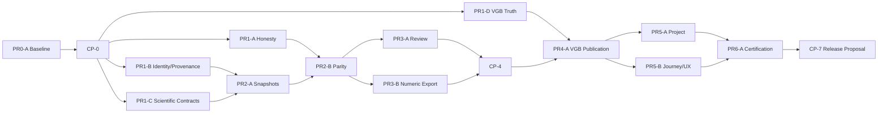

# Scientific Graph AI — Detailed Implementation Roadmap

**Record Date:** 2026-08-21
**Authority:** PROJECT OWNER / PRODUCT GOVERNANCE AUTHORITY
**Roadmap Status:** **FROZEN / AUTHORIZED FOR IMPLEMENTATION**
**Implementation Status:** **NOT STARTED**
**Entry Point:** **PR0-A — Contract, Ownership, and Regression Baseline**
**Final Certification:** [CERTIFIED AFTER CORRECTIONS](../PRODUCT/official-records/FINAL-ROADMAP-CERTIFICATION.md)

---

## 1. Authority and Guardrails

This is the repository-authoritative Detailed Implementation Roadmap for the frozen [Product Reorganization Baseline](../PRODUCT/official-records/PRODUCT-REORGANIZATION-BASELINE.md).

Inputs:

- [Final Product Gap Inventory](../PRODUCT/FINAL-PRODUCT-GAP-INVENTORY.md), checkpoint `0c6a40c`;
- [Product Decision Register PD-01–PD-07](../PRODUCT/official-records/PRODUCT-DECISION-REGISTER-PD-01-PD-07.md);
- [Inventory Decision Supersession](../PRODUCT/official-records/PRODUCT-INVENTORY-DECISION-SUPERSESSION.md);
- Tier 3 checkpoint `f0730a2`;
- current repository and validator evidence;
- Researcher Journey and Workflow Reconciliation.

Frozen guardrails:

- PD-01–PD-07 may not be reinterpreted.
- Tier 3 remains closed; no T3-022+ or estimator changes are authorized.
- No monolithic result model is mandated.
- Graph Editor and VGB remain separate.
- VGB does not automatically feed Analysis.
- Project and Session continuity remain separate.
- runtime AI/AIR-1 remains deferred.
- no broad size-driven `page.tsx` refactor is authorized.
- no validator may be changed merely to obtain PASS.
- unknown implementation homes remain to be determined by the owning phase.

This roadmap authorizes implementation sequencing. It does not assert that any phase has already been executed or passed.

---

## 2. Authorized Route

```text
PR0-A
  → PR1-A / PR1-B / PR1-C / PR1-D
  → PR2-A / PR2-B
  → PR3-A / PR3-B
  → PR4-A
  → PR5-A / PR5-B
  → PR6-A
```

Phase boundaries exist only for a contract, ownership, persistence, validation or certification reason. Researcher Journey work is integrated into PR0-A, PR5-B and PR6-A; it is not a separate phase.

---

## 3. Product Contracts

| Contract | Authority | Depends on | Primary implementation | Primary validation |
|---|---|---|---|---|
| **CTR-01 Capability identity** | PD-01/02 | Frozen decisions | PR1-A.1 | Scientific Honesty Gate |
| **CTR-02 Artifact identity** | PD-06 | Artifact taxonomy | PR1-B.1, then lifecycle consumers | Artifact Foundation / Project Continuity |
| **CTR-03 Provenance** | PD-04/06 | CTR-02, existing data identities | PR1-B.2, then consumers | Provenance / Output Parity |
| **CTR-04 Scientific result inventory** | Scientific authority | CTR-03 references | PR1-C.1 | Scientific Contract / Output Parity |
| **CTR-05 Composite disclosure** | PD-02 | CTR-01/04 | PR1-A.2 | Scientific Honesty / Output Parity |
| **CTR-06 Semantic parity** | PD-04 | CTR-02–05 | PR2-B | Output Parity and downstream gates |
| **CTR-07 Citable snapshots** | PD-06 | CTR-02–04 | PR2-A.1 | Snapshot / Project |
| **CTR-08 Generated-text review** | PD-07 | CTR-02/06 | PR3-A | Researcher Authority |
| **CTR-09 VGB figure lifecycle** | PD-03 | CTR-02/03/06/08 | PR4-A | VGB Publication / Project |
| **CTR-10 Numeric export** | PD-05 | CTR-02–07 | PR3-B | Numeric Export / Output Parity |
| **CTR-11 Comparison freshness** | PD-06 | CTR-03/07 | PR2-A.2 | Snapshot / Freshness |
| **CTR-12 PCA semantic identity** | PD-04 | CTR-01/03/04 | PR1-C.2 | Scientific Contract / VGB parity |
| **CTR-13 Project/session boundary** | Frozen lifecycle boundary | CTR-02/07/11 | PR5-A durable portion | Project Continuity |

The contract graph is acyclic. Contracts may be implemented incrementally by capability or artifact, but no downstream consumer may bypass an unmet prerequisite.

---

## STAGE 0 — Architecture and Current-Behavior Baseline

### PR0-A — Contract, Ownership, and Regression Baseline

**Objective:** establish authoritative current behavior and map frozen product semantics to repository owners before source mutation.

**Workstreams:** WS-A, WS-J.
**Capabilities:** PC-01–PC-15.
**Prerequisites:** frozen Product Reorganization Baseline and 24-gap inventory.

**Inputs**

- current result types/builders;
- project schemas;
- VGB contracts;
- Results/Report/PDF/export behavior;
- validator inventory;
- current researcher entry points and continuity behavior.

**Outputs**

- authority and ownership catalog;
- CTR-01–CTR-13 owner/consumer map;
- federated result-contract inventory frame;
- current semantic-parity matrix;
- gap and validator traceability;
- researcher-journey baseline;
- explicit validation gaps and non-blocking unknowns.

**Validation:** characterize targeted gates and known debt without manipulating failures.

**Gate:** **CP-0 — Architectural Baseline Gate**.

**Exclusions:** source movement, schema changes, UI changes, validator rewrites, implementation.

#### PR0-A.1 — Ownership and Behavior Characterization

- Map authoritative values, orchestration, derived state, rendering, persistence and output behavior.
- Record owners and consumers for every planned contract.
- Resolve ownership ambiguity as a catalog; do not invent architecture without evidence.
- **Completion:** every contract has an owner, consumers and current-state evidence.

#### PR0-A.2 — Validation, Parity and Journey Baseline

- Inventory validators as reusable, known-debt, environment-dependent or absent.
- Record entry points, convergence points, return paths, orphan actions and UNKNOWN next actions.
- Establish validation gaps for identity, composite disclosure, VGB truth, provenance, parity, review, freshness, numeric export and journey continuity.
- **Completion:** PR1 tracks can begin without reopening Product Reorganization.

---

## STAGE 1 — Identity, Provenance and Scientific Semantics Foundation

### PR1-A — Capability Identity and Composite Methodology Honesty

**Objective:** implement frozen Explorer identity, composite methodology semantics and approximate p-value disclosure.

**Primary gaps:** FINAL-PG-001, FINAL-PG-002, FINAL-PG-004.
**Contracts:** CTR-01, CTR-05; incremental CTR-04/06.
**Prerequisites:** PR0-A; PD-01/02/04.
**Outputs:** canonical functional identities/aliases; factor/coverage/fallback/provenance disclosure; adjacent approximation qualifiers.
**Gate:** **CP-1 — Scientific Honesty Gate**.
**Exclusions:** real method implementation, estimator changes, broad UI extraction.

#### PR1-A.1 — Explorer Identity Registry and Aliases

- Use functional primary identities on Results, Report, PDF and export metadata.
- Preserve historical names only as migration/search aliases.
- **Completion:** historical method names cannot masquerade as executed methods.

#### PR1-A.2 — SCI-50–60 Composite Disclosure

- Expose contributing factors, coverage, defaults/fallbacks and provenance.
- Prevent supporting-module names from becoming false scientific evidence.
- **Completion:** each output is explicitly a composite decision-support indicator.

#### PR1-A.3 — Approximate p-value Disclosure

- Preserve the existing numeric value.
- Attach approximation status across Results, Report and PDF.
- **Completion:** no user-visible/exported approximate p-value implies exactness.

### PR1-B — Artifact Identity and Provenance Foundation

**Objective:** establish identity and provenance vocabulary for datasets, live results, snapshots, figures, reports and exports.

**Contracts:** CTR-02/03.
**Prerequisites:** PR0-A; PD-06.
**Outputs:** additive artifact taxonomy; source/config/method provenance; transport/persistence boundaries.
**Gate:** **CP-2 component — Artifact Foundation Gate**.
**Exclusions:** persisting every live result; unnecessary schema bump; presentation ownership in DATA.

#### PR1-B.1 — Artifact Taxonomy and Stable Identity Policy

- Represent artifact kind, identity, revision/lifecycle and source references.
- Keep live results distinguishable from citable artifacts.
- **Completion:** every citable artifact class has an owner and identity policy.

#### PR1-B.2 — Provenance Capture and Transport

- Trace source checksum, worksheet lineage, included series, configuration, method/index version, approximations and warnings.
- **Completion:** downstream projections can consume provenance without reconstructing it from UI strings.

### PR1-C — Federated Scientific Result Inventory and PCA Identity

**Objective:** make per-capability scientific authority explicit and close PCA semantic ambiguity without forcing shared code.

**Primary gaps:** FINAL-PG-013, FINAL-PG-015.
**Contracts:** CTR-04, CTR-12.
**Prerequisites:** PR0-A and PR1-B provenance vocabulary. Catalog work may begin in parallel; provenance-bound integration waits for PR1-B.
**Gate:** **CP-2 component — Scientific Contract Gate**.
**Exclusions:** big-bang extraction, forced PCA implementation merge, Tier 3 reopening.

#### PR1-C.1 — Scientific Result Authority Catalog

- Enumerate values, units, uncertainty, method/index identity, warnings and approximation status per capability.
- **Completion:** CTR-06/10 can use authoritative fields rather than UI strings.

#### PR1-C.2 — PCA Semantic Identity and Quantile Boundary

- Record inputs, standardization/sign conventions and naming.
- Require semantic/configuration parity; code sharing remains optional.
- **Completion:** both PCA surfaces explain differences without a forced merger.

### PR1-D — VGB Visual Truthfulness and State Isolation

**Objective:** close independently actionable false affordances and encodings before publication work.

**Primary gaps:** FINAL-PG-003, FINAL-PG-005, FINAL-PG-006, FINAL-PG-009.
**Contracts:** visual subset of CTR-06/09.
**Prerequisites:** PR0-A; PD-03.
**Gate:** **VGB Visual Truth Gate**.
**Exclusions:** publication export, VGB-to-Analysis, GE/VGB merger.

#### PR1-D.1 — VGB Error-Bar Observability

- Render selected SD/SEM/CI95 truthfully or remove unavailable selection.
- **Completion:** no silent scientific control remains.

#### PR1-D.2 — Box and Violin Truthfulness

- Derive box geometry from computed statistics.
- Implement actual density or functionally rename the current violin display.
- **Completion:** visible identity matches calculation.

#### PR1-D.3 — Cross-Surface State Isolation

- Prevent VGB creation from mutating GE title/export identity.
- **Completion:** figure identities are surface-specific and persistence-safe.

---

## STAGE 2 — Snapshot Lifecycle and Semantic Parity

### PR2-A — Citable Snapshots and Comparison Freshness

**Objective:** implement immutable citable snapshots, recomputation equivalence and current/stale/unknown comparison state.

**Primary gap:** FINAL-PG-017.
**Contracts:** CTR-07, CTR-11.
**Prerequisites:** PR1-B and PR1-C.
**Outputs:** snapshot lifecycle; equivalence semantics; freshness evaluator and references.
**Gate:** **Snapshot and Freshness Gate**.
**Exclusions:** persisting all live computation; silently upgrading snapshots to live analyses.

#### PR2-A.1 — Citable Snapshot Lifecycle

- Capture selected results with immutable identity/provenance.
- Establish equivalence without identity reuse.
- **Completion:** citable snapshots remain independent of live recomputation.

#### PR2-A.2 — Comparison Freshness

- Classify comparisons as current, stale or unknown.
- No silent auto-refresh.
- **Completion:** reopened comparisons communicate their relation to current data/configuration.

### PR2-B — Cross-Output Semantic Parity and Projection Boundaries

**Objective:** implement invariant-preserving projections without imposing structural parity.

**Primary gaps:** FINAL-PG-012, FINAL-PG-019, FINAL-PG-020.
**Contract:** CTR-06.
**Prerequisites:** PR1-A/B/C and PR2-A snapshot identity. Projection design may proceed in parallel; snapshot-bound integration waits for PR2-A.
**Outputs:** parity seams/evidence for Results, Report, PDF and Comparison; formatting policy; retained graph-math PDF policy.
**Gate:** **CP-3 — Output Parity Gate**.
**Exclusions:** identical document structures, graph-math scope expansion, wholesale Report refactor.

#### PR2-B.1 — Result-to-Output Projection Seams

- Preserve identity, values, units, uncertainty, warnings, approximation and provenance.
- **Completion:** downstream outputs do not reconstruct stronger or contradictory meaning.

#### PR2-B.2 — Adjacency, Policy and Numeric Presentation

- Keep effect size adjacent to related inference.
- Retain the current tested graph-math PDF exclusion.
- Apply formatting without changing underlying values.
- **Completion:** local output gaps close without scientific computation changes.

---

## STAGE 3 — Publication and Export Contracts

### PR3-A — Generated-Text Review and Report Lifecycle

**Objective:** distinguish factual text from interpretive draft and prevent silent publication acceptance.

**Contracts:** CTR-08.
**Prerequisites:** PR2-A/B; PD-07.
**Outputs:** text authority classification; review lifecycle; reviewed Report state; export guard.
**Gate:** **Researcher Authority Gate**.
**Exclusions:** runtime AI, automatic acceptance, architecture-mandated per-line UI.

#### PR3-A.1 — Text Classification and Draft State

- Classify factual versus interpretive/advisory/evidentiary content.
- Interpretive content is draft by default.
- **Completion:** every publication-oriented block has deterministic authority classification.

#### PR3-A.2 — Reviewed Report and Export Guard

- Distinguish draft, edited, accepted and excluded behavior.
- **Completion:** publication export cannot silently claim researcher acceptance.

### PR3-B — First-Class Numeric Scientific Export

**Objective:** implement structured scientific export distinct from chart configuration.

**Primary gap:** FINAL-PG-010.
**Contract:** CTR-10.
**Prerequisites:** PR1-C, PR2-A/B; PR3-A review/provenance boundary when interpretive text is included.
**Outputs:** versioned machine-readable scientific artifact; unambiguous chart-config labeling.
**Gate:** **Numeric Export Gate**.
**Exclusions:** monolithic result model, relabeling chart JSON as science, EXPORT-3.

#### PR3-B.1 — Export Contract and Compatibility Boundary

- Select representation only after content/versioning requirements are proven.
- **Completion:** format/schema is justified by scientific content and compatibility.

#### PR3-B.2 — Result, Composite and Comparison Projections

- Export approved result/composite/comparison scope with complete provenance.
- **Completion:** canonical fixtures prove semantic parity with other projections.

---

## STAGE 4 — VGB Publication Lifecycle

### PR4-A — Working-to-Publication Figure Promotion

**Objective:** implement `Working Figure → Researcher Review → Publication Figure` and publication projections.

**Primary gaps:** FINAL-PG-007, FINAL-PG-008, FINAL-PG-014.
**Contracts:** CTR-09 plus CTR-06/08/12.
**Prerequisites:** PR1-B/D, PR2-B and PR3-A; PCA contract where applicable.
**Outputs:** lifecycle/promotion; publication export; deliberate Report/PDF inclusion; token parity; `displaySeries` disposition.
**Gate:** **CP-5 — VGB Publication Gate**.
**Exclusions:** automatic VGB-to-Analysis, GE/VGB fusion, style-only publication status.

PR4-A lifecycle design may begin when its declared prerequisites are available. Final publication/output integration converges with the completed PR3 authority/export checkpoint; this is a merge dependency, not a new phase.

#### PR4-A.1 — Figure Lifecycle Persistence

- Persist working, reviewed and publication identities/provenance.
- **Completion:** save/reopen does not regenerate publication identity.

#### PR4-A.2 — Researcher Promotion and Eligibility

- Enforce explicit review and visual-truth prerequisites.
- **Completion:** only eligible reviewed figures become Publication Figures.

#### PR4-A.3 — Figure Output Integration and Orphan Disposition

- Add deliberate figure export and Report/PDF selection.
- Apply publication tokens consistently.
- Resolve `displaySeries` without an Analysis feed.
- **Completion:** VGB publication path is complete and no transitional orphan remains ambiguous.

---

## STAGE 5 — Project Continuity and Product Face Integration

### PR5-A — Project/Reopen Lifecycle and Deferred Session Boundary

**Objective:** integrate snapshots, reviewed artifacts, publication figures and comparison freshness while preserving Project/Session separation.

**Primary gaps:** FINAL-PG-011, FINAL-PG-016.
**Contract:** CTR-13.
**Prerequisites:** PR2-A, PR3-A/B and PR4-A.
**Outputs:** durable artifact/review/snapshot recovery; explicit Session and history dispositions.
**Gate:** **Project Continuity Gate**.
**Exclusions:** full window/tab/content restore; domain undo/redo without separate authorization.

#### PR5-A.1 — Durable Project Integration

- Round-trip snapshots, review state, publication figures, provenance and freshness.
- **Completion:** reopened projects recompute live state without colliding with prior citable identity.

#### PR5-A.2 — Session Restore Disposition

- Preserve Project recovery versus deferred Session restore.
- **Completion:** PG-011 remains honestly deferred unless ARCH-U separately activates it.

#### PR5-A.3 — Reversible-History Disposition

- Preserve structural-only history until domain undo has separate authorization.
- **Completion:** PG-016 has an explicit non-blocking activation boundary.

### PR5-B — UX/Product Face and Researcher Journey Integration

**Objective:** expose completed contracts consistently and make the researcher workflow coherent without inventing semantics or performing a general visual redesign.

**Primary gaps:** FINAL-PG-021, FINAL-PG-022, FINAL-PG-024.
**Contracts consumed:** CTR-01/02/03/06/08/09/10/11/13.
**Prerequisites:** each relevant capability contract/lifecycle.
**Outputs:** entry context; next/return actions; Results-centered hierarchy; honest empty/gated states; computation disclosure.
**Gate:** **UX/Product Face Gate**.
**Exclusions:** CRP Phase 3, layout redesign, AI UI.

#### PR5-B.1 — Entry, Empty, Gated and Next-Action Honesty

- Cover Import, Open Project, GE, VGB, Analysis, Compare, Report and deferred Session/AI entries.
- State prerequisites, context, natural next action, alternatives and blocked actions.
- **Completion:** each valid entry converges to a known stage or declares its independent branch/return.

#### PR5-B.2 — Computation Visibility Disclosure

- Keep hidden-but-computed behavior accurately disclosed.
- **Completion:** presentation toggles never imply computation is disabled when it is not.

#### PR5-B.3 — Results-Centered Journey and Cross-Stage Continuity

- Make Results the scientific review center joining Analysis, GE/VGB, Comparison, Report, Review and Export.
- Preserve alternate paths and intentional Results terminal states.
- **Completion:** no important capability is a contextless module, orphan button or result without onward/recovery action.

---

## STAGE 6 — Hardening and Release Certification

### PR6-A — Integrated Validation, Performance Evidence and Release Certification

**Objective:** certify the implemented baseline against architectural, honesty, provenance, parity, VGB, export, persistence, journey, UX and release gates.

**Primary gaps:** FINAL-PG-018; FINAL-PG-023 is dispositioned `DEFERRED — AIR-1`.
**Contracts:** CTR-01–CTR-13 at all consumers.
**Prerequisites:** all mandatory phases and gates; explicit deferred dispositions.
**Outputs:** implementation certification proposal; accepted exceptions; release evidence.
**Gate:** **CP-7 — Final Release Certification Proposal**.
**Exclusions:** runtime AI, AIR-1, COLLAB, PLUGINS, EXPORT-3, CRP Phase 3 and speculative optimization.

#### PR6-A.1 — Integrated Contract and Regression Certification

- Run targeted architecture, scientific, VGB, project, output and UX suites.
- Classify failures honestly; no validator manipulation.
- **Completion:** mandatory gates pass or have formally accepted non-blocking exceptions.

#### PR6-A.2 — Performance Evidence

- Measure representative stabilized workloads.
- Optimize only demonstrated regressions while preserving semantic parity.
- **Completion:** sufficient release evidence; no speculative scope.

#### PR6-A.3 — Product-Gap, Journey and Governance Certification

- Verify all 24 gap dispositions, CTR consumers, Tier 3 closure, non-goals and deferred boundaries.
- Verify Product Journey Completion criteria.
- **Completion:** Product V1 can be presented for separate release review without requiring deferred domains.

---

## 4. Researcher Journey Integration

### Canonical relationship

```text
START
  → DATA / IMPORT
  → PREPARE
  → EXPLORE
  → ANALYZE
  → RESULTS
  → VISUALIZE
  → COMPARE
  → REPORT
  → REVIEW
  → EXPORT
  → CONTINUE
```

This is a relationship graph, not a required linear wizard.

### Entry and convergence rules

| Entry/branch | Context | Convergence |
|---|---|---|
| Import | Dataset/import choices | Data → Prepare/Analyze |
| Open Project | Durable saved/recovery context | Prior Data/Results/Report context |
| Graph Editor | Expression and/or Experimental Series | Results; optional export/report |
| VGB | Eligible worksheet/column bindings | Working Figure → Results → review/publication |
| Analysis | Sufficient scientific context | Results |
| Compare | Two eligible snapshots/datasets | Results comparison → Report/export |
| Guided workflow | Objective plus prerequisites | Analysis/Results/Report as defined |
| AI | Future contextual assistance | Never a terminal/product stage |

### Results-centered rule

```text
Analysis = configuration/control
Results = scientific review/convergence
Report = document composition
Review = human authority
Export = semantically faithful external artifact
```

Results does not become a new scientific SSOT.

### GE versus VGB

| Dimension | Graph Editor | VGB |
|---|---|---|
| Role | Mathematical/experimental graph authoring | Worksheet-driven figure authoring |
| Output | GE chart in Results | Working Figure in Results |
| Publication | Existing figure path under parity rules | Explicit reviewed promotion required |
| Must not imply | Chart JSON is scientific numeric export | Automatic Analysis feed or GE equivalence |

### Next-action requirement

Each current stage must expose:

- current context/state;
- available actions;
- recommended next action;
- optional actions;
- blocked actions with cause;
- completion condition;
- return path where applicable.

### AI boundary

Future AI may assist START, DATA, EXPLORE, ANALYZE, RESULTS, COMPARE and REPORT only after AIR-1. It may explain or draft; it cannot select scientific truth, approve claims or become the author. Human scientific authority is mandatory.

---

## 5. Complete Gap-to-Phase Traceability

| Gap | Priority | Primary closure/disposition | Gate | Status |
|---|---|---|---|---|
| FINAL-PG-001 | P0 | PR1-A.1 | Scientific Honesty | ACTIVE |
| FINAL-PG-002 | P0 | PR1-A.2 | Scientific Honesty | ACTIVE |
| FINAL-PG-003 | P0 | PR1-D.1 | VGB Visual Truth | ACTIVE |
| FINAL-PG-004 | P1 | PR1-A.3 | Scientific Honesty | ACTIVE |
| FINAL-PG-005 | P1 | PR1-D.2 | VGB Visual Truth | ACTIVE |
| FINAL-PG-006 | P1 | PR1-D.2 | VGB Visual Truth | ACTIVE |
| FINAL-PG-007 | P1 | PR4-A.3 | VGB Publication | ACTIVE |
| FINAL-PG-008 | P1 | PR4-A.3 | VGB Publication | ACTIVE |
| FINAL-PG-009 | P1 | PR1-D.3 | VGB Visual Truth | ACTIVE |
| FINAL-PG-010 | P1 | PR3-B.2 | Numeric Export | ACTIVE |
| FINAL-PG-011 | P1 | PR5-A.2 | Project Continuity | DEFERRED unless ARCH-U authorizes |
| FINAL-PG-012 | P2 | PR2-B.2 | Output Parity | ACTIVE |
| FINAL-PG-013 | P2 | PR1-C.2 | Scientific Contract | ACTIVE |
| FINAL-PG-014 | P2 | PR4-A.3 | VGB Publication | ACTIVE |
| FINAL-PG-015 | P2 | PR1-C.2 | Scientific Contract | ACTIVE |
| FINAL-PG-016 | P2 | PR5-A.3 | Project Continuity | DEFERRED / non-blocking |
| FINAL-PG-017 | P2 | PR2-A.2 | Snapshot/Freshness | ACTIVE |
| FINAL-PG-018 | P2 | PR6-A.1 | Final Release | ACTIVE disclosed debt |
| FINAL-PG-019 | P2 | PR2-B.2 | Output Parity | ACTIVE; current `never` policy |
| FINAL-PG-020 | P3 | PR2-B.2 | Output Parity | ACTIVE |
| FINAL-PG-021 | P3 | PR5-B.1 | UX/Product Face | ACTIVE / non-blocking |
| FINAL-PG-022 | P3 | PR5-B.1 | UX/Product Face | ACTIVE / non-blocking |
| FINAL-PG-023 | P3 | PR6-A.3 disposition | AI Gate only if activated | DEFERRED — AIR-1 |
| FINAL-PG-024 | P3 | PR5-B.2 | UX/Product Face | ACTIVE / monitor |

Every gap has exactly one primary closure or disposition. Supporting phases do not duplicate ownership.

---

## 6. Parallel Execution Model

- **Track A — Scientific Honesty:** PR0-A → PR1-A → PR2-B merge.
- **Track B — Artifact/Provenance:** PR0-A → PR1-B → PR2-A; blocks publication/export foundations.
- **Track C — VGB Visual Truth:** PR0-A → PR1-D → PR4-A merge.
- **Track D — PCA/Data Lineage:** PR1-B/C → PR2-B/PR4-A merge.
- **Track E — Output/Report/Export:** characterize in PR0-A; implement PR3-A/B after PR2.
- **Track F — Project/Session:** design from PR1-B; durable integration PR5-A; Session UI deferred.
- **Track G — Researcher Journey/UX:** characterize in PR0-A; consume stable contracts in PR5-B.
- **Track H — Verification:** continuous evidence; final integration PR6-A.

Soft parallelism never permits a consumer to use an unimplemented contract.

---

## 7. Checkpoint Strategy

| Checkpoint | Required evidence | Unlocks |
|---|---|---|
| **CP-0 Architecture Baseline** | Ownership, parity, validators, journey and CTR consumers | PR1 tracks |
| **CP-1 Scientific Identity and Semantics** | CTR-01/05 and approximation disclosure | Honesty/output consumers |
| **CP-2 Artifact/Scientific Foundation** | CTR-02/03/04/12 persistence-safe | Snapshot/parity lifecycle |
| **CP-3 Snapshot and Parity** | CTR-06/07/11 across consumers | Review/export/publication |
| **CP-4 Publication and Numeric Export** | CTR-08/10 and authority/provenance | VGB publication integration |
| **CP-5 VGB Publication** | CTR-09 and visual truth | Product/project integration |
| **CP-6 Integrated Product Baseline** | Durable reopen and journey/UX gates | Release certification |
| **CP-7 Release Certification Proposal** | Gap, contract, journey and deferred evidence | Separate release review |

---

## 8. Validation Requirements

- Scientific honesty validates labels/disclosures without changing certified numbers.
- VGB validates error-bar observability, box geometry, violin identity and publication lifecycle.
- Persistence validates artifact identity, provenance, immutability and recomputation equivalence.
- Output parity validates semantic invariants across enabled projections.
- Numeric export requires canonical schema/version/content fixtures.
- Research authority proves interpretive draft cannot bypass review.
- Comparison validates current/stale/unknown.
- Journey validation proves valid entry, context, next action, blocked action, completion and return paths.
- Accessibility may combine targeted automation and manual evidence; missing automation is explicit.
- Performance is measured after stabilization; optimization is evidence-driven.

Known validation gaps are mandatory implementation evidence, not reasons to redesign the roadmap.

---

## 9. Product Journey Completion Gate

`PRODUCT JOURNEY COMPLETE` requires:

- valid and understandable entry points;
- active source/context and provenance visibility;
- clear Analysis-versus-Results roles;
- Results-centered review and onward actions;
- distinguishable GE and VGB paths;
- comparison freshness;
- traceable Report content and human review;
- semantically distinct PDF, figure, chart-config and numeric exports;
- durable Project save/reopen;
- honest deferral of Session, AI and undo;
- no important contextless module, orphan action or dead-end result.

Visual polish alone cannot satisfy this gate.

---

## 10. Deferred Work and Non-Goals

Deferred/non-blocking:

- AI/AIR-1;
- COLLAB;
- PLUGINS;
- Session UI/full restore;
- domain undo/redo;
- EXPORT-3;
- CRP Phase 3;
- CRP-6.4 implementation;
- optional live comparison;
- shared PCA code;
- speculative performance optimization.

Forbidden in this series:

- Tier 3 reopening or T3-022+;
- real methods merely to preserve labels;
- autonomous AI claims;
- GE/VGB fusion or automatic VGB-to-Analysis;
- monolithic `ResultModel` mandate;
- indiscriminate live-result persistence;
- broad size-driven refactor;
- validator manipulation;
- UX that invents missing semantics.

---

## 11. Final Critical Path



Mandatory order:

```text
PR0-A
  → PR1 foundations
  → PR2 snapshots/parity
  → PR3 authority/export
  → PR4 VGB publication
  → PR5 project/journey integration
  → PR6 certification
```

---

## 12. Roadmap Freeze

```text
ROADMAP = FROZEN
ROUTE = PR0-A → PR6-A
RESEARCHER JOURNEY = INTEGRATED
NEW PHASE = NONE
FIRST IMPLEMENTATION PHASE = PR0-A
IMPLEMENTATION ALREADY PERFORMED = NO
```

Amending frozen product semantics, phase boundaries or active/deferred scope requires separate governance. Implementation details within those boundaries remain owned by their declared phases.
