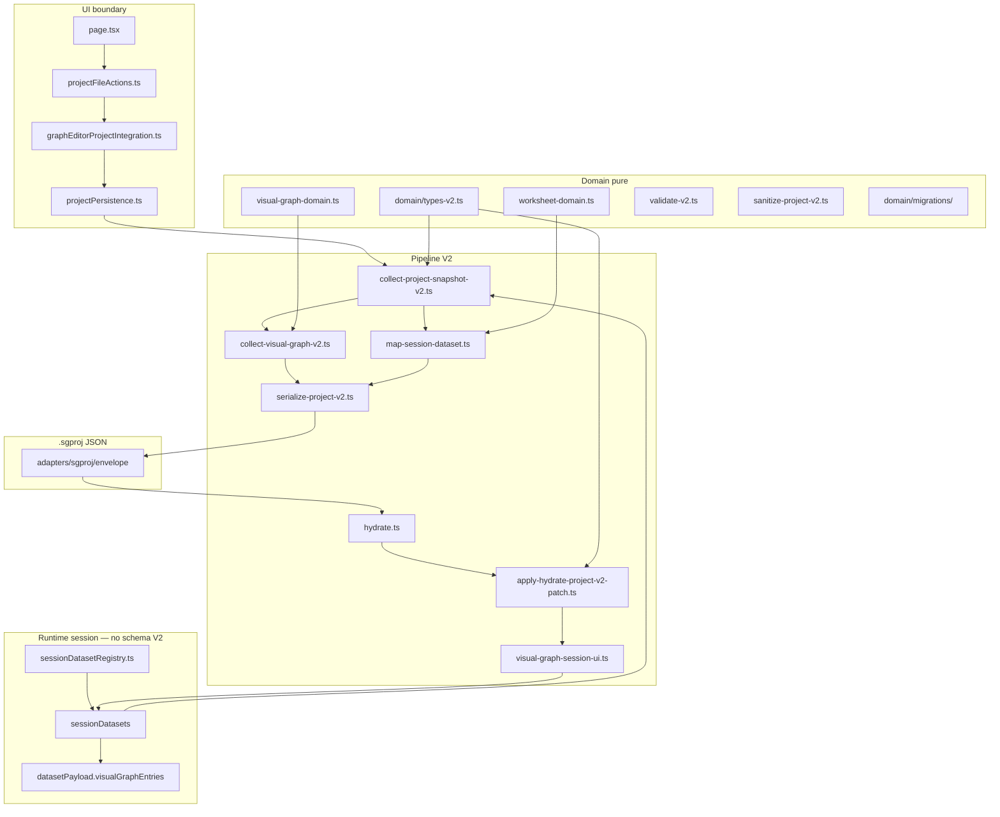

# Persistencia `.sgproj` — Arquitectura técnica

Referencia de implementación para el stack V2 bajo `src/lib/project/`. Para presentación del proyecto, quick start e índice documental, ver [`README.md`](../../../README.md) en la raíz.

Estado de cierre: PROD-2B B1–B2 + PROD-2C C1–C8 — ver [`PROJECT_STATUS_PROD_2C.md`](../../../PROJECT_STATUS_PROD_2C.md) (documento congelado).

---

## Arquitectura en capas



| Capa | Ubicación | Responsabilidad |
|------|-----------|-----------------|
| **Domain** | `domain/` | Tipos V1/V2, validación, sanitize, migrador, mappers puros |
| **Adapters** | `adapters/sgproj/` | Envelope JSON, serialize, helpers legacy |
| **Pipeline** | raíz `src/lib/project/` | Collect, hydrate, sanitize wiring |
| **Runtime session** | `sessionDatasetRegistry.ts`, stash VGB en payload | IDs efímeros `session-ds-*`, estado UI multi-dataset |
| **UI boundary** | `src/app/projectFileActions.ts`, `graphEditorProjectIntegration.ts`, `projectPersistence.ts` | Save/Open desde React |

**Prohibido en domain:** imports de React, Next.js, motores SCI, IndexedDB, Supabase.

---

## Pipeline Save / Open

### Save (Runtime → `.sgproj` V2)

```
sessionDatasets (worksheet + visualGraphEntries stash en payload runtime)
  → prepareCollectContextForSave / finalizeProjectSnapshotForSave
  → collectProjectSnapshotV2 (+ collect-visual-graph-v2)
  → map-session-dataset (worksheet por dataset)
  → serializeProjectV2 → .sgproj
```

### Open (`.sgproj` → Runtime)

```
parse → migrateProjectJson (si V1)
     → validateScientificProjectFile
     → sanitizeScientificProjectV2
     → buildHydrateProjectV2Patch
     → applyHydrateProjectV2Patch (worksheet + rebuildVisualGraphRuntimeEntries)
     → visual-graph-session-ui (partición por sourceDatasetId → session stash)
     → page.tsx activateSessionDataset (stash/load, sin wipe global)
```

Pipeline invariante: **`parse → migrate → validate → sanitize → hydrate`**.

Desde PROD-2B B2.6 el hydrate principal usa **`buildHydrateProjectV2Patch`** (nativo V2, sin colapso). Los helpers legacy `projectFileToHydrateV1` / `buildHydrateProjectPatch` y `collapse-v2-for-hydrate.ts` se conservan solo para rutas serialize/snapshot V1; no participan en Save/Open UI.

---

## Domain — `ScientificProjectV2`

Contrato on-disk (`CURRENT_SCHEMA_VERSION = 2`):

| Bloque | Contenido persistido |
|--------|---------------------|
| `metadata` | id, name, timestamps, `revisionHistory`, `cloudRef` (opcional) |
| `datasets[]` | `ProjectDatasetV2`: series, import info, **`worksheet`** |
| `activeDatasetId` | Dataset activo al guardar |
| `analysisConfig` | toggles, modos, selecciones, leyenda |
| `workflow` | `GuidedWorkflowSession` (SCI-59) |
| `comparison` | Slots A/B con `sourceDatasetId` + perfiles KPI (SCI-58) |
| `workspace` | sección, inspector, módulos habilitados |
| `graphContext` | curvas matemáticas + ejes (opcional) |
| `visualGraphs[]` | Entradas VGB: `id`, `graphSpec`, `sourceDatasetId`, `createdAt` |

### Worksheet por dataset (`ProjectWorksheetV2`)

- `columnRegistry` — metadatos de columnas y transforms
- `auxiliaryColumns` — columnas auxiliares de importación
- `modified` — flag de worksheet editado

Módulos: `domain/worksheet-domain.ts`, mappers en `adapters/sgproj/map-session-dataset.ts`.

### Visual Graph Builder (`ProjectVisualGraphPersistedV2`)

- **VGB-R1:** no se persisten `preview` ni `displaySeries`; se reconstruyen al abrir.
- Claves persistidas: `PERSISTED_VISUAL_GRAPH_ENTRY_KEYS` en `domain/visual-graph-domain.ts`.
- Mappers: `domain/mappers/visual-graph.ts`; collect: `collect-visual-graph-v2.ts`.

### Schema v1 (legacy)

Fixtures V1 se auto-migran al abrir vía `migrateProjectJson`. Regla migración `::primary`: ver [`domain/migrations/README.md`](./domain/migrations/README.md).

**No persistido en `.sgproj`:** outputs SCI-53→60, análisis `useMemo`, PDF, estado wizard, lista Supabase.

---

## Runtime session

| Concepto | Detalle |
|----------|---------|
| `SessionDataset[]` | Registry en memoria; IDs efímeros `session-ds-*` |
| ID policy | `domain/dataset-id-policy.ts` — remap a UUID estables al guardar |
| VGB stash | `sessionDatasets[].datasetPayload.visualGraphEntries` — **runtime only**, no schema V2 |
| Switch dataset | `page.tsx` `activateSessionDataset` — stash VGB activo, carga stash del target |
| Invariante **C-D** | Visual graphs aislados por `sourceDatasetId`; sin cross-contamination |

Módulo central multi-dataset UI: `visual-graph-session-ui.ts`.

---

## Persistencia — módulos clave

| Módulo | Rol |
|--------|-----|
| `collect-project-snapshot-v2.ts` | Collect multi-dataset, comparison slots, ID remap |
| `collect-visual-graph-v2.ts` | Collect `visualGraphs[]` desde runtime |
| `serialize-project-v2.ts` | Escritura envelope V2 |
| `apply-hydrate-project-v2-patch.ts` | Hydrate patch V2: registry, worksheet, VGB rebuild |
| `sanitize-project-v2.ts` | Sanitize determinista al abrir (B2.9) |
| `hydrate.ts` | Orquestación open; sanitize wired pre-patch |
| `adapters/sgproj/map-session-dataset.ts` | SessionDataset ↔ ProjectDatasetV2 |
| `parse.ts`, `validate.ts`, `migrate.ts` | Entrada JSON, validación, migración V1→V2 |
| `userMessages.ts` | Errores open/save en español |
| `src/app/projectFileActions.ts` | Acciones Save/Open UI |
| `src/app/graphEditorProjectIntegration.ts` | Wiring integración editor ↔ persistencia |
| `src/app/projectPersistence.ts` | Exports collect / apply boundary |

### Envelope JSON

```json
{
  "kind": "scientific-graph-ai.project",
  "schemaVersion": 2,
  "appVersion": "0.1.0",
  "exportedAt": "ISO-8601",
  "project": { "... ScientificProjectV2 ..." }
}
```

---

## Invariantes certificados

| Invariante | Definición | Evidencia |
|------------|------------|-----------|
| **A** | Save → Load → Save — equivalencia funcional | B2 `b2-9-invariants.cases.ts`; C2 worksheet; C8 golden VGB |
| **B** | V1 → migrate → hydrate → save V2 preserva campos | B2.9 fixture V1 |
| **C-D** | VGB particionados por `sourceDatasetId` | C7 UI cases; C8 golden multi |
| **C-B2** | Fixtures B2 sin worksheet/VGB no regresionan | C2/C3/C8 compat cases |
| **VGB-R1** | Sin leak de preview/displaySeries en JSON | C4–C6 mapper/collect/hydrate; C8 fixtures |

Detalle de casos y commits: [`PROJECT_STATUS_PROD_2C.md`](../../../PROJECT_STATUS_PROD_2C.md).

---

## Fixtures

| Fixture | Origen | Descripción |
|---------|--------|-------------|
| `scripts/fixtures/project-v1-empty.sgproj` | PROD-2A/B1 | V1 vacío |
| `scripts/fixtures/project-v1-dataset5-minimal.sgproj` | PROD-2A/B1 | V1 mono-dataset (Invariante B) |
| `scripts/fixtures/project-v2-empty.sgproj` | B1/B2 | V2 vacío |
| `scripts/fixtures/project-v2-dataset5-minimal.sgproj` | B2 | V2 mono-dataset golden |
| `scripts/fixtures/project-v2-dataset5-dataset6-comparison.sgproj` | B2 | V2 multi-dataset + comparison SCI-58 |
| `scripts/fixtures/project-v2-dataset5-with-worksheet.sgproj` | PROD-2C C3 | Golden worksheet mono-dataset |
| `scripts/fixtures/project-v2-dataset5-with-visual-graph.sgproj` | PROD-2C C8 | Golden VGB mono-dataset |
| `scripts/fixtures/project-v2-dataset5-dataset6-with-visual-graphs.sgproj` | PROD-2C C8 | Golden VGB multi-dataset (C-D) |

Generadores:

```bash
npm run generate:prod2b-v2-fixtures
npm run generate:prod2c-c3-golden-fixture
npm run generate:prod2c-c8-golden-fixture
```

---

## Gates técnicos

### PROD-2A (base)

```bash
npm run validate:prod2a-f0
npm run validate:prod2a-unit
npm run validate:prod2a-f6
npm run validate:prod2a          # E2E Playwright save/reload
npm run validate:prod2a-gate     # umbrella PROD-2A
```

### PROD-2B B1

```bash
npm run validate:prod2b-f0
npm run validate:prod2b-migrate
npm run validate:prod2b-b1-1-domain
npm run validate:prod2b-b1-2-migrate
npm run validate:prod2b-b1-3-v2
npm run validate:prod2b-b1-4-adapters
```

### PROD-2B B2 (umbrella)

```bash
npm run validate:prod2b-b2-gate   # 17 sub-gates: map, ids, collect, serialize, hydrate, sanitize, invariants, regresión B1
```

Sub-gates individuales: `validate:prod2b-b2-map`, `b2-ids`, `b2-collect`, `b2-serialize`, `b2-hydrate`, `b2-hydrate-wire`, `b2-sanitize`, `b2-ui-pipeline`, `b2-invariants`.

### PROD-2C C1–C8

```bash
npm run validate:prod2c-c1-worksheet-domain
npm run validate:prod2c-c2-worksheet-pipeline
npm run validate:prod2c-c3-worksheet-ui
npm run validate:prod2c-c4-visual-graph-mapper
npm run validate:prod2c-c5-visual-graph-collect
npm run validate:prod2c-c6-visual-graph-hydrate
npm run validate:prod2c-c7-visual-graph-ui
npm run validate:prod2c-c8-visual-graph-fixtures
npm run validate:prod2c-c8-regression-gate   # umbrella C4→C8 (5 sub-gates)
```

### PROD-2B B5 (IndexedDB)

```bash
npm run validate:prod2b-indexeddb   # umbrella B5: InMemory + CRUD/rename/draft/integrity
```

### Gap `validate:full`

`npm run validate:full` (raíz) cubre regresión PROD-2A, PROD-1, build y tsc. **No incluye** `validate:prod2b-b2-gate`, `validate:prod2b-indexeddb` ni gates PROD-2C. Ejecutarlos explícitamente al validar cambios en persistencia V2.

E2E y baselines requieren `DATASET5_PATH` / `DATASET6_PATH` cuando aplique.

#### Criterio de certificación de B5 respecto de `validate:full`

`npm run validate:full` puede reportar `ERR_CONNECTION_REFUSED` cuando el servidor local requerido por los tests E2E (Playwright) y/o el baseline SCI-60 (`http://localhost:3000`) **no está en ejecución** o no es alcanzable.

La certificación funcional de PROD-2B B5 se basa en los gates específicos de la fase (`validate:prod2b-indexeddb`, `validate:prod2b-b2-gate`, `validate:prod2c-c8-regression-gate` y `tsc`). La ejecución satisfactoria de `validate:full` continúa siendo requerida para la regresión global del producto, pero un `ERR_CONNECTION_REFUSED` causado exclusivamente por la ausencia del servidor local no constituye, por sí mismo, una regresión funcional de B5.

Criterios obligatorios para cerrar B5:

- `npm run validate:prod2b-indexeddb` — **PASS**
- `npm run validate:prod2b-b2-gate` — **PASS**
- `npm run validate:prod2c-c8-regression-gate` — **PASS**
- `npx tsc --noEmit` — **PASS**

Antes de certificar regresión global del producto (p. ej. cierre B6 / smoke CI), `validate:full` (pasos `baseline` + `e2e`) debe **re-ejecutarse con el servidor local disponible**.

---

## UI Save/Open (sidebar Proyecto científico)

- Nombre de proyecto inline (sin `prompt` nativo)
- Confirmación de descarte inline cuando dirty (sin `confirm` nativo)
- Banner de estado: success / warning / error
- Guard de extensión: solo `.sgproj` al abrir
- Recuperación de errores: `userMessages.ts` — distingue `sgproj` vs `graph-json` vs JSON inválido
